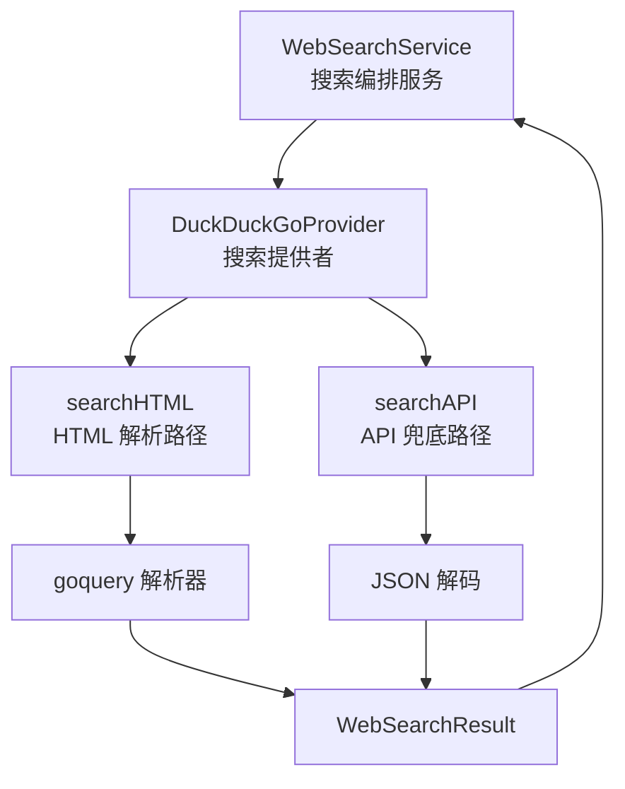

# DuckDuckGo Provider 实现深度解析

## 概述：为什么需要这个模块

想象一下，你的 Agent 需要回答"2024 年最新的人工智能趋势是什么？"这类问题。知识库里的内容可能已经过时，这时候就需要**实时网络搜索**能力。`duckduckgo_provider_implementation` 模块正是为此而生 —— 它是一个**无需 API 密钥、免费可用**的网络搜索提供者实现。

但这里有个核心矛盾：**免费的搜索服务往往不稳定，稳定的搜索服务往往收费**。DuckDuckGo 的官方 Instant Answer API 虽然免费，但返回结果有限；而它的 HTML 搜索结果更丰富，却需要解析网页且容易被反爬。这个模块的设计洞察在于：**不赌单一方案，而是构建一个"HTML 优先、API 兜底"的双层检索策略**。当 HTML 解析成功时返回丰富结果；当 HTML 被阻断时，优雅降级到 API 模式。这种设计让系统在"结果质量"和"可用性"之间取得了务实的平衡。

## 架构定位与数据流



**架构角色**：这是一个典型的**策略模式（Strategy Pattern）实现**。在 [web_search_provider_implementations](web_search_provider_implementations.md) 模块族中，`DuckDuckGoProvider` 与 `BingProvider`、`GoogleProvider` 并列，都实现了 `interfaces.WebSearchProvider` 接口。上层 [WebSearchService](web_search_orchestration_service.md) 通过统一的接口调用它们，无需关心底层是哪个搜索引擎。

**数据流追踪**：
1. **调用入口**：`WebSearchService.Search()` 根据配置选择提供者，调用 `DuckDuckGoProvider.Search()`
2. **策略分叉**：`Search()` 方法首先尝试 `searchHTML()`，若失败则回退到 `searchAPI()`
3. **HTML 路径**：构造 `html.duckduckgo.com` 请求 → 设置 UA 头防反爬 → `goquery` 解析 DOM → 提取 `.web-result` 节点
4. **API 路径**：构造 `api.duckduckgo.com` 请求 → 解析 JSON 响应 → 提取 `AbstractText`、`RelatedTopics`、`Results`
5. **结果归一**：两条路径都返回 `[]*types.WebSearchResult`，上层服务无需感知来源差异

## 核心组件深度解析

### DuckDuckGoProvider 结构体

```go
type DuckDuckGoProvider struct {
    client *http.Client
}
```

**设计意图**：这个结构体极其轻量，只持有一个 `*http.Client`。这是**显式依赖注入**的体现 —— HTTP 客户端作为可配置的外部依赖，而非隐式使用 `http.DefaultClient`。这样做的好处是：
- **超时可控**：构造函数中设置 30 秒超时，避免网络请求无限挂起
- **测试友好**：测试时可以替换为 mock client（见 `duckduckgo_test.testRoundTripper`）
- **连接复用**：同一 provider 实例复用 TCP 连接，提升性能

**关键约束**：`client` 字段是私有的，外部无法直接修改。这遵循了**封装原则**，确保 HTTP 行为的一致性。

### NewDuckDuckGoProvider 构造函数

```go
func NewDuckDuckGoProvider() (interfaces.WebSearchProvider, error) {
    return &DuckDuckGoProvider{
        client: &http.Client{
            Timeout: 30 * time.Second,
        },
    }, nil
}
```

**返回类型的设计玄机**：注意返回类型是 `interfaces.WebSearchProvider` 而非 `*DuckDuckGoProvider`。这是**面向接口编程**的典型实践 —— 调用方只依赖接口，不依赖具体实现。这使得未来替换提供者实现（比如从 HTML 解析改为官方 API）时，调用方代码无需修改。

**超时选择的权衡**：30 秒是一个经验值。太短（如 5 秒）可能导致复杂查询超时；太长（如 120 秒）会占用连接池资源。这个值应该与 [WebSearchConfig](web_search_domain_models.md) 中的全局超时配置协调。

### Search 方法：双层检索策略的核心

```go
func (p *DuckDuckGoProvider) Search(
    ctx context.Context,
    query string,
    maxResults int,
    includeDate bool,
) ([]*types.WebSearchResult, error)
```

**参数语义**：
- `ctx`：支持请求取消和超时传递，是 Go 并发安全的基石
- `query`：用户搜索词，**注意**：这里没有做 URL 编码，由 `url.Values` 内部处理
- `maxResults`：期望的最大结果数，≤0 时默认为 5（防御性编程）
- `includeDate`：**当前未使用**，这是一个预留参数，可能是为了未来支持日期过滤

**策略逻辑**（这是理解本模块的关键）：

```
┌─────────────────────────────────────┐
│  1. 尝试 searchHTML (优先路径)       │
│     ├─ 成功且有结果 → 立即返回       │
│     └─ 失败或无结果 → 继续           │
├─────────────────────────────────────┤
│  2. 尝试 searchAPI (兜底路径)        │
│     ├─ 成功且有结果 → 返回           │
│     └─ 失败 → 进入错误处理           │
├─────────────────────────────────────┤
│  3. 错误处理                         │
│     ├─ HTML 失败 → 返回 HTML 错误     │
│     └─ HTML 成功但 API 失败 → 不报错  │
└─────────────────────────────────────┘
```

**设计权衡分析**：
- **为什么 HTML 优先？** HTML 结果更丰富（通常 10+ 条），API 结果有限（主要是摘要和相关主题）。对于需要多样性的搜索场景，HTML 更优。
- **为什么 API 兜底？** HTML 解析依赖页面结构，DDG 改版会导致解析失败。API 虽然结果少，但接口稳定。
- **错误处理的不对称性**：如果 HTML 成功，即使 API 失败也不报错。这体现了**"有结果比完美更重要"**的实用主义。

### searchHTML 方法：网页解析的实现细节

**请求构造的防反爬策略**：
```go
req.Header.Set("User-Agent", "Mozilla/5.0 (Windows NT 10.0; Win64; x64) ...")
```
使用真实的浏览器 UA 是为了避免被 DDG 识别为爬虫而返回空结果或验证码。这是一个**与外部服务博弈**的无奈之举 —— 理论上应该使用官方 API，但为了结果质量选择了灰色地带。

**区域参数 kl=cn-zh**：
```go
params.Set("kl", "cn-zh")
```
这强制返回中文结果。对于中文用户场景是合理的，但如果系统需要国际化，这里应该从配置中读取区域参数。

**日志中的 curl 命令**：
```go
curlCommand := fmt.Sprintf("curl -X GET '%s' -H 'User-Agent: ...'", req.URL.String())
logger.Infof(ctx, "Curl of request: %s", secutils.SanitizeForLog(curlCommand))
```
这是一个**调试友好**的设计。当生产环境搜索失败时，运维人员可以直接复制日志中的 curl 命令复现问题。`SanitizeForLog` 确保敏感信息（如果有）被脱敏。

**DOM 解析的 CSS 选择器**：
```go
doc.Find(".web-result").Each(func(i int, s *goquery.Selection) {
    titleNode := s.Find(".result__a")
    snippet := s.Find(".result__snippet").Text()
    ...
})
```
这里硬编码了 DDG 的 HTML 结构类名。这是**脆弱点** —— DDG 前端改版会导致解析失败。更好的设计是将选择器配置化，或者定期运行集成测试验证。

### searchAPI 方法：Instant Answer API 适配

**API 的局限性**：
DuckDuckGo Instant Answer API 不是传统搜索引擎 API，它返回的是"即时答案"（类似维基百科摘要）和相关主题，而非完整的搜索结果列表。这解释了为什么 `searchHTML` 优先 —— API 的结果类型和数量都有限。

**响应结构解析**：
```go
var apiResponse struct {
    AbstractText  string `json:"AbstractText"`
    AbstractURL   string `json:"AbstractURL"`
    Heading       string `json:"Heading"`
    RelatedTopics []struct{...} `json:"RelatedTopics"`
    Results       []struct{...} `json:"Results"`
}
```
这里使用了**匿名结构体**而非独立类型。优点是代码紧凑，缺点是如果 API 响应结构变化，编译时无法捕获。考虑到这是内部使用且 API 稳定，这是一个可接受的权衡。

**结果合并逻辑**：
```go
// 1. 优先添加摘要（如果有）
if apiResponse.AbstractText != "" && apiResponse.AbstractURL != "" {
    results = append(results, &types.WebSearchResult{...})
}
// 2. 添加相关主题
for _, topic := range apiResponse.RelatedTopics { ... }
// 3. 添加结果
for _, r := range apiResponse.Results { ... }
```
这个顺序体现了**信息密度优先**：摘要通常是最相关的，放在最前面。

### cleanDDGURL 工具函数：URL 清洗的必要性

**问题背景**：DDG HTML 返回的链接不是原始 URL，而是经过重定向的：
```
//duckduckgo.com/l/?uddg=https%3A%2F%2Fexample.com&rut=xxx
```

**解析策略**：
```go
func cleanDDGURL(urlStr string) string {
    if strings.HasPrefix(urlStr, "//duckduckgo.com/l/?uddg=") {
        trimmed := strings.TrimPrefix(urlStr, "//duckduckgo.com/l/?uddg=")
        if idx := strings.Index(trimmed, "&rut="); idx != -1 {
            decodedStr, err := url.PathUnescape(trimmed[:idx])
            if err == nil {
                return decodedStr
            }
        }
    }
    // 备用解析逻辑...
    return urlStr
}
```

**设计观察**：
- 提供了两种解析方式（字符串操作和 `url.Parse`），这是**防御性编程** —— 防止 DDG 改变 URL 格式
- 解析失败时返回空字符串而非原始 URL，这可能导致结果丢失，但避免了返回无效链接
- 没有处理 `https://` 前缀的情况，这是一个潜在的边界 case

### extractTitle 工具函数：标题提取的启发式方法

```go
func extractTitle(text string) string {
    lines := strings.Split(text, "\n")
    if len(lines) > 0 {
        title := strings.TrimSpace(lines[0])
        if len(title) > 100 {
            title = title[:100] + "..."
        }
        return title
    }
    return strings.TrimSpace(text)
}
```

**启发式假设**：API 返回的 `Text` 字段第一行是标题。这在大多数情况下成立，但不是绝对可靠。100 字符截断是为了避免标题过长影响 UI 展示。

## 依赖关系分析

### 上游依赖（谁调用它）

| 调用方 | 依赖关系 | 期望契约 |
|--------|----------|----------|
| [WebSearchService](web_search_orchestration_service.md) | 直接调用 `Search()` | 返回 `[]*WebSearchResult`，错误时返回非 nil error |
| [WebSearchHandler](web_search_endpoint_handler.md) | 通过 Service 间接调用 | HTTP 响应中序列化结果 |

**契约约束**：
- `Search()` 必须在 `ctx` 超时时返回错误
- 返回的 `WebSearchResult` 中 `Title`、`URL`、`Snippet` 不应为空（但代码未强制校验）
- `Source` 字段固定为 `"duckduckgo"`，用于结果溯源

### 下游依赖（它调用谁）

| 被调用方 | 用途 | 耦合程度 |
|----------|------|----------|
| `net/http.Client` | HTTP 请求执行 | 低（标准库） |
| `goquery` | HTML 解析 | 中（第三方库，DDG 改版会影响） |
| `logger` | 日志记录 | 低（内部包） |
| `secutils.SanitizeForLog` | 日志脱敏 | 低（内部包） |

**最脆弱的依赖**：`goquery` 的 CSS 选择器直接耦合 DDG 的 HTML 结构。这是整个模块的**单点故障** —— DDG 前端改版会导致 `searchHTML` 路径失效。

### 数据契约：WebSearchResult

```go
type WebSearchResult struct {
    Title   string `json:"title"`
    URL     string `json:"url"`
    Snippet string `json:"snippet"`
    Source  string `json:"source"`
}
```

**隐式约束**：
- `URL` 应该是绝对路径（`cleanDDGURL` 保证）
- `Source` 用于区分不同提供者，在混合搜索结果时很重要
- `Snippet` 可能为空（HTML 解析时如果 `.result__snippet` 不存在）

## 设计决策与权衡

### 1. HTML 优先 vs API 优先

**选择**：HTML 优先

**理由**：
- HTML 结果数量更多（10+ vs 通常<5）
- HTML 结果更接近传统搜索引擎体验
- API 的"即时答案"定位不适合通用搜索

**代价**：
- HTML 结构变化会导致解析失败
- 需要维护 UA 头等反反爬策略
- 法律灰色地带（服务条款可能禁止爬虫）

**替代方案**：
- 纯 API：稳定但结果有限
- 配置化选择：允许用户根据场景选择，但增加复杂度

### 2. 同步请求 vs 异步并发

**选择**：同步请求

**理由**：
- 代码简单，易于理解和调试
- 30 秒超时足够完成请求
- 上层 Service 可以并发调用多个提供者

**代价**：
- 单个请求阻塞 goroutine
- 无法利用 HTTP/2 多路复用优势

**适用场景**：当前设计适合 QPS 不高的场景。如果需要高并发，应该引入连接池和请求队列。

### 3. 硬编码配置 vs 外部配置

**选择**：硬编码（UA、区域、超时）

**理由**：
- 减少配置复杂度
- 这些值相对稳定
- 代码即文档

**代价**：
- 修改需要重新编译
- 无法针对不同环境调整

**改进建议**：将 `UserAgent`、`Region`、`Timeout` 提取到 [WebSearchConfig](web_search_domain_models.md) 中。

### 4. 错误处理策略

**选择**：HTML 失败不立即报错，尝试 API 兜底

**理由**：
- 提高整体可用性
- 用户更关心"有结果"而非"完美结果"

**代价**：
- 可能掩盖 HTML 路径的持续失败
- 调试时难以定位问题根源

**改进建议**：添加指标监控，记录 HTML 和 API 的成功率，当 HTML 持续失败时告警。

## 使用指南与示例

### 基本使用

```go
provider, err := web_search.NewDuckDuckGoProvider()
if err != nil {
    return err
}

results, err := provider.Search(ctx, "Golang 最佳实践", 10, false)
if err != nil {
    return err
}

for _, r := range results {
    fmt.Printf("标题：%s\n", r.Title)
    fmt.Printf("链接：%s\n", r.URL)
    fmt.Printf("摘要：%s\n", r.Snippet)
}
```

### 提供者注册

```go
// 在初始化时注册提供者
info := web_search.DuckDuckGoProviderInfo()
// info.ID = "duckduckgo"
// info.Name = "DuckDuckGo"
// info.Free = true
// info.RequiresAPIKey = false
```

### 配置建议

| 配置项 | 推荐值 | 说明 |
|--------|--------|------|
| `maxResults` | 5-10 | 过多结果会增加处理时间，且相关性递减 |
| `ctx` 超时 | 30-60 秒 | 与 provider 内部超时协调 |
| 并发调用 | 是 | 可同时调用多个提供者，取最佳结果 |

## 边界情况与陷阱

### 1. HTML 结构变更

**现象**：`searchHTML` 突然返回 0 条结果

**原因**：DDG 修改了前端 HTML 结构，CSS 选择器 `.web-result`、`.result__a` 失效

**检测**：监控 `searchHTML` 的成功率，当连续失败时告警

**应对**：
- 短期：依赖 API 兜底
- 长期：更新选择器或切换到其他提供者

### 2. 反爬机制触发

**现象**：HTTP 状态码 200，但返回验证码页面

**原因**：请求频率过高或 UA 被识别

**检测**：检查响应中是否包含 "captcha"、"verify" 等关键词

**应对**：
- 降低请求频率
- 轮换 UA
- 使用代理 IP

### 3. URL 解析失败

**现象**：结果中 `URL` 字段为空

**原因**：`cleanDDGURL` 无法解析 DDG 的重定向链接

**影响**：该结果会被过滤掉（代码中 `if title != "" && link != ""`）

**改进**：记录解析失败的原始 URL，便于调试

### 4. 区域参数不适用

**现象**：中文查询返回英文结果

**原因**：`kl=cn-zh` 参数可能被 DDG 忽略，或查询词本身是英文

**应对**：根据查询语言动态设置区域参数，或移除该参数让 DDG 自动检测

### 5. includeDate 参数未实现

**现象**：传入 `includeDate=true` 但结果中无日期信息

**原因**：代码中未使用该参数

**影响**：调用方可能误以为支持日期过滤

**改进**：要么实现该功能，要么从接口中移除

## 测试策略

### 单元测试要点

```go
// 使用 testRoundTripper 模拟 HTTP 响应
func TestDuckDuckGoProvider_Search(t *testing.T) {
    // 1. 模拟 HTML 成功
    // 2. 模拟 HTML 失败，API 成功
    // 3. 模拟两者都失败
    // 4. 模拟 maxResults 限制
}
```

### 集成测试要点

- 定期运行真实请求，验证 HTML 结构未变化
- 监控响应时间和成功率
- 测试不同查询语言的结果质量

## 扩展点

### 1. 添加新的搜索源

如果要支持 DDG 的其他端点（如图片搜索），可以：
- 添加 `searchImages()` 方法
- 扩展 `WebSearchResult` 添加 `ImageURL` 字段
- 或创建新的 `DuckDuckGoImageProvider`

### 2. 结果缓存

当前实现每次请求都调用 DDG。可以添加：
- 内存缓存（短期，如 5 分钟）
- Redis 缓存（长期，如 24 小时）
- 缓存键：`query + maxResults + region`

### 3. 结果融合

如果需要同时调用多个提供者：
```go
// 伪代码
results1, _ := duckduckgo.Search(ctx, query, 5, false)
results2, _ := bing.Search(ctx, query, 5, false)
merged := mergeAndDeduplicate(results1, results2)
```

## 相关模块参考

- [WebSearchService](web_search_orchestration_service.md) — 搜索编排服务，调用本模块
- [WebSearchProvider](web_search_provider_integration_contracts.md) — 提供者接口定义
- [BingProvider](bing_provider_implementation_and_response_contract.md) — 另一个搜索提供者实现
- [GoogleProvider](google_provider_implementation.md) — 另一个搜索提供者实现
- [WebSearchResult](web_search_domain_models.md) — 结果数据结构定义

## 总结

`duckduckgo_provider_implementation` 是一个**务实的工程解决方案**。它没有追求完美的架构抽象，而是直面现实约束：免费服务不稳定、HTML 解析脆弱、API 结果有限。通过"HTML 优先、API 兜底"的双层策略，它在结果质量和可用性之间找到了平衡点。

对于新加入的工程师，理解这个模块的关键是：**这不是一个纯粹的 API 封装，而是一个与外部服务博弈的适配器**。它的代码中充满了与 DDG 反爬机制的对抗（UA 头）、与 HTML 结构变化的对抗（CSS 选择器）、与网络不稳定的对抗（超时和兜底）。这些"不优雅"的设计，恰恰是生产级代码的真实面貌。
