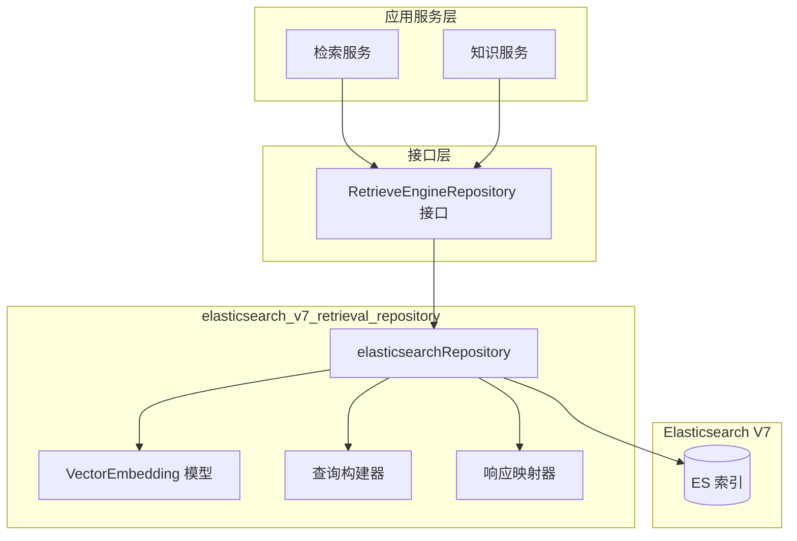

# Elasticsearch V7 Retrieval Repository 模块深度解析

## 模块概述

想象一下，你正在构建一个智能问答系统，用户提出问题后，系统需要从海量文档中快速找到最相关的片段。这个模块就是那个"图书管理员"——它负责将文档片段（chunk）及其向量表示高效地存入 Elasticsearch V7，并在查询时以毫秒级速度返回最匹配的结果。

**核心问题**：为什么需要这个专门的模块，而不是直接在业务代码中调用 ES 客户端？

1. **领域模型隔离**：业务层操作的是 `IndexInfo`、`RetrieveParams` 等域模型，而 ES 操作的是 JSON 文档。这个模块承担了"翻译官"的角色，避免业务逻辑被 ES 的 DSL 细节污染。

2. **检索策略抽象**：系统支持关键词检索和向量检索两种模式。V7 版本的 ES 没有原生的稠密向量支持（那是 V8 的 `dense_vector` 字段类型），因此需要用 `script_score` + `cosineSimilarity` 来模拟。这个复杂性被封装在模块内部，调用者无需关心。

3. **批量操作优化**：单个文档索引和批量索引的性能差异巨大。模块提供了 `BatchSave` 方法，内部使用 ES 的 Bulk API，同时处理部分失败的容错逻辑。

4. **多租户与权限隔离**：检索时需要按 `KnowledgeBaseID`、`KnowledgeID`、`TagID` 等维度过滤，还要排除已禁用的片段。这些过滤条件被统一封装在 `getBaseConds` 方法中，确保所有检索操作都遵循相同的权限规则。

**一句话总结**：这是 RAG（检索增强生成）系统中的向量存储与检索基础设施层，将 Elasticsearch V7 的底层能力转化为业务友好的领域接口。

---

## 架构与数据流

### 架构定位



### 核心组件职责

| 组件 | 职责 | 类比 |
|------|------|------|
| `elasticsearchRepository` | 主结构体，实现 `RetrieveEngineRepository` 接口 | 仓库管理员 |
| `VectorEmbedding` | ES 文档模型，包含内容、向量、元数据 | 图书卡片 |
| `getBaseConds` | 构建通用过滤条件（知识库 ID、启用状态等） | 门禁规则 |
| `buildVectorSearchQuery` / `buildKeywordSearchQuery` | 构建特定检索类型的 ES DSL | 搜索策略 |
| `processSearchResponse` | 解析 ES 响应并转换为域模型 | 翻译官 |

### 数据流：写入路径

```
IndexInfo (域模型)
    ↓ ToDBVectorEmbedding()
VectorEmbedding (ES 文档模型)
    ↓ json.Marshal()
JSON 字节流
    ↓ client.Create() / client.Bulk()
Elasticsearch 索引
```

### 数据流：检索路径

```
RetrieveParams (查询参数)
    ↓ getBaseConds() + buildXxxSearchQuery()
ES Query DSL (JSON)
    ↓ client.Search()
ES Response (JSON)
    ↓ processSearchResponse() → processHits() → processHit()
[]*IndexWithScore (带分数的域模型)
    ↓ 包装
RetrieveResult
```

### 数据流：批量复制路径（知识库克隆场景）

```
源 KnowledgeBaseID
    ↓ querySourceBatch() (分页查询)
源文档批次
    ↓ processSourceBatch() (ID 映射转换)
目标 IndexInfo 列表
    ↓ BatchSave()
目标索引
```

---

## 核心组件深度解析

### 1. `elasticsearchRepository` 结构体

```go
type elasticsearchRepository struct {
    client *elasticsearch.Client
    index  string
}
```

**设计意图**：这是一个典型的 Repository 模式实现，封装了所有与 ES 交互的细节。

**关键设计决策**：

- **无状态设计**：结构体只持有 `client` 和 `index`，不保存任何请求级状态。这意味着同一个实例可以安全地并发处理多个请求，符合 Go 的并发哲学。

- **索引名从环境变量读取**：`NewElasticsearchEngineRepository` 从 `ELASTICSEARCH_INDEX` 环境变量读取索引名，默认为 `xwrag_default`。这种设计允许在不同环境（开发、测试、生产）中使用不同的索引，而无需修改代码或重新编译。

- **实现接口而非暴露结构**：构造函数返回 `interfaces.RetrieveEngineRepository` 接口类型，而非具体结构体。这为未来替换实现（如切换到 V8 版本或 Milvus）留下了空间。

### 2. 写入操作：`Save` 与 `BatchSave`

#### `Save` 方法（单文档索引）

```go
func (e *elasticsearchRepository) Save(ctx context.Context,
    embedding *typesLocal.IndexInfo, additionalParams map[string]any,
) error
```

**内部流程**：

1. **模型转换**：调用 `elasticsearchRetriever.ToDBVectorEmbedding()` 将 `IndexInfo` 转换为 `VectorEmbedding`。这个转换函数在 `internal/application/repository/retriever/elasticsearch` 包中定义，是 V7 和 V8 共享的。

2. **空向量校验**：如果 `embeddingDB.Embedding` 为空，直接返回错误。这是一个**防御性编程**实践——避免将无效数据写入索引，因为后续检索时会无法计算相似度。

3. **生成文档 ID**：使用 `uuid.New().String()` 生成 ES 文档 ID。注意，这个 ID 与 `ChunkID` 无关，是 ES 内部的唯一标识。`ChunkID` 存储在文档内容中，用于业务查询。

4. **执行 Create 操作**：使用 `client.Create()` 而非 `client.Index()`。区别在于：`Create` 在文档已存在时会失败，而 `Index` 会覆盖。这避免了意外覆盖已有数据。

**潜在问题**：如果同一个 `ChunkID` 被多次保存，会生成多个 ES 文档（因为文档 ID 是随机 UUID）。删除时需要通过 `chunk_id.keyword` 字段查询所有相关文档。这是一种**写扩散、删聚合**的设计，适合写少删多的场景。

#### `BatchSave` 方法（批量索引）

```go
func (e *elasticsearchRepository) BatchSave(ctx context.Context,
    embeddingList []*typesLocal.IndexInfo, additionalParams map[string]any,
) error
```

**性能优化**：

- **Bulk API**：ES 的 Bulk API 允许在一次 HTTP 请求中发送多个操作，大幅减少网络往返开销。对于 1000 个文档，单条插入需要 1000 次 HTTP 请求，而 Bulk 只需 1 次。

- **预分配缓冲区**：`body.Grow(len(meta) + len(data))` 预分配 `bytes.Buffer` 容量，避免多次内存重新分配。

**容错设计**：

```go
// processBulkResponse 中
if hasErrors, ok := bulkResponse["errors"].(bool); ok && hasErrors {
    errorCount := e.countBulkErrors(ctx, bulkResponse, totalDocuments)
    if errorCount > 0 {
        log.Warnf("[ElasticsearchV7] %d/%d documents failed to index", errorCount, totalDocuments)
    }
}
```

注意，即使部分文档失败，方法也不会返回错误（除非整个 Bulk 请求失败）。这是**部分成功语义**——调用者需要查看日志确认是否有失败。这种设计权衡了**严格一致性**与**可用性**：在大规模索引场景下，少量失败不应阻塞整个流程。

### 3. 删除操作：按字段批量删除

```go
func (e *elasticsearchRepository) DeleteByChunkIDList(ctx context.Context, 
    chunkIDList []string, dimension int, knowledgeType string) error
```

**实现模式**：三个删除方法（`DeleteByChunkIDList`、`DeleteBySourceIDList`、`DeleteByKnowledgeIDList`）都委托给同一个私有方法 `deleteByFieldList`。

**关键设计**：

- **使用 `keyword` 子字段**：查询条件是 `"chunk_id.keyword"` 而非 `"chunk_id"`。这是因为 `chunk_id` 字段可能是 `text` 类型（支持全文检索），而 `.keyword` 是精确匹配的子字段。使用错误的字段类型会导致查询失败或性能问题。

- **Delete By Query**：使用 ES 的 `DeleteByQuery` API，而非先查询再逐条删除。这在内部是原子的，且性能更优。

**注意事项**：`DeleteByQuery` 默认不会刷新索引，删除的文档在下次刷新前仍可被检索到。如果需要立即可见，需要添加 `Refresh: true` 参数（当前实现未添加）。

### 4. 检索操作：`Retrieve` 分发器

```go
func (e *elasticsearchRepository) Retrieve(ctx context.Context,
    params typesLocal.RetrieveParams,
) ([]*typesLocal.RetrieveResult, error)
```

**策略模式**：根据 `params.RetrieverType` 分发到不同的检索实现：

- `KeywordsRetrieverType` → `KeywordsRetrieve`
- `VectorRetrieverType` → `VectorRetrieve`（当前 V7 实现中未在 switch 中处理，会返回错误）

**注意**：代码中 `Support()` 方法返回 `[]typesLocal.RetrieverType{typesLocal.KeywordsRetrieverType}`，表明 V7 版本**仅支持关键词检索**。向量检索的代码存在但未在 `Retrieve` 中注册，这可能是预留功能或需要额外配置。

### 5. 向量检索：`script_score` 模拟稠密向量

```go
// buildVectorSearchQuery 中
queryObj := map[string]interface{}{
    "query": map[string]interface{}{
        "script_score": map[string]interface{}{
            "query": map[string]interface{}{
                "bool": map[string]interface{}{
                    "filter": []interface{}{filterQuery},
                },
            },
            "script": map[string]interface{}{
                "source": "cosineSimilarity(params.query_vector,'embedding')",
                "params": map[string]interface{}{
                    "query_vector": params.Embedding,
                },
            },
            "min_score": params.Threshold,
        },
    },
    "size": params.TopK,
}
```

**为什么这么复杂？**

Elasticsearch V7 没有原生的 `dense_vector` 字段类型（V7.10+ 才引入，且功能有限）。因此需要用 Painless 脚本手动计算余弦相似度。

**性能影响**：`script_score` 会对每个候选文档执行脚本，性能远低于 V8 的 `dense_vector` + `knn` 查询。对于大规模向量检索，建议：

1. 先用关键词检索缩小候选集
2. 再用 `script_score` 对候选集进行向量重排序

**阈值过滤**：`min_score` 参数确保只返回相似度高于阈值的文档，避免返回大量低质量结果。

### 6. 关键词检索：`match` 查询

```go
// buildKeywordSearchQuery 中
query := fmt.Sprintf(
    `{\"query\": {\"bool\": {\"must\": [{\"match\": {\"content\": %s}}], \"filter\": [%s]}}}`,
    string(content), filter,
)
```

**设计要点**：

- **`match` 查询**：对 `content` 字段使用 `match` 查询，会进行分词和全文检索。如果 `content` 字段配置了中文分词器（如 IK），可以正确处理中文查询。

- **`filter` 上下文**：过滤条件放在 `filter` 上下文中，ES 可以缓存过滤结果，提升重复查询的性能。

### 7. 响应处理：从 ES 文档到域模型

```go
// processHit 中
func (e *elasticsearchRepository) processHit(ctx context.Context,
    hit interface{}, retrieverType typesLocal.RetrieverType,
) (*typesLocal.IndexWithScore, error)
```

**转换链**：

1. 提取 `_id`、`_source`、`_score` 字段
2. 将 `_source` 反序列化为 `VectorEmbeddingWithScore`
3. 调用 `elasticsearchRetriever.FromDBVectorEmbeddingWithScore()` 转换为 `IndexWithScore`

**错误处理策略**：单个文档解析失败不会中断整个流程，而是记录警告并跳过。这确保了部分损坏的文档不会导致整个检索失败。

### 8. 知识库克隆：`CopyIndices`

**场景**：用户复制一个知识库时，需要将其中的所有索引复制到新的知识库 ID 下。

**实现策略**：

1. **分页查询**：使用 `from` + `size` 分页，每批 500 条文档。避免一次性加载大量数据导致内存溢出。

2. **ID 映射转换**：
   - `sourceToTargetKBIDMap`：源知识库 ID → 目标知识库 ID
   - `sourceToTargetChunkIDMap`：源 ChunkID → 目标 ChunkID

3. **SourceID 特殊处理**：
   ```go
   if originalSourceID == sourceChunkID {
       // 普通 chunk，直接使用目标 ChunkID
       targetSourceID = targetChunkID
   } else if strings.HasPrefix(originalSourceID, sourceChunkID+"-") {
       // 生成的问题，保留问题 ID 部分
       questionID := strings.TrimPrefix(originalSourceID, sourceChunkID+"-")
       targetSourceID = fmt.Sprintf("%s-%s", targetChunkID, questionID)
   }
   ```
   
   这个逻辑处理了 FAQ 场景中"基于 chunk 生成的问题"的 ID 继承关系。

4. **批量保存**：转换完成后调用 `BatchSave` 写入目标索引。

**性能考虑**：对于大型知识库（数万文档），这个过程可能耗时较长。生产环境中建议使用异步任务执行，并提供进度查询接口。

### 9. 批量更新：启用状态与标签

```go
func (e *elasticsearchRepository) BatchUpdateChunkEnabledStatus(
    ctx context.Context,
    chunkStatusMap map[string]bool,
) error
```

**使用场景**：用户在前端批量启用/禁用某些 chunk 时，不需要删除重建，只需更新 `is_enabled` 字段。

**实现**：使用 `UpdateByQuery` API + Painless 脚本：

```go
query := map[string]interface{}{
    "query": map[string]interface{}{
        "terms": map[string]interface{}{
            "chunk_id.keyword": enabledChunkIDs,
        },
    },
    "script": map[string]interface{}{
        "source": "ctx._source.is_enabled = true",
        "lang":   "painless",
    },
}
```

**分组优化**：代码将所有 chunk 按 `enabled` 状态分组，然后分别执行两次 `UpdateByQuery`。这比逐条更新高效得多。

**类似地**，`BatchUpdateChunkTagID` 按 `tagID` 分组，对每个标签执行一次批量更新。

### 10. 存储估算：`EstimateStorageSize`

```go
func (e *elasticsearchRepository) EstimateStorageSize(ctx context.Context,
    indexInfoList []*typesLocal.IndexInfo, params map[string]any,
) int64
```

**估算公式**：

```
总大小 = 文本内容大小 + 向量存储大小 + 元数据开销 + 索引放大系数

其中：
- 文本内容大小 = len(content) 字节
- 向量存储大小 = 维度数 × 4 字节（float32）
- 元数据开销 = 250 字节（固定估算）
- 索引放大系数 = (内容 + 向量) × 0.5
```

**用途**：在用户上传文档前，预估需要多少存储空间，用于配额管理或成本估算。

**精度**：这是一个**粗略估算**，实际 ES 存储还受压缩、分片、副本等因素影响。但对于数量级判断足够准确。

---

## 依赖关系分析

### 上游调用者（谁调用这个模块）

| 调用者 | 调用场景 | 期望行为 |
|--------|----------|----------|
| `KnowledgeService` | 知识入库、更新、删除 | 原子性写入，失败时回滚 |
| `RetrieveEngineService` | 检索请求 | 低延迟返回，支持过滤 |
| `KnowledgeBaseService` | 知识库克隆 | 完整复制，ID 映射正确 |

### 下游依赖（这个模块调用谁）

| 被调用者 | 用途 | 耦合程度 |
|----------|------|----------|
| `elasticsearch.Client` | ES HTTP 客户端 | 强耦合，替换 ES 版本需修改代码 |
| `elasticsearchRetriever.ToDBVectorEmbedding` | 模型转换 | 弱耦合，共享包中的工具函数 |
| `elasticsearchRetriever.FromDBVectorEmbeddingWithScore` | 响应转换 | 弱耦合，共享包中的工具函数 |
| `logger.GetLogger` | 日志记录 | 弱耦合，可替换日志实现 |

### 数据契约

**输入契约**：
- `IndexInfo`：必须包含 `ChunkID`、`Content`、`KnowledgeBaseID` 等必填字段
- `RetrieveParams`：`TopK` 必须为正数，`Threshold` 在 0-1 之间

**输出契约**：
- `Save`/`BatchSave`：成功返回 `nil`，失败返回描述性错误
- `Retrieve`：返回 `[]*RetrieveResult`，即使无结果也返回空切片而非 `nil`
- `Delete*`：成功返回 `nil`，即使没有文档被删除

---

## 设计决策与权衡

### 1. 为什么 V7 和 V8 分开实现？

**观察**：代码树中存在 `elasticsearch.v7.repository` 和 `elasticsearch.v8.repository` 两个独立包。

**原因**：

- **API 差异**：V8 的 Go 客户端引入了 `TypedClient`，支持泛型文档模型，而 V7 使用 `*elasticsearch.Client` + 手动 JSON 序列化。
- **向量检索能力**：V8 支持原生的 `knn` 查询，性能远优于 V7 的 `script_score`。
- **向后兼容**：现有生产环境可能仍在使用 V7 集群，无法强制升级。

**权衡**：代码重复 vs 版本隔离。当前选择是**版本隔离**，避免 V8 的新特性污染 V7 的实现，也便于未来独立演进。

### 2. 为什么文档 ID 使用随机 UUID 而非 ChunkID？

**选择**：`docID := uuid.New().String()`

**优点**：
- 支持同一 `ChunkID` 的多个版本共存（如不同时间的快照）
- 避免 ES 文档 ID 冲突导致的覆盖问题

**缺点**：
- 删除时需要通过 `DeleteByQuery` 而非直接的 `Delete` API
- 无法通过文档 ID 直接定位到业务实体

**替代方案**：使用 `ChunkID` 作为文档 ID。这样可以直接用 `Delete` API，但会失去版本共存能力。

**当前权衡**：选择了**灵活性**优先，适合需要版本管理的场景。

### 3. 为什么 `Retrieve` 方法中向量检索未注册？

**观察**：`Support()` 只返回 `KeywordsRetrieverType`，`Retrieve` 的 switch 中也没有 `VectorRetrieverType` 分支。

**可能原因**：
1. **性能考虑**：V7 的 `script_score` 性能较差，生产环境可能禁用向量检索
2. **配置驱动**：向量检索可能需要额外的 ES 配置（如脚本缓存），默认不启用
3. **待实现功能**：代码已写好但未在配置中启用

**影响**：如果调用者传入 `RetrieverType: VectorRetrieverType`，会收到 `"invalid retriever type"` 错误。

**建议**：在文档中明确说明 V7 版本仅支持关键词检索，向量检索需升级到 V8 或使用混合检索策略。

### 4. 为什么批量操作采用"部分成功"语义？

**观察**：`BatchSave` 和 `processBulkResponse` 中，单个文档失败不会导致整个请求失败。

**权衡**：
- **严格一致性**：任何失败都返回错误，调用者需要重试整个批次
- **最终可用性**：记录失败，成功部分生效，调用者决定如何处理失败项

**当前选择**：**最终可用性**。理由是：
- 大规模索引场景下，少量失败是常态（如网络抖动）
- 重试整个批次成本高昂
- 调用者可以通过日志监控失败率，达到阈值时告警

**风险**：调用者可能误以为所有文档都成功写入。需要在文档中明确说明这一行为。

### 5. 为什么过滤条件使用 `.keyword` 子字段？

**观察**：所有 ID 字段查询都使用 `"chunk_id.keyword"` 而非 `"chunk_id"`。

**原因**：ES 的 `text` 字段会被分词，无法进行精确匹配。例如：
- `"chunk_id": "abc-123"` 分词后可能是 `["abc", "123"]`
- 查询 `chunk_id: "abc-123"` 会匹配到包含 "abc" 或 "123" 的文档

**解决方案**：使用 `keyword` 类型（不分词）的子字段进行精确匹配。

**前提条件**：ES 索引映射中必须为 ID 字段配置 `fields: { keyword: { type: "keyword" } }`。如果映射配置错误，查询会失败。

---

## 使用指南与示例

### 初始化仓库

```go
import (
    "github.com/elastic/go-elasticsearch/v7"
    v7 "github.com/Tencent/WeKnora/internal/application/repository/retriever/elasticsearch/v7"
)

// 创建 ES 客户端
esClient, err := elasticsearch.NewClient(elasticsearch.Config{
    Addresses: []string{"http://localhost:9200"},
    Username:  "elastic",
    Password:  "password",
})

// 初始化仓库
repo := v7.NewElasticsearchEngineRepository(esClient, config)
```

### 保存单个索引

```go
indexInfo := &types.IndexInfo{
    ChunkID:         "chunk-001",
    SourceID:        "doc-001",
    KnowledgeID:     "know-001",
    KnowledgeBaseID: "kb-001",
    Content:         "这是文档内容",
    SourceType:      types.SourceTypeManual,
}

// additionalParams 中可传入 embedding 向量
additionalParams := map[string]any{
    "embedding": []float32{0.1, 0.2, 0.3, ...},
}

err := repo.Save(ctx, indexInfo, additionalParams)
```

### 批量保存

```go
indexList := []*types.IndexInfo{...} // 多个索引
err := repo.BatchSave(ctx, indexList, additionalParams)
```

### 关键词检索

```go
params := types.RetrieveParams{
    Query:            "如何重置密码",
    KnowledgeBaseIDs: []string{"kb-001"},
    TopK:             10,
    RetrieverType:    types.KeywordsRetrieverType,
}

results, err := repo.Retrieve(ctx, params)
for _, result := range results {
    for _, hit := range result.Results {
        fmt.Printf("ChunkID: %s, Score: %.4f, Content: %s\n", 
            hit.ChunkID, hit.Score, hit.Content)
    }
}
```

### 按条件删除

```go
// 删除某个知识库的所有索引
err := repo.DeleteByKnowledgeIDList(ctx, []string{"know-001"}, 768, "manual")

// 禁用某些 chunk
chunkStatusMap := map[string]bool{
    "chunk-001": false,
    "chunk-002": false,
}
err := repo.BatchUpdateChunkEnabledStatus(ctx, chunkStatusMap)
```

### 知识库克隆

```go
sourceToTargetKBIDMap := map[string]string{
    "know-old-001": "know-new-001",
}
sourceToTargetChunkIDMap := map[string]string{
    "chunk-old-001": "chunk-new-001",
}

err := repo.CopyIndices(
    ctx,
    "kb-source",
    sourceToTargetKBIDMap,
    sourceToTargetChunkIDMap,
    "kb-target",
    768,
    "manual",
)
```

---

## 边界情况与注意事项

### 1. 空向量校验

```go
if len(embeddingDB.Embedding) == 0 {
    return fmt.Errorf("empty embedding vector for chunk ID: %s", embedding.ChunkID)
}
```

**陷阱**：如果 `additionalParams` 中未传入 `embedding`，转换后的 `VectorEmbedding.Embedding` 会是空切片。保存会失败。

**解决**：调用 `Save`/`BatchSave` 前确保 `additionalParams["embedding"]` 已正确设置。

### 2. 索引名配置

```go
indexName := os.Getenv("ELASTICSEARCH_INDEX")
if indexName == "" {
    indexName = "xwrag_default"
}
```

**陷阱**：如果环境变量未设置，会使用默认索引名。开发环境可能意外写入生产索引。

**建议**：
- 在 CI/CD 流程中强制设置环境变量
- 使用索引别名而非硬编码索引名
- 添加环境标识前缀（如 `dev_xwrag_default`）

### 3. Bulk 操作的部分失败

**行为**：`BatchSave` 返回 `nil` 不代表所有文档都成功写入。

**监控建议**：
```go
// 在生产环境中，解析 Bulk 响应并统计失败数
err := repo.BatchSave(ctx, indexList, params)
if err != nil {
    // 整个请求失败，需要重试
} else {
    // 检查日志中的警告，确认是否有部分失败
}
```

### 4. DeleteByQuery 的可见性延迟

**问题**：`DeleteByQuery` 默认不刷新索引，删除的文档在下次刷新前仍可被检索到。

**影响**：用户删除后立即检索，可能仍看到已删除的文档。

**解决**：
- 添加 `Refresh: true` 参数（影响性能）
- 在 UI 上提示"删除操作可能需要几秒生效"
- 使用版本号控制，检索时过滤旧版本

### 5. 向量检索未启用

**现状**：`Support()` 只返回 `KeywordsRetrieverType`。

**影响**：传入 `VectorRetrieverType` 会返回错误。

**解决**：
- 使用混合检索：先关键词检索，再用外部服务进行向量重排序
- 升级到 V8 版本获取原生向量检索支持

### 6. 分页查询的深度分页问题

**问题**：`CopyIndices` 使用 `from` + `size` 分页，当 `from` 很大时性能急剧下降。

**原因**：ES 需要收集 `from + size` 条文档，然后丢弃前 `from` 条。

**建议**：
- 对于超大型知识库（>10 万文档），使用 `search_after` 游标分页
- 限制单次复制的文档数量，分多次执行

### 7. 脚本性能

**问题**：`script_score` 中的 `cosineSimilarity` 对每个候选文档执行，性能开销大。

**优化建议**：
- 在 `filter` 中先用关键词缩小候选集
- 调整 `min_score` 阈值，减少需要计算相似度的文档数
- 启用 ES 的脚本缓存（`script.cache.size` 配置）

---

## 相关模块参考

- [elasticsearch_v8_retrieval_repository](elasticsearch_v8_retrieval_repository.md) — V8 版本实现，支持原生稠密向量检索
- [milvus_vector_retrieval_repository](milvus_vector_retrieval_repository.md) — Milvus 专用向量数据库实现
- [postgres_vector_retrieval_repository](postgres_vector_retrieval_repository.md) — PostgreSQL + pgvector 实现
- [qdrant_vector_retrieval_repository](qdrant_vector_retrieval_repository.md) — Qdrant 向量数据库实现
- [RetrieveEngine 接口定义](core_domain_types_and_interfaces.md) — 检索引擎的统一接口契约
- [IndexInfo 与 RetrieveParams](core_domain_types_and_interfaces.md) — 域模型定义

---

## 总结

`elasticsearch_v7_retrieval_repository` 是 RAG 系统中的关键基础设施层，承担了向量存储与检索的核心职责。它的设计体现了以下原则：

1. **领域驱动**：通过 `IndexInfo`、`RetrieveParams` 等域模型隔离 ES 的技术细节
2. **性能优先**：批量操作、过滤缓存、分页查询等优化手段
3. **容错设计**：部分成功语义、单点失败不中断整体流程
4. **可扩展性**：接口抽象为 V8 或其他向量数据库留下替换空间

对于新加入的开发者，理解这个模块的关键是把握其**翻译官**角色——将业务语言翻译成 ES DSL，再将 ES 响应翻译回业务语言。掌握了这一点，就能理解为什么需要这么多转换函数、为什么查询条件要这样构建、为什么响应要那样解析。

**最后的建议**：如果你需要高性能向量检索，考虑升级到 V8 版本或使用专用向量数据库（Milvus、Qdrant）。V7 的 `script_score` 方案适合中小规模场景或作为过渡方案。
