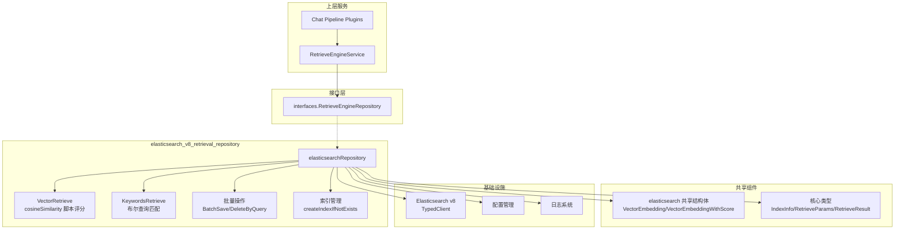

# Elasticsearch v8 Retrieval Repository 深度解析

## 开篇：这个模块解决什么问题？

想象一下，你正在构建一个企业级知识库问答系统。用户问"如何申请年假？"，系统需要从成千上万的文档片段中找到最相关的那一段。这个模块就是负责**存储和检索这些文档片段的核心引擎**。

`elasticsearch_v8_retrieval_repository` 是 WeKnora 系统中 Elasticsearch v8 版本的检索仓库实现。它的核心职责有两个：

1. **持久化存储**：将文档切片（chunk）及其向量嵌入（embedding）存入 Elasticsearch
2. **高效检索**：支持两种检索模式——基于语义的向量相似度搜索和基于文本的关键词匹配

为什么需要专门的 v8 版本？Elasticsearch v8 相比 v7 有重大 API 变更，特别是引入了**类型安全的 Typed API**。这个模块不是简单的版本升级，而是针对 v8 的新特性重新设计的实现，它利用 v8 的类型系统提供了更安全的查询构建和更清晰的错误处理。

**核心设计洞察**：检索系统面临一个根本性张力——**查询灵活性 vs 类型安全**。传统的 ES 客户端使用 `map[string]interface{}` 构建查询，灵活但容易出错。v8 的 Typed API 通过编译时类型检查解决了这个问题，本模块正是这一设计哲学的体现。

---

## 架构概览



### 架构角色定位

这个模块在系统中扮演**检索网关**的角色：

- **向上**：实现 `interfaces.RetrieveEngineRepository` 接口，对上层服务（如 [RetrieveEngineService](file:///Users/wangshiwei/Project/WeKnora/WeKnora-CodeBase-Analysis/docs/application_services_and_orchestration.md#retrieval_engine_service--检索引擎服务)）暴露统一的存储和检索 API
- **向下**：封装 Elasticsearch v8 的 TypedClient，处理所有 ES 特定的查询构建和响应解析
- **横向**：与 [elasticsearch_v7_retrieval_repository](elasticsearch_v7_retrieval_repository.md) 共享数据模型（`VectorEmbedding` 等），确保版本间的数据兼容性

### 数据流追踪

以一次典型的向量检索为例，数据流动路径如下：

```
用户提问 → ChatPipeline.PluginSearch → RetrieveEngineService.Retrieve 
→ elasticsearchRepository.Retrieve → VectorRetrieve 
→ ES Client.Search() → Elasticsearch 集群
→ 返回 hits → 解析为 RetrieveResult → 返回给调用方
```

关键转换点：
1. **入参转换**：`RetrieveParams`（通用检索参数）→ ES 查询 DSL
2. **出参转换**：ES `SearchResponse` → `VectorEmbeddingWithScore` → `IndexWithScore` → `RetrieveResult`

---

## 核心组件深度解析

### 1. elasticsearchRepository 结构体

```go
type elasticsearchRepository struct {
    client *elasticsearch.TypedClient // Elasticsearch 客户端实例
    index  string                     // 使用的索引名称
}
```

**设计意图**：这是一个典型的**仓库模式（Repository Pattern）**实现。结构体只持有两个必要依赖：
- `client`：ES v8 的类型化客户端，所有 ES 操作都通过它执行
- `index`：索引名称，在初始化时从环境变量读取（支持多租户场景下的索引隔离）

**为什么不用接口持有 client？** 因为这是一个具体实现，不需要抽象客户端。如果需要支持多 ES 集群，会在上层通过工厂模式创建不同的 repository 实例。

### 2. 初始化函数 NewElasticsearchEngineRepository

```go
func NewElasticsearchEngineRepository(
    client *elasticsearch.TypedClient,
    config *config.Config,
) interfaces.RetrieveEngineRepository
```

**关键行为**：
1. 从环境变量 `ELASTICSEARCH_INDEX` 读取索引名，默认 `xwrag_default`
2. 调用 `createIndexIfNotExists` 确保索引存在（**自动初始化模式**）
3. 返回接口类型，隐藏具体实现

**设计权衡**：这里选择**自动创建索引**而非要求预创建。优点是部署简单，缺点是生产环境可能需要更精细的索引配置（分片数、副本数等）。代码注释提到创建的是默认配置索引，生产使用应通过 ES 模板预先配置。

### 3. 检索路由：Retrieve 方法

```go
func (e *elasticsearchRepository) Retrieve(
    ctx context.Context,
    params typesLocal.RetrieveParams,
) ([]*typesLocal.RetrieveResult, error)
```

这是模块的**核心入口点**，采用**策略模式**根据 `params.RetrieverType` 路由到不同实现：

| RetrieverType | 调用方法 | 适用场景 |
|--------------|---------|---------|
| `VectorRetrieverType` | `VectorRetrieve` | 语义搜索，理解"年假申请流程"和"如何请年假"是同一个意思 |
| `KeywordsRetrieverType` | `KeywordsRetrieve` | 精确匹配，搜索特定术语或产品型号 |

**为什么返回 `[]*RetrieveResult` 而不是单个？** 这是为混合检索预留的设计。虽然当前每个调用只返回一种类型的结果，但接口设计允许未来扩展为同时返回向量和关键词结果的数组。

### 4. 向量检索：VectorRetrieve

```go
func (e *elasticsearchRepository) VectorRetrieve(
    ctx context.Context,
    params typesLocal.RetrieveParams,
) ([]*typesLocal.RetrieveResult, error)
```

**核心机制**：使用 Elasticsearch 的 `script_score` 查询计算余弦相似度。

```go
scoreSource := "cosineSimilarity(params.query_vector, 'embedding')"
scriptScore := &types.ScriptScoreQuery{
    Query: types.Query{Bool: &types.BoolQuery{Filter: filter}},
    Script: types.Script{
        Source: &scoreSource,
        Params: map[string]json.RawMessage{
            "query_vector": json.RawMessage(queryVectorJSON),
        },
    },
    MinScore: &minScore,
}
```

**为什么用 script_score 而不是 dense_vector？** 这是一个重要的设计决策：

| 方案 | 优点 | 缺点 |
|-----|------|-----|
| `dense_vector` + `cosine` | ES 原生支持，性能更好 | 需要特定字段类型，迁移成本高 |
| `script_score` + 数组 | 灵活，兼容现有数据结构 | 脚本执行有性能开销 |

当前选择 `script_score` 是因为：
1. **向后兼容**：v7 版本也使用相同方案，数据模型无需变更
2. **灵活性**：可以轻松修改相似度算法（如改为点积或欧氏距离）
3. **阈值过滤**：`MinScore` 参数直接在 ES 层过滤低分结果，减少网络传输

**性能考量**：脚本评分在大规模数据上性能较差。如果未来需要优化，可以考虑：
- 使用 ES 的 `dense_vector` 字段类型（需要数据迁移）
- 引入近似最近邻（ANN）索引如 HNSW
- 在应用层做阈值预过滤

### 5. 关键词检索：KeywordsRetrieve

```go
func (e *elasticsearchRepository) KeywordsRetrieve(
    ctx context.Context,
    params typesLocal.RetrieveParams,
) ([]*typesLocal.RetrieveResult, error)
```

实现相对直接，使用布尔查询组合：
- `must`：内容匹配（`match` 查询，会进行分词）
- `filter`：元数据过滤（知识库 ID、标签 ID、启用状态等）

**关键细节**：`filter` 上下文中的查询不参与评分，但会被缓存。这是 ES 的性能优化最佳实践——将不需要评分的条件放入 `filter`。

### 6. 基础查询条件：getBaseConds

```go
func (e *elasticsearchRepository) getBaseConds(
    params typesLocal.RetrieveParams,
) []types.Query
```

这个方法体现了**检索范围的多维约束**设计：

```go
// AND 逻辑：同时指定知识库和文档时，搜索特定知识库中的特定文档
if len(params.KnowledgeBaseIDs) > 0 {
    must = append(must, termsQuery("knowledge_base_id.keyword", ...))
}
if len(params.KnowledgeIDs) > 0 {
    must = append(must, termsQuery("knowledge_id.keyword", ...))
}
if len(params.TagIDs) > 0 {
    must = append(must, termsQuery("tag_id.keyword", ...))
}

// 排除条件
mustNot = append(mustNot, termQuery("is_enabled", false))
```

**设计洞察**：
- 使用 `.keyword` 子字段进行精确匹配（不分词）
- `is_enabled` 字段放在 `must_not` 中，意味着**历史数据（无此字段）会被包含**——这是一个向后兼容的宽容设计
- 支持 `ExcludeKnowledgeIDs` 和 `ExcludeChunkIDs`，用于负向过滤（如排除已读文档）

### 7. 批量操作：BatchSave 和 DeleteByQuery

**BatchSave** 使用 ES 的 Bulk API：
```go
indexRequest := e.client.Bulk().Index(e.index)
for _, embedding := range embeddingList {
    indexRequest.CreateOp(types.CreateOperation{Index_: &e.index}, embeddingDB)
}
_, err := indexRequest.Do(ctx)
```

**为什么用 Bulk API？** 单次索引操作的网络往返开销是固定的。批量操作可以将 100 次请求合并为 1 次，吞吐量提升可达 10 倍以上。

**DeleteByQuery** 系列方法（`DeleteByChunkIDList`、`DeleteBySourceIDList`、`DeleteByKnowledgeIDList`）：
```go
_, err := e.client.DeleteByQuery(e.index).Query(&types.Query{
    Terms: &types.TermsQuery{
        TermsQuery: map[string]types.TermsQueryField{
            "chunk_id.keyword": chunkIDList,
        },
    },
}).Do(ctx)
```

**注意事项**：`DeleteByQuery` 不是原子的，删除过程中新写入的文档可能被遗漏。对于高并发场景，需要考虑版本控制或乐观锁。

### 8. 索引复制：CopyIndices

这是一个**知识库克隆功能**的核心实现：

```go
func (e *elasticsearchRepository) CopyIndices(
    ctx context.Context,
    sourceKnowledgeBaseID string,
    sourceToTargetKBIDMap map[string]string,
    sourceToTargetChunkIDMap map[string]string,
    targetKnowledgeBaseID string,
    ...
) error
```

**关键逻辑**：
1. 分页查询源知识库的所有文档（每批 500 条）
2. 根据映射表转换 `chunk_id`、`knowledge_id`、`source_id`
3. 特殊处理生成的问题（`source_id` 格式为 `{chunkID}-{questionID}`）
4. 批量写入目标知识库

**设计亮点**：
- **分页处理**：避免一次性加载大量数据导致内存溢出
- **ID 映射**：支持一对多的知识库复制场景
- **问题 ID 保留**：生成的 FAQ 问题保持与原 chunk 的关联关系

### 9. 批量状态更新：BatchUpdateChunkEnabledStatus 和 BatchUpdateChunkTagID

这两个方法使用 ES 的 `UpdateByQuery` API 配合 Painless 脚本：

```go
source := "ctx._source.is_enabled = true"
script := types.Script{
    Source: &source,
    Lang:   &scriptlanguage.Painless,
}
_, err := e.client.UpdateByQuery(e.index).Query(query).Script(&script).Do(ctx)
```

**为什么用 UpdateByQuery 而不是先查后改？**
- **原子性**：避免并发修改导致的数据不一致
- **效率**：单次请求完成查询和更新，减少网络往返
- **脚本灵活性**：Painless 脚本可以执行复杂逻辑（如条件更新）

**性能警告**：`UpdateByQuery` 会获取文档锁，大批量更新可能影响并发读取。生产环境应分批执行（当前代码按 enabled/disabled 分组，但未限制每批大小）。

### 10. 存储估算：EstimateStorageSize

```go
func (e *elasticsearchRepository) calculateStorageSize(
    embedding *elasticsearchRetriever.VectorEmbedding,
) int64 {
    contentSizeBytes := int64(len(embedding.Content))
    vectorSizeBytes := int64(len(embedding.Embedding) * 4) // 4 bytes per float32
    metadataSizeBytes := int64(250) // 固定开销估算
    indexOverheadBytes := (contentSizeBytes + vectorSizeBytes) * 5 / 10 // 50% 索引开销
    return contentSizeBytes + vectorSizeBytes + metadataSizeBytes + indexOverheadBytes
}
```

**用途**：用于知识库容量规划和配额管理。

**估算模型**：
- 向量：每维 4 字节（float32）
- 元数据：固定 250 字节（ID、时间戳等）
- 索引开销：内容的 50%（ES 倒排索引的膨胀系数）

**注意**：这是粗略估算，实际大小取决于 ES 版本、字段类型、压缩设置等。

---

## 依赖关系分析

### 上游调用者（谁调用这个模块）

| 调用方 | 调用场景 | 期望行为 |
|-------|---------|---------|
| [RetrieveEngineService](application_services_and_orchestration.md) | 检索请求路由 | 返回按相关性排序的结果列表 |
| [KnowledgeService](application_services_and_orchestration.md) | 知识库导入/更新 | 批量保存成功或返回明确错误 |
| [ChunkService](application_services_and_orchestration.md) | 文档切片管理 | 支持按 chunk_id 精确删除 |
| [ChatPipeline.PluginSearch](application_services_and_orchestration.md) | 问答检索 | 低延迟（<500ms），支持阈值过滤 |

### 下游依赖（这个模块调用谁）

| 被调用方 | 用途 | 耦合程度 |
|---------|-----|---------|
| `elasticsearch.TypedClient` | 所有 ES 操作 | **强耦合**：直接依赖 v8 客户端 API |
| [elasticsearch 共享结构体](data_access_repositories.md) | 数据模型转换 | **松耦合**：共享类型定义，便于 v7/v8 共存 |
| `config.Config` | 初始化配置 | **松耦合**：仅初始化时使用 |
| `logger` | 日志记录 | **松耦合**：标准接口，可替换 |

### 数据契约

**输入契约**：`RetrieveParams`
```go
type RetrieveParams struct {
    RetrieverType     RetrieverType      // vector 或 keywords
    Query             string             // 关键词检索的查询文本
    Embedding         []float32          // 向量检索的查询向量
    TopK              int                // 返回结果数量
    Threshold         float64            // 向量相似度阈值
    KnowledgeBaseIDs  []string           // 知识库 ID 过滤
    KnowledgeIDs      []string           // 文档 ID 过滤
    TagIDs            []string           // 标签 ID 过滤
    ExcludeKnowledgeIDs []string         // 排除的文档 ID
    ExcludeChunkIDs     []string         // 排除的 chunk ID
}
```

**输出契约**：`[]*RetrieveResult`
```go
type RetrieveResult struct {
    Results             []*IndexWithScore  // 匹配结果列表
    RetrieverEngineType RetrieverEngineType // 引擎类型（用于混合检索合并）
    RetrieverType       RetrieverType      // 检索类型
    Error               error              // 错误信息（部分失败场景）
}
```

**隐式契约**：
1. 向量维度必须与索引中存储的维度一致（否则余弦相似度计算无意义）
2. `chunk_id` 在知识库内唯一（删除操作依赖此假设）
3. `is_enabled` 字段可选（历史数据可能缺失，查询应兼容）

---

## 设计决策与权衡

### 1. 为什么使用 Typed API 而不是 Raw JSON？

**选择**：Elasticsearch v8 的 Typed API（`typedapi/core/search` 等）

**替代方案**：手动构建 JSON 查询字符串

**权衡分析**：

| 维度 | Typed API | Raw JSON |
|-----|-----------|---------|
| 类型安全 | ✅ 编译时检查 | ❌ 运行时才能发现错误 |
| IDE 支持 | ✅ 自动补全 | ❌ 无 |
| 重构友好 | ✅ 字段重命名会报错 | ❌ 字符串不会报错 |
| 灵活性 | ⚠️ 受限于 API 覆盖度 | ✅ 可以使用任何 ES 特性 |
| 学习曲线 | ⚠️ 需要理解类型层次 | ✅ 直接对应 ES 文档 |

**决策理由**：对于核心检索逻辑，**正确性优先于灵活性**。Typed API 可以捕获大部分查询构建错误，减少生产事故。对于 Typed API 不支持的高级特性，可以通过 `json.RawMessage` 逃逸。

### 2. 为什么向量存储为 `[]float32` 而不是 `dense_vector`？

**选择**：使用普通数组字段存储向量

**替代方案**：ES 的 `dense_vector` 字段类型

**权衡分析**：

| 维度 | `[]float32` | `dense_vector` |
|-----|-------------|---------------|
| 兼容性 | ✅ 与 v7 完全兼容 | ❌ 需要数据迁移 |
| 性能 | ⚠️ 脚本计算较慢 | ✅ 原生优化 |
| 功能 | ⚠️ 仅支持 script_score | ✅ 支持 KNN 查询 |
| 存储 | ⚠️ 无压缩 | ✅ 支持量化压缩 |

**决策理由**：**渐进式演进**策略。当前选择保持与 v7 的数据兼容，允许系统同时运行两个版本。未来可以通过后台任务逐步迁移到 `dense_vector`，无需停机。

### 3. 为什么索引自动创建而不是预定义？

**选择**：运行时检查并创建索引

**替代方案**：启动时预创建或通过 ES 模板管理

**权衡分析**：

| 维度 | 自动创建 | 预定义模板 |
|-----|---------|-----------|
| 部署复杂度 | ✅ 低 | ⚠️ 需要额外步骤 |
| 配置灵活性 | ❌ 使用默认配置 | ✅ 可精细控制 |
| 多环境一致性 | ❌ 可能不一致 | ✅ 模板保证一致 |
| 权限要求 | ⚠️ 需要创建索引权限 | ✅ 只需写入权限 |

**决策理由**：**开发体验优先**。自动创建降低了本地开发和测试的门槛。生产环境应通过 ES Index Template 预先定义映射和设置，代码中的自动创建作为兜底。

### 4. 为什么批量更新按状态分组而不是逐条更新？

**选择**：按 `enabled`/`disabled` 分组后使用 `UpdateByQuery`

**替代方案**：逐条调用 Update API

**权衡分析**：

| 维度 | 分组 UpdateByQuery | 逐条 Update |
|-----|-------------------|------------|
| 请求数量 | ✅ 2 次（enabled + disabled） | ❌ N 次 |
| 网络开销 | ✅ 低 | ❌ 高 |
| 原子性 | ✅ 组内原子 | ❌ 每条独立 |
| 锁竞争 | ⚠️ 可能阻塞其他操作 | ✅ 锁粒度小 |

**决策理由**：**吞吐量优先**。对于批量操作（如禁用整个知识库），减少网络往返是关键瓶颈。分组策略在大多数场景下性能更优，但应注意避免单组过大（建议限制每组最多 10000 条）。

---

## 使用指南与示例

### 基本使用模式

```go
// 1. 初始化仓库
esClient, _ := elasticsearch.NewTypedClient(...)
repo := NewElasticsearchEngineRepository(esClient, config)

// 2. 保存单个索引
indexInfo := &types.IndexInfo{
    Content: "文档内容...",
    ChunkID: "chunk-123",
    KnowledgeID: "kb-456",
    KnowledgeBaseID: "kbase-789",
}
additionalParams := map[string]any{
    "embedding": []float32{0.1, 0.2, ...}, // 768 维向量
}
err := repo.Save(ctx, indexInfo, additionalParams)

// 3. 批量保存
indexList := []*types.IndexInfo{...}
err = repo.BatchSave(ctx, indexList, additionalParams)

// 4. 向量检索
params := types.RetrieveParams{
    RetrieverType: types.VectorRetrieverType,
    Embedding: queryVector,
    TopK: 10,
    Threshold: 0.75,
    KnowledgeBaseIDs: []string{"kbase-789"},
}
results, err := repo.Retrieve(ctx, params)

// 5. 关键词检索
params := types.RetrieveParams{
    RetrieverType: types.KeywordsRetrieverType,
    Query: "年假申请",
    TopK: 10,
}
results, err := repo.Retrieve(ctx, params)

// 6. 删除操作
err = repo.DeleteByKnowledgeIDList(ctx, []string{"kb-456"}, 768, "manual")

// 7. 批量更新状态
chunkStatusMap := map[string]bool{
    "chunk-123": false, // 禁用
    "chunk-456": true,  // 启用
}
err = repo.BatchUpdateChunkEnabledStatus(ctx, chunkStatusMap)
```

### 配置选项

| 配置项 | 来源 | 默认值 | 说明 |
|-------|------|-------|------|
| `ELASTICSEARCH_INDEX` | 环境变量 | `xwrag_default` | ES 索引名称 |
| 向量维度 | `RetrieveParams` | 无默认 | 必须与嵌入模型输出一致 |
| 相似度阈值 | `RetrieveParams.Threshold` | 0.0 | 向量检索的最低相似度 |

### 混合检索模式

虽然当前 `Retrieve` 方法单次调用只返回一种类型的结果，但上层服务可以实现混合检索：

```go
// 伪代码：混合检索策略
vectorResults, _ := repo.Retrieve(ctx, vectorParams)
keywordResults, _ := repo.Retrieve(ctx, keywordParams)

// 合并结果（按分数加权或 Reciprocal Rank Fusion）
mergedResults := mergeResults(vectorResults, keywordResults, weights)
```

---

## 边界情况与注意事项

### 1. 空向量处理

```go
if len(embeddingDB.Embedding) == 0 {
    return fmt.Errorf("empty embedding vector for chunk ID: %s", embedding.ChunkID)
}
```

**问题**：空向量会导致余弦相似度计算返回 NaN 或错误。

**处理**：在 `Save` 时校验，提前失败而非写入脏数据。

### 2. 历史数据兼容性

```go
mustNot = append(mustNot, types.Query{Term: map[string]types.TermQuery{
    "is_enabled": {Value: false},
}})
```

**问题**：旧数据可能没有 `is_enabled` 字段。

**处理**：ES 的 `term` 查询对缺失字段返回 false，因此 `must_not` 会排除这些文档——**但这不是期望行为**。当前实现实际上会**包含**历史数据（因为 `is_enabled: false` 不匹配缺失字段），这是一个宽容设计，但应通过数据迁移统一字段。

### 3. 大批量删除的性能陷阱

`DeleteByQuery` 在大数据集上可能很慢，且会获取分片锁。

**建议**：
- 单次删除不超过 10000 条
- 使用 `scroll` + `bulk delete` 替代超大批量删除
- 在低峰期执行

### 4. 向量维度不一致

如果查询向量维度与存储的向量维度不一致，`cosineSimilarity` 脚本会报错。

**防护**：
- 在 `RetrieveEngineService` 层校验维度
- 在知识库配置中记录维度，检索时比对

### 5. 并发写入冲突

`BatchSave` 使用 `CreateOp`，如果文档已存在会失败。

**当前行为**：返回错误，调用方需要处理。

**改进建议**：
- 使用 `IndexOp` 覆盖已有文档
- 或使用 `UpdateOp` + `upsert` 实现幂等写入

### 6. 脚本性能开销

`script_score` 在每次查询时执行脚本，大规模数据下性能显著下降。

**监控指标**：
- 查询延迟 P99 > 1s 时告警
- ES 节点 CPU 使用率 > 70% 时考虑优化

**优化路径**：
1. 短期：增加 `MinScore` 阈值，减少候选集
2. 中期：迁移到 `dense_vector` + KNN 查询
3. 长期：引入专用向量数据库（如 Milvus、Qdrant）

### 7. 索引复制的幂等性

`CopyIndices` 方法不是幂等的，重复执行会导致数据重复。

**防护**：
- 调用方应确保目标知识库为空
- 或在复制前清理目标知识库

---

## 与其他模块的关系

### 与 elasticsearch_v7_retrieval_repository 的关系

两个模块共享相同的数据模型（`VectorEmbedding`、`VectorEmbeddingWithScore`），但使用不同的 ES 客户端：

| 特性 | v7 版本 | v8 版本 |
|-----|--------|--------|
| 客户端 | `github.com/elastic/go-elasticsearch/v7` | `github.com/elastic/go-elasticsearch/v8` |
| API 风格 | 部分 Typed，部分 Raw JSON | 完全 Typed API |
| 查询构建 | `map[string]interface{}` | 类型化结构体 |
| 功能覆盖 | 完整 | 完整 |

**迁移策略**：两个版本可以共存，通过 `RetrieveEngineRegistry` 动态选择。迁移时先部署 v8，逐步切换流量，验证后下线 v7。

### 与 Milvus/Qdrant 仓库的关系

[ Milvus](data_access_repositories.md) 和 [Qdrant](data_access_repositories.md) 是专用向量数据库，提供更高效的向量检索：

| 特性 | Elasticsearch | Milvus/Qdrant |
|-----|--------------|---------------|
| 向量检索 | ⚠️ 脚本评分，较慢 | ✅ 原生 KNN，支持 HNSW |
| 关键词检索 | ✅ 全文检索成熟 | ⚠️ 需要额外配置 |
| 混合检索 | ✅ 原生支持 | ⚠️ 需要应用层合并 |
| 运维复杂度 | ✅ 成熟生态 | ⚠️ 需要额外组件 |

**选择建议**：
- 当前规模（<1000 万向量）：ES 足够
- 大规模（>1 亿向量）：考虑迁移到专用向量数据库
- 混合检索需求强：ES 更合适

### 与上层服务的关系

- **[RetrieveEngineService](application_services_and_orchestration.md)**：直接调用本模块，负责多引擎路由和结果合并
- **[ChatPipeline.PluginSearch](application_services_and_orchestration.md)**：通过 RetrieveEngineService 间接调用，关注检索延迟
- **[KnowledgeService](application_services_and_orchestration.md)**：调用 `BatchSave` 和 `DeleteByKnowledgeIDList`，关注数据一致性

---

## 扩展点

### 1. 添加新的检索类型

实现 `Retrieve` 方法的新分支：

```go
func (e *elasticsearchRepository) Retrieve(...) {
    switch params.RetrieverType {
    case typesLocal.VectorRetrieverType:
        return e.VectorRetrieve(ctx, params)
    case typesLocal.KeywordsRetrieverType:
        return e.KeywordsRetrieve(ctx, params)
    case typesLocal.HybridRetrieverType: // 新增
        return e.HybridRetrieve(ctx, params)
    }
}
```

### 2. 自定义相似度算法

修改 `VectorRetrieve` 中的脚本：

```go
// 余弦相似度（当前）
scoreSource := "cosineSimilarity(params.query_vector, 'embedding')"

// 点积相似度
scoreSource := "dotProduct(params.query_vector, 'embedding')"

// 欧氏距离（转换为相似度）
scoreSource := "1 / (1 + l2norm(params.query_vector, 'embedding'))"
```

### 3. 添加新的过滤条件

在 `getBaseConds` 中扩展：

```go
if params.TimeRange != nil {
    must = append(must, types.Query{Range: &types.RangeQuery{
        "created_at": map[string]any{
            "gte": params.TimeRange.Start,
            "lte": params.TimeRange.End,
        },
    }})
}
```

---

## 运维考虑

### 监控指标

| 指标 | 采集方式 | 告警阈值 |
|-----|---------|---------|
| 检索延迟 P99 | ES slow log + 应用埋点 | > 1000ms |
| 批量保存失败率 | 应用日志 | > 1% |
| 索引大小 | ES `_cat/indices` API | > 50GB |
| 文档数量 | ES `_count` API | > 1000 万 |

### 索引优化建议

```json
{
  "settings": {
    "number_of_shards": 3,
    "number_of_replicas": 1,
    "refresh_interval": "30s",
    "codec": "best_compression"
  },
  "mappings": {
    "properties": {
      "embedding": { "type": "dense_vector", "dims": 768 },
      "content": { "type": "text", "analyzer": "ik_max_word" },
      "chunk_id": { "type": "keyword" },
      "knowledge_id": { "type": "keyword" },
      "is_enabled": { "type": "boolean" }
    }
  }
}
```

### 备份策略

- 使用 ES Snapshot API 每日备份
- 知识库删除前导出原始数据
- 保留最近 7 天的快照

---

## 参考链接

- [Elasticsearch v7 检索仓库](elasticsearch_v7_retrieval_repository.md) — 对比 v7 实现的差异
- [Milvus 检索仓库](milvus_vector_retrieval_repository.md) — 专用向量数据库方案
- [RetrieveEngineService](application_services_and_orchestration.md) — 上层检索服务编排
- [数据访问仓库概览](data_access_repositories.md) — 所有仓库模块的架构位置
