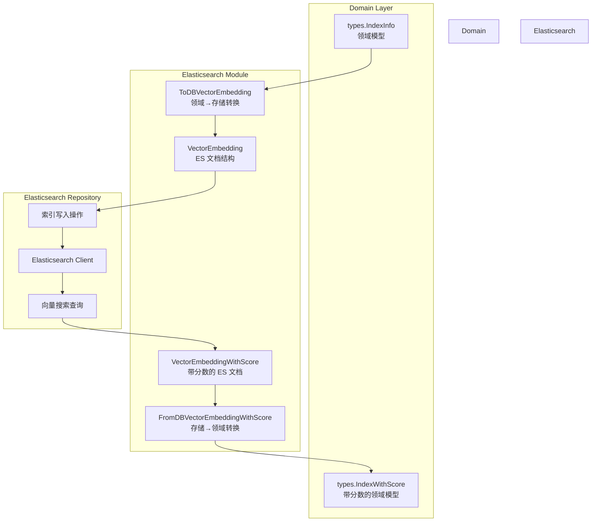

# Elasticsearch Vector Embedding Models

## 概述

想象一下，你正在构建一个大规模的知识检索系统，需要将数百万个文本片段（chunk）存储到 Elasticsearch 中，并支持基于语义相似度的向量搜索。`elasticsearch_vector_embedding_models` 模块就是这个系统的**数据翻译层**——它定义了向量嵌入在 Elasticsearch 中的存储结构，并负责在领域模型和数据库模型之间进行双向转换。

这个模块存在的核心原因是：**领域层不应该直接依赖存储层的实现细节**。上层业务代码操作的是通用的 `IndexInfo` 和 `IndexWithScore` 领域模型，而 Elasticsearch 有自己特定的文档结构要求。这个模块就是两者之间的适配器，确保存储细节的变化不会污染整个代码库。

## 架构角色与数据流



### 数据流 walkthrough

**写入路径（索引创建）**：
1. 上层服务（如 [knowledgeService](file://internal/application/service/knowledge/knowledge.go#L60-L652)）生成 `IndexInfo` 领域对象
2. 调用 `ToDBVectorEmbedding()` 将领域模型转换为 `VectorEmbedding`
3. `VectorEmbedding` 被序列化为 JSON 文档写入 Elasticsearch
4. 转换过程中会从 `additionalParams` 提取向量数据和启用状态

**读取路径（向量搜索）**：
1. Elasticsearch 执行相似度搜索，返回 `VectorEmbeddingWithScore`
2. 调用 `FromDBVectorEmbeddingWithScore()` 将 ES 文档转换回 `IndexWithScore`
3. 领域层拿到带有相似度分数的结果，继续后续的排序、过滤等操作

## 核心组件深度解析

### VectorEmbedding

**设计目的**：定义 Elasticsearch 中文档的精确结构，相当于数据库的 schema。

```go
type VectorEmbedding struct {
    Content         string    `json:"content"`           // 文本片段内容
    SourceID        string    `json:"source_id"`         // 源文档 ID
    SourceType      int       `json:"source_type"`       // 源文档类型（枚举值）
    ChunkID         string    `json:"chunk_id"`          // 文本片段的唯一 ID
    KnowledgeID     string    `json:"knowledge_id"`      // 知识项 ID
    KnowledgeBaseID string    `json:"knowledge_base_id"` // 知识库 ID
    Embedding       []float32 `json:"embedding"`         // 向量嵌入数据
    IsEnabled       bool      `json:"is_enabled"`        // 是否启用
}
```

**关键设计决策**：

1. **冗余存储策略**：注意 `Content` 字段同时存储了文本内容。这是典型的**空间换时间**设计——向量搜索返回结果时，可以直接获取内容，无需二次查询。在高频检索场景下，这避免了 N+1 查询问题。

2. **多层级索引结构**：同时存储 `KnowledgeID` 和 `KnowledgeBaseID`，支持两种粒度的过滤查询。想象一下图书馆系统：你可以按"书架"（KnowledgeBase）过滤，也可以按"书"（Knowledge）过滤。这种设计让查询更灵活，但代价是文档体积稍大。

3. **启用状态标记**：`IsEnabled` 字段允许软删除片段，而不是物理删除。这在 FAQ 导入、知识审核等场景非常有用——可以临时禁用有问题的片段，而不破坏引用关系。

4. **向量存储为 float32 数组**：选择 `[]float32` 而非 `[]float64` 是性能考量。向量维度通常是 768、1024 或 1536，使用 float32 可以节省一半存储空间，且 Elasticsearch 的向量相似度计算对 float32 有优化。

### VectorEmbeddingWithScore

**设计目的**：扩展 `VectorEmbedding`，携带向量搜索返回的相似度分数。

```go
type VectorEmbeddingWithScore struct {
    VectorEmbedding
    Score float64 // 向量搜索返回的相似度分数
}
```

**为什么分数是 float64 而向量是 float32？**

这是一个微妙的精度权衡：
- 向量存储用 `float32`：节省空间，检索时的精度损失可接受
- 分数用 `float64`：排序和阈值比较需要更高精度，避免浮点误差导致边界情况判断错误

这种设计类似于"存储用压缩格式，计算用高精度格式"的模式。

### ToDBVectorEmbedding

**函数签名**：
```go
func ToDBVectorEmbedding(
    embedding *types.IndexInfo, 
    additionalParams map[string]interface{},
) *VectorEmbedding
```

**职责**：将领域层的 `IndexInfo` 转换为 Elasticsearch 可存储的 `VectorEmbedding`。

**参数设计解析**：

`additionalParams` 是一个灵活但需要谨慎使用的扩展点。它允许调用者传递一些**非领域核心**但存储层需要的数据：

```go
// 典型调用示例
additionalParams := map[string]interface{}{
    "embedding": map[string][]float32{
        "chunk-123": {0.1, 0.2, 0.3, ...}, // 按 SourceID 索引的向量
    },
    "chunk_enabled": map[string]bool{
        "chunk-123": true,
    },
}
```

**为什么这样设计？**

`IndexInfo` 领域模型不直接包含向量数据（向量是计算产物，不是领域概念），但存储时需要。通过 `additionalParams` 传递，保持了领域模型的纯净性。这是一种**依赖倒置**的实现——存储层依赖领域层定义的接口，但领域层不需要知道存储层的额外需求。

**潜在陷阱**：
- `additionalParams` 是 `map[string]interface{}`，类型不安全，调用方必须确保传入正确的结构
- 向量数据按 `SourceID` 索引，如果 ID 不匹配会导致向量为空
- 默认 `IsEnabled = true`，如果业务需要默认禁用，必须显式传递 `chunk_enabled`

### FromDBVectorEmbeddingWithScore

**函数签名**：
```go
func FromDBVectorEmbeddingWithScore(
    id string,
    embedding *VectorEmbeddingWithScore,
    matchType types.MatchType,
) *types.IndexWithScore
```

**职责**：将 Elasticsearch 查询结果转换回领域模型。

**参数解析**：

| 参数 | 作用 | 为什么需要 |
|------|------|-----------|
| `id` | Elasticsearch 文档 ID | ES 的 `_id` 不在文档体内，需要单独传入 |
| `embedding` | ES 查询结果 | 包含文档内容和相似度分数 |
| `matchType` | 匹配类型（向量/关键词/混合） | 用于追踪结果来源，支持混合搜索场景 |

**设计洞察**：

`matchType` 参数的存在揭示了这个系统支持**混合搜索**（hybrid search）——同时使用向量相似度和关键词匹配。上层服务需要根据匹配类型决定如何融合结果。这是检索系统中常见但容易被忽视的设计点。

## 依赖关系分析

### 上游依赖（谁调用这个模块）

这个模块主要被 [elasticsearchRepository](file://internal/application/repository/retriever/elasticsearch/v8/repository/elasticsearch.go#L23-L1158) 使用：

```
elasticsearchRepository
    ├── 写入时调用 ToDBVectorEmbedding()
    └── 读取时调用 FromDBVectorEmbeddingWithScore()
```

而 `elasticsearchRepository` 又被更上层的检索服务调用：
- [RetrieveEngine](file://internal/types/interfaces/retriever/retriever.go#L10-L34) 接口实现
- [CompositeRetrieveEngine](file://internal/application/service/retriever/composite/composite_retrieve_engine.go#L17-L298) 组合检索引擎
- [KeywordsVectorHybridRetrieveEngineService](file://internal/application/service/retriever/keywords_vector_hybrid_indexer/keywords_vector_hybrid_indexer.go#L19-L380) 混合检索服务

### 下游依赖（这个模块依赖什么）

```go
import (
    "maps"
    "slices"
    "github.com/Tencent/WeKnora/internal/types" // 领域模型定义
)
```

**关键依赖**：
- `types.IndexInfo`：领域层的索引信息模型
- `types.IndexWithScore`：带分数的检索结果模型
- `types.SourceType`：源文档类型枚举
- `types.MatchType`：匹配类型枚举

**耦合分析**：
- 这个模块**单向依赖**领域层，领域层不依赖它（正确的依赖方向）
- 如果 `IndexInfo` 增加字段，`ToDBVectorEmbedding` 需要同步更新
- 如果 Elasticsearch 的 mapping 变更，只需要修改这个模块，不影响上层

## 设计权衡与决策

### 1. 为什么不用 ORM 标签生成？

代码中同时存在 `json` 和 `gorm` 标签，但实际使用的是 JSON 序列化直接操作 Elasticsearch：

```go
Content string `json:"content" gorm:"column:content;not null"`
```

**权衡**：
- **选择**：保留 GORM 标签可能是历史遗留（从关系数据库迁移过来）
- **风险**：新贡献者可能误以为这是 GORM 模型，实际是 JSON 文档结构
- **建议**：如果确定不用 GORM，可以移除 `gorm` 标签减少混淆

### 2. additionalParams 的类型安全 vs 灵活性

使用 `map[string]interface{}` 传递额外参数是 Go 中常见的模式，但存在类型安全问题。

**替代方案对比**：

| 方案 | 优点 | 缺点 |
|------|------|------|
| `map[string]interface{}`（当前） | 灵活，易于扩展 | 类型不安全，需要运行时检查 |
| 专用 struct | 类型安全，IDE 友好 | 每次扩展需要修改定义 |
| 函数选项模式（Functional Options） | 优雅，类型安全 | 代码量较大 |

**当前选择的合理性**：
- 这个转换函数调用频率不高（批量索引时），性能不是首要考虑
- 参数结构相对固定（主要是 `embedding` 和 `chunk_enabled`）
- 权衡后选择了简单性

### 3. 嵌入向量存储位置的设计

向量数据不直接放在 `IndexInfo` 中，而是通过 `additionalParams` 传递。

**为什么？**

`IndexInfo` 是领域模型，代表"一个可检索的索引项"这个概念。向量是**实现细节**——今天用 Elasticsearch 存储向量，明天可能换成 Milvus 或 Qdrant。如果 `IndexInfo` 包含向量字段，就污染了领域模型的纯净性。

这是一种**关注点分离**：领域层关心"是什么"，存储层关心"怎么存"。

## 使用示例

### 索引写入场景

```go
// 1. 准备领域模型
indexInfo := &types.IndexInfo{
    Content:         "Elasticsearch 是一个分布式搜索引擎",
    SourceID:        "doc-001",
    SourceType:      types.SourceTypeKnowledge,
    ChunkID:         "chunk-001",
    KnowledgeID:     "kb-001",
    KnowledgeBaseID: "kbase-001",
}

// 2. 准备向量数据（由嵌入模型计算得到）
embeddingVector := []float32{0.1, 0.2, 0.3, /* ... 768 维 */}

// 3. 构建 additionalParams
additionalParams := map[string]interface{}{
    "embedding": map[string][]float32{
        "doc-001": embeddingVector,
    },
    "chunk_enabled": map[string]bool{
        "chunk-001": true,
    },
}

// 4. 转换为 ES 文档
esDoc := ToDBVectorEmbedding(indexInfo, additionalParams)

// 5. 写入 Elasticsearch（伪代码）
esClient.Index("knowledge_chunks", esDoc)
```

### 向量搜索场景

```go
// 1. 执行向量搜索（伪代码）
searchResult := esClient.Search(
    "knowledge_chunks",
    elasticsearch.NewVectorQuery(queryVector, "embedding"),
)

// 2. 解析 ES 响应
var esDoc VectorEmbeddingWithScore
json.Unmarshal(searchResult.Source, &esDoc)
esDoc.Score = searchResult.Score

// 3. 转换为领域模型
indexWithScore := FromDBVectorEmbeddingWithScore(
    searchResult.ID,
    &esDoc,
    types.MatchTypeVector,
)

// 4. 使用结果
fmt.Printf("找到相关内容: %s (相似度: %.4f)\n", 
    indexWithScore.Content, 
    indexWithScore.Score)
```

## 边界情况与注意事项

### 1. 向量数据缺失

如果 `additionalParams["embedding"]` 不存在或格式不正确，转换后的 `VectorEmbedding.Embedding` 会是空切片。这会导致：
- Elasticsearch 索引失败（如果 mapping 要求 `embedding` 字段非空）
- 或者索引成功但无法进行向量搜索

**防御建议**：在调用 `ToDBVectorEmbedding` 前，调用方应验证向量数据存在。

### 2. ChunkID 与 SourceID 的映射关系

`chunk_enabled` 映射使用 `ChunkID` 作为键，而 `embedding` 映射使用 `SourceID` 作为键。这种不一致容易出错：

```go
// 错误示例：都用 SourceID
additionalParams := map[string]interface{}{
    "chunk_enabled": map[string]bool{
        "doc-001": true, // 应该用 "chunk-001"
    },
}
// 结果：IsEnabled 保持默认值 true，而不是预期的 false
```

**记忆技巧**：启用状态是针对"片段"（Chunk）的，向量是针对"源"（Source）的。

### 3. 分数精度问题

`Score` 是 `float64`，但 Elasticsearch 返回的分数可能有浮点误差。在比较分数时应使用容差：

```go
// 不推荐
if result.Score == 0.85 { ... }

// 推荐
if math.Abs(result.Score - 0.85) < 1e-6 { ... }
```

### 4. 并发安全

这两个转换函数都是纯函数（无状态），可以安全并发调用。但 `additionalParams` 如果在多个 goroutine 间共享且被修改，会导致数据竞争。

## 扩展点

### 添加新字段

如果需要在 Elasticsearch 中存储新字段：

1. 在 `VectorEmbedding` 添加字段
2. 在 `ToDBVectorEmbedding` 中设置新字段的值
3. 在 `FromDBVectorEmbeddingWithScore` 中决定是否映射回领域模型

**示例**：添加 `LastModified` 时间戳

```go
type VectorEmbedding struct {
    // ... 现有字段
    LastModified time.Time `json:"last_modified"`
}

func ToDBVectorEmbedding(...) *VectorEmbedding {
    return &VectorEmbedding{
        // ... 现有赋值
        LastModified: time.Now(),
    }
}
```

### 支持新的向量类型

当前只支持 `[]float32`。如果需要支持稀疏向量或二进制向量：

1. 添加新字段（如 `SparseEmbedding map[string]float32`）
2. 更新转换逻辑
3. 更新 Elasticsearch mapping

## 相关模块

- [elasticsearch_v7_retrieval_repository](elasticsearch_v7_retrieval_repository.md) / [elasticsearch_v8_retrieval_repository](elasticsearch_v8_retrieval_repository.md)：使用本模块的 ES 仓库实现
- [milvus_vector_embedding_models](milvus_vector_embedding_models.md)：Milvus 向量存储的对应模块
- [postgres_vector_embedding_models](postgres_vector_embedding_models.md)：PostgreSQL pgvector 的对应模块
- [qdrant_vector_embedding_models](qdrant_vector_embedding_models.md)：Qdrant 向量存储的对应模块
- [RetrieveEngine](RetrieveEngine.md)：检索引擎接口，定义检索操作的契约

## 总结

`elasticsearch_vector_embedding_models` 是一个典型的**仓储层数据映射模块**，它的设计体现了几个关键原则：

1. **依赖倒置**：存储层适配领域层，而不是反过来
2. **关注点分离**：领域模型不包含存储细节
3. **冗余优化**：为查询性能牺牲存储空间
4. **扩展性**：通过 `additionalParams` 支持未来变化

理解这个模块的关键是认识到它不是"业务逻辑"，而是**基础设施代码**——它的存在让上层代码可以优雅地工作，而不必关心 Elasticsearch 的具体实现细节。
