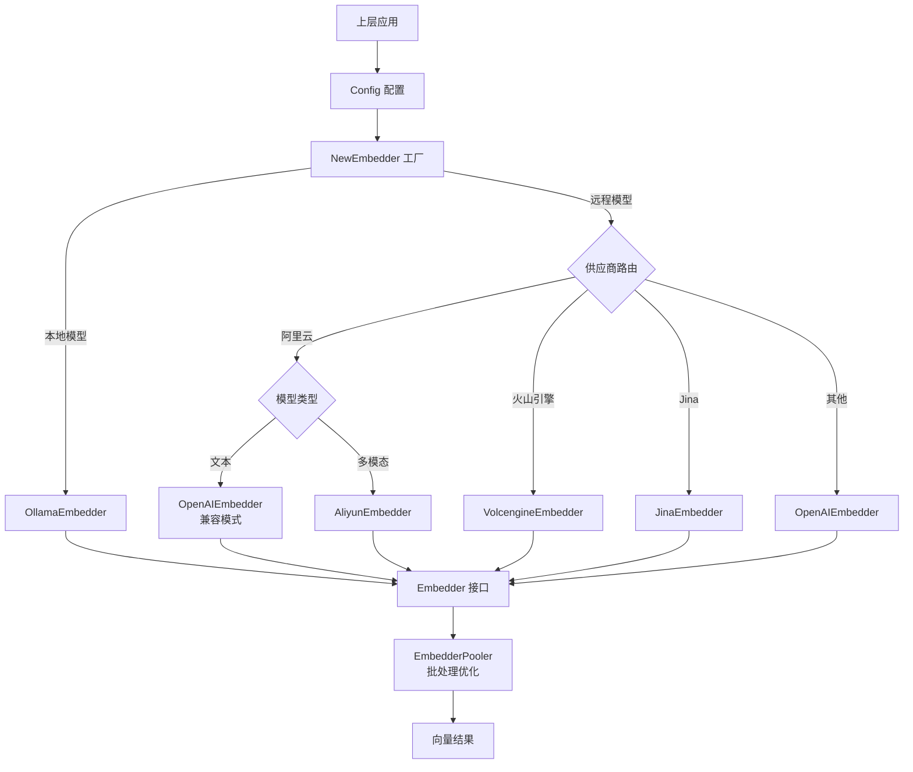

# Embedding Pooling and Runtime Configuration 模块深度解析

## 1. 模块概览与问题定位

在现代 AI 应用架构中，文本嵌入（Text Embedding）是连接自然语言处理和向量检索的核心环节。`embedding_pooling_and_runtime_configuration` 模块的存在，正是为了解决多供应商嵌入模型集成、运行时配置管理和批处理优化这三大核心问题。

想象一下，如果没有这个模块，每个使用嵌入功能的组件都需要直接与不同供应商（OpenAI、阿里云、火山引擎等）的 API 打交道，处理各自不同的请求格式、认证方式和错误处理。这会导致代码重复、维护成本高昂，以及添加新供应商时的巨大改动成本。

本模块作为嵌入功能的**统一接入层**和**配置中心**，将这种复杂性封装起来，为上层应用提供简洁一致的接口。

## 2. 核心抽象与设计思想

### 2.1 核心接口与模型

本模块的核心抽象包括两个关键组件：

#### `Embedder` 接口
这是整个嵌入功能的统一入口，定义了文本向量化的标准契约。它要求实现者提供：
- 单个文本嵌入能力（`Embed`）
- 批量文本嵌入能力（`BatchEmbed`）
- 模型元数据查询（`GetModelName`、`GetDimensions`、`GetModelID`）
- 以及通过 `EmbedderPooler` 接口扩展的池化批处理能力

#### `EmbedderPooler` 接口
这是一个专门用于批量处理优化的扩展接口，允许不同的实现策略：
- 可以是简单的串行调用
- 可以是并发处理优化
- 可以是基于连接池的复用策略

#### `Config` 结构体
这是一个包含所有必要配置信息的数据结构，用于统一描述任何嵌入模型的配置：
- `Source`：模型来源（本地/远程）
- `BaseURL`：API 端点
- `ModelName`：模型名称
- `APIKey`：认证密钥
- `TruncatePromptTokens`：提示截断长度
- `Dimensions`：向量维度
- `ModelID`：模型唯一标识
- `Provider`：供应商名称

### 2.2 设计思想

这个模块采用了**策略模式**和**工厂模式**的结合：
- **工厂模式**：`NewEmbedder` 函数作为工厂，根据配置创建合适的嵌入器实现
- **策略模式**：不同的供应商实现（OpenAI、阿里云等）是不同的策略，可以互换使用
- **组合模式**：`Embedder` 接口组合了基本功能和池化扩展功能

## 3. 数据流程与架构角色

### 3.1 架构图



### 3.2 初始化流程

1. **配置准备**：上层组件（如向量检索服务）准备 `Config` 结构体
2. **工厂创建**：调用 `NewEmbedder(config, pooler, ollamaService)`
3. **路由决策**：
   - 首先根据 `Source` 区分本地/远程
   - 对于远程，通过 `provider.DetectProvider` 或配置的 `Provider` 字段识别供应商
   - 根据供应商类型路由到具体的构造函数

### 3.3 运行时使用流程

```
上层应用
    ↓
Embedder.BatchEmbed() 
    ↓
[可选：EmbedderPooler.BatchEmbedWithPool() 优化]
    ↓
具体供应商实现
    ↓
外部 API 调用
    ↓
向量结果返回
```

## 4. 关键组件深度解析

### 4.1 `NewEmbedder` 工厂函数

这是模块的核心编排函数，它的设计体现了几个重要的考量：

#### 供应商智能路由
```go
// 检测或使用配置的供应商进行路由
providerName := provider.ProviderName(config.Provider)
if providerName == "" {
    providerName = provider.DetectProvider(config.BaseURL)
}
```

**设计意图**：
- 允许显式配置供应商，提高确定性
- 支持自动检测，降低配置复杂度
- 这种双重机制既满足了高级用户的控制需求，又简化了普通用户的使用

#### 阿里云多模态特殊处理
这是代码中最复杂的部分，值得深入理解：

```go
// 检查是否是多模态嵌入模型
isMultimodalModel := strings.Contains(strings.ToLower(config.ModelName), "vision") ||
    strings.Contains(strings.ToLower(config.ModelName), "multimodal")
```

**为什么需要这种特殊处理？**
- 阿里云的文本嵌入模型（text-embedding-v*）使用 OpenAI 兼容接口
- 但多模态模型（tongyi-embedding-vision-*、multimodal-embedding-*）需要使用 DashScope 专用 API
- 如果混用，会导致响应格式不匹配、embedding 返回空数组等问题

**URL 自动修正机制**：
```go
if strings.Contains(baseURL, "/compatible-mode/") {
    // 移除 compatible-mode 路径，AliyunEmbedder 会自动添加多模态端点
    baseURL = strings.Replace(baseURL, "/compatible-mode/v1", "", 1)
    baseURL = strings.Replace(baseURL, "/compatible-mode", "", 1)
}
```

这种设计体现了**防御性编程**思想——即使配置有误，系统也能尝试自动修正，提高鲁棒性。

### 4.2 `EmbedderPooler` 接口设计

这个接口的设计非常巧妙：

```go
type EmbedderPooler interface {
    BatchEmbedWithPool(ctx context.Context, model Embedder, texts []string) ([][]float32, error)
}
```

**为什么 `Embedder` 要继承 `EmbedderPooler`？**
- 这使得每个 `Embedder` 实例都可以使用池化能力
- 但池化逻辑本身可以与具体的嵌入实现解耦
- 不同的池化策略可以共享同一个嵌入器实例

**这种设计的灵活性**：
- 你可以有一个基于连接池的池化器
- 也可以有一个基于并发控制的池化器
- 甚至可以有一个实现了断路器模式的池化器

## 5. 设计决策与权衡

### 5.1 统一配置 vs 专用配置

**决策**：使用单一的 `Config` 结构体包含所有可能的配置项

**权衡分析**：
- ✅ 优点：简化了工厂函数签名，上层组件不需要知道不同供应商的特定配置
- ❌ 缺点：有些配置项对某些供应商没有意义（例如 `Dimensions` 对不支持自定义维度的模型）
- **缓解方案**：通过文档和默认值来处理，供应商实现可以忽略不相关的配置项

### 5.2 硬编码的供应商路由 vs 可插拔的注册机制

**决策**：在 `NewEmbedder` 中使用 switch-case 硬编码路由

**权衡分析**：
- ✅ 优点：逻辑清晰直观，易于理解和调试
- ❌ 缺点：添加新供应商需要修改这个函数，违反了开闭原则
- **为什么这样选择**：
  - 供应商的数量相对有限且变化不频繁
  - 每个供应商的初始化逻辑可能有特殊处理（如阿里云的多模态处理）
  - 过早抽象可能导致过度设计

### 5.3 接口组合 vs 单一庞大接口

**决策**：将基本功能和池化功能分离到两个接口，然后组合

**权衡分析**：
- ✅ 优点：
  - 接口职责单一
  - 可以独立测试和实现
  - 灵活性高——如果不需要池化，可以只实现基本接口
- ❌ 缺点：
  - 接口数量增加，理解成本略高
- **为什么这样选择**：遵循接口隔离原则（ISP），客户端不应该依赖它不需要的方法

## 6. 依赖关系分析

### 6.1 输入依赖

本模块依赖以下关键组件：

1. **`provider.ProviderName` 和 `provider.DetectProvider`**：
   - 用于供应商识别和路由
   - 这是本模块与供应商目录之间的契约

2. **`ollama.OllamaService`**：
   - 仅在使用本地模型时需要
   - 体现了本地/远程模型的差异化处理

### 6.2 输出契约

本模块为上层提供的契约：
1. **`Embedder` 接口**：这是主要的使用契约
2. **`Config` 结构体**：这是配置契约

### 6.3 调用关系

本模块被以下类型的组件调用：
- 向量检索服务（在 [vector_retrieval_backend_repositories](data-access-repositories-vector-retrieval-backend-repositories.md) 中）
- 知识图谱构建服务
- 任何需要文本向量化的应用层组件

本模块调用：
- 各供应商的具体嵌入实现（OpenAIEmbedder、AliyunEmbedder 等）
- 供应商检测工具
- Ollama 服务（本地模型）

## 7. 使用指南与最佳实践

### 7.1 基本使用

```go
// 1. 准备配置
config := embedding.Config{
    Source:               types.ModelSourceRemote,
    BaseURL:              "https://api.openai.com/v1",
    ModelName:            "text-embedding-3-small",
    APIKey:               "your-api-key",
    TruncatePromptTokens: 8191,
    Dimensions:           1536,
    ModelID:              "openai-text-embedding-3-small",
    Provider:             "openai",
}

// 2. 创建嵌入器（假设已有 pooler 和 ollamaService）
embedder, err := embedding.NewEmbedder(config, pooler, ollamaService)
if err != nil {
    // 处理错误
}

// 3. 使用嵌入器
vector, err := embedder.Embed(ctx, "Hello, world!")
vectors, err := embedder.BatchEmbed(ctx, []string{"Text 1", "Text 2"})
```

### 7.2 配置最佳实践

1. **供应商选择**：
   - 对于阿里云文本模型，使用 `compatible-mode` URL
   - 对于阿里云多模态模型，使用标准 DashScope URL
   - 尽可能显式设置 `Provider` 字段，避免依赖自动检测

2. **ModelID 的使用**：
   - `ModelID` 是你自己给模型起的唯一标识符
   - 用于在系统内部区分不同的模型配置
   - 建议使用 `{provider}-{model-name}` 格式

3. **维度配置**：
   - 只有当模型支持自定义维度时才设置 `Dimensions`
   - 对于不支持的模型，留空或设置为 0

## 8. 边缘情况与陷阱

### 8.1 常见陷阱

1. **阿里云模型 URL 配置错误**：
   - ❌ 错误：多模态模型使用 `/compatible-mode/` URL
   - ✅ 正确：多模态模型使用标准 DashScope URL
   - 好消息：代码会尝试自动修正这个问题

2. **忽略 ModelID**：
   - ❌ 错误：不设置或使用重复的 ModelID
   - ✅ 正确：为每个配置使用唯一的 ModelID
   - 后果：可能导致模型缓存混淆、指标统计错误

3. **TruncatePromptTokens 设置不当**：
   - ❌ 错误：设置超过模型最大输入长度的值
   - ✅ 正确：查询模型文档，使用合适的值
   - 后果：可能导致 API 调用失败或截断过度

### 8.2 扩展注意事项

如果你需要添加新的供应商支持：

1. **在 `NewEmbedder` 中添加 case**：找到合适的位置添加你的供应商路由
2. **考虑是否需要特殊处理**：像阿里云那样的特殊逻辑
3. **复用现有实现**：如果是 OpenAI 兼容的，可以直接使用 `NewOpenAIEmbedder`
4. **更新文档**：确保记录新供应商的特殊配置要求

## 9. 总结

`embedding_pooling_and_runtime_configuration` 模块是一个典型的**防腐层（Anti-Corruption Layer）**设计示例。它通过统一的接口和配置模型，将上层应用与多样化的嵌入模型供应商隔离开来，同时提供了足够的灵活性来处理各供应商的特殊性。

这个模块的设计哲学可以概括为：
- **封装复杂性**：将供应商差异隐藏在统一接口背后
- **提供灵活性**：通过池化接口等扩展点支持优化
- **增强鲁棒性**：通过自动修正等机制处理常见配置错误

理解这个模块，关键是要理解它作为**统一接入点**和**配置路由器**的双重角色，以及它在 simplicity（简单性）和 flexibility（灵活性）之间的巧妙平衡。
