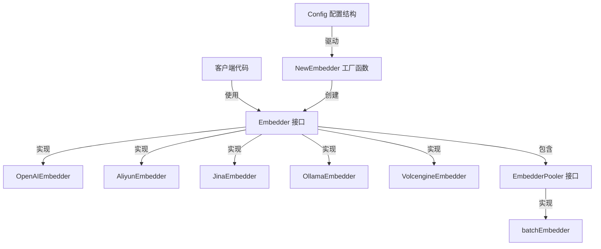

# Embedding 接口、批处理与后端实现

## 1. 模块概述

`embedding_interfaces_batching_and_backends` 模块是系统中负责文本向量化的核心组件。它解决了一个关键问题：**如何以统一、高效、可扩展的方式将文本转换为向量表示，同时支持多种不同的 AI 服务提供商和本地模型**。

想象一下，您正在构建一个文档检索系统，需要将成千上万的文档片段转换为向量以便进行语义搜索。如果直接调用 API，您会遇到几个问题：
- 不同提供商的 API 格式完全不同
- 大量请求会导致超时或被限流
- 本地模型和云端模型的调用方式差异巨大

这个模块就像一个"向量转换工厂"：它提供了一个统一的工作接口，内部管理着不同的"生产线"（各提供商的实现），并通过"批量处理车间"（批处理机制）优化生产效率。

## 2. 架构设计

### 2.1 核心组件关系图



### 2.2 架构层次分析

这个模块采用了清晰的分层设计：

**接口层**：
- `Embedder`：定义了所有向量化实现必须遵守的契约
- `EmbedderPooler`：扩展了批处理能力的接口

**实现层**：
- 各个提供商的具体实现（OpenAI、阿里云、Jina、Ollama、火山引擎）
- `batchEmbedder`：通用的批处理协调器

**工厂层**：
- `NewEmbedder`：根据配置动态创建合适的实现

**数据模型层**：
- 各个提供商的请求/响应结构
- `Config`：统一的配置结构

## 3. 核心设计理念

### 3.1 统一接口，多态实现

`Embedder` 接口是整个模块的基石。它定义了五个核心方法：

```go
type Embedder interface {
    Embed(ctx context.Context, text string) ([]float32, error)
    BatchEmbed(ctx context.Context, texts []string) ([][]float32, error)
    GetModelName() string
    GetDimensions() int
    GetModelID() string
    EmbedderPooler
}
```

**设计意图**：通过统一接口，上层代码可以完全不关心底层是调用 OpenAI 还是本地 Ollama，实现了"面向接口编程"。这使得切换提供商变得轻而易举，只需修改配置即可。

### 3.2 批处理的双重策略

模块提供了两种批处理方式：

1. **提供商原生批处理**：通过 `BatchEmbed` 方法，利用提供商 API 的批量能力
2. **应用层批处理**：通过 `BatchEmbedWithPool` 方法，在应用层进行分批并发处理

**设计权衡**：
- 提供商原生批处理通常更高效、更经济，但受限于 API 的最大批量限制
- 应用层批处理更灵活，可以控制并发度，但会增加网络往返次数

`batchEmbedder` 的设计巧妙地结合了两者：它将大批次切分成小批次，然后并发调用提供商的 `BatchEmbed` 方法。

### 3.3 优雅的错误处理与重试

所有 HTTP 客户端实现都包含了 `doRequestWithRetry` 方法，采用了指数退避重试策略。

**设计意图**：网络请求是不可靠的，特别是在调用外部 API 时。通过内置重试机制，模块提高了整体系统的韧性，减少了临时性错误对上层应用的影响。

### 3.4 配置驱动的工厂模式

`NewEmbedder` 工厂函数是模块的"指挥中心"，它根据 `Config` 结构中的信息动态创建合适的实现。

**特别值得注意的是阿里云的路由逻辑**：
- 文本-only 模型使用 OpenAI 兼容接口
- 多模态模型使用 DashScope 专用 API
- 自动修正用户可能错误配置的 URL

这体现了一个重要的设计原则：**让模块尽可能聪明，减轻用户的认知负担**。

## 4. 数据流向分析

### 4.1 单次文本向量化流程

当调用 `Embed(text)` 时，数据流如下：

```
客户端 
  ↓
Embedder.Embed()
  ↓ (内部调用)
Embedder.BatchEmbed([text])
  ↓
构建提供商特定请求
  ↓
HTTP 请求 (可能重试)
  ↓
解析响应
  ↓
返回 []float32
```

### 4.2 批量向量化流程 (使用 BatchEmbedWithPool)

当调用 `BatchEmbedWithPool(texts)` 时，数据流更复杂：

```
客户端
  ↓
batchEmbedder.BatchEmbedWithPool()
  ↓
将 texts 切分成小批次 (大小由 BATCH_EMBED_SIZE 决定)
  ↓
为每个批次创建任务
  ↓
提交任务到 ants  goroutine pool
  ↓ (并发执行)
每个任务调用 model.BatchEmbed(batch)
  ↓
收集结果并保持顺序
  ↓
返回 [][]float32
```

**关键同步机制**：
- 使用 `sync.WaitGroup` 等待所有任务完成
- 使用 `sync.Mutex` 保护错误状态和结果写入
- 一旦发生错误，后续任务会跳过处理

## 5. 关键设计决策

### 5.1 为什么 Embedder 接口要嵌入 EmbedderPooler？

这是一个有趣的设计选择。从代码来看：

```go
type Embedder interface {
    // ... 其他方法
    EmbedderPooler
}
```

**设计权衡**：
- ✅ 优点：每个 Embedder 实例都自带批处理能力，使用更方便
- ⚠️ 缺点：创建 Embedder 时必须传入 EmbedderPooler，增加了耦合

**替代方案**：可以将批处理作为独立的工具函数，而不是接口的一部分。但当前设计使得"每个模型都有批处理能力"成为一个强制契约，这在实际使用中确实很方便。

### 5.2 为什么 VolcengineEmbedder 的 BatchEmbed 是逐个请求的？

查看 `volcengine.go` 中的实现，您会发现一个特殊的设计：

```go
// Volcengine multimodal API returns a single combined embedding for all inputs,
// so we need to call the API once per text for proper batch embedding
for i, text := range texts {
    // ... 单独调用 API
}
```

**设计原因**：火山引擎的多模态 API 有一个特殊行为 - 它会为所有输入返回一个**组合**的向量，而不是每个输入单独的向量。为了保持 `BatchEmbed` 接口的契约（返回与输入一一对应的向量），这里不得不进行逐个请求。

这展示了一个重要的设计原则：**在适配层解决差异，保持接口契约的一致性**。

### 5.3 为什么使用 ants 池而不是直接使用 goroutine？

`batchEmbedder` 使用了 `ants.Pool` 来管理并发。

**设计权衡**：
- ✅ 优点：ants 池可以限制最大并发数，防止资源耗尽；复用 goroutine，减少创建销毁开销
- ⚠️ 缺点：增加了外部依赖；使用稍微复杂一些

对于可能处理成千上万文档的系统来说，这种资源控制是必要的。

## 6. 子模块概览

### 6.1 embedding_core_contracts_and_batch_orchestration

这是模块的核心，定义了 `Embedder` 接口、`Config` 配置结构以及 `batchEmbedder` 批处理实现。它是整个模块的"骨架"。

[查看详细文档](model_providers_and_ai_backends-embedding_interfaces_batching_and_backends-embedding_core_contracts_and_batch_orchestration.md)

### 6.2 各提供商后端

- **aliyun_embedding_backend**：阿里云 DashScope 实现，特别处理了文本和多模态模型的路由
- **openai_embedding_backend**：OpenAI 兼容实现，可用于任何 OpenAI 兼容的 API
- **jina_embedding_backend**：Jina AI 实现，处理了其特殊的 API 格式差异
- **ollama_embedding_backend**：本地 Ollama 实现，包含模型可用性检查
- **volcengine_multimodal_embedding_backend**：火山引擎实现，处理了其特殊的 API 行为

## 7. 与其他模块的关系

### 7.1 依赖关系

本模块依赖：
- `provider` 模块：用于提供商检测
- `types` 模块：用于模型来源类型
- `logger` 模块：用于日志记录
- `ants` 第三方库：用于 goroutine 池

### 7.2 被依赖情况

本模块被以下模块使用：
- 向量检索后端 (elasticsearch, milvus, postgres, qdrant)
- 知识图谱构建服务
- 文档提取和摘要服务

## 8. 使用指南与注意事项

### 8.1 基本使用

创建一个 Embedder：

```go
config := embedding.Config{
    Source:    types.ModelSourceRemote,
    BaseURL:   "https://api.openai.com/v1",
    ModelName: "text-embedding-3-small",
    APIKey:    "your-api-key",
}

embedder, err := embedding.NewEmbedder(config, batchEmbedder, ollamaService)
```

### 8.2 配置批处理大小

可以通过环境变量 `BATCH_EMBED_SIZE` 控制批次大小，默认为 5。

```bash
export BATCH_EMBED_SIZE=10
```

### 8.3 常见陷阱与注意事项

1. **阿里云模型选择**：
   - 文本-only 模型 (text-embedding-v*) 会自动使用 OpenAI 兼容接口
   - 多模态模型 (vision/multimodal) 会使用专用 API
   - 模块会自动修正错误配置的 URL，但最好还是配置正确

2. **火山引擎的性能**：
   - 由于 API 限制，`BatchEmbed` 实际上是逐个请求的
   - 对于大量文本，这可能会比较慢
   - 考虑使用 `BatchEmbedWithPool` 来并发化

3. **错误处理**：
   - 所有实现都有重试机制，但重试只针对网络错误
   - 业务错误（如无效 API 密钥）不会重试
   - `BatchEmbedWithPool` 会在第一个错误发生时停止

4. **线程安全**：
   - 所有 Embedder 实现都是线程安全的
   - 可以在多个 goroutine 中共享使用

## 9. 扩展点与未来改进

### 9.1 添加新的提供商

添加新的提供商很简单：
1. 创建新的 `XxxEmbedder` 结构体，嵌入 `EmbedderPooler`
2. 实现 `Embedder` 接口的所有方法
3. 在 `NewEmbedder` 工厂函数中添加路由逻辑

### 9.2 可能的改进方向

1. **更灵活的批处理策略**：当前批次大小是固定的，可以考虑根据文本长度动态调整
2. **缓存层**：可以添加可选的缓存层，避免重复向量化相同的文本
3. **指标收集**：添加 Prometheus 指标，便于监控向量化的性能和错误率
4. **异步 API**：添加异步的向量化 API，特别适合超大批量的处理

---

这个模块的设计展现了优秀的软件架构实践：通过接口抽象差异，通过组合增强能力，通过配置提供灵活性。它不仅仅是"调用几个 API"，而是一个真正解决了实际问题的健壮组件。
