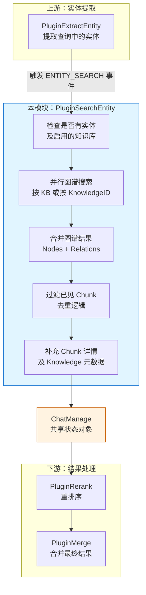

# Entity Extraction for Search Preparation (`PluginSearchEntity`)

## 概述：为什么需要这个模块

想象你在一个大型图书馆里找书。如果只靠书名或关键词搜索，你可能会错过那些**内容相关但用词不同**的书籍。`PluginSearchEntity` 解决的就是这个问题 —— 它利用**知识图谱**来找到与用户查询中提到的**实体**（人名、地名、概念、术语等）相关联的所有文档片段。

这个模块存在的核心原因是：**传统的向量检索和关键词检索是"模糊匹配"，而图谱检索是"精确关联"**。当用户问"张三负责什么项目？"时，向量检索可能找到语义相似的内容，但图谱检索能直接定位到所有与"张三"这个实体节点相连的文档。

`PluginSearchEntity` 的设计洞察在于：它不是独立工作的，而是作为 [chat_pipeline](application_services_and_orchestration.md) 插件链中的一环，在 [extract_entity](application_services_and_orchestration.md) 插件提取出实体后，负责将这些实体"翻译"成图谱查询，再将查询结果"翻译"回标准的搜索结果格式，供后续的 [rerank](application_services_and_orchestration.md) 和 [merge](application_services_and_orchestration.md) 插件使用。

---

## 架构与数据流



### 数据流 walkthrough

1. **触发时机**：当 [PluginExtractEntity](application_services_and_orchestration.md) 完成实体提取后，会触发 `ENTITY_SEARCH` 事件，`PluginSearchEntity` 被激活。

2. **输入来源**：从 `ChatManage` 共享状态中读取：
   - `Entity`：提取出的实体列表（如 `["张三", "项目 A"]`）
   - `EntityKBIDs`：启用了 `ExtractConfig` 的知识库 ID 列表
   - `EntityKnowledge`：KnowledgeID → KnowledgeBaseID 映射（针对启用了图谱的单个文件）
   - `SearchResult`：之前检索阶段已有的搜索结果（用于去重）

3. **并行搜索**：根据是否有指定的 `KnowledgeID`，选择按文件搜索或按知识库搜索，使用 goroutine 并行执行多个图谱查询。

4. **结果合并**：将所有并行搜索返回的 `GraphNode` 和 `GraphRelation` 合并到 `ChatManage.GraphResult`。

5. **去重与补充**：过滤掉已经在 `SearchResult` 中出现过的 Chunk，获取剩余 Chunk 的详细信息和 Knowledge 元数据，追加到 `SearchResult`。

6. **输出传递**：更新后的 `ChatManage.SearchResult` 传递给下游的 [PluginRerank](application_services_and_orchestration.md) 进行重排序。

---

## 核心组件深度解析

### `PluginSearchEntity` 结构体

```go
type PluginSearchEntity struct {
    graphRepo     interfaces.RetrieveGraphRepository  // 图谱检索接口
    chunkRepo     interfaces.ChunkRepository          // Chunk 存储接口
    knowledgeRepo interfaces.KnowledgeRepository      // Knowledge 元数据接口
}
```

**设计意图**：这个结构体是典型的**依赖注入**模式。它不直接依赖具体的数据库实现（如 Neo4j、Elasticsearch），而是依赖接口。这样做的好处是：
- **可测试性**：可以用 mock 实现进行单元测试
- **可替换性**：底层图谱存储可以从 Neo4j 切换到其他图数据库，无需修改业务逻辑
- **职责分离**：`PluginSearchEntity` 只负责编排搜索流程，不负责具体的数据存储细节

**三个依赖的分工**：
- `graphRepo`：负责图谱层面的节点和关系查询（"找到所有与'张三'相关的节点"）
- `chunkRepo`：负责将图谱节点引用的 ChunkID 转换为完整的 Chunk 对象
- `knowledgeRepo`：负责补充 Chunk 所属的 Knowledge 元数据（标题、文件名等）

---

### `OnEvent` 方法：核心执行逻辑

```go
func (p *PluginSearchEntity) OnEvent(ctx context.Context,
    eventType types.EventType, chatManage *types.ChatManage, next func() *PluginError,
) *PluginError
```

**方法签名解读**：
- `ctx`：携带请求上下文（包括 TenantID、SessionID 等）
- `eventType`：触发事件类型（这里固定是 `ENTITY_SEARCH`）
- `chatManage`：**共享状态对象**，所有插件通过它传递数据
- `next`：责任链模式的下一个插件调用函数

**执行流程详解**：

#### 第一步：前置检查（快速失败）

```go
entity := chatManage.Entity
if len(entity) == 0 {
    return next()  // 没有实体，跳过图谱搜索
}

knowledgeBaseIDs := chatManage.EntityKBIDs
entityKnowledge := chatManage.EntityKnowledge
if len(knowledgeBaseIDs) == 0 && len(entityKnowledge) == 0 {
    return next()  // 没有启用图谱的知识库，跳过
}
```

**设计考量**：这里采用了**快速失败**策略。如果上游没有提取到实体，或者用户选择的知识库没有启用图谱功能，直接跳过本插件，避免无谓的数据库查询。这是一种**性能优化**，也是**防御性编程**。

#### 第二步：并行图谱搜索

```go
var wg sync.WaitGroup
var mu sync.Mutex
var allNodes []*types.GraphNode
var allRelations []*types.GraphRelation

if len(entityKnowledge) > 0 {
    // 按 KnowledgeID 搜索（针对特定文件）
    for knowledgeID, kbID := range entityKnowledge {
        wg.Add(1)
        go func(knowledgeBaseID, knowledgeID string) {
            defer wg.Done()
            graph, err := p.graphRepo.SearchNode(ctx, types.NameSpace{
                KnowledgeBase: knowledgeBaseID,
                Knowledge:     knowledgeID,
            }, entity)
            // ... 合并结果
        }(kbID, knowledgeID)
    }
} else {
    // 按 KnowledgeBaseID 搜索（整个知识库）
    for _, kbID := range knowledgeBaseIDs {
        wg.Add(1)
        go func(knowledgeBaseID string) {
            defer wg.Done()
            graph, err := p.graphRepo.SearchNode(ctx, types.NameSpace{
                KnowledgeBase: knowledgeBaseID,
            }, entity)
            // ... 合并结果
        }(kbID)
    }
}
wg.Wait()
```

**并发模型分析**：
- 使用 `sync.WaitGroup` 等待所有 goroutine 完成
- 使用 `sync.Mutex` 保护共享切片 `allNodes` 和 `allRelations` 的并发写入
- 每个 goroutine 独立执行一次图谱查询，互不阻塞

**为什么用并行？** 当用户选择多个知识库或多个文件时，串行查询会导致延迟线性增长。并行查询可以将总延迟降低到**最慢单个查询的时间**。这是一个典型的**用资源换时间**的权衡。

**潜在风险**：
- 如果知识库数量很多（如 100+），会创建大量 goroutine，可能导致资源耗尽
- 没有设置超时控制，单个慢查询会拖慢整体流程
- 没有错误聚合，单个查询失败只记录日志，不影响其他查询（这是**容错设计**，但也可能丢失部分结果）

#### 第三步：去重与结果补充

```go
chunkIDs := filterSeenChunk(ctx, chatManage.GraphResult, chatManage.SearchResult)
if len(chunkIDs) == 0 {
    return next()  // 没有新 Chunk，跳过
}

chunks, err := p.chunkRepo.ListChunksByID(ctx, tenantID, chunkIDs)
// ... 获取 Knowledge 元数据
// ... 转换为 SearchResult 并追加
chatManage.SearchResult = removeDuplicateResults(chatManage.SearchResult)
```

**去重逻辑**：`filterSeenChunk` 函数检查图谱节点引用的 ChunkID 是否已经存在于 `SearchResult` 中。这是为了避免**重复检索** —— 同一个 Chunk 可能既被向量检索命中，又被图谱检索命中。

**设计权衡**：这里选择**保留向量检索结果，补充图谱检索的新结果**，而不是替换。这样做的好处是：
- 不丢失向量检索的语义匹配结果
- 增加图谱检索的精确关联结果
- 最终由 [PluginRerank](application_services_and_orchestration.md) 统一排序

---

### `filterSeenChunk` 函数：去重核心

```go
func filterSeenChunk(ctx context.Context, graph *types.GraphData, searchResult []*types.SearchResult) []string {
    seen := map[string]bool{}
    for _, chunk := range searchResult {
        seen[chunk.ID] = true
    }

    chunkIDs := []string{}
    for _, node := range graph.Node {
        for _, chunkID := range node.Chunks {
            if seen[chunkID] {
                continue
            }
            seen[chunkID] = true
            chunkIDs = append(chunkIDs, chunkID)
        }
    }
    return chunkIDs
}
```

**算法复杂度**：O(n + m)，其中 n 是已有 SearchResult 数量，m 是图谱节点引用的 Chunk 总数。使用哈希表实现 O(1) 查找，避免嵌套循环的 O(n*m) 复杂度。

**设计细节**：
- 复用 `seen` 地图记录已处理的 ChunkID，避免同一 Chunk 被多次添加
- 只返回**新的** ChunkID，减少后续数据库查询的数据量

---

### `chunk2SearchResult` 函数：数据格式转换

```go
func chunk2SearchResult(chunk *types.Chunk, knowledge *types.Knowledge) *types.SearchResult {
    return &types.SearchResult{
        ID:                chunk.ID,
        Content:           chunk.Content,
        KnowledgeID:       chunk.KnowledgeID,
        KnowledgeTitle:    knowledge.Title,
        Score:             1.0,  // 固定分数
        MatchType:         types.MatchTypeGraph,  // 标记为图谱匹配
        // ... 其他字段
    }
}
```

**关键设计点**：
- `Score: 1.0`：图谱检索结果使用固定分数，因为图谱匹配是**布尔性质**（匹配/不匹配），不像向量检索有连续相似度分数
- `MatchType: MatchTypeGraph`：标记来源，供下游 [PluginRerank](application_services_and_orchestration.md) 区分处理

**潜在问题**：固定分数 1.0 可能在重排序时与向量检索结果（分数范围 0-1）产生冲突。如果向量检索结果分数普遍低于 1.0，图谱结果会始终排在前面，这可能不是期望的行为。

---

## 依赖关系分析

### 上游依赖

| 依赖模块 | 依赖内容 | 契约说明 |
|---------|---------|---------|
| [PluginExtractEntity](application_services_and_orchestration.md) | `ChatManage.Entity` | 必须在本插件之前执行，填充实体列表 |
| [PluginSearch](application_services_and_orchestration.md) | `ChatManage.SearchResult` | 可选依赖，如果之前有向量检索结果，用于去重 |
| 知识库配置 | `ChatManage.EntityKBIDs` / `EntityKnowledge` | 由请求入口根据用户选择的知识库配置填充 |

### 下游依赖

| 依赖模块 | 依赖内容 | 契约说明 |
|---------|---------|---------|
| [PluginRerank](application_services_and_orchestration.md) | `ChatManage.SearchResult` | 期望包含所有检索结果（向量 + 图谱），由重排序模型统一打分 |
| [PluginMerge](application_services_and_orchestration.md) | `ChatManage.MergeResult` | 期望重排序后的结果已填充到此字段 |

### 外部依赖

| 依赖接口 | 实现方 | 调用频率 |
|---------|-------|---------|
| `RetrieveGraphRepository.SearchNode` | Neo4j 图谱数据库 | 每次 ENTITY_SEARCH 事件，按 KB 数量并行调用 |
| `ChunkRepository.ListChunksByID` | PostgreSQL/Elasticsearch | 每次 ENTITY_SEARCH 事件，1 次批量查询 |
| `KnowledgeRepository.GetKnowledgeBatch` | PostgreSQL | 每次 ENTITY_SEARCH 事件，1 次批量查询 |

---

## 设计决策与权衡

### 1. 插件架构 vs 直接调用

**选择**：采用插件架构，通过 `EventManager` 注册和触发。

**权衡**：
- **优点**：解耦、可扩展、可动态启用/禁用
- **缺点**：增加了一层间接性，调试链路变长

**为什么这样选**：[chat_pipeline](application_services_and_orchestration.md) 是一个需要灵活配置的系统，不同租户可能需要不同的检索策略（有的只用向量检索，有的需要图谱 + 向量混合）。插件架构允许通过配置动态组合功能，而无需修改核心代码。

### 2. 并行搜索 vs 串行搜索

**选择**：使用 goroutine 并行搜索多个知识库。

**权衡**：
- **优点**：显著降低多知识库场景的延迟
- **缺点**：资源消耗增加，错误处理复杂化

**为什么这样选**：典型场景下，用户选择的知识库数量在 1-10 个之间，并行带来的性能提升远大于资源开销。但对于超大规模场景（100+ 知识库），可能需要引入**批处理**或**限流**机制。

### 3. 固定分数 vs 动态分数

**选择**：图谱检索结果使用固定分数 1.0。

**权衡**：
- **优点**：实现简单，图谱匹配是布尔性质
- **缺点**：与向量检索分数体系不兼容，可能影响重排序效果

**改进方向**：可以引入**图谱置信度**概念，根据节点属性完整度、关系数量等因素动态计算分数。

### 4. 容错设计：单点失败不影响整体

**选择**：单个知识库搜索失败只记录日志，不中断整体流程。

**权衡**：
- **优点**：提高系统鲁棒性，部分结果优于无结果
- **缺点**：用户可能得到不完整的结果而不自知

**改进方向**：可以在响应中增加**警告信息**，告知用户部分知识库检索失败。

---

## 使用示例与配置

### 启用图谱检索的前提条件

1. **知识库配置**：知识库的 `ExtractConfig` 必须启用
   ```go
   knowledgeBaseConfig.ExtractConfig.Enabled = true
   ```

2. **请求参数**：用户选择的知识库必须包含在 `EntityKBIDs` 中
   ```go
   chatManage.EntityKBIDs = []string{"kb-123", "kb-456"}
   ```

3. **实体提取**：上游 `PluginExtractEntity` 必须成功提取实体
   ```go
   chatManage.Entity = []string{"张三", "项目 A"}
   ```

### 典型调用流程

```go
// 1. 创建 EventManager
eventManager := NewEventManager()

// 2. 注册插件（按顺序）
NewPluginExtractEntity(eventManager, ...)  // 先提取实体
NewPluginSearchEntity(eventManager, ...)   // 再搜索图谱
NewPluginRerank(eventManager, ...)         // 最后重排序

// 3. 触发事件
eventManager.Emit(ctx, types.ENTITY_SEARCH, chatManage)
```

---

## 边界情况与注意事项

### 1. 空实体处理

**场景**：用户查询不包含可识别的实体（如"今天天气怎么样"）

**行为**：插件快速返回，不执行图谱查询

**注意**：确保上游 `PluginExtractEntity` 正确设置 `chatManage.Entity`，即使是空列表

### 2. 图谱与向量结果重复

**场景**：同一个 Chunk 既被向量检索命中，又被图谱检索命中

**行为**：`filterSeenChunk` 过滤掉重复的 ChunkID，只保留向量检索的原始结果

**潜在问题**：如果图谱检索的 Chunk 信息更新（如内容修订），可能被过滤掉

**建议**：考虑引入**版本检查**，如果图谱引用的 Chunk 版本更新，应替换旧结果

### 3. 大规模知识库场景

**场景**：用户选择 50+ 知识库进行检索

**风险**：
- 创建大量 goroutine，可能导致资源耗尽
- 单个慢查询拖慢整体流程
- 部分失败难以追踪

**建议优化**：
- 引入**并发度限制**（如最多 10 个并行查询）
- 添加**超时控制**（如单个查询 5 秒超时）
- 实现**错误聚合**，在响应中报告失败情况

### 4. 图谱数据一致性

**场景**：Chunk 被删除或修改，但图谱节点仍引用旧 ChunkID

**行为**：`ListChunksByID` 可能返回空或旧数据

**建议**：图谱更新应与 Chunk 更新保持**事务一致性**，或在查询时验证 Chunk 存在性

### 5. 分数体系冲突

**场景**：图谱结果（固定 1.0 分）与向量结果（0-1 分）混合重排序

**影响**：图谱结果可能始终排在前面，即使相关性不如高分向量结果

**建议**：在 [PluginRerank](application_services_and_orchestration.md) 中对不同 `MatchType` 采用不同的重排序策略

---

## 扩展点

### 1. 自定义图谱查询逻辑

如果需要更复杂的图谱查询（如多跳关系、属性过滤），可以扩展 `RetrieveGraphRepository` 接口：

```go
type RetrieveGraphRepository interface {
    SearchNode(ctx context.Context, namespace types.NameSpace, nodes []string) (*types.GraphData, error)
    // 新增：支持关系类型过滤
    SearchNodeWithRelations(ctx context.Context, namespace types.NameSpace, nodes []string, relationTypes []string) (*types.GraphData, error)
}
```

### 2. 自定义分数计算

如果需要动态计算图谱结果分数，可以修改 `chunk2SearchResult`：

```go
func chunk2SearchResult(chunk *types.Chunk, knowledge *types.Knowledge, node *types.GraphNode) *types.SearchResult {
    score := calculateGraphScore(node)  // 根据节点属性、关系数量等计算
    return &types.SearchResult{
        Score:     score,
        MatchType: types.MatchTypeGraph,
        // ...
    }
}
```

### 3. 异步图谱搜索

对于超大规模场景，可以考虑将图谱搜索改为异步模式：

```go
// 提交异步任务
taskID := p.graphRepo.SearchNodeAsync(ctx, namespace, entity)
// 立即返回，稍后通过 taskID 获取结果
```

---

## 相关模块参考

- [PluginExtractEntity](application_services_and_orchestration.md) — 上游实体提取插件
- [PluginSearch](application_services_and_orchestration.md) — 向量/关键词检索插件
- [PluginRerank](application_services_and_orchestration.md) — 结果重排序插件
- [PluginMerge](application_services_and_orchestration.md) — 结果合并插件
- [RetrieveGraphRepository](data_access_repositories.md) — 图谱存储接口
- [ChatManage](core_domain_types_and_interfaces.md) — 共享状态对象

---

## 总结

`PluginSearchEntity` 是一个**图谱增强的检索插件**，它在传统向量检索的基础上，利用知识图谱的精确关联能力，找到与查询实体相关的所有文档片段。其设计核心是：

1. **插件化架构**：通过事件驱动与上下游解耦
2. **并行搜索**：用并发换取多知识库场景的性能
3. **去重合并**：避免与向量检索结果重复，补充新结果
4. **容错设计**：单点失败不影响整体流程

理解这个模块的关键是把握它在整个 [chat_pipeline](application_services_and_orchestration.md) 中的**承上启下**角色：它依赖上游的实体提取结果，为下游的重排序提供图谱增强的检索结果。
