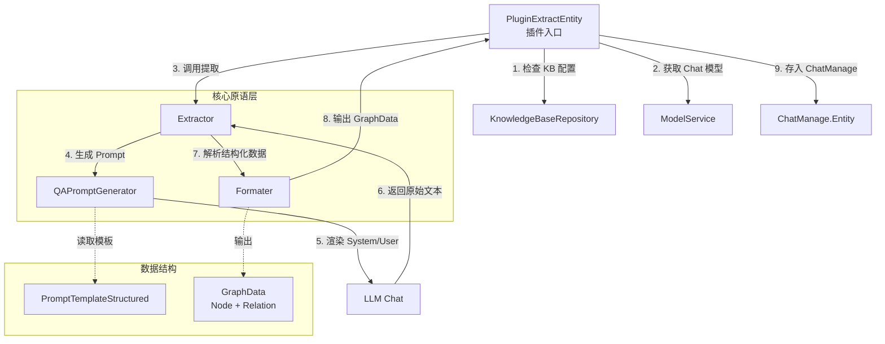

# entity_extraction_pipeline_primitives 模块深度解析

## 概述：为什么需要这个模块

想象一下，用户问："张三上个月在哪个项目里和李四合作过？" —— 这个问题里藏着**实体**（张三、李四）、**时间约束**（上个月）、**关系类型**（合作）。如果直接把整句话丢给向量检索，大概率会迷失在语义空间里。

`entity_extraction_pipeline_primitives` 模块的核心使命就是：**从自然语言查询中精准提取结构化实体和关系，为后续的知识图谱检索提供精确的"锚点"**。它不是简单的关键词抽取，而是通过 LLM 理解语义，输出规范化的图数据结构（节点 + 边）。

这个模块存在的根本原因是：**向量检索擅长语义相似性，但不擅长精确的实体定位和关系推理**。当用户问题涉及具体的人名、项目名、时间范围时，必须先提取这些"硬约束"，才能在知识图谱中执行精确查询。模块采用"LLM 提取 + 结构化解析"的双层设计，既利用了大语言模型的语义理解能力，又通过严格的格式约束保证输出可被下游消费。

---

## 架构与数据流



**数据流 walkthrough**：

1. **插件触发**：`PluginExtractEntity` 在 `REWRITE_QUERY` 事件时被激活，此时用户原始查询已加载到 `ChatManage.Query`
2. **配置检查**：先检查 Neo4j 是否启用，再批量获取关联的 KnowledgeBase，筛选出 `ExtractConfig.Enabled = true` 的库
3. **提取执行**：创建 `Extractor` 实例，传入 Chat 模型和 Prompt 模板，调用 `Extract()` 方法
4. **Prompt 生成**：`QAPromptGenerator` 根据模板中的 `Description` 和 `Examples` 动态组装 System Prompt，将用户查询包装成 User Prompt
5. **LLM 调用**：以 `Temperature=0.3`（低随机性）调用模型，期望获得确定性输出
6. **结果解析**：`Formater` 从 LLM 返回文本中提取代码块（```json ... ```），反序列化为中间结构，再映射为 `GraphData`
7. **图重建**：`rebuildGraph()` 处理重复节点合并、孤立节点补充、自环关系过滤
8. **状态传递**：提取出的实体名称列表存入 `ChatManage.Entity`，启用的 KB ID 存入 `ChatManage.EntityKBIDs`，供下游 [`PluginSearchEntity`](chat_pipeline_plugins_and_flow.md) 使用

---

## 核心组件深度解析

### 1. QAPromptGenerator：Prompt 的动态装配线

**设计意图**：将静态的 Prompt 模板转换为 LLM 可执行的对话消息，同时支持 Few-Shot 示例注入。

```go
type QAPromptGenerator struct {
    Formater        *Formater
    Template        *types.PromptTemplateStructured
    ExamplesHeading string        // "# Examples"
    QuestionHeading string        // "# Question"
    QuestionPrefix  string        // "Q: "
    AnswerPrefix    string        // "A: "
}
```

**关键方法**：

| 方法 | 职责 | 设计细节 |
|------|------|----------|
| `System(ctx)` | 生成系统指令 | 若 `Template.Tags` 非空，会将标签列表 JSON 序列化后注入到 `Description` 中（使用 `fmt.Sprintf`），实现动态约束 |
| `User(ctx, question)` | 生成用户查询 | 采用"Q: {question}\nA: "的半完成格式，引导模型直接续写答案 |
| `Render(ctx, question)` | 组装消息数组 | 返回 `[]chat.Message{system, user}`，符合 Chat API 标准 |

**为什么这样设计**：

- **动态标签注入**：`Description` 字段可能包含 `%s` 占位符，用于在运行时注入允许的关系类型列表。这避免了为每种关系组合维护独立模板。
- **Few-Shot 示例格式化**：示例中的答案不是预渲染的字符串，而是通过 `Formater.formatExtraction()` 动态生成，保证示例格式与期望输出完全一致。
- **前缀一致性**：`QuestionPrefix` 和 `AnswerPrefix` 硬编码为 "Q: " 和 "A: "，是因为模型在预训练阶段见过大量 QA 格式，这种模式能激发更好的指令遵循能力。

**潜在陷阱**：如果 `Template.Description` 包含 `%s` 但 `Tags` 为空，`fmt.Sprintf` 会 panic。调用方需保证模板与配置的一致性。

---

### 2. Extractor：提取流程的编排器

**设计意图**：封装"Prompt 生成 → LLM 调用 → 结果解析"的完整链路，对外暴露单一的 `Extract()` 接口。

```go
type Extractor struct {
    chat     chat.Chat           // LLM 客户端
    formater *Formater           // 结果解析器
    template *types.PromptTemplateStructured
    chatOpt  *chat.ChatOptions   // Temperature=0.3, MaxTokens=4096
}
```

**关键方法**：

| 方法 | 职责 | 设计细节 |
|------|------|----------|
| `NewExtractor()` | 构造函数 | 固定 `Temperature=0.3`（低随机性，保证提取稳定性），`Thinking=false`（关闭思维链，减少延迟） |
| `Extract(ctx, content)` | 执行提取 | 返回 `*types.GraphData`，错误直接透传，不调用方决定重试策略 |
| `RemoveUnknownRelation()` | 过滤未知关系 | 被注释掉的遗留代码，说明团队曾尝试在提取后过滤，但最终改为在 Prompt 阶段约束 |

**为什么 Temperature=0.3**：

实体提取是**确定性任务**，不是创意生成。过高的温度会导致：
- 同一查询多次调用输出不一致
- 实体名称出现幻觉（如"张三"变成"张先生"）
- JSON 格式错误率上升

0.3 是一个经验值：保留少量随机性以应对边界情况，但主体输出稳定。

**数据流**：

```
用户查询 → QAPromptGenerator.Render() → []chat.Message
         → chat.Chat() → chatResponse.Content (原始文本)
         → Formater.ParseGraph() → *types.GraphData
```

---

### 3. Formater：结构化数据的"翻译官"

**设计意图**：在 LLM 的非结构化文本输出与程序可消费的 `GraphData` 之间建立双向转换通道。

```go
type Formater struct {
    attributeSuffix  string     // "_attributes"
    formatType       FormatType // "json"
    useFences        bool       // true, 使用 ``` 包裹
    nodePrefix       string     // "entity"
    relationSource   string     // "entity1"
    relationTarget   string     // "entity2"
    relationPrefix   string     // "relation"
}
```

**核心能力**：

#### 3.1 正向格式化（LLM 示例生成）

`formatExtraction(nodes, relations)` 将图结构序列化为 JSON：

```json
[
  {"entity": "张三", "entity_attributes": ["工程师"]},
  {"entity": "李四", "entity_attributes": ["产品经理"]},
  {"entity1": "张三", "entity2": "李四", "relation": "合作"}
]
```

**设计选择**：
- 使用数组而非对象：支持多个实体/关系，顺序无关
- 属性后缀 `_attributes`：避免与实体名冲突
- 代码块包裹：便于从长文本中定位

#### 3.2 反向解析（LLM 输出消费）

`ParseGraph(text)` 执行四步解析：

1. **内容提取**：`extractContent()` 用正则 `_FENCE_RE` 从文本中提取 ```json ... ``` 内的内容
2. **JSON 反序列化**：`json.Unmarshal()` 解析为 `[]map[string]interface{}`
3. **字段映射**：根据 `nodePrefix`、`relationSource` 等字段识别节点/关系
4. **图重建**：`rebuildGraph()` 处理数据清洗

**为什么需要 rebuildGraph**：

LLM 输出可能存在以下问题：
- **重复节点**：同一实体在多处出现，需合并属性
- **孤立关系**：关系中的节点未在节点列表中声明，需自动补充
- **自环关系**：`Node1 == Node2` 的关系无意义，需过滤

```go
func (f *Formater) rebuildGraph(ctx context.Context, graph *types.GraphData) {
    // 1. 合并重复节点（按 Name 去重，属性追加）
    nodeMap := make(map[string]*types.GraphNode)
    
    // 2. 补充关系中的缺失节点
    if _, ok := nodeMap[relation.Node1]; !ok {
        nodes = append(nodes, &GraphNode{Name: relation.Node1})
    }
    
    // 3. 过滤自环
    if relation.Node1 == relation.Node2 {
        continue
    }
}
```

**正则表达式细节**：

```go
var _FENCE_RE = regexp.MustCompile(
    "```" + `(?P<lang>[A-Za-z0-9_+-]+)?` + `(?:\s*\n)?` + `(?P<body>[\s\S]*?)` + "```",
)
```

- 支持可选的语言标签（```json 或 ```）
- `[\s\S]*?` 非贪婪匹配任意字符（包括换行）
- 多匹配时取第一个有效候选，避免过度解析

**边界情况处理**：

| 情况 | 处理策略 |
|------|----------|
| 无代码块 | 直接 `strings.TrimSpace(text)` |
| 多个代码块 | 取第一个，记录警告日志 |
| 空内容 | 返回空 `GraphData{}`，不报错 |
| JSON 解析失败 | 返回错误，由调用方决定是否降级 |

---

## 依赖关系分析

### 上游依赖（谁调用本模块）

| 调用方 | 依赖关系 | 期望契约 |
|--------|----------|----------|
| [`PluginExtractEntity`](chat_pipeline_plugins_and_flow.md) | 直接组合使用三个原语 | 输入查询字符串，输出实体名称列表 |
| [`PluginSearchEntity`](chat_pipeline_plugins_and_flow.md) | 间接消费 `ChatManage.Entity` | 实体列表非空时触发图谱检索 |

### 下游依赖（本模块调用谁）

| 被调用方 | 调用目的 | 耦合强度 |
|----------|----------|----------|
| `interfaces.ModelService` | 获取 Chat 模型实例 | 强耦合，需实现该接口 |
| `chat.Chat` | 执行 LLM 推理 | 强耦合，依赖 Chat API 契约 |
| `interfaces.KnowledgeBaseRepository` | 读取 `ExtractConfig` | 中耦合，仅读取配置 |
| `interfaces.KnowledgeService` | 获取带共享权限的 Knowledge | 中耦合，处理跨租户场景 |
| `config.Config` | 读取 Prompt 模板 | 弱耦合，启动时注入 |

### 数据契约

**输入**：
- `query string`：用户原始查询
- `ChatManage`：包含 `KnowledgeBaseIDs`、`KnowledgeIDs`、`TenantID`、`ChatModelID`

**输出**：
- `ChatManage.Entity []string`：提取出的实体名称列表
- `ChatManage.EntityKBIDs []string`：启用提取的 KB ID 列表
- `ChatManage.EntityKnowledge map[string]string`：KnowledgeID → KBID 映射

**错误处理**：
- LLM 调用失败：记录日志，跳过提取，继续后续流程（`return next()`）
- 解析失败：同上，保证管道不中断
- Neo4j 禁用：直接跳过，不记录错误

---

## 设计决策与权衡

### 1. 为什么用 LLM 提取而非 NER 模型？

**选择**：使用通用 Chat 模型 + Prompt 工程，而非专用 NER 模型。

**权衡**：
- **优势**：
  - 零训练成本，新实体类型只需改 Prompt
  - 支持上下文消歧（"苹果"是公司还是水果，由对话历史决定）
  - 可输出关系，不仅是实体
- **劣势**：
  - 延迟更高（~500ms vs ~50ms）
  - 成本更高（Token 计费）
  - 输出不稳定（需后处理）

**适用场景**：实体类型动态变化、关系提取必需、QPS 不高的场景。

### 2. 为什么在插件层检查 KB 配置而非全局开启？

**选择**：每个 KnowledgeBase 独立配置 `ExtractConfig.Enabled`。

**权衡**：
- **优势**：
  - 细粒度控制，避免对无关 KB 执行提取
  - 支持渐进式 rollout（先对部分 KB 开启）
  - 减少不必要的 LLM 调用成本
- **劣势**：
  - 配置复杂度增加
  - 需在运行时批量查询 KB 配置

**设计洞察**：实体提取是**高成本低收益**操作（仅对图谱检索有用），必须精确控制触发条件。

### 3. 为什么使用 JSON 而非 YAML 或其他格式？

**选择**：`FormatTypeJSON` 为唯一支持格式。

**权衡**：
- **优势**：
  - Go 标准库支持，无外部依赖
  - LLM 对 JSON 的训练数据最多
  - 易于调试（可直接打印）
- **劣势**：
  - 对特殊字符敏感（需转义）
  - 不支持注释

**历史遗留**：代码中保留了 `FormatTypeYAML` 常量，但 `switch` 语句只有 `default` 分支处理 JSON，说明曾考虑多格式支持但最终放弃。

### 4. 为什么提取失败不中断流程？

**选择**：所有错误都记录日志后调用 `next()` 继续。

**权衡**：
- **优势**：
  - 保证核心问答功能可用（降级为普通向量检索）
  - 避免单点故障（LLM 波动不影响整体）
- **劣势**：
  - 难以发现配置问题（静默失败）
  - 调试成本高（需查日志）

**改进建议**：增加指标埋点，统计提取失败率，超过阈值时告警。

---

## 使用指南与示例

### 配置 Prompt 模板

```yaml
# config.yaml
extract_manager:
  extract_entity:
    description: "从用户查询中提取实体和关系，允许的关系类型：%s"
    tags:
      - "合作"
      - "隶属"
      - "参与"
    examples:
      - text: "张三和李四在哪个项目合作过？"
        node:
          - name: "张三"
            attributes: ["人员"]
          - name: "李四"
            attributes: ["人员"]
        relation:
          - node1: "张三"
            node2: "李四"
            type: "合作"
```

### 插件注册

```go
func InitializePlugins(eventManager *EventManager, cfg *config.Config) {
    modelSvc := services.GetModelService()
    kbRepo := repos.GetKnowledgeBaseRepo()
    kbSvc := services.GetKnowledgeService()
    kRepo := repos.GetKnowledgeRepo()
    
    // 实体提取插件会自动注册到 EventManager
    NewPluginExtractEntity(eventManager, modelSvc, kbRepo, kbSvc, kRepo, cfg)
}
```

### 调试技巧

1. **查看提取结果**：
   ```go
   logger.Debugf(ctx, "extracted nodes: %v", chatManage.Entity)
   ```

2. **模拟 LLM 输出测试解析**：
   ```go
   formater := NewFormater()
   graph, err := formater.ParseGraph(ctx, "```json\n[{\"entity\": \"测试\"}]\n```")
   ```

3. **验证 Prompt 生成**：
   ```go
   generator := NewQAPromptGenerator(formater, template)
   fmt.Println(generator.System(ctx))
   fmt.Println(generator.User(ctx, "用户查询"))
   ```

---

## 边界情况与陷阱

### 1. 空实体列表的处理

**现象**：LLM 返回空数组或无法解析时，`ChatManage.Entity` 为空切片。

**影响**：下游 `PluginSearchEntity` 会跳过图谱检索，降级为普通检索。

**建议**：在监控中跟踪空实体比例，若过高说明 Prompt 或模型有问题。

### 2. 实体名称重复

**现象**：同一实体在多处出现（如"张三"在问题和示例中都出现）。

**处理**：`rebuildGraph()` 会合并节点，属性追加到同一节点。

**陷阱**：若属性不一致（一次是"工程师"，一次是"经理"），会同时保留，下游需自行处理。

### 3. 跨租户 Knowledge 访问

**现象**：`KnowledgeIDs` 可能包含共享的 Knowledge（不属于当前租户）。

**处理**：使用 `GetKnowledgeBatchWithSharedAccess()` 而非普通批量查询。

**陷阱**：若忘记处理共享场景，会漏掉部分文件的实体提取。

### 4. Neo4j 动态开关

**现象**：`NEO4J_ENABLE` 环境变量在运行时变更。

**处理**：每次 `OnEvent` 都检查，支持热切换。

**陷阱**：若 Neo4j 故障但未关闭开关，会持续记录错误日志。

### 5. JSON 解析的脆弱性

**现象**：LLM 可能输出不合法的 JSON（如 trailing comma）。

**处理**：直接返回错误，不尝试修复。

**建议**：在 Prompt 中强调"输出合法 JSON"，或考虑使用更宽容的解析器（如 `json5`）。

---

## 性能与扩展性

### 性能特征

| 操作 | 耗时 | 优化空间 |
|------|------|----------|
| KB 配置查询 | ~50ms（批量） | 可增加本地缓存 |
| LLM 调用 | ~300-800ms | 取决于模型和 Token 数 |
| JSON 解析 | <5ms | 无需优化 |
| 图重建 | <5ms | 无需优化 |

**瓶颈**：LLM 调用占 90%+ 耗时。

**优化建议**：
1. 对相同查询做短期缓存（5 分钟）
2. 使用更小的专用模型（如 7B 参数）
3. 异步提取（不阻塞主流程）

### 扩展点

1. **支持多格式输出**：扩展 `FormatType` 枚举，在 `parseOutput()` 中添加 YAML/XML 分支
2. **自定义关系过滤**：取消注释 `RemoveUnknownRelation()`，在提取后过滤
3. **实体链接**：在 `rebuildGraph()` 中添加实体消歧逻辑（如"张三"→"张三 (工程师)"）
4. **批量提取**：修改 `Extract()` 支持 `[]string` 输入，减少 LLM 调用次数

---

## 相关模块参考

- **父插件**：[`PluginExtractEntity`](chat_pipeline_plugins_and_flow.md) — 实体提取插件的编排层
- **下游消费者**：[`PluginSearchEntity`](chat_pipeline_plugins_and_flow.md) — 使用提取结果执行图谱检索
- **数据结构**：[`types.GraphData`](core_domain_types_and_interfaces.md) — 图数据定义
- **配置管理**：[`config.ExtractManagerConfig`](platform_infrastructure_and_runtime.md) — Prompt 模板配置
- **知识图谱**：[`RetrieveGraphRepository`](core_domain_types_and_interfaces.md) — 图谱检索接口

---

## 总结

`entity_extraction_pipeline_primitives` 是一个**小而精**的模块，体现了以下设计哲学：

1. **单一职责**：三个原语各司其职（生成、执行、解析），无冗余逻辑
2. **容错优先**：所有错误都降级处理，保证主流程稳定
3. **配置驱动**：Prompt 模板完全外部化，支持运行时调整
4. **契约清晰**：输入输出都是简单类型（string → []string），易于测试和调试

对于新贡献者，理解这个模块的关键是：**它不是在做 NLP 任务，而是在做"LLM 输出规范化"**。核心挑战不是提取算法，而是如何让 LLM 稳定输出可解析的结构化数据。
