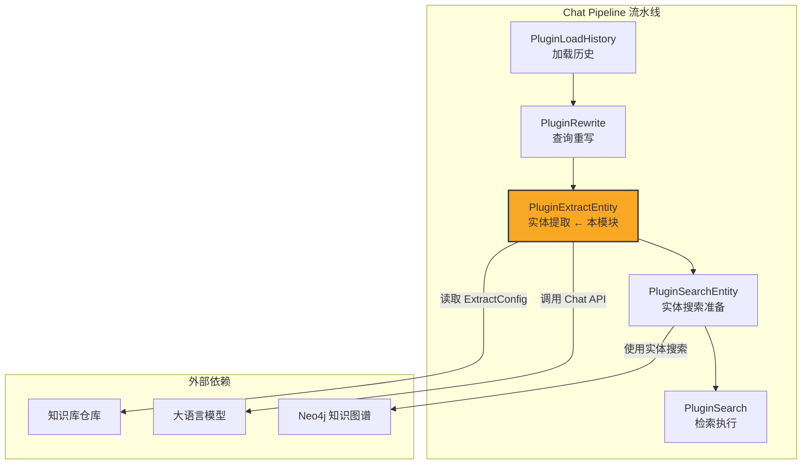

# entity_extraction_plugin_orchestration 模块深度解析

## 模块概述：为什么需要实体提取编排器

想象一下，用户向知识库问答系统提问："腾讯 2023 年的财报数据是什么？"。如果系统直接拿这个问题去向量数据库搜索，很可能找不到精准答案——因为"腾讯"是一个需要被识别的**实体**，而"2023 年财报"是一个需要被理解的**概念**。

`entity_extraction_plugin_orchestration` 模块的核心使命就是：**在查询进入检索引擎之前，用大语言模型从用户问题中抽取出关键实体和它们之间的关系，构建一个结构化的知识图谱查询基础**。

这个模块存在的根本原因是：**原始的用户查询是模糊的、非结构化的自然语言，但下游的知识图谱检索（Neo4j）需要明确的节点和边**。如果跳过这一步，系统就只能依赖纯向量相似度检索，丢失了精确的实体匹配能力。

模块的设计洞察在于：**实体提取不应该是一个独立的预处理步骤，而应该嵌入到查询重写的流水线中，与对话历史、知识库配置动态联动**。这就是为什么它被设计为一个插件（Plugin），而不是一个独立的服务。

---

## 架构与数据流

### 模块在系统中的位置



### 数据流追踪：一次实体提取的完整旅程

当用户发起一个问答请求时，数据流经本模块的路径如下：

1. **触发阶段**：`PluginRewrite` 完成查询重写后，触发 `REWRITE_QUERY` 事件
2. **前置检查**：`PluginExtractEntity.OnEvent` 检查 Neo4j 是否启用、知识库是否配置了 `ExtractConfig`
3. **上下文收集**：收集所有相关的知识库 ID（包括共享知识库），构建 `EntityKBIDs` 和 `EntityKnowledge` 映射
4. **LLM 提取**：调用 `Extractor.Extract`，通过 `QAPromptGenerator` 生成提示词，请求大语言模型抽取实体图
5. **结果解析**：`Formater.ParseGraph` 解析 LLM 返回的 JSON/YAML，构建 `GraphData`
6. **图谱重建**：`Formater.rebuildGraph` 去重节点、补全孤立节点、过滤自环关系
7. **状态传递**：将提取的节点名称存入 `chatManage.Entity`，供下游 `PluginSearchEntity` 使用

**关键数据契约**：
- 输入：`chatManage.Query`（用户查询）、`chatManage.KnowledgeBaseIDs`（知识库 ID 列表）
- 输出：`chatManage.Entity`（实体名称列表）、`chatManage.EntityKBIDs`（启用提取的知识库 ID）
- 副作用：无（不修改持久化存储，只修改流水线上下文）

---

## 核心组件深度解析

### PluginExtractEntity：插件编排器

**设计意图**：这是一个典型的**策略模式 + 责任链模式**的实现。作为插件，它不直接处理业务逻辑，而是协调多个依赖组件（模型服务、知识库仓库、提取器）完成实体提取任务。

```go
type PluginExtractEntity struct {
    modelService      interfaces.ModelService         // 大模型调用接口
    template          *types.PromptTemplateStructured // 提示词模板
    knowledgeBaseRepo interfaces.KnowledgeBaseRepository
    knowledgeService  interfaces.KnowledgeService     // 处理共享知识库
    knowledgeRepo     interfaces.KnowledgeRepository
}
```

**关键方法 `OnEvent` 的执行逻辑**：

1. **环境检查**：读取 `NEO4J_ENABLE` 环境变量，如果为 `false` 直接跳过（降级为纯向量检索）
2. **模型获取**：通过 `modelService.GetChatModel` 获取当前会话配置的聊天模型
3. **知识库聚合**：
   - 从 `chatManage.KnowledgeBaseIDs` 收集直接指定的知识库
   - 从 `chatManage.KnowledgeIDs` 解析文件级指定，通过 `knowledgeService.GetKnowledgeBatchWithSharedAccess` 获取归属的知识库（**注意：这里支持共享知识库的跨租户访问**）
4. **配置过滤**：只保留 `ExtractConfig.Enabled == true` 的知识库（**设计决策：实体提取是可选的，按知识库粒度配置**）
5. **实体提取**：调用 `Extractor.Extract`，传入查询和模板
6. **结果存储**：将提取的节点名称存入 `chatManage.Entity`

**设计权衡**：
- **为什么检查 `NEO4J_ENABLE` 而不是直接调用？** —— 知识图谱是可选组件，系统需要支持纯向量检索的降级模式。在环境变量层面做检查，避免了不必要的依赖初始化。
- **为什么区分 `KnowledgeBaseIDs` 和 `KnowledgeIDs`？** —— 用户可以在会话级别指定整个知识库，也可以在单次查询中指定特定文件。这种设计提供了灵活的检索范围控制。
- **为什么只传递实体名称（`nodes`）而不是完整的 `GraphData`？** —— 下游的 `PluginSearchEntity` 只需要实体名称进行图谱查询，传递完整图谱会增加序列化开销。这是一个**最小化接口契约**的设计。

---

### Extractor：LLM 提取器

**设计意图**：这是一个**适配器模式**的实现，将大语言模型的 Chat 接口封装为实体提取接口。

```go
type Extractor struct {
    chat     chat.Chat           // 大模型 Chat 接口
    formater *Formater           // 格式化工具
    template *types.PromptTemplateStructured
    chatOpt  *chat.ChatOptions   // 调用参数配置
}
```

**关键配置**：
```go
chatOpt: &chat.ChatOptions{
    Temperature: 0.3,  // 低温度值，追求确定性输出
    MaxTokens:   4096, // 足够的 token 预算处理复杂查询
    Thinking:    &think, // 禁用思考模式（think=false）
}
```

**为什么 Temperature 设为 0.3？** —— 实体提取是一个**确定性任务**，不需要创造性。低温度值可以减少输出波动，提高解析成功率。这是一个**正确性优先于多样性**的权衡。

**提取流程**：
1. 使用 `QAPromptGenerator` 生成系统提示词和用户提示词
2. 调用 `chat.Chat` 发送请求
3. 使用 `Formater.ParseGraph` 解析返回内容

---

### QAPromptGenerator：提示词生成器

**设计意图**：这是一个**模板方法模式**的实现，将提示词的结构固定，但允许通过配置动态注入内容。

**提示词结构**：
```
# 系统提示词
[模板描述，可包含 Tags 占位符]
# Examples
Q: [示例问题 1]
A: [示例答案 1 - JSON 格式]

Q: [示例问题 2]
A: [示例答案 2 - JSON 格式]

# Question
Q: [用户实际查询]
A: 
```

**关键设计点**：
- **Few-shot Learning**：通过 `template.Examples` 提供示例，引导 LLM 输出符合预期格式
- **动态 Tags 注入**：如果 `template.Tags` 非空，会将允许的关系类型列表注入到描述中（`fmt.Sprintf(qa.Template.Description, string(tags))`），约束 LLM 的输出空间
- **格式约束**：答案部分直接以 `A: ` 结尾，暗示 LLM 继续输出 JSON

**为什么使用 Q/A 格式而不是直接指令？** —— 实验表明，Few-shot 的 Q/A 格式比纯指令更能稳定 LLM 的输出格式，尤其是对于结构化数据提取任务。

---

### Formater：格式化工具

**设计意图**：这是一个**解析器 + 序列化器**的组合，负责双向转换：将内部 `GraphData` 序列化为 LLM 可理解的格式，将 LLM 输出解析回 `GraphData`。

**核心字段**：
```go
type Formater struct {
    attributeSuffix  string     // "_attributes"
    formatType       FormatType // "json" 或 "yaml"
    useFences        bool       // 是否使用 ``` 代码块标记
    nodePrefix       string     // "entity"
    relationSource   string     // "entity1"
    relationTarget   string     // "entity2"
    relationPrefix   string     // "relation"
}
```

**序列化格式示例**：
```json
[
  {"entity": "腾讯", "entity_attributes": ["公司", "科技企业"]},
  {"entity": "2023 年财报", "entity_attributes": ["财务报告"]},
  {"entity1": "腾讯", "entity2": "2023 年财报", "relation": "发布"}
]
```

**关键方法 `ParseGraph` 的容错设计**：

1. **代码块提取**：使用正则 `_FENCE_RE` 从 LLM 输出中提取 ```json ... ``` 包裹的内容
2. **多候选处理**：如果找到多个代码块，取第一个（`candidates[0]`）
3. **无标签降级**：如果没有语言标签但有代码块，使用第一个匹配
4. **完全降级**：如果连代码块都没有，使用原始文本

**为什么需要这么多降级策略？** —— LLM 的输出是不稳定的，可能有时带代码块、有时不带、有时用错语言标签。多层降级确保**尽可能从任何格式中提取有效内容**，而不是直接报错。

**`rebuildGraph` 的图谱修复逻辑**：

```go
func (f *Formater) rebuildGraph(ctx context.Context, graph *types.GraphData) {
    // 1. 节点去重：合并同名节点的 Attributes
    // 2. 关系去重：过滤 Node1 == Node2 的自环
    // 3. 节点补全：如果关系中的节点未在 Node 列表中，自动添加
}
```

**为什么需要补全节点？** —— LLM 可能只输出关系而忘记输出对应的节点定义。补全逻辑确保图谱的完整性，避免下游查询时出现"悬空边"。

---

## 依赖关系分析

### 本模块调用的组件（Callees）

| 依赖组件 | 调用目的 | 耦合强度 |
|---------|---------|---------|
| `interfaces.ModelService` | 获取 Chat 模型实例 | 强耦合（核心依赖） |
| `interfaces.KnowledgeBaseRepository` | 读取知识库配置（ExtractConfig） | 中耦合（只读配置） |
| `interfaces.KnowledgeService` | 解析共享知识库的文件归属 | 中耦合（只读元数据） |
| `config.Config` | 读取提示词模板配置 | 弱耦合（启动时注入） |
| `logger` | 调试和错误日志 | 弱耦合（可替换） |

**关键契约**：
- `ModelService.GetChatModel` 必须返回实现 `chat.Chat` 接口的实例
- `KnowledgeBaseRepository.GetKnowledgeBaseByIDs` 返回的 `KnowledgeBase` 必须包含 `ExtractConfig` 字段
- `KnowledgeService.GetKnowledgeBatchWithSharedAccess` 必须正确处理跨租户共享权限

### 调用本模块的组件（Callers）

| 调用组件 | 调用场景 | 期望行为 |
|---------|---------|---------|
| `EventManager` | 触发 `REWRITE_QUERY` 事件 | 修改 `chatManage.Entity`，调用 `next()` 继续流水线 |
| `PluginSearchEntity` | 读取 `chatManage.Entity` | 期望非空实体列表用于图谱查询 |

**隐式契约**：
- 本模块必须在 `PluginSearchEntity` 之前执行（由事件顺序保证）
- `chatManage.Entity` 可以为空（当提取失败或无启用知识库时），下游必须处理空列表情况

---

## 设计决策与权衡

### 1. 插件模式 vs 独立服务

**选择**：插件模式（实现 `Plugin` 接口，注册到 `EventManager`）

**权衡**：
- ✅ **优点**：与查询流水线深度集成，可以访问完整的会话上下文（历史消息、知识库配置）
- ✅ **优点**：错误处理统一（返回 `PluginError`，调用 `next()` 降级）
- ❌ **缺点**：与流水线耦合，难以独立测试和部署
- ❌ **缺点**：同步调用 LLM，增加查询延迟

**为什么这样选？** —— 实体提取是查询理解的一部分，需要与重写、检索紧密协作。独立服务会引入额外的网络开销和状态同步复杂度。

### 2. 环境变量控制 vs 配置中心控制

**选择**：`os.Getenv("NEO4J_ENABLE")`

**权衡**：
- ✅ **优点**：快速开关，无需重启或配置推送
- ✅ **优点**：与基础设施状态对齐（Neo4j 宕机时快速降级）
- ❌ **缺点**：无法按租户/知识库粒度控制
- ❌ **缺点**：环境变量管理分散，难以审计

**为什么这样选？** —— Neo4j 是全局基础设施，要么全有要么全无。细粒度控制由 `ExtractConfig.Enabled` 在知识库层面实现。

### 3. LLM 提取 vs 规则提取

**选择**：LLM 提取（通过 `Extractor` 调用大模型）

**权衡**：
- ✅ **优点**：泛化能力强，可以处理未见过的实体类型和关系
- ✅ **优点**：可以结合对话历史理解上下文（虽然当前实现未使用历史）
- ❌ **缺点**：延迟高（额外一次 LLM 调用）
- ❌ **缺点**：成本较高
- ❌ **缺点**：输出不稳定，需要复杂的解析和容错

**为什么这样选？** —— 规则提取无法处理开放域的实体类型。对于知识库问答场景，用户可能询问任何领域的实体，LLM 的泛化能力是必需的。

### 4. JSON vs YAML 输出格式

**选择**：默认 JSON（`FormatTypeJSON`），支持 YAML

**权衡**：
- ✅ **JSON 优点**：LLM 训练数据中更常见，解析库成熟
- ✅ **YAML 优点**：人类可读性更好，支持注释
- ❌ **JSON 缺点**：对引号、转义敏感，LLM 容易出错
- ❌ **YAML 缺点**：缩进敏感，LLM 容易格式错误

**为什么这样选？** —— JSON 的解析错误更容易检测和恢复。代码中保留了 YAML 的扩展点，但当前未使用。

---

## 使用指南与配置

### 启用实体提取

1. **基础设施准备**：
   ```bash
   export NEO4J_ENABLE=true
   ```

2. **知识库配置**：
   在创建或更新知识库时，设置 `ExtractConfig`：
   ```json
   {
     "extractConfig": {
       "enabled": true
     }
   }
   ```

3. **提示词模板配置**（在 `config.Config.ExtractManager.ExtractEntity` 中）：
   ```json
   {
     "description": "从以下问题中提取实体和关系。允许的关系类型：%s",
     "tags": ["发布", "属于", "位于", "创建"],
     "examples": [
       {
         "text": "腾讯的总部在哪里？",
         "node": [
           {"name": "腾讯", "attributes": ["公司"]},
           {"name": "深圳", "attributes": ["城市"]}
         ],
         "relation": [
           {"node1": "腾讯", "node2": "深圳", "type": "位于"}
         ]
       }
     ]
   }
   ```

### 调试技巧

1. **查看提取的实体**：
   在日志中搜索 `extracted node:`，会输出提取的节点名称列表。

2. **查看提示词**（需临时取消注释）：
   ```go
   logger.Debugf(ctx, "chat system: %s", generator.System(ctx))
   logger.Debugf(ctx, "chat user: %s", generator.User(ctx, content))
   ```

3. **查看解析的图谱**：
   ```go
   mm, _ := json.Marshal(matchData)
   logger.Debugf(ctx, "Parsed graph data: %s", string(mm))
   ```

---

## 边界情况与陷阱

### 1. Neo4j 未启用时的静默降级

**行为**：当 `NEO4J_ENABLE != "true"` 时，插件直接调用 `next()`，不执行任何提取逻辑。

**陷阱**：下游 `PluginSearchEntity` 会收到空的 `chatManage.Entity`，必须正确处理空列表（否则会报错或返回空结果）。

**建议**：在 `PluginSearchEntity` 中添加空实体检查，记录日志说明"跳过实体搜索，因为实体提取未启用"。

### 2. 共享知识库的权限问题

**行为**：`knowledgeService.GetKnowledgeBatchWithSharedAccess` 会检查当前租户是否有权限访问指定的知识库（包括其他租户共享的知识库）。

**陷阱**：如果权限检查失败，会返回错误，插件会调用 `next()` 跳过提取。这可能导致**部分知识库的实体被忽略**。

**建议**：在日志中记录具体哪些知识库因权限问题被跳过，便于排查。

### 3. LLM 输出格式错误

**行为**：`Formater.ParseGraph` 有多层降级策略，但如果 LLM 返回完全无法解析的内容，会返回空 `GraphData`。

**陷阱**：空图谱不会报错，但会导致下游实体搜索无结果。这可能导致**静默失败**，难以发现是 LLM 问题还是数据问题。

**建议**：
- 在 `Extractor.Extract` 中添加输出格式验证，记录解析失败的原始输出
- 设置告警：当连续 N 次提取返回空图谱时，触发告警

### 4. 节点去重导致的属性丢失

**行为**：`rebuildGraph` 会合并同名节点的 `Attributes`，但如果 LLM 对同一实体输出不同的属性列表，合并后可能包含冗余或冲突的属性。

**陷阱**：例如，LLM 可能输出：
```json
{"entity": "腾讯", "entity_attributes": ["公司"]}
{"entity": "腾讯", "entity_attributes": ["科技企业"]}
```
合并后变成 `["公司", "科技企业"]`，这通常是期望的行为，但如果属性有冲突（如不同的实体类型），会导致下游混淆。

**建议**：在合并前对属性去重，或记录警告日志。

### 5. 温度值与输出稳定性

**行为**：`Temperature: 0.3` 是硬编码的，无法通过配置调整。

**陷阱**：在某些场景下（如多语言查询、专业领域术语），0.3 可能过于严格，导致 LLM 拒绝输出或输出截断。

**建议**：将 `Temperature` 和 `MaxTokens` 移到配置中，允许按场景调整。

---

## 扩展点

### 1. 支持对话历史增强

当前实现只使用 `chatManage.Query`（当前查询），未使用对话历史。可以在 `QAPromptGenerator.User` 中注入历史消息，帮助 LLM 理解上下文中的指代（如"它的财报"中的"它"指代上一轮提到的公司）。

**扩展方式**：
```go
func (qa *QAPromptGenerator) User(ctx context.Context, question string, history []types.Message) string {
    // 在提示词中加入历史摘要
}
```

### 2. 支持批量实体提取

当前实现对每个查询单独调用 LLM。对于批量查询场景（如评估任务），可以合并多个查询，一次调用提取多个实体，降低延迟和成本。

**扩展方式**：
```go
func (e *Extractor) ExtractBatch(ctx context.Context, contents []string) ([]*types.GraphData, error)
```

### 3. 支持缓存

对于重复的查询，可以缓存提取结果，避免重复调用 LLM。

**扩展方式**：
- 使用查询文本的哈希作为缓存键
- 缓存有效期可配置（如 24 小时）
- 缓存存储可使用 Redis（与 `RedisStreamManager` 共享连接）

---

## 相关模块参考

- [chat_pipline_core](chat_pipline_core.md) — 插件流水线的核心接口和事件管理
- [PluginRewrite](query_rewrite_plugin.md) — 查询重写插件，在本模块之前执行
- [PluginSearchEntity](search_entity_plugin.md) — 实体搜索插件，使用本模块的输出
- [PromptTemplateStructured](prompt_template_structured.md) — 提示词模板的数据结构定义
- [GraphData](graph_data.md) — 图谱数据的数据结构定义

---

## 总结

`entity_extraction_plugin_orchestration` 模块是一个**查询理解增强器**，它在检索之前用 LLM 从自然语言查询中抽取结构化实体，为知识图谱检索提供精确的查询条件。

**核心设计哲学**：
1. **插件化** — 深度集成到查询流水线，共享上下文，统一错误处理
2. **降级友好** — 多层容错（环境变量、配置检查、LLM 输出解析），确保系统可用性
3. **配置驱动** — 提示词模板、关系类型、示例都可通过配置调整，无需修改代码
4. **最小契约** — 只向下游传递必要的实体名称列表，降低耦合

**最适合的场景**：
- 知识库包含结构化实体关系（如公司 - 产品 - 人员）
- 用户查询包含明确的实体提及
- 已部署 Neo4j 知识图谱

**不适合的场景**：
- 纯文档检索（无知识图谱）
- 对延迟极度敏感（无法承受额外 LLM 调用）
- 查询高度模糊，难以提取明确实体
