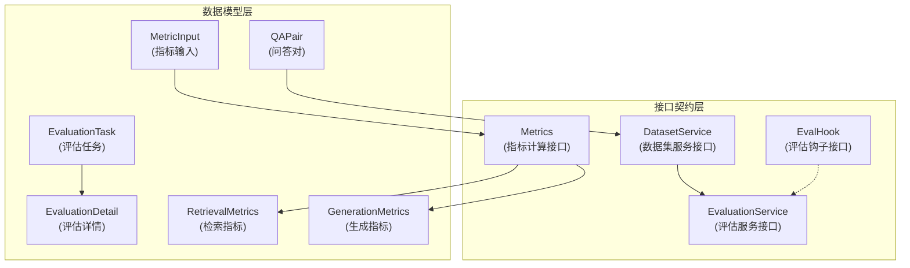

# 评估数据集与指标契约 (evaluation_dataset_and_metric_contracts)

## 概述

在构建智能问答系统时，如何客观、可重复地衡量系统的检索质量和生成答案的质量？这个模块正是为了解决这个问题而设计的。它定义了一套完整的契约和数据结构，用于：

- 标准化评估数据集的格式（问题、答案、相关段落）
- 定义评估任务的生命周期状态
- 抽象出指标计算的通用接口
- 提供评估过程的扩展机制

想象一下，这就像是为问答系统建立了一套"标准化考试"：`QAPair` 是试卷上的题目，`EvaluationTask` 是考试任务，各种 `Metrics` 是评分标准，而 `EvalHook` 则是考试过程中的监考员，可以在每个阶段记录和干预。

## 架构概览

这个模块采用了清晰的分层架构：

1. **数据模型层**：定义了评估过程中涉及的核心数据结构，包括问答对、评估任务、指标输入和结果等。
2. **接口契约层**：定义了数据集管理、评估执行、指标计算和过程扩展的接口。

数据流向是自下而上的：从 `QAPair` 数据集开始，通过 `DatasetService` 加载，然后由 `EvaluationService`  orchestrate 整个评估流程，最终产出 `RetrievalMetrics` 和 `GenerationMetrics`。

## 核心设计决策

### 1. 数据与行为分离

**决策**：将数据结构（`QAPair`、`EvaluationTask` 等）与业务逻辑接口（`DatasetService`、`EvaluationService` 等）明确分离。

**分析**：
- **为什么这样做**：评估功能可能在不同的服务环境中运行（本地测试、云端服务、批处理任务），数据结构的稳定性远比实现重要。
- **权衡**：这意味着具体的实现逻辑需要放在其他模块（如 [evaluation_dataset_and_metric_services](application_services_and_orchestration-evaluation_dataset_and_metric_services.md)），增加了模块间的依赖，但获得了更强的可移植性。

### 2. 指标计算的抽象接口

**决策**：定义统一的 `Metrics` 接口，所有指标都通过 `Compute(MetricInput) float64` 方法计算。

**分析**：
- **为什么这样做**：不同的评估场景可能需要不同的指标组合，通过接口抽象可以轻松添加新指标而不改变评估流程。
- **类比**：这就像计算器的按键，每个按键（指标）都实现相同的"按下计算"接口，但内部逻辑各不相同。
- **局限性**：对于需要复杂配置的指标，简单的 `MetricInput` 可能不够用，但对于大多数常见的检索和生成指标已经足够。

### 3. 基于状态机的钩子机制

**决策**：使用 `EvalState` 枚举定义评估流程的各个阶段，并通过 `EvalHook` 接口在每个阶段进行扩展。

**分析**：
- **为什么这样做**：评估过程可能需要在不同阶段执行额外操作（日志记录、中间结果保存、性能监控等），使用钩子模式可以将这些横切关注点与主流程分离。
- **状态设计**：从 `StateBegin` 到 `StateEnd`，清晰地定义了评估的完整生命周期，包括数据加载、嵌入生成、向量搜索、重排序等关键步骤。

### 4. 中文文本处理的全局实例

**决策**：在包级别初始化全局的 `Jieba` 分词器实例。

**分析**：
- **为什么这样做**：中文文本处理（如 BLEU、ROUGE 指标计算）需要分词，而 Jieba 分词器的初始化成本较高，全局单例可以避免重复初始化。
- **权衡**：这引入了全局状态，可能在测试时造成干扰，但在这个特定场景下，性能收益大于可测试性的损失。

## 子模块说明

### [dataset_qa_contracts](core_domain_types_and_interfaces-evaluation_dataset_and_metric_contracts-dataset_qa_contracts.md)

这个子模块定义了评估数据集的核心数据结构和服务接口。`QAPair` 是整个评估体系的基石——它封装了一个完整的问答示例，包括问题、相关段落、标准答案等。`DatasetService` 接口则定义了如何从存储中加载这些问答对。

### [evaluation_task_and_execution_contracts](core_domain_types_and_interfaces-evaluation_dataset_and_metric_contracts-evaluation_task_and_execution_contracts.md)

这个子模块关注评估任务的执行流程。`EvaluationTask` 记录了任务的基本信息和执行状态，`EvaluationDetail` 则包含了完整的评估上下文和结果。`EvaluationService` 接口定义了启动评估和获取结果的核心操作，是外部系统与评估功能交互的主要入口。

### [metric_models_and_extension_hooks](core_domain_types_and_interfaces-evaluation_dataset_and_metric_contracts-metric_models_and_extension_hooks.md)

这个子模块是评估指标的"工具箱"。`RetrievalMetrics` 和 `GenerationMetrics` 分别定义了检索质量和文本生成质量的常用指标。`Metrics` 和 `EvalHook` 接口则提供了扩展点，允许自定义指标计算和评估过程的介入。

## 跨模块依赖关系

这个模块在整个系统中处于**契约定义层**，它被多个上层模块依赖，但自身几乎不依赖其他模块（除了基础的 `ChatManage` 类型）。

### 依赖此模块的模块

- **[evaluation_dataset_and_metric_services](application_services_and_orchestration-evaluation_dataset_and_metric_services.md)**：实现了此模块定义的接口，包含具体的评估逻辑和指标计算。
- **[evaluation_and_web_search_handlers](http_handlers_and_routing-evaluation_and_web_search_handlers.md)**：通过 HTTP 接口暴露评估功能，使用此模块的数据结构进行请求和响应。

### 数据流向示例

1. **评估启动流程**：
   - HTTP 层接收评估请求 → 创建 `EvaluationTask`
   - 调用 `EvaluationService.Evaluation()` → 启动评估
   - 通过 `DatasetService.GetDatasetByID()` → 加载 `QAPair` 数据集

2. **指标计算流程**：
   - 评估执行过程中收集数据 → 构建 `MetricInput`
   - 调用各种 `Metrics.Compute()` → 计算指标值
   - 填充 `RetrievalMetrics` 和 `GenerationMetrics` → 生成最终结果

## 使用指南与注意事项

### 作为数据结构使用者

- **`QAPair` 的完整性**：在创建评估数据集时，确保 `QAPair` 的 `PIDs`（相关段落 ID）和 `Passages`（段落文本）是对应的，否则检索指标计算会出错。
- **状态检查**：在获取 `EvaluationTask` 时，始终检查 `Status` 字段，不要假设任务一定成功。

### 作为接口实现者

- **`DatasetService` 的性能**：评估通常需要加载大量问答对，实现时考虑批量加载和缓存。
- **`EvalHook` 的错误处理**：`EvalHook.Handle()` 返回的错误会中断评估流程，除非你明确希望这样，否则应该在钩子内部处理错误。
- **`Metrics` 的线程安全**：如果在并发环境中使用指标计算器，确保 `Compute()` 方法是线程安全的。

### 常见陷阱

- **全局 Jieba 实例**：不要在测试中重置或修改全局的 `Jieba` 实例，这会影响所有使用它的指标计算。
- **空值处理**：`MetricInput` 中的字段可能为空（例如只有检索没有生成），实现指标计算时要处理这种情况。
- **状态顺序**：`EvalState` 的顺序是有意义的，不要在钩子中假设某个状态一定会在另一个状态之前或之后发生，除非你完全控制评估流程。
