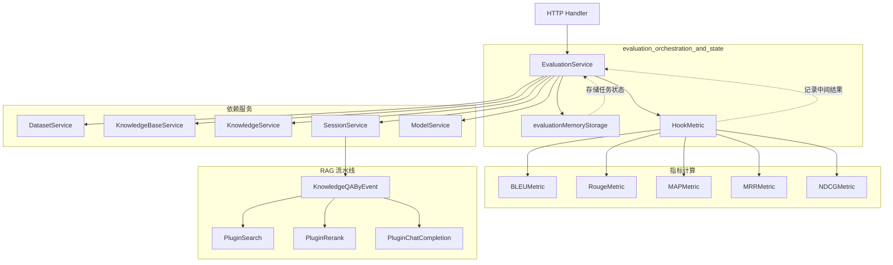

# evaluation_orchestration_and_state

## 模块概述

想象你正在运营一个问答机器人，你需要知道它回答得有多好。你不能只靠感觉——你需要系统化的测试：准备一批标准问题和答案，让机器人逐一回答，然后用客观指标打分。**`evaluation_orchestration_and_state` 模块就是这个测试流水线的指挥中心**。

这个模块解决的核心问题是：**如何在一个支持多租户的 RAG（检索增强生成）系统中，自动化地、可重复地评估检索和生成质量**。它不是简单地调用几个指标函数，而是要协调整个评估流程：准备临时知识库、并行执行 QA 测试、收集中间结果、计算综合指标、清理临时资源，同时保证多租户之间的数据隔离。

为什么不能简单地写个脚本跑一跑？因为评估过程涉及多个服务的协同（知识库服务、会话服务、模型服务），需要处理并发执行、状态追踪、资源清理、租户权限校验等复杂问题。这个模块将这些复杂性封装成一个清晰的接口：提交评估任务 → 后台异步执行 → 查询结果。

## 架构设计



### 核心组件角色

**`EvaluationService`** 是模块的对外接口和编排中枢。它接收评估请求，协调各个依赖服务完成评估流程，并将结果存储在内存中供后续查询。你可以把它理解为一个**测试项目经理**：它不亲自做具体的测试工作，但负责分配任务、追踪进度、汇总结果。

**`evaluationMemoryStorage`** 是一个线程安全的内存存储层，用于保存评估任务的状态和结果。选择内存存储而非持久化数据库是一个关键的设计决策——评估任务是临时性的，生命周期短，且需要频繁更新进度（每完成一个 QA 对就更新一次），内存存储避免了数据库写入的开销。但这也意味着服务重启后评估结果会丢失。

**`HookMetric`** 是评估过程中的数据收集器。它在每个 QA 对的处理过程中记录检索结果、重排结果、生成答案等中间数据，最后统一计算指标。这种"先记录、后计算"的模式避免了在流水线中嵌入复杂的指标逻辑，保持了关注点分离。

### 数据流 walkthrough

让我们追踪一个评估请求的完整生命周期：

1. **任务提交**：HTTP Handler 调用 `EvaluationService.Evaluation()`，传入数据集 ID、知识库 ID、模型 ID 等参数。

2. **知识库准备**：如果未提供知识库 ID，服务会自动创建一个临时的评估专用知识库，使用默认的嵌入模型和 LLM 模型。这个知识库会在评估结束后被删除。

3. **任务注册**：生成唯一的 `taskID`，创建 `EvaluationDetail` 对象，通过 `evaluationMemoryStorage.register()` 存入内存。此时任务状态为 `Pending`。

4. **异步执行**：启动一个 goroutine 在后台执行评估，主线程立即返回任务详情给调用者。这是典型的**异步任务模式**——调用者可以轮询结果而不阻塞请求。

5. **数据集加载**：从 `DatasetService` 获取 QA 对列表，每个 QA 对包含问题、标准答案和相关段落。

6. **知识注入**：将 QA 对中的段落批量创建为知识库条目。这是评估的关键——让系统"学习"这些材料，然后测试它能否正确检索和回答。

7. **并行评估**：使用 `errgroup.Group` 并行处理每个 QA 对。每个 worker 执行：
   - 调用 `SessionService.KnowledgeQAByEvent()` 运行完整的 RAG 流水线
   - 通过 `HookMetric` 记录检索结果、重排结果、生成答案
   - 更新任务进度（已完成数量/总数量）

8. **指标聚合**：所有 QA 对处理完成后，`HookMetric` 计算综合指标（BLEU、ROUGE、MAP、MRR、NDCG 等）。

9. **资源清理**：通过 `defer` 删除临时创建的知识库和知识条目，避免数据污染。

10. **结果查询**：调用者通过 `EvaluationResult()` 接口，传入 `taskID` 获取评估结果。服务会校验租户 ID 确保数据隔离。

## 组件深度解析

### `EvaluationService`

**设计意图**：作为评估流程的编排器，`EvaluationService` 的核心职责是协调而非执行。它不直接计算指标，不直接检索知识，而是调用专业服务完成这些工作。这种设计遵循**单一职责原则**，使每个组件保持专注。

**关键方法**：

```go
func (e *EvaluationService) Evaluation(
    ctx context.Context,
    datasetID string, 
    knowledgeBaseID string,
    chatModelID string, 
    rerankModelID string,
) (*types.EvaluationDetail, error)
```

这个方法的设计体现了几个重要考量：

1. **参数灵活性**：所有 ID 参数都允许为空，服务会自动选择默认值。这降低了调用门槛——用户只需提供数据集 ID 即可启动评估，其他配置使用系统默认。但这种便利性也带来了隐式依赖：如果系统没有配置默认模型，评估会失败。

2. **知识库隔离策略**：无论是否提供 `knowledgeBaseID`，服务都会创建一个新的临时知识库。这是为了避免评估过程污染现有知识库的数据。如果提供了 ID，新知识库会复制原知识库的模型配置（嵌入模型、摘要模型），确保评估环境与生产环境一致。

3. **异步执行模式**：方法在启动后台 goroutine 后立即返回，任务状态初始为 `Pending`，后台进程将其更新为 `Running`，完成后更新为 `Success` 或 `Failed`。这种模式适合长时间运行的任务，但调用者需要轮询结果。

```go
func (e *EvaluationService) EvalDataset(
    ctx context.Context, 
    detail *types.EvaluationDetail, 
    knowledgeBaseID string,
) error
```

这是实际执行评估的核心方法。内部使用 `errgroup.Group` 实现并行处理：

```go
g.SetLimit(max(runtime.GOMAXPROCS(0)-1, 1))
```

这个设置值得注意：它保留一个 CPU 核心给主线程和其他任务，避免评估任务占满所有资源。这是一种**资源友好的并发策略**，但在高负载服务器上可能导致评估速度受限。

**依赖注入**：

`EvaluationService` 依赖六个外部服务：
- `DatasetService`：获取 QA 对数据集
- `KnowledgeBaseService`：创建/删除临时知识库
- `KnowledgeService`：创建/删除知识条目
- `SessionService`：执行 RAG 问答流水线
- `ModelService`：获取默认模型配置
- `config.Config`：读取系统配置（阈值、TopK 等）

这些依赖通过构造函数注入，便于测试和替换。但这也意味着 `EvaluationService` 的行为高度依赖这些服务的具体实现——如果 `SessionService.KnowledgeQAByEvent()` 的行为发生变化，评估结果可能不一致。

### `evaluationMemoryStorage`

**设计意图**：这是一个简单的内存键值存储，用 `sync.RWMutex` 保证线程安全。选择这种简单设计的原因是评估任务的生命周期短（通常几分钟到几十分钟），且需要频繁更新进度（每完成一个 QA 对就更新一次）。如果使用数据库，频繁的写操作会成为瓶颈。

**核心操作**：

```go
func (e *evaluationMemoryStorage) register(params *types.EvaluationDetail)
func (e *evaluationMemoryStorage) get(taskID string) (*types.EvaluationDetail, error)
func (e *evaluationMemoryStorage) update(taskID string, fn func(params *types.EvaluationDetail)) error
```

`update` 方法的设计很巧妙：它接受一个函数作为参数，在持有写锁的情况下执行这个函数。这种**回调式更新**确保了更新操作的原子性，避免了竞态条件。例如：

```go
e.evaluationMemoryStorage.update(detail.Task.ID, func(params *types.EvaluationDetail) {
    params.Metric = metricResult
    params.Task.Finished = finished
})
```

这个更新操作是原子的——不会出现在更新过程中其他 goroutine 读取到部分更新数据的情况。

**局限性**：

1. **无持久化**：服务重启后所有评估任务丢失。对于需要长期保存评估历史的场景，这是一个缺陷。

2. **无过期清理**：已完成的任务会一直占用内存，直到服务重启。在生产环境中，这可能导致内存泄漏。理想的设计应该有一个后台清理任务，定期删除超过一定时间的评估记录。

3. **单点存储**：所有任务存储在一个 map 中，如果评估任务数量巨大，可能成为性能瓶颈。不过在实际使用中，评估是低频操作，这个限制通常不是问题。

### `HookMetric`

**设计意图**：`HookMetric` 是评估数据的收集器和聚合器。它的设计模式类似于**事件监听器**——在 RAG 流水线的各个关键节点"钩入"，记录中间结果，最后统一计算指标。

**数据收集流程**：

```go
metricHook.recordInit(i)           // 初始化第 i 个 QA 对的记录
metricHook.recordQaPair(i, qaPair) // 记录问题和标准答案
metricHook.recordSearchResult(i, chatManage.SearchResult)   // 记录检索结果
metricHook.recordRerankResult(i, chatManage.RerankResult)   // 记录重排结果
metricHook.recordChatResponse(i, chatManage.ChatResponse)   // 记录生成答案
metricHook.recordFinish(i)         // 标记第 i 个 QA 对完成
```

这种分阶段记录的设计有几个好处：

1. **可调试性**：如果评估结果异常，可以检查每个阶段的中间数据，定位问题是在检索、重排还是生成阶段。

2. **指标扩展性**：新增指标类型时，只需在 `MetricResult` 中添加相应字段，并在 `MetricList` 中实现计算逻辑，无需修改评估流程本身。

3. **并行安全**：每个 QA 对的数据记录是独立的，最后通过互斥锁聚合结果，避免了并发写入的冲突。

**指标计算**：

`HookMetric` 本身不直接计算指标，而是将数据传递给具体的指标实现（`BLEUMetric`、`RougeMetric`、`MAPMetric` 等）。这种**策略模式**使得指标算法可以独立演化和测试。

## 依赖关系分析

### 上游调用者

**`internal.handler.evaluation.EvaluationHandler`**：HTTP 层处理器，接收用户的评估请求，调用 `EvaluationService.Evaluation()` 启动任务。Handler 层负责参数校验和响应格式化，业务逻辑完全委托给 Service。

**`internal.handler.evaluation.EvaluationHandler.EvaluationResult`**：查询评估结果的 HTTP 接口。调用 `EvaluationService.EvaluationResult()` 获取任务详情，返回给前端。

### 下游被调用者

**`SessionService.KnowledgeQAByEvent()`**：这是评估流程中最关键的依赖。它执行完整的 RAG 流水线（检索 → 重排 → 生成），评估的准确性完全依赖于这个方法的实现。如果流水线行为发生变化（例如检索策略调整），评估结果会随之变化——这是预期的，因为评估的目的就是测量当前流水线的性能。

**`DatasetService.GetDatasetByID()`**：获取评估数据集。数据集的格式（QA 对的结构、段落内容）直接影响评估的有效性。如果数据集质量差（问题模糊、答案不准确），评估结果没有参考价值。

**`KnowledgeBaseService` / `KnowledgeService`**：用于创建和删除临时知识库。这些操作的失败会导致评估无法进行或资源泄漏。

**`ModelService.ListModels()`**：当用户未指定模型时，自动选择默认模型。这个依赖引入了隐式配置——评估使用的模型取决于系统中注册的模型，而不是硬编码的。

### 数据契约

**`types.EvaluationDetail`**：评估任务的核心数据结构，包含：
- `Task`：任务元信息（ID、状态、进度）
- `Params`：评估参数（模型配置、阈值、TopK 等）
- `Metric`：评估结果指标

**`types.MetricInput`**：指标计算的输入数据，包含：
- `RetrievalGT`：检索的地面真实值（相关文档的 ID 列表）
- `RetrievalIDs`：实际检索到的文档 ID 列表
- `GeneratedTexts`：生成的答案
- `GeneratedGT`：标准答案

这个结构将检索指标和生成指标统一在一个接口下，使得不同类型的指标可以共享相同的数据输入。

## 设计决策与权衡

### 内存存储 vs 持久化存储

**选择**：使用内存存储（`evaluationMemoryStorage`）而非数据库。

**理由**：
1. 评估任务是临时性的，生命周期短（通常几分钟）
2. 需要频繁更新进度（每完成一个 QA 对更新一次），数据库写入开销大
3. 评估结果通常在前端展示后就不再需要

**代价**：
1. 服务重启后数据丢失
2. 无法跨服务实例共享评估结果（如果部署多个实例，需要 sticky session 或外部存储）
3. 无历史追溯能力

**适用场景**：这个设计适合开发调试和临时评估。如果需要长期保存评估历史用于趋势分析，应该引入持久化存储。

### 异步执行 vs 同步执行

**选择**：评估任务在后台 goroutine 中异步执行，主线程立即返回。

**理由**：
1. 评估可能耗时较长（数据集大时），同步执行会导致 HTTP 请求超时
2. 调用者可以并行启动多个评估任务
3. 支持进度查询——调用者可以轮询任务状态

**代价**：
1. 调用者需要实现轮询逻辑或 WebSocket 推送
2. 错误处理复杂化——任务失败时无法直接返回错误给调用者，需要通过状态字段传递
3. 资源管理困难——后台 goroutine 可能泄漏（虽然代码中使用了 `defer` 清理资源）

### 并行评估 vs 串行评估

**选择**：使用 `errgroup.Group` 并行处理 QA 对，worker 数量为 `GOMAXPROCS(0)-1`。

**理由**：
1. 每个 QA 对的评估是独立的，可以并行
2. 充分利用多核 CPU，加速评估过程
3. 保留一个 CPU 核心给其他任务，避免资源独占

**代价**：
1. 并发执行可能导致资源竞争（例如知识库读取、模型调用）
2. 错误处理复杂化——一个 QA 对失败会影响整个任务
3. 进度更新需要加锁，可能成为瓶颈

**潜在问题**：如果数据集包含 1000 个 QA 对，而服务器有 8 个核心，会同时执行 7 个评估任务。每个任务都会调用 RAG 流水线，可能触发大量的模型 API 调用，导致速率限制或资源耗尽。理想的设计应该限制**并发流水线数量**，而不仅仅是 goroutine 数量。

### 临时知识库 vs 复用现有知识库

**选择**：每次评估都创建新的临时知识库，评估结束后删除。

**理由**：
1. 避免污染现有知识库的数据
2. 确保评估环境的一致性
3. 支持并行评估多个数据集

**代价**：
1. 创建和删除知识库有开销
2. 如果评估过程中服务崩溃，临时知识库可能泄漏
3. 无法复用已有的知识库索引

**改进建议**：可以考虑使用命名空间或标签隔离评估数据，而不是创建完整的知识库。但这需要底层存储服务的支持。

### 租户隔离策略

**选择**：在 `EvaluationResult()` 中校验租户 ID，确保用户只能访问自己租户的评估结果。

```go
tenantID := ctx.Value(types.TenantIDContextKey).(uint64)
if tenantID != detail.Task.TenantID {
    return nil, errors.New("tenant ID does not match")
}
```

**理由**：多租户系统的基本要求，防止数据泄露。

**潜在问题**：
1. 校验只在查询结果时进行，任务创建时的租户 ID 来自 context，如果 context 被篡改，可能创建不属于当前租户的任务
2. `evaluationMemoryStorage` 是全局共享的，所有租户的任务都在同一个 map 中。虽然查询时有校验，但内存使用没有隔离——一个租户的大量评估任务可能耗尽内存，影响其他租户

**改进建议**：使用嵌套 map `map[tenantID]map[taskID]*EvaluationDetail` 实现租户级别的内存隔离，并设置每个租户的内存配额。

## 使用指南

### 启动评估任务

```go
// 最小化调用 - 使用默认配置
detail, err := evaluationService.Evaluation(
    ctx,
    "dataset-123",  // 数据集 ID（必需）
    "",             // 知识库 ID（空则自动创建）
    "",             // 聊天模型 ID（空则使用默认）
    "",             // 重排模型 ID（空则使用默认）
)

// 完整配置调用
detail, err := evaluationService.Evaluation(
    ctx,
    "dataset-123",
    "kb-456",
    "model-chat-789",
    "model-rerank-012",
)

// 获取任务 ID 用于轮询
taskID := detail.Task.ID
```

### 轮询评估结果

```go
for {
    detail, err := evaluationService.EvaluationResult(ctx, taskID)
    if err != nil {
        // 处理错误（任务不存在、租户不匹配等）
        break
    }
    
    switch detail.Task.Status {
    case types.EvaluationStatuePending:
        // 等待中
        time.Sleep(1 * time.Second)
    case types.EvaluationStatueRunning:
        // 进行中 - 可以显示进度
        progress := float64(detail.Task.Finished) / float64(detail.Task.Total) * 100
        fmt.Printf("Progress: %.2f%%\n", progress)
        time.Sleep(1 * time.Second)
    case types.EvaluationStatueSuccess:
        // 完成 - 获取指标
        fmt.Printf("BLEU: %f\n", detail.Metric.BLEU)
        fmt.Printf("ROUGE: %f\n", detail.Metric.Rouge)
        fmt.Printf("MAP: %f\n", detail.Metric.MAP)
        return
    case types.EvaluationStatueFailed:
        // 失败 - 查看错误信息
        fmt.Printf("Error: %s\n", detail.Task.ErrMsg)
        return
    }
}
```

### 配置评估参数

评估参数通过 `config.Config` 注入，主要配置项包括：

```yaml
conversation:
  vector_threshold: 0.7      # 向量检索阈值
  keyword_threshold: 0.5     # 关键词检索阈值
  embedding_topk: 10         # 检索返回数量
  rerank_topk: 5             # 重排后保留数量
  rerank_threshold: 0.6      # 重排阈值
  max_rounds: 5              # 最大对话轮数
  summary:
    max_tokens: 500          # 摘要最大 token 数
    temperature: 0.7         # 生成温度
```

这些配置影响评估的行为，但不影响指标计算。例如，`embedding_topk` 影响检索返回多少文档，但 MAP 指标会根据返回的文档数量计算。

## 边界情况与陷阱

### 1. 任务 ID 冲突

任务 ID 通过 `utils.GenerateTaskID("evaluation", tenantID, datasetID)` 生成。如果同一租户对同一数据集快速启动多次评估，可能生成相同的任务 ID，导致后启动的任务覆盖先启动的任务状态。

**缓解措施**：在生成任务 ID 时加入时间戳或随机数。

### 2. 资源泄漏

评估结束后会删除临时知识库，但如果评估过程中服务崩溃（panic、kill -9），`defer` 清理不会执行，导致知识库泄漏。

**缓解措施**：
- 实现定期清理任务，删除超过一定时间的"僵尸"评估知识库
- 使用带 TTL 的知识库，自动过期

### 3. 内存泄漏

`evaluationMemoryStorage` 没有清理机制，已完成的评估任务会一直占用内存。

**缓解措施**：
- 添加 `Cleanup()` 方法，定期删除超过 24 小时的评估记录
- 限制最大存储任务数，超出时删除最旧的任务

### 4. 并发进度更新竞争

虽然 `evaluationMemoryStorage.update()` 使用互斥锁，但 `finished` 计数器和 `metricResult` 的更新在锁外进行，可能导致进度和指标不一致。

```go
mu.Lock()
finished += 1
metricResult := metricHook.MetricResult()
mu.Unlock()
// 这里可能发生上下文切换
e.evaluationMemoryStorage.update(detail.Task.ID, func(params *types.EvaluationDetail) {
    params.Metric = metricResult  // 可能不是最新的
    params.Task.Finished = finished  // 可能不是最新的
})
```

**修复建议**：将更新逻辑移入 `update()` 的回调中：

```go
e.evaluationMemoryStorage.update(detail.Task.ID, func(params *types.EvaluationDetail) {
    mu.Lock()
    finished += 1
    params.Metric = metricHook.MetricResult()
    params.Task.Finished = finished
    mu.Unlock()
})
```

### 5. 错误传播不完整

`EvalDataset()` 中，如果某个 QA 对处理失败，`errgroup` 会取消其他正在执行的任务，但已完成的 QA 对的指标可能部分丢失。

**改进建议**：使用 `errgroup.WithContext()` 并设置 `ContinueOnError`，让其他任务继续执行，最后汇总成功和失败的数量。

### 6. 租户 ID 类型断言风险

```go
tenantID := ctx.Value(types.TenantIDContextKey).(uint64)
```

如果 context 中没有设置租户 ID，这行代码会 panic。应该使用类型断言的安全形式：

```go
tenantID, ok := ctx.Value(types.TenantIDContextKey).(uint64)
if !ok {
    return nil, errors.New("tenant ID not found in context")
}
```

### 7. 默认模型选择的不确定性

当未指定模型 ID 时，服务遍历 `ListModels()` 返回的列表，选择第一个匹配类型的模型。如果系统中有多个同类型模型，选择哪个是不确定的（取决于列表顺序）。

**改进建议**：允许用户指定默认模型的优先级，或要求必须显式指定模型 ID。

## 扩展点

### 添加新的评估指标

1. 实现 `Metrics` 接口：

```go
type MyNewMetric struct {
    // 配置参数
}

func (m *MyNewMetric) Compute(input *types.MetricInput) float64 {
    // 计算逻辑
    return score
}
```

2. 在 `HookMetric.MetricResult()` 中调用新指标：

```go
func (h *HookMetric) MetricResult() *types.MetricResult {
    result := &types.MetricResult{}
    // ... 现有指标计算
    myMetric := &MyNewMetric{}
    result.MyNewMetric = myMetric.Compute(metricInput)
    return result
}
```

### 支持持久化存储

创建 `evaluationStorage` 接口，提供内存和数据库两种实现：

```go
type evaluationStorage interface {
    register(params *types.EvaluationDetail) error
    get(taskID string) (*types.EvaluationDetail, error)
    update(taskID string, fn func(params *types.EvaluationDetail)) error
    cleanup(before time.Time) error
}

type databaseEvaluationStorage struct {
    db *sql.DB
}

type memoryEvaluationStorage struct {
    store map[string]*types.EvaluationDetail
    mu    *sync.RWMutex
}
```

### 支持实时进度推送

当前设计需要轮询，可以扩展为支持 WebSocket 或 SSE 推送：

```go
func (e *EvaluationService) EvaluationStream(
    ctx context.Context, 
    taskID string,
) (<-chan *types.EvaluationDetail, error) {
    ch := make(chan *types.EvaluationDetail)
    // 注册回调，每次进度更新时发送到 channel
    e.evaluationMemoryStorage.registerProgressCallback(taskID, func(detail *types.EvaluationDetail) {
        ch <- detail
    })
    return ch, nil
}
```

## 相关模块

- [chat_pipeline_plugins_and_flow](chat_pipeline_plugins_and_flow.md) - RAG 流水线插件，评估过程实际调用的核心逻辑
- [retrieval_quality_metrics](retrieval_quality_metrics.md) - 检索质量指标（MAP、MRR、NDCG）的实现
- [generation_text_overlap_metrics](generation_text_overlap_metrics.md) - 生成质量指标（BLEU、ROUGE）的实现
- [knowledge_ingestion_extraction_and_graph_services](knowledge_ingestion_extraction_and_graph_services.md) - 知识库和知识条目的管理服务
- [conversation_context_and_memory_services](conversation_context_and_memory_services.md) - 会话和上下文管理服务

## 总结

`evaluation_orchestration_and_state` 模块是一个典型的**异步任务编排器**，它将复杂的评估流程封装成简单的接口。设计上的核心权衡是**简单性 vs 健壮性**——内存存储和异步执行简化了实现，但牺牲了持久性和错误恢复能力。

对于新贡献者，理解这个模块的关键是把握它的**临时性**和**协调性**：它不长期保存数据，不直接执行核心逻辑，而是协调其他服务完成评估，并在完成后清理现场。这种设计适合开发和调试场景，但在生产环境中需要额外的持久化和监控机制。
