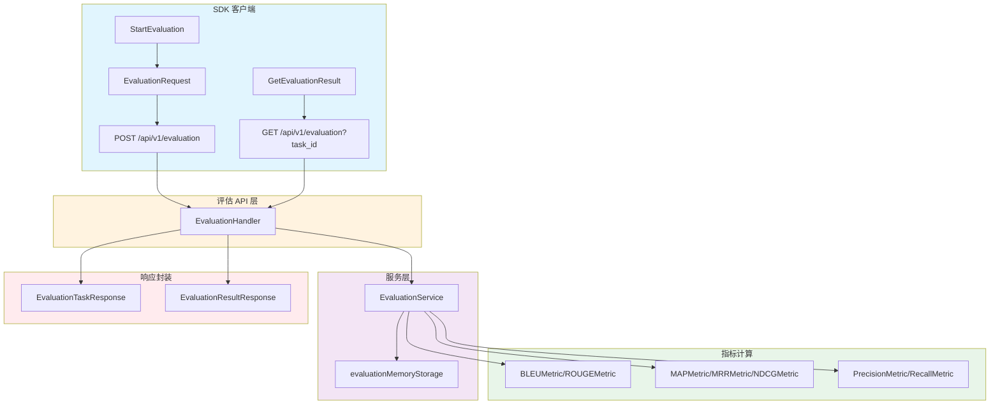

# evaluation_result_and_task_responses 模块深度解析

## 概述：为什么需要这个模块

想象你是一家公司的 AI 平台负责人，团队正在使用多个不同的 embedding 模型、聊天模型和重排序模型。你面临一个核心问题：**如何客观地比较这些模型的性能，并选择最适合业务场景的组合？**

这就是 `evaluation_result_and_task_responses` 模块存在的根本原因。它提供了与后端评估服务交互的标准化接口，让开发者能够：
1. **启动评估任务** —— 指定数据集和模型组合，触发异步评估流程
2. **获取评估结果** —— 检索详细的性能指标和统计分析

这个模块的设计洞察在于：**模型评估是一个耗时的异步过程**，不能像普通 API 调用那样同步返回结果。因此，它采用了"任务提交 → 异步执行 → 结果查询"的经典异步模式，类似于云服务商的任务队列设计（如 AWS Batch 或 Celery 任务）。

如果你尝试用同步方式实现评估功能，会遇到两个问题：
- 评估可能需要数分钟甚至数小时，HTTP 请求会超时
- 用户无法在评估过程中获取进度信息

这个模块通过分离"任务创建"和"结果获取"两个操作，优雅地解决了这些问题。

---

## 架构与数据流



### 数据流 walkthrough

**启动评估任务的路径**：
1. 调用方创建 `EvaluationRequest`，指定 `dataset_id`、`embedding_id`、`chat_id`、`rerank_id`
2. `Client.StartEvaluation()` 将请求序列化为 JSON，通过 POST 发送到 `/api/v1/evaluation`
3. 后端的 [`EvaluationHandler`](http_handlers_and_routing.md) 接收请求，委托给 [`EvaluationService`](application_services_and_orchestration.md)
4. 服务层创建异步任务，立即返回 `EvaluationTaskResponse`（包含任务 ID 和初始状态）
5. 后台进程开始执行评估，计算各项指标并更新进度

**获取评估结果的路径**：
1. 调用方使用任务 ID 调用 `Client.GetEvaluationResult()`
2. 请求通过 GET 发送到 `/api/v1/evaluation?task_id=xxx`
3. 后端查询 [`evaluationMemoryStorage`](application_services_and_orchestration.md) 获取结果
4. 返回 `EvaluationResultResponse`，包含完整的指标数据和查询统计

---

## 核心组件深度解析

### EvaluationTaskResponse

**设计目的**：作为创建评估任务 API 的标准化响应包装器。

```go
type EvaluationTaskResponse struct {
    Success bool           `json:"success"` // 操作是否成功
    Data    EvaluationTask `json:"data"`    // 任务数据
}
```

**为什么需要这个包装层？**

你可能会问：为什么不直接返回 `EvaluationTask`？这里体现了 API 设计的两个关键考量：

1. **统一的响应契约**：所有 API 响应都遵循 `{success, data, error}` 的模式，前端可以编写统一的错误处理逻辑，而不需要为每个端点特殊处理。

2. **未来扩展性**：如果将来需要添加元数据（如请求 ID、耗时、分页信息），可以在不破坏现有 `Data` 结构的前提下扩展响应对象。

**内部 mechanics**：
- `Success` 字段由 `parseResponse()` 函数根据 HTTP 状态码和响应体解析设置
- `Data` 字段在反序列化时自动填充为 `EvaluationTask` 结构

**使用场景**：
- 仅在 `StartEvaluation()` 方法内部使用，作为中间解析结构
- 调用方最终拿到的是解包后的 `*EvaluationTask`

---

### EvaluationResultResponse

**设计目的**：作为获取评估结果 API 的标准化响应包装器。

```go
type EvaluationResultResponse struct {
    Success bool             `json:"success"` // 操作是否成功
    Data    EvaluationResult `json:"data"`    // 评估结果数据
}
```

**与 EvaluationTaskResponse 的对称性**：
这两个响应结构形成了完美的对称设计，反映了 CRUD 操作中"创建"与"读取"的对应关系。这种对称性降低了认知负担——开发者学会一个模式后，可以自然推导出另一个。

**关键字段解析**：
- `Success`：布尔标志，快速判断请求是否成功，无需解析深层嵌套
- `Data`：包含完整的评估结果，包括指标、进度、错误信息等

**使用场景**：
- 仅在 `GetEvaluationResult()` 方法内部使用
- 调用方拿到的是解包后的 `*EvaluationResult`

---

### 关联类型：EvaluationTask 与 EvaluationResult

虽然这两个类型不在本模块的核心组件列表中，但理解它们对于掌握数据流至关重要。

**EvaluationTask**（任务元数据）：
```go
type EvaluationTask struct {
    ID          string // 任务唯一标识
    Status      string // pending, running, completed, failed
    Progress    int    // 0-100 的进度值
    DatasetID   string // 评估数据集 ID
    EmbeddingID string // embedding 模型 ID
    ChatID      string // 聊天模型 ID
    RerankID    string // 重排序模型 ID
    CreatedAt   string // 创建时间
    CompleteAt  string // 完成时间
    ErrorMsg    string // 失败时的错误信息
}
```

**设计洞察**：`EvaluationTask` 是"轻量级"的任务描述，适合在任务列表中快速展示。它不包含具体的指标数据，只包含元数据和状态。

**EvaluationResult**（完整结果）：
```go
type EvaluationResult struct {
    TaskID       string                   // 关联的任务 ID
    Status       string                   // 任务状态
    Progress     int                      // 进度
    TotalQueries int                      // 总查询数
    TotalSamples int                      // 总样本数
    Metrics      map[string]float64       // 评估指标集合
    QueriesStat  []map[string]interface{} // 每个查询的统计
    CreatedAt    string                   // 创建时间
    CompleteAt   string                   // 完成时间
    ErrorMsg     string                   // 错误信息
}
```

**关键区别**：
- `Metrics` 字段是 `map[string]float64`，这是一个**动态扩展点**。后端可以根据评估类型添加不同的指标（如 BLEU、ROUGE、MAP、MRR、NDCG 等），而无需修改前端结构。
- `QueriesStat` 使用 `[]map[string]interface{}`，提供了最大的灵活性来存储每个查询的详细统计，但代价是类型安全性降低。

---

## 依赖关系分析

### 本模块调用的组件

| 依赖组件 | 调用方式 | 设计原因 |
|---------|---------|---------|
| [`client.Client`](core_client_runtime.md) | `c.doRequest()` | 封装 HTTP 请求细节（认证、重试、超时） |
| `net/http` | `http.MethodPost`, `http.MethodGet` | 标准 HTTP 方法常量 |
| `net/url` | `url.Values{}` | 构建查询参数 |
| `context` | `ctx context.Context` | 支持请求取消和超时控制 |

**关键依赖：Client.doRequest()**

```go
func (c *Client) StartEvaluation(ctx context.Context, request *EvaluationRequest) (*EvaluationTask, error) {
    resp, err := c.doRequest(ctx, http.MethodPost, "/api/v1/evaluation", request, nil)
    // ...
}
```

`doRequest()` 是一个**基础设施抽象**，它处理：
- 请求头设置（Content-Type, Authorization）
- JSON 序列化/反序列化
- 错误统一处理
- 重试逻辑（如果配置）

这种设计将业务逻辑（评估 API）与传输细节（HTTP）解耦，符合单一职责原则。

### 调用本模块的组件

根据模块树，本模块位于 `tenant_and_evaluation_api` 下，主要被以下层调用：

1. **HTTP Handler 层**：[`EvaluationHandler`](http_handlers_and_routing.md) 使用这些类型定义 API 响应格式
2. **前端应用**：通过 SDK 调用评估功能，展示模型对比结果
3. **自动化测试**：验证评估流程的正确性

**数据契约**：
- **输入**：`EvaluationRequest`（包含 dataset_id 和模型 ID 列表）
- **输出**：`EvaluationTask` 或 `EvaluationResult`（取决于操作类型）

---

## 设计决策与权衡

### 1. 异步任务模式 vs 同步执行

**选择**：异步任务模式（提交任务 → 轮询结果）

**权衡分析**：
| 维度 | 同步方案 | 异步方案（当前） |
|-----|---------|----------------|
| 实现复杂度 | 低 | 中（需要状态存储） |
| 用户体验 | 差（长时间等待） | 好（可显示进度） |
| 可扩展性 | 差（受 HTTP 超时限制） | 好（支持长时间任务） |
| 错误恢复 | 难（请求失败需重试） | 易（任务状态持久化） |

**为什么异步方案更适合**：
评估任务可能需要遍历数百个查询样本，对每个样本执行 embedding → 检索 → rerank → 生成 → 指标计算的完整流程。假设每个查询耗时 2 秒，100 个查询就是 200 秒——远超典型的 HTTP 超时时间（30-60 秒）。

### 2. 响应包装器模式 vs 直接返回数据

**选择**：使用 `EvaluationTaskResponse` / `EvaluationResultResponse` 包装

**权衡分析**：
- **优点**：统一响应格式、便于扩展、支持批量操作
- **缺点**：增加一层嵌套、需要额外解包

**设计理由**：
在 SDK 内部解包，对外暴露纯净的数据对象（`*EvaluationTask` / `*EvaluationResult`），兼顾了内部一致性和外部简洁性。

### 3. 动态指标 Map vs 结构化字段

**选择**：`Metrics map[string]float64`

**权衡分析**：
| 方案 | 优点 | 缺点 |
|-----|------|------|
| 动态 Map | 灵活扩展、支持自定义指标 | 类型不安全、IDE 无提示 |
| 结构化字段 | 类型安全、文档清晰 | 添加新指标需修改结构 |

**为什么选择动态 Map**：
评估指标体系是**演进中的**——今天可能只需要 BLEU 和 ROUGE，明天可能需要添加 BERTScore 或人类评估分数。动态 Map 允许后端在不破坏 SDK 兼容性的前提下添加新指标。

**使用建议**：
```go
// 访问已知指标
bleuScore := result.Metrics["bleu"]

// 遍历所有指标
for name, value := range result.Metrics {
    fmt.Printf("%s: %.4f\n", name, value)
}
```

### 4. 查询统计的 interface{} 类型

**选择**：`QueriesStat []map[string]interface{}`

**这是一个有争议的设计**。使用 `interface{}` 牺牲了类型安全，换取了存储任意统计数据的灵活性。

**潜在问题**：
- 调用方需要类型断言才能访问具体字段
- 重构困难（编译器无法检查字段名）
- 文档依赖性强（需要外部文档说明可能的字段）

**改进建议**：
如果查询统计的结构相对稳定，可以考虑定义专用结构：
```go
type QueryStat struct {
    QueryID       string  `json:"query_id"`
    RetrievalRank int     `json:"retrieval_rank"`
    RerankScore   float64 `json:"rerank_score"`
    // ...
}
```

---

## 使用指南与示例

### 启动评估任务

```go
import (
    "context"
    "time"
    "github.com/yourorg/weknora-sdk/client"
)

// 创建客户端
cli := client.NewClient("https://api.weknora.com", "your-api-key")

// 构建评估请求
request := &client.EvaluationRequest{
    DatasetID:        "ds_12345",
    EmbeddingModelID: "emb_bge_large",
    ChatModelID:      "chat_gpt4",
    RerankModelID:    "rerank_bge",
}

// 启动任务
ctx, cancel := context.WithTimeout(context.Background(), 10*time.Second)
defer cancel()

task, err := cli.StartEvaluation(ctx, request)
if err != nil {
    log.Fatalf("启动评估失败：%v", err)
}

log.Printf("任务已创建：ID=%s, 状态=%s", task.ID, task.Status)
```

### 轮询任务结果

```go
// 轮询直到任务完成
for {
    result, err := cli.GetEvaluationResult(ctx, task.ID)
    if err != nil {
        log.Fatalf("获取结果失败：%v", err)
    }
    
    log.Printf("进度：%d%%, 状态：%s", result.Progress, result.Status)
    
    if result.Status == "completed" {
        // 输出指标
        for name, value := range result.Metrics {
            log.Printf("%s: %.4f", name, value)
        }
        break
    }
    
    if result.Status == "failed" {
        log.Fatalf("任务失败：%s", result.ErrorMsg)
    }
    
    time.Sleep(5 * time.Second) // 等待 5 秒后重试
}
```

### 最佳实践

1. **设置合理的超时**：`StartEvaluation()` 是快速操作，10 秒超时足够；`GetEvaluationResult()` 可能需要更长时间，建议 30 秒以上。

2. **实现指数退避轮询**：不要固定 5 秒轮询，使用指数退避（1s, 2s, 4s, 8s...）减少服务器压力。

3. **处理部分完成状态**：某些评估可能部分成功，检查 `Progress` 和 `TotalQueries` 判断是否有足够的数据。

4. **记录任务 ID**：将 `task.ID` 持久化到数据库，便于后续审计和结果追溯。

---

## 边界情况与注意事项

### 1. 任务状态竞态条件

**问题**：在轮询过程中，任务可能从 `running` 直接变为 `failed`，跳过 `completed` 状态。

**解决方案**：
```go
switch result.Status {
case "completed":
    // 处理成功
case "failed":
    // 处理失败
case "pending", "running":
    // 继续轮询
default:
    // 记录未知状态，可能需要人工介入
    log.Warnf("未知任务状态：%s", result.Status)
}
```

### 2. 指标缺失处理

**问题**：某些指标可能因为评估过程中的错误而缺失。

**解决方案**：
```go
bleuScore, exists := result.Metrics["bleu"]
if !exists {
    log.Warn("BLEU 指标缺失，可能评估未完成")
    bleuScore = -1 // 或使用默认值
}
```

### 3. 查询统计的类型断言

**问题**：`QueriesStat` 是 `[]map[string]interface{}`，访问具体字段需要类型断言。

**解决方案**：
```go
for _, stat := range result.QueriesStat {
    queryID, ok := stat["query_id"].(string)
    if !ok {
        continue
    }
    score, ok := stat["score"].(float64)
    if !ok {
        continue
    }
    // 处理...
}
```

### 4. 并发轮询限制

**问题**：多个 goroutine 同时轮询同一个任务可能导致服务器压力过大。

**解决方案**：
- 使用单例轮询器，通过 channel 广播结果
- 实现请求去重（相同 task_id 共享同一个请求）

### 5. 错误消息的国际化

**问题**：`ErrorMsg` 可能包含后端本地化的错误消息，前端直接展示可能不友好。

**解决方案**：
- 在 SDK 层映射常见错误码到用户友好的消息
- 记录原始错误消息用于调试

---

## 相关模块参考

- [`evaluation_task_definition_and_request`](evaluation_task_definition_and_request.md) —— 评估任务定义和请求参数
- [`tenant_and_evaluation_api`](tenant_and_evaluation_api.md) —— 租户与评估 API 整体架构
- [`application_services_and_orchestration`](application_services_and_orchestration.md) —— 评估服务层实现
- [`http_handlers_and_routing`](http_handlers_and_routing.md) —— HTTP 处理器层
- [`core_client_runtime`](core_client_runtime.md) —— SDK 客户端运行时

---

## 总结

`evaluation_result_and_task_responses` 模块虽然代码量不大，但体现了几个重要的设计原则：

1. **异步优先**：针对耗时操作采用任务队列模式，避免阻塞调用
2. **响应标准化**：统一的包装器结构简化了错误处理和扩展
3. **灵活性与类型安全的平衡**：动态 Map 支持指标扩展，同时保持核心结构稳定
4. **关注点分离**：SDK 负责传输和解析，业务逻辑在服务层

理解这个模块的关键在于把握其**架构角色**：它是客户端与评估服务之间的**协议适配器**，将 HTTP 响应转换为类型安全的 Go 对象，同时隐藏了异步任务管理的复杂性。
