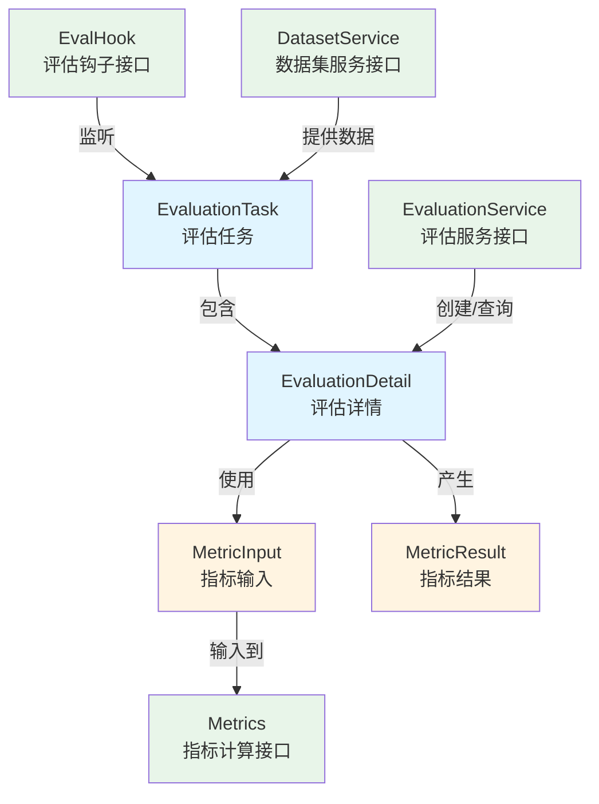

# 评估任务与执行契约 (evaluation_task_and_execution_contracts)

## 概述

想象一下，你刚刚发布了一个新的智能问答系统，但你不确定它的表现如何。它是否能准确找到相关的文档？生成的回答质量如何？这就是 `evaluation_task_and_execution_contracts` 模块要解决的问题——它定义了一套完整的契约，用于评估系统的检索质量和生成质量，就像一位严格但公正的阅卷老师。

这个模块是整个评估系统的"骨架"，它不直接执行评估计算，而是定义了评估任务应该长什么样、评估过程中会产生哪些数据、以及评估服务应该提供哪些能力。通过这些契约，系统的其他部分可以安全地进行评估任务的创建、监控和结果获取，而不需要关心底层的评估算法细节。

在整个系统架构中，这个模块扮演着**标准化契约层**的角色，它不包含具体的评估逻辑实现，而是定义了"评估应该是什么样子"的规范，让不同的实现可以遵循统一的接口进行交互。

## 核心概念与架构

### 主要组件与职责



这个模块的设计遵循了"契约优先"的原则，主要包含三个层次：

1. **数据契约层**：由 `EvaluationTask`、`EvaluationDetail`、`MetricInput`、`MetricResult` 等结构体组成，定义了评估过程中流转的数据格式
2. **服务接口层**：由 `EvaluationService`、`Metrics`、`EvalHook`、`DatasetService` 等接口组成，定义了评估相关服务的能力契约
3. **状态与枚举层**：由 `EvaluationStatue`、`EvalState` 等枚举组成，定义了评估过程中的状态流转

让我们深入理解每个核心组件：

#### EvaluationTask - 评估任务的"身份证"

`EvaluationTask` 是评估任务的核心数据结构，它就像一张任务清单，记录了：
- 任务的基本信息（ID、所属租户、关联的数据集）
- 执行状态（等待中、运行中、成功、失败）
- 进度信息（总数量、已完成数量）
- 时间戳和错误信息

这个结构体的设计体现了"任务跟踪"的思想——通过它，你可以随时了解一个评估任务的生死存亡和进展情况。

#### MetricInput 与 MetricResult - 评估的"输入输出"

`MetricInput` 定义了计算评估指标所需的原材料：
- 检索相关：Ground Truth 和实际检索到的 ID 列表
- 生成相关：生成的文本和标准答案

而 `MetricResult` 则是评估的产物，包含了两大类指标：
- **检索指标**：Precision（精确率）、Recall（召回率）、NDCG、MRR、MAP
- **生成指标**：BLEU、ROUGE 系列

这种分离设计使得指标计算可以独立于任务管理进行——你可以用同一套输入数据测试不同的指标算法。

#### EvaluationService - 评估能力的"契约书"

`EvaluationService` 接口定义了评估系统应该提供的核心能力：
- 创建并启动一个新的评估任务
- 根据任务 ID 查询评估结果

这个接口非常简洁，但它隐藏了背后复杂的评估流程——这正是接口设计的魅力所在：使用者只需要知道"做什么"，而不需要知道"怎么做"。

## 核心组件详解

### EvaluationTask：评估任务的"身份证"

`EvaluationTask` 是评估任务的核心数据结构，它记录了任务的基本信息和执行状态。可以把它想象成评估任务的"身份证"，包含了识别和追踪任务所需的所有关键信息。

```go
type EvaluationTask struct {
    ID        string           // 唯一任务 ID
    TenantID  uint64           // 租户/组织 ID
    DatasetID string           // 评估数据集 ID
    StartTime time.Time        // 任务开始时间
    Status    EvaluationStatue // 当前任务状态
    ErrMsg    string           // 错误信息（如果失败）
    Total     int              // 待评估的总项目数
    Finished  int              // 已完成的项目数
}
```

**设计意图**：
- 分离了任务的基本信息（ID、租户、数据集）和执行状态（状态、进度、错误）
- 包含了进度追踪字段（Total、Finished），支持实时显示评估进度
- 提供了 `String()` 方法，方便日志记录和调试

### EvaluationDetail：评估的"全景视图"

`EvaluationDetail` 提供了评估任务的完整视图，它将任务信息、参数和结果组合在一起。

```go
type EvaluationDetail struct {
    Task   *EvaluationTask // 评估任务信息
    Params *ChatManage     // 评估参数
    Metric *MetricResult   // 评估指标
}
```

**设计意图**：
- 采用组合模式，将不同关注点的信息分离到不同的结构体中
- `Params` 字段使用了 `ChatManage` 类型，这表明评估过程复用了聊天管理的配置
- `Metric` 字段是可选的（`omitempty`），支持在评估完成前返回部分信息

### MetricInput & MetricResult：指标计算的"输入输出"

这两个结构体定义了指标计算的输入和输出格式：

```go
type MetricInput struct {
    RetrievalGT  [][]int // 检索的真实值（Ground Truth）
    RetrievalIDs []int   // 检索到的 ID 列表
    GeneratedTexts string // 生成的文本
    GeneratedGT    string // 生成文本的真实值
}

type MetricResult struct {
    RetrievalMetrics  RetrievalMetrics  // 检索性能指标
    GenerationMetrics GenerationMetrics // 文本生成质量指标
}
```

**设计意图**：
- `MetricInput` 将检索和生成两类评估的输入数据合并在一起，支持同时进行两种评估
- `RetrievalGT` 使用二维数组，支持一个查询对应多个正确结果的情况
- `MetricResult` 清晰地分离了检索和生成两类指标，便于单独使用或组合使用

### 指标结构体：RetrievalMetrics & GenerationMetrics

这两个结构体定义了具体的评估指标：

```go
type RetrievalMetrics struct {
    Precision float64 // 精确率
    Recall    float64 // 召回率
    NDCG3     float64 // 前 3 个结果的归一化折损累计增益
    NDCG10    float64 // 前 10 个结果的归一化折损累计增益
    MRR       float64 // 平均倒数排名
    MAP       float64 // 平均精确率
}

type GenerationMetrics struct {
    BLEU1 float64 // BLEU-1 分数
    BLEU2 float64 // BLEU-2 分数
    BLEU4 float64 // BLEU-4 分数
    ROUGE1 float64 // ROUGE-1 分数
    ROUGE2 float64 // ROUGE-2 分数
    ROUGEL float64 // ROUGE-L 分数
}
```

**设计意图**：
- 涵盖了信息检索和文本生成领域的标准指标
- 对于检索指标，同时提供了基于位置的指标（NDCG、MRR）和基于集合的指标（Precision、Recall、MAP）
- 对于生成指标，同时提供了基于精度的 BLEU 指标和基于召回的 ROUGE 指标，从不同角度评估生成质量

### EvaluationService：评估服务的"契约"

`EvaluationService` 接口定义了评估服务的核心功能：

```go
type EvaluationService interface {
    // 启动新的评估任务
    Evaluation(ctx context.Context, datasetID string, knowledgeBaseID string,
        chatModelID string, rerankModelID string,
    ) (*types.EvaluationDetail, error)
    // 根据任务 ID 获取评估结果
    EvaluationResult(ctx context.Context, taskID string) (*types.EvaluationDetail, error)
}
```

**设计意图**：
- 接口设计简洁，只包含两个核心方法
- `Evaluation` 方法需要的参数涵盖了评估所需的所有关键组件：数据集、知识库、聊天模型、重排序模型
- 两个方法都返回 `EvaluationDetail`，保持了数据结构的一致性
- 使用 `context.Context` 支持超时控制和取消操作

## 设计决策与权衡

### 1. 契约与实现分离

**决策**：将数据结构和服务接口定义在同一个模块中，但与具体实现分离。

**原因**：
- 这样做使得模块可以被其他模块依赖，而不会引入具体实现的依赖
- 便于进行单元测试——你可以轻松地 mock 这些接口
- 支持多个实现共存——比如可以有本地评估实现和远程评估实现

**权衡**：
- ✅ 优点：解耦、可测试性强、灵活性高
- ❌ 缺点：增加了一层抽象，对于简单场景可能显得过度设计

### 2. 状态机设计

**决策**：使用 `EvaluationStatue` 和 `EvalState` 两个枚举来表示不同粒度的状态。

**原因**：
- `EvaluationStatue` 是任务级别的粗粒度状态（待处理、运行中、成功、失败），用于外部展示
- `EvalState` 是评估流程中的细粒度状态（开始、加载 QA 对、向量化、搜索、重排序等），用于内部流程控制和钩子

**权衡**：
- ✅ 优点：职责清晰，外部接口稳定，内部流程灵活
- ❌ 缺点：需要维护两套状态，可能造成状态同步的复杂性

### 3. MetricInput 的设计

**决策**：将检索和生成的输入数据放在同一个结构体中。

**原因**：
- 很多评估场景同时需要检索和生成
- 可以减少接口的数量，简化使用
- 符合"一次评估，多个维度"的使用场景

**权衡**：
- ✅ 优点：使用方便，数据结构统一
- ❌ 缺点：对于只需要检索或只需要生成的场景，会有一些字段冗余

### 4. 钩子机制的引入

**决策**：设计 `EvalHook` 接口，允许在评估流程的不同阶段插入自定义逻辑。

**原因**：
- 评估流程可能需要进行日志记录、进度更新、中间结果保存等操作
- 不希望在核心评估逻辑中掺杂这些横切关注点
- 提供扩展点，让使用者可以自定义评估流程

**权衡**：
- ✅ 优点：符合开闭原则，核心逻辑稳定，扩展性强
- ❌ 缺点：增加了系统复杂度，钩子的执行顺序和错误处理需要仔细设计

## 数据流程

让我们通过一个典型的评估场景，看看数据是如何在这个模块定义的契约中流动的：

1. **任务创建**：调用者通过 `EvaluationService.Evaluation()` 方法创建任务，传入数据集 ID、知识库 ID、模型 ID 等参数
2. **任务初始化**：系统创建 `EvaluationTask` 对象，状态设为 `EvaluationStatuePending`，记录开始时间
3. **数据加载**：`DatasetService.GetDatasetByID()` 加载 QA 对，状态流转到 `StateAfterQaPairs` 和 `StateAfterDataset`
4. **向量化**：对问题和文档进行向量化，状态到 `StateAfterEmbedding`
5. **检索**：执行向量搜索，状态到 `StateAfterVectorSearch`
6. **重排序**：对检索结果进行重排序，状态到 `StateAfterRerank`
7. **生成**：基于检索结果生成回答
8. **指标计算**：收集 `MetricInput`，调用各种 `Metrics.Compute()` 计算指标
9. **结果组装**：将所有指标组装成 `MetricResult`，放入 `EvaluationDetail`
10. **任务完成**：更新 `EvaluationTask` 状态为 `EvaluationStatueSuccess` 或 `EvaluationStatueFailed`

在整个流程中，`EvalHook.Handle()` 会在每个状态转换时被调用，允许进行额外的处理。

## 与其他模块的关系

这个模块是评估系统的核心契约层，它被以下模块依赖：

- **[evaluation_dataset_and_metric_services](../application_services_and_orchestration-evaluation_dataset_and_metric_services.md)**：实现了这里定义的接口，提供具体的评估逻辑
- **[evaluation_and_web_search_handlers](../http_handlers_and_routing-evaluation_and_web_search_handlers.md)**：使用这些契约暴露 HTTP API
- **[metric_models_and_extension_hooks](core_domain_types_and_interfaces-evaluation_dataset_and_metric_contracts-metric_models_and_extension_hooks.md)**：依赖 `MetricInput` 并实现 `Metrics` 接口

同时，它也依赖一些更基础的模块：
- **[dataset_qa_contracts](core_domain_types_and_interfaces-evaluation_dataset_and_metric_contracts-dataset_qa_contracts.md)**：提供 `QAPair` 数据结构
- **[agent_conversation_and_runtime_contracts](core_domain_types_and_interfaces-agent_conversation_and_runtime_contracts.md)**：提供 `ChatManage` 等会话相关结构

## 子模块

这个模块包含以下子模块，每个子模块都有更详细的文档：

- [evaluation_task_definition_contracts](evaluation_task_and_execution_contracts-evaluation_task_definition_contracts.md)：评估任务定义的详细契约
- [evaluation_execution_detail_and_metric_input_contracts](evaluation_task_and_execution_contracts-evaluation_execution_detail_and_metric_input_contracts.md)：评估执行详情和指标输入的契约
- [evaluation_service_execution_interface](evaluation_task_and_execution_contracts-evaluation_service_execution_interface.md)：评估服务执行接口的详细说明

## 注意事项与常见陷阱

### 1. 状态同步问题

**陷阱**：`EvaluationTask.Status` 和 `EvalState` 是两个独立的状态系统，需要确保它们的变更同步。

**建议**：在更新细粒度状态 `EvalState` 时，考虑是否需要同步更新粗粒度状态 `EvaluationTask.Status`。例如，当到达 `StateAfterComplete` 时，应该将任务状态设为 `EvaluationStatueSuccess`。

### 2. MetricInput 的字段填充

**陷阱**：`MetricInput` 包含检索和生成两部分数据，但在某些场景下可能只填充其中一部分。

**建议**：实现 `Metrics` 接口时，要做好字段检查，处理字段缺失的情况。不要假设所有字段都会被填充。

### 3. 错误处理策略

**陷阱**：评估过程中可能会在任何阶段失败，如何处理失败是一个关键设计点。

**建议**：
- 在 `EvaluationTask` 中预留了 `ErrMsg` 字段用于记录错误信息
- 考虑实现"部分结果"机制——即使最终失败，也能返回已经计算完成的指标
- 使用 `EvalHook` 可以在失败时进行清理工作

### 4. 并发安全

**陷阱**：`EvaluationTask` 可能会被多个 goroutine 同时访问和修改（例如一个在执行评估，一个在查询状态）。

**建议**：虽然这个模块只定义了数据结构，但在实现时要考虑并发安全。可以使用互斥锁保护 `EvaluationTask` 的更新，或者使用通道来串行化状态变更。

### 5. 中文分词的全局状态

**注意**：代码中定义了一个全局的 `Jieba` 变量，这是一个中文分词工具的实例。

**建议**：全局变量会带来一些问题，比如难以进行单元测试、可能有并发安全问题。如果可能，考虑将其作为依赖注入到需要的地方，而不是使用全局变量。

### 6. 注意拼写错误

**提示**：`EvaluationStatue` 中的 "Statue" 是拼写错误（应该是 "Status"）。在使用时要注意这个拼写，避免编译错误。

## 总结

`evaluation_task_and_execution_contracts` 模块是评估系统的"定海神针"，它通过清晰的契约定义，将复杂的评估过程拆解为可管理、可扩展的部分。它的设计体现了几个重要的软件设计原则：

- **契约优先**：先定义"是什么"，再考虑"怎么做"
- **关注点分离**：数据结构、服务接口、状态管理各司其职
- **开闭原则**：通过钩子机制提供扩展点，而不需要修改核心代码

理解这个模块，是理解整个评估系统的第一步——它就像一张地图，指引你在评估的迷宫中找到方向。

对于新加入团队的开发者来说，理解这个模块的关键是：
1. 将其视为评估系统的"规范手册"，而不是具体实现
2. 理解各个数据结构的职责和它们之间的关系
3. 掌握如何通过接口与评估系统交互
4. 注意状态管理和错误处理的细节

有了这个基础，你就可以更好地理解整个评估系统的工作原理，并能够有效地使用和扩展评估功能。
