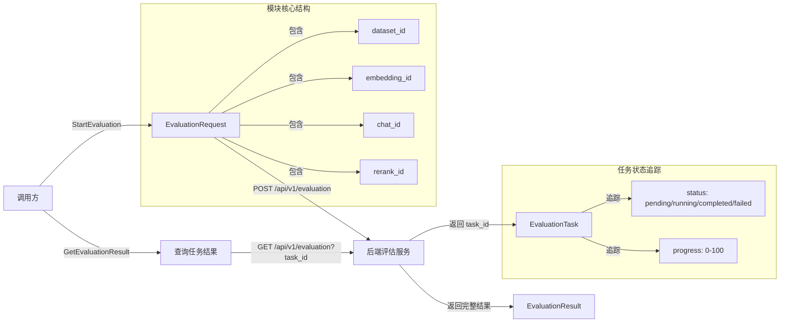

# evaluation_task_definition_and_request

## 概述

想象你是一家餐厅的质量控制主管，需要定期评估不同厨师（模型）的菜品质量。你不能只凭一次品尝就下结论——需要设计一套标准化的测试流程：准备相同的食材（数据集），让不同厨师用各自的技法（embedding/chat/rerank 模型）处理，然后由专业评审团（评估指标）打分。**`evaluation_task_definition_and_request` 模块正是这套质量控制流程的"点单系统"**。

这个模块解决了 RAG 系统中一个核心问题：**如何科学、可重复地评估不同模型组合的性能表现**。在知识问答系统中，embedding 模型、chat 模型和 rerank 模型的选择直接影响最终效果，但凭直觉选择往往不可靠。该模块通过定义标准化的评估任务结构，让开发者能够：

1. **启动评估任务**：指定数据集和待评估的模型组合（embedding + chat + rerank）
2. **追踪任务状态**：从 pending → running → completed/failed 的全生命周期监控
3. **获取量化结果**：得到可比较的指标分数，支持模型选型决策

模块的设计洞察在于**将评估过程异步化**。评估任务可能耗时数分钟甚至数小时（取决于数据集大小），如果采用同步 API 会阻塞调用方。因此模块采用了"提交任务 → 轮询结果"的模式，这与云原生系统中常见的长任务处理模式一致。

## 架构与数据流



### 组件角色说明

| 组件 | 架构角色 | 职责 |
|------|----------|------|
| `EvaluationRequest` | 请求契约 | 定义启动评估任务所需的输入参数，是调用方与评估服务之间的协议 |
| `EvaluationTask` | 任务状态载体 | 承载任务的元数据和运行时状态，支持调用方轮询进度 |
| `EvaluationResult` | 结果聚合器 | 汇总所有评估指标和统计信息，是决策的最终依据 |
| `Client.StartEvaluation` | 任务提交入口 | 将请求转换为 HTTP POST，处理响应解析和错误传播 |
| `Client.GetEvaluationResult` | 结果获取入口 | 通过 task_id 检索完整评估结果，支持异步结果拉取 |

### 数据流追踪

**启动评估任务的完整路径**：

1. 调用方构造 `EvaluationRequest`，填入 `dataset_id` 和三个模型 ID
2. `Client.StartEvaluation` 将请求序列化为 JSON，通过 `doRequest` 发送 POST 到 `/api/v1/evaluation`
3. 后端创建任务记录，返回 `EvaluationTaskResponse{success: true, data: EvaluationTask}`
4. 客户端解析响应，提取 `EvaluationTask` 返回给调用方
5. 调用方获得 `task_id`，可后续用于查询进度

**获取评估结果的路径**：

1. 调用方调用 `Client.GetEvaluationResult(ctx, task_id)`
2. 客户端构造 GET 请求，将 `task_id` 作为查询参数
3. 后端查询任务状态，若已完成则返回 `EvaluationResultResponse`
4. 客户端解析 `Metrics` 映射和 `QueriesStat` 统计数组
5. 调用方根据指标分数进行模型对比决策

## 组件深度解析

### EvaluationRequest

**设计意图**：这是评估任务的"配方"——告诉系统用哪些材料（数据集）和工具（模型）来做评估。

```go
type EvaluationRequest struct {
    DatasetID        string `json:"dataset_id"`   // 评估数据集 ID
    EmbeddingModelID string `json:"embedding_id"` // Embedding 模型 ID
    ChatModelID      string `json:"chat_id"`      // Chat 模型 ID
    RerankModelID    string `json:"rerank_id"`    // Rerank 模型 ID
}
```

**内部机制**：四个字段都是字符串 ID，采用引用而非内联的方式。这种设计基于以下考虑：

- **解耦**：评估服务不需要知道模型的具体配置，只需传递 ID 给下游服务解析
- **可复用**：同一数据集可以用不同模型组合多次评估，无需复制数据
- **原子性**：四个字段共同构成评估的完整上下文，缺一不可（虽然代码未强制校验，但业务逻辑上应如此）

**参数说明**：
- `DatasetID`：指向 [evaluation_dataset_and_metric_services](evaluation_dataset_and_metric_services.md) 中管理的数据集，包含待评估的 QA 对
- `EmbeddingModelID`：指定用于向量化的 embedding 模型，影响检索阶段的效果
- `ChatModelID`：指定用于生成答案的 LLM，影响最终回答质量
- `RerankModelID`：指定用于重排序的模型，影响检索结果的相关性

**返回值与副作用**：本身是纯数据结构，无副作用。但传入 `StartEvaluation` 后会触发后端创建任务记录。

**使用陷阱**：
- 四个 ID 必须指向已存在的资源，否则会返回 400 或 404 错误
- `RerankModelID` 可为空字符串（如果检索流程不使用 rerank），但需确认后端支持
- 模型 ID 的格式需符合 [model_api](model_api.md) 中定义的规范

### EvaluationTask

**设计意图**：这是评估任务的"进度条"——让调用方知道任务是否还在运行、是否出错。

```go
type EvaluationTask struct {
    ID          string `json:"id"`           // 任务唯一标识
    Status      string `json:"status"`       // pending/running/completed/failed
    Progress    int    `json:"progress"`     // 0-100 的整数进度
    DatasetID   string `json:"dataset_id"`   // 关联的数据集 ID
    EmbeddingID string `json:"embedding_id"` // 使用的 embedding 模型
    ChatID      string `json:"chat_id"`      // 使用的 chat 模型
    RerankID    string `json:"rerank_id"`    // 使用的 rerank 模型
    CreatedAt   string `json:"created_at"`   // 创建时间
    CompleteAt  string `json:"complete_at"`  // 完成时间（完成后才有值）
    ErrorMsg    string `json:"error_msg"`    // 失败时的错误信息
}
```

**内部机制**：`Status` 字段是状态机的核心，典型的状态流转为：

```
pending → running → completed
              ↓
            failed
```

`Progress` 字段提供细粒度的进度反馈，对于大数据集尤其重要——调用方可以估算剩余时间。

**设计权衡**：
- **时间字段用字符串而非 time.Time**：这是 SDK 的常见模式，避免时区处理复杂性，将解析责任交给调用方。但这牺牲了类型安全。
- **ErrorMsg 仅在失败时有值**：这是一种"可选字段用空值表示"的 Go 惯用法，但调用方需要主动检查 `Status == "failed"` 后再读取。

**使用模式**：
```go
// 轮询任务状态直到完成
task, _ := client.StartEvaluation(ctx, request)
for task.Status != "completed" && task.Status != "failed" {
    time.Sleep(5 * time.Second)
    task = client.GetEvaluationTask(ctx, task.ID) // 假设有此方法
}
if task.Status == "failed" {
    log.Fatalf("评估失败：%s", task.ErrorMsg)
}
```

### EvaluationResult

**设计意图**：这是评估的"成绩单"——用量化指标告诉你模型组合的表现如何。

```go
type EvaluationResult struct {
    TaskID       string                   `json:"task_id"`       // 关联的任务 ID
    Status       string                   `json:"status"`        // 任务状态
    Progress     int                      `json:"progress"`      // 进度
    TotalQueries int                      `json:"total_queries"` // 总查询数
    TotalSamples int                      `json:"total_samples"` // 总样本数
    Metrics      map[string]float64       `json:"metrics"`       // 评估指标集合
    QueriesStat  []map[string]interface{} `json:"queries_stat"`  // 每个查询的统计
    CreatedAt    string                   `json:"created_at"`    // 创建时间
    CompleteAt   string                   `json:"complete_at"`   // 完成时间
    ErrorMsg     string                   `json:"error_msg"`     // 错误信息
}
```

**核心字段解析**：

- **`Metrics map[string]float64`**：这是最关键的字段，包含如 `precision`、`recall`、`ndcg`、`bleu`、`rouge` 等指标。使用 `map[string]float64` 而非结构体的原因是**指标集合可能随评估类型变化**——检索评估用 precision/recall，生成评估用 bleu/rouge。这种动态性用 map 更灵活。

- **`QueriesStat []map[string]interface{}`**：每个查询的详细统计，用于下钻分析。使用 `interface{}` 是因为不同查询可能有不同的统计维度（如有的有检索命中数，有的有生成 token 数）。

**设计权衡**：
- **灵活性 vs 类型安全**：`Metrics` 用 map 牺牲了编译期类型检查，但支持动态指标扩展。调用方需要知道预期的指标名称。
- **详细统计用 interface{}**：同样是为了灵活性，但调用方需要类型断言才能使用具体值。

**典型指标**（参考 [evaluation_dataset_and_metric_services](evaluation_dataset_and_metric_services.md)）：
- 检索类：`precision@k`、`recall@k`、`ndcg@k`、`mrr`、`map`
- 生成类：`bleu`、`rouge_l`、`rouge_1`

### Client.StartEvaluation

**设计意图**：将评估请求提交到后端的入口点，处理 HTTP 通信细节。

```go
func (c *Client) StartEvaluation(ctx context.Context, request *EvaluationRequest) (*EvaluationTask, error) {
    resp, err := c.doRequest(ctx, http.MethodPost, "/api/v1/evaluation", request, nil)
    if err != nil {
        return nil, err
    }

    var response EvaluationTaskResponse
    if err := parseResponse(resp, &response); err != nil {
        return nil, err
    }

    return &response.Data, nil
}
```

**内部机制**：
1. 调用 `doRequest` 发送 POST 请求，`request` 会被序列化为 JSON body
2. 检查网络错误和 HTTP 状态码错误
3. 使用 `parseResponse` 解析响应体到 `EvaluationTaskResponse` 结构
4. 提取 `Data` 字段返回

**依赖关系**：
- 依赖 `client.Client` 的 `doRequest` 方法处理底层 HTTP 通信
- 依赖 `parseResponse` 函数处理响应解析和错误统一处理

**错误处理**：
- 网络错误（超时、连接失败）直接返回
- HTTP 错误（4xx、5xx）由 `doRequest` 转换为 error
- 响应解析错误（JSON 格式错误）由 `parseResponse` 捕获

### Client.GetEvaluationResult

**设计意图**：通过 task_id 获取评估的完整结果，支持异步任务的结果拉取。

```go
func (c *Client) GetEvaluationResult(ctx context.Context, taskID string) (*EvaluationResult, error) {
    queryParams := url.Values{}
    queryParams.Add("task_id", taskID)

    resp, err := c.doRequest(ctx, http.MethodGet, "/api/v1/evaluation", nil, queryParams)
    if err != nil {
        return nil, err
    }

    var response EvaluationResultResponse
    if err := parseResponse(resp, &response); err != nil {
        return nil, err
    }

    return &response.Data, nil
}
```

**设计特点**：
- 使用 **GET + 查询参数** 而非 RESTful 的 `/api/v1/evaluation/{task_id}`，这与 `StartEvaluation` 的 POST 共用同一 URL 路径
- 这种设计可能源于后端路由的简化，但从 API 设计角度看，`GET /api/v1/evaluation/{task_id}` 更符合 REST 规范

**使用注意**：
- 如果任务尚未完成，返回的 `EvaluationResult` 中 `Status` 可能为 `running`，`Metrics` 可能为空
- 如果任务失败，`ErrorMsg` 字段会包含错误信息

## 依赖关系分析

### 上游依赖（被谁调用）

| 调用方 | 调用场景 | 期望行为 |
|--------|----------|----------|
| [evaluation_endpoint_handler](evaluation_endpoint_handler.md) | HTTP API 层接收评估请求 | 将 HTTP 请求转换为 SDK 调用，处理认证和参数校验 |
| 评估管理 UI | 用户通过界面启动评估 | 轮询任务状态，展示进度条和最终指标 |
| 自动化测试脚本 | CI/CD 中验证模型效果 | 批量启动评估，比较不同模型组合的指标 |

### 下游依赖（调用谁）

| 被调用方 | 调用目的 | 契约依赖 |
|----------|----------|----------|
| [core_client_runtime](core_client_runtime.md) 的 `Client.doRequest` | 发送 HTTP 请求 | 依赖 `doRequest` 的签名和错误处理行为 |
| [evaluation_result_and_task_responses](evaluation_result_and_task_responses.md) | 解析响应结构 | 依赖 `EvaluationTaskResponse` 和 `EvaluationResultResponse` 的字段定义 |
| [evaluation_dataset_and_metric_services](evaluation_dataset_and_metric_services.md) | 后端评估逻辑 | 依赖数据集和模型 ID 的有效性 |

### 数据契约

**请求契约**（`EvaluationRequest` → 后端）：
```json
{
  "dataset_id": "ds_123",
  "embedding_id": "emb_openai_v3",
  "chat_id": "chat_gpt4",
  "rerank_id": "rerank_jina"
}
```

**响应契约**（后端 → `EvaluationTask`）：
```json
{
  "success": true,
  "data": {
    "id": "task_456",
    "status": "pending",
    "progress": 0,
    "dataset_id": "ds_123",
    "embedding_id": "emb_openai_v3",
    "chat_id": "chat_gpt4",
    "rerank_id": "rerank_jina",
    "created_at": "2024-01-15T10:30:00Z",
    "complete_at": "",
    "error_msg": ""
  }
}
```

**关键契约约束**：
- `dataset_id`、`embedding_id`、`chat_id` 必须指向已存在的资源
- `task_id` 在系统内全局唯一
- `status` 字段只能是 `pending`、`running`、`completed`、`failed` 之一

## 设计决策与权衡

### 1. 异步任务模式 vs 同步评估

**选择**：异步任务模式（提交 → 轮询）

**原因**：
- 评估任务可能非常耗时（大数据集需要数小时）
- 同步模式会导致 HTTP 连接超时
- 异步模式支持任务持久化，服务重启后仍可查询结果

**代价**：
- 调用方需要实现轮询逻辑，增加复杂度
- 需要额外的存储来保存任务状态
- 无法实时获取评估进度（除非频繁轮询）

**替代方案**：WebSocket 或 Server-Sent Events 推送进度更新，但会增加后端复杂度。

### 2. 指标用 map[string]float64 vs 结构化类型

**选择**：`map[string]float64`

**原因**：
- 评估类型多样（检索评估、生成评估、混合评估），指标集合不固定
- 新指标可以随时添加，无需修改 SDK 结构定义
- 与后端 [evaluation_dataset_and_metric_services](evaluation_dataset_and_metric_services.md) 的动态指标系统对齐

**代价**：
- 失去编译期类型检查，拼写错误只能在运行时发现
- 调用方需要知道预期的指标名称
- IDE 自动补全无法提供帮助

**缓解措施**：在文档中明确列出常见指标名称，或提供指标常量定义。

### 3. 时间字段用字符串 vs time.Time

**选择**：字符串

**原因**：
- 避免时区处理复杂性
- 与后端 JSON 序列化格式保持一致
- Go 的 `time.Time` 序列化格式不直观（包含纳秒和时区）

**代价**：
- 调用方需要手动解析时间字符串
- 无法直接进行时间计算（如 `CompleteAt - CreatedAt`）

**建议**：在调用方封装解析逻辑：
```go
func (t *EvaluationTask) Duration() (time.Duration, error) {
    start, _ := time.Parse(time.RFC3339, t.CreatedAt)
    end, _ := time.Parse(time.RFC3339, t.CompleteAt)
    return end.Sub(start), nil
}
```

### 4. GET 查询参数 vs RESTful 路径参数

**选择**：`GET /api/v1/evaluation?task_id=xxx`

**原因**：
- 与 `StartEvaluation` 共用同一 URL 路径，简化后端路由
- 可能是历史遗留设计

**代价**：
- 不符合 REST 最佳实践（资源应该用路径标识）
- 日志中查询参数可能被截断

**建议**：未来版本可考虑改为 `GET /api/v1/evaluation/{task_id}`。

## 使用指南与示例

### 基本使用流程

```go
// 1. 构造评估请求
request := &client.EvaluationRequest{
    DatasetID:        "ds_benchmark_2024",
    EmbeddingModelID: "emb_openai_text3",
    ChatModelID:      "chat_gpt4_turbo",
    RerankModelID:    "rerank_jina_v2",
}

// 2. 启动评估任务
task, err := client.StartEvaluation(ctx, request)
if err != nil {
    log.Fatalf("启动评估失败：%v", err)
}
log.Printf("评估任务已创建：%s", task.ID)

// 3. 轮询任务状态
for {
    result, err := client.GetEvaluationResult(ctx, task.ID)
    if err != nil {
        log.Printf("查询结果失败：%v", err)
        continue
    }
    
    if result.Status == "completed" {
        log.Printf("评估完成！进度：%d%%", result.Progress)
        log.Printf("指标结果：%v", result.Metrics)
        break
    } else if result.Status == "failed" {
        log.Fatalf("评估失败：%s", result.ErrorMsg)
    }
    
    log.Printf("评估进行中... 进度：%d%%", result.Progress)
    time.Sleep(10 * time.Second)
}
```

### 模型对比评估

```go
// 对比不同 embedding 模型的效果
embeddingModels := []string{"emb_openai_v3", "emb_jina_v2", "emb_bge_large"}
results := make(map[string]map[string]float64)

for _, embID := range embeddingModels {
    request := &client.EvaluationRequest{
        DatasetID:        "ds_benchmark",
        EmbeddingModelID: embID,
        ChatModelID:      "chat_gpt4",
        RerankModelID:    "rerank_jina",
    }
    
    task, _ := client.StartEvaluation(ctx, request)
    
    // 等待完成...
    result, _ := waitForCompletion(ctx, client, task.ID)
    results[embID] = result.Metrics
}

// 输出对比结果
for embID, metrics := range results {
    fmt.Printf("%s: precision=%.3f, recall=%.3f, ndcg=%.3f\n", 
        embID, metrics["precision"], metrics["recall"], metrics["ndcg"])
}
```

### 配置选项

| 配置项 | 说明 | 默认值 |
|--------|------|--------|
| `ctx` 超时时间 | 控制单次请求的超时 | 建议设置 30 秒 |
| 轮询间隔 | 查询任务状态的时间间隔 | 建议 5-10 秒 |
| 最大轮询次数 | 防止无限轮询 | 建议 100-200 次 |

## 边界情况与陷阱

### 1. 任务永远不完成

**场景**：后端服务崩溃或任务卡死，`Status` 一直为 `running`。

**应对**：
```go
maxRetries := 200
for i := 0; i < maxRetries; i++ {
    result, err := client.GetEvaluationResult(ctx, taskID)
    if err != nil {
        // 处理网络错误
        continue
    }
    if result.Status == "completed" || result.Status == "failed" {
        break
    }
    time.Sleep(10 * time.Second)
}
if i == maxRetries {
    log.Fatal("评估任务超时，可能卡死")
}
```

### 2. 部分指标缺失

**场景**：`Metrics` map 中某些预期指标不存在（如只返回了 `precision` 但没有 `recall`）。

**原因**：评估类型不同，指标集合可能不同。

**应对**：使用安全的 map 访问：
```go
precision, ok := result.Metrics["precision"]
if !ok {
    log.Warn("precision 指标缺失")
}
```

### 3. 并发轮询同一任务

**场景**：多个 goroutine 同时调用 `GetEvaluationResult` 查询同一 task_id。

**影响**：通常无问题（读操作），但可能触发后端速率限制。

**建议**：使用单例或 channel 串行化对同一 task_id 的查询。

### 4. 时区混淆

**场景**：`CreatedAt` 和 `CompleteAt` 是字符串，不同服务可能使用不同时区。

**建议**：统一按 UTC 解析：
```go
t, _ := time.Parse(time.RFC3339, task.CreatedAt) // 假设后端返回 RFC3339 格式
```

### 5. 空 RerankModelID 的处理

**场景**：检索流程不使用 rerank 模型时，`RerankModelID` 应传什么？

**建议**：传空字符串 `""`，但需确认后端支持（某些后端可能要求必须传有效 ID）。

## 扩展点

### 添加自定义指标

后端 [evaluation_dataset_and_metric_services](evaluation_dataset_and_metric_services.md) 支持通过 `EvalHook` 接口注入自定义指标。SDK 层无需修改，因为 `Metrics` 是 `map[string]float64`，新指标会自动出现在返回结果中。

### 支持批量评估

当前 API 一次只能启动一个评估任务。如需批量评估（如网格搜索超参数），调用方需自行循环调用 `StartEvaluation`。

### 结果缓存

SDK 层未实现结果缓存。如需避免重复查询同一已完成任务的结果，调用方可自行实现：
```go
var cache = make(map[string]*client.EvaluationResult)

func getCachedResult(ctx context.Context, client *client.Client, taskID string) (*client.EvaluationResult, error) {
    if result, ok := cache[taskID]; ok {
        return result, nil
    }
    result, err := client.GetEvaluationResult(ctx, taskID)
    if err != nil {
        return nil, err
    }
    if result.Status == "completed" || result.Status == "failed" {
        cache[taskID] = result // 只缓存终态结果
    }
    return result, nil
}
```

## 相关模块

- [evaluation_result_and_task_responses](evaluation_result_and_task_responses.md) — 评估响应结构定义
- [evaluation_dataset_and_metric_services](evaluation_dataset_and_metric_services.md) — 评估数据集和指标计算服务
- [evaluation_endpoint_handler](evaluation_endpoint_handler.md) — HTTP 评估端点处理器
- [core_client_runtime](core_client_runtime.md) — SDK 客户端运行时
- [model_api](model_api.md) — 模型管理 API（获取可用的模型 ID）
