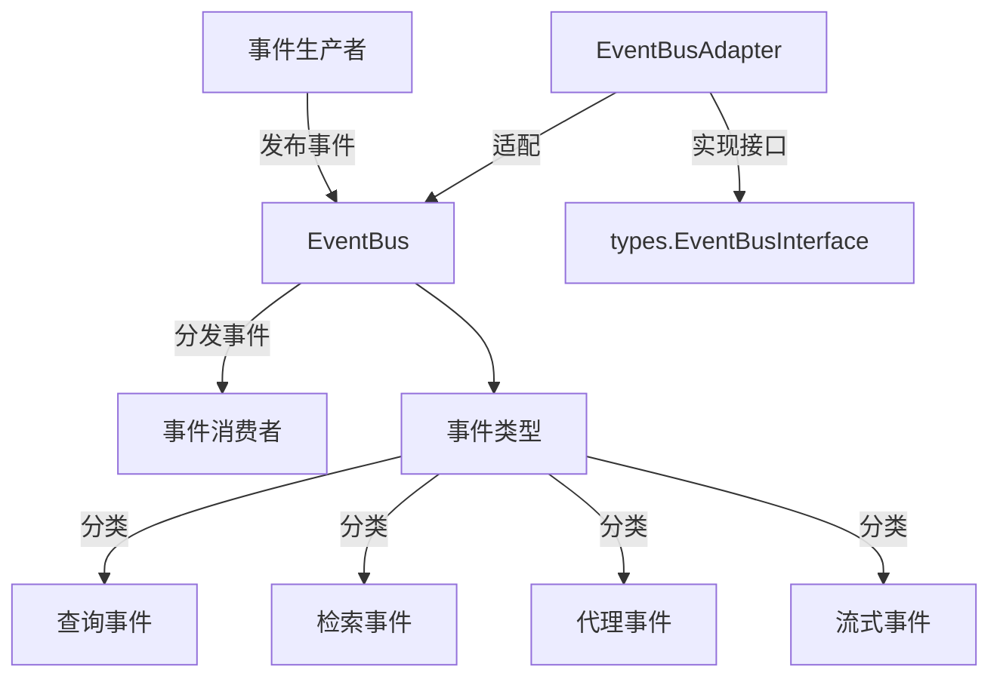

# Event Bus and Agent Runtime Event Contracts

## 概述

这个模块是系统的事件总线基础设施和代理运行时事件契约。它提供了一个灵活的发布-订阅系统，解耦了系统各个组件，实现了松耦合的通信，特别适用于代理运行时的事件流处理。

## 架构设计

### 核心组件

1. **EventBus**: 事件总线核心实现，管理事件的发布和订阅
2. **Event**: 事件数据结构，包含事件ID、类型、会话ID等核心信息
3. **EventBusAdapter**: 适配器，将EventBus适配为系统接口
4. **事件数据结构**: 各种类型的事件数据定义，如QueryData、RetrievalData等

## 设计决策

### 同步与异步模式
- **选择**: 同时支持同步和异步两种模式
- **原因**: 灵活应对不同场景需求
- **权衡**: 
  - 同步模式保证了事件处理的顺序性，但可能阻塞主线程
  - 异步模式提高了系统响应性，但需要注意资源管理和错误处理

### 事件数据结构设计
- **选择**: 使用统一的Event结构+具体数据结构
- **原因**: 保持事件系统的一致性和扩展性
- **权衡**: 
  - 统一结构便于处理，但需要类型断言
  - 具体数据结构保证了类型安全

### 适配器模式的使用
- **选择**: 使用EventBusAdapter将EventBus适配为types.EventBusInterface
- **原因**: 避免循环依赖，提高模块解耦
- **权衡**: 
  - 增加了一层抽象，但提高了系统的灵活性
  - 便于测试和替换实现

## 子模块说明

这个模块包含以下子模块：

- [事件总线核心契约](platform_infrastructure_and_runtime-event_bus_and_agent_runtime_event_contracts-event_bus_core_contracts.md)
- [会话和聊天事件负载](platform_infrastructure_and_runtime-event_bus_and_agent_runtime_event_contracts-session_and_chat_event_payloads.md)
- [检索和结果融合事件负载](platform_infrastructure_and_runtime-event_bus_and_agent_runtime_event_contracts-retrieval_and_result_fusion_event_payloads.md)
- [代理规划推理和完成事件负载](platform_infrastructure_and_runtime-event_bus_and_agent_runtime_event_contracts-agent_planning_reasoning_and_completion_event_payloads.md)
- [代理工具调用结果和引用事件负载](platform_infrastructure_and_runtime-event_bus_and_agent_runtime_event_contracts-agent_tool_calls_results_and_references_event_payloads.md)

## 与其他模块的依赖

这个模块是系统的基础设施，被多个上层模块依赖：

- [核心域类型和接口](core_domain_types_and_interfaces.md) - 定义了事件总线接口
- [聊天管道插件和流程](application_services_and_orchestration-chat_pipeline_plugins_and_flow.md) - 使用事件总线进行流程编排
- [代理运行时和工具](agent_runtime_and_tools.md) - 发布和订阅代理运行时事件
