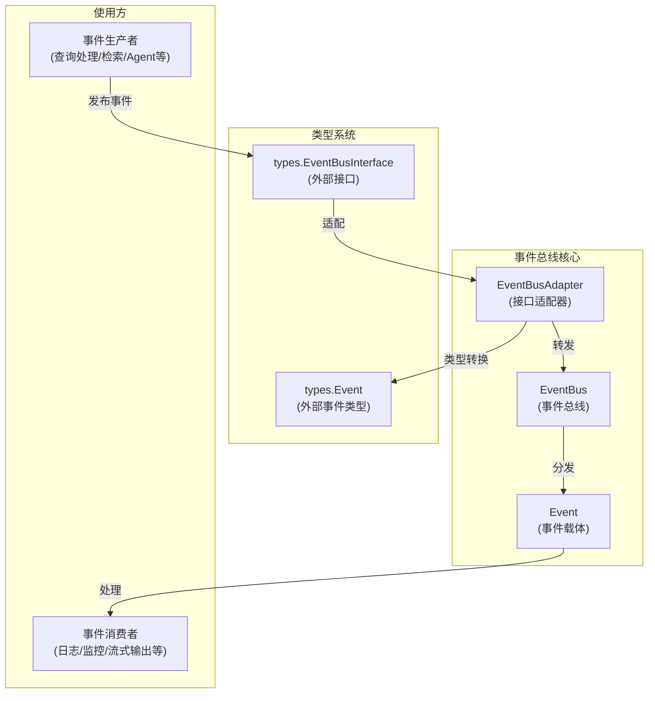
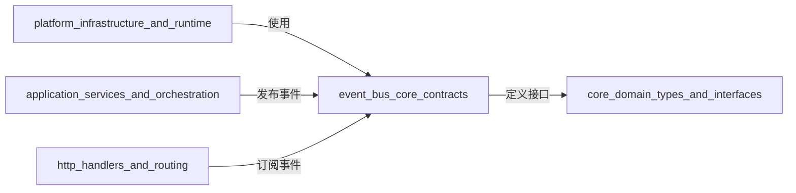

# event_bus_core_contracts 模块技术深度解析

## 1. 为什么需要这个模块？

想象一个复杂的对话系统：当用户发送一个查询时，系统需要依次完成查询验证、预处理、改写、检索、重排序、合并，最后生成响应。如果这些组件直接相互调用，代码会变成紧密耦合的"意大利面条"——你修改一个组件可能会破坏另一个，测试每个组件都需要搭建整个系统。

`event_bus_core_contracts` 模块解决了这个问题。它提供了一个**事件总线**，让系统组件之间通过事件进行通信，而不是直接依赖。就像广播电台：发送者发布消息，接收者订阅感兴趣的消息类型，两者互不相识。

这个模块的核心价值在于：
- **解耦**：生产者和消费者互不依赖，降低系统复杂度
- **可观测性**：所有事件都流经总线，可以轻松添加监控、日志和追踪
- **灵活性**：可以动态添加/移除事件处理器，无需修改核心逻辑
- **一致性**：提供统一的事件契约，确保整个系统对事件有相同的理解

## 2. 核心抽象和心智模型

这个模块的设计围绕三个核心概念构建：

### 2.1 事件 (Event) - 系统中的"消息"

`Event` 结构体是系统中所有事件的统一载体。把它想象成一个**信封**：
- `ID`：信封编号（自动生成UUID），用于追踪
- `Type`：信件类型（如"query.received"），告诉接收者这是什么内容
- `SessionID`：会话标识，关联到具体的对话
- `Data`：信件内容，可以是任意类型的数据
- `Metadata`：附言，额外的元数据
- `RequestID`：请求标识，用于追踪整个请求链路

### 2.2 事件总线 (EventBus) - 系统中的"邮局"

`EventBus` 是事件的中央枢纽。它的职责是：
- 接收事件发布（`Emit`）
- 维护事件类型到处理器的映射
- 将事件分发给所有订阅了该类型的处理器

它支持两种工作模式：
- **同步模式**：事件处理器按顺序执行，一个失败会阻止后续执行
- **异步模式**：事件处理器在后台 goroutine 中执行，不阻塞发布者

### 2.3 适配器 (EventBusAdapter) - 系统中的"翻译官"

`EventBusAdapter` 解决了一个关键问题：**避免循环依赖**。它将 `internal/event` 包中的 `EventBus` 适配到 `types.EventBusInterface` 接口，让其他模块可以通过接口依赖事件总线，而不是直接依赖具体实现。

## 3. 架构概览



### 数据流向详解

1. **事件发布流程**：
   - 生产者创建 `types.Event`（外部事件类型）
   - 通过 `types.EventBusInterface.Emit()` 发布
   - `EventBusAdapter` 将其转换为内部 `Event` 类型
   - `EventBus` 接收事件并分发给所有注册的处理器

2. **事件订阅流程**：
   - 消费者通过 `types.EventBusInterface.On()` 注册处理器
   - `EventBusAdapter` 将外部处理器包装为内部处理器
   - `EventBus` 保存处理器映射关系

3. **事件处理流程**：
   - 如果是同步模式：按顺序执行处理器，错误会中断
   - 如果是异步模式：在后台 goroutine 中执行所有处理器
   - `EmitAndWait` 模式：等待所有处理器完成，无论同步还是异步

## 4. 关键设计决策

### 4.1 同步 vs 异步模式的选择

**决策**：提供两种模式，默认为同步模式

**权衡分析**：
- **同步模式**：
  - ✅ 优点：错误可以立即传播，确保处理完成后再继续
  - ❌ 缺点：阻塞发布者，一个慢处理器会拖慢整个流程
  - 适用场景：关键路径处理，需要确保处理完成

- **异步模式**：
  - ✅ 优点：不阻塞发布者，提高响应速度
  - ❌ 缺点：错误被忽略，无法保证处理顺序
  - 适用场景：日志、监控等非关键路径

**为什么默认同步**：因为在对话系统中，很多事件处理是关键路径的一部分（如流式输出），需要确保处理完成。

### 4.2 适配器模式解决循环依赖

**决策**：使用 `EventBusAdapter` 将内部实现适配到外部接口

**背景**：
- 事件总线需要被很多模块使用
- 但事件总线内部也可能依赖某些类型
- 直接依赖会造成循环依赖：`types` → `event` → `types`

**解决方案**：
- `types` 包定义接口 `EventBusInterface`
- `event` 包实现具体功能
- `EventBusAdapter` 桥接两者，进行类型转换

**权衡**：
- ✅ 优点：完美解决循环依赖，符合依赖倒置原则
- ❌ 缺点：增加了一层间接，有轻微的性能开销

### 4.3 事件类型的集中定义

**决策**：在 `event.go` 中集中定义所有事件类型常量

**原因**：
- 确保事件类型的一致性，避免拼写错误
- 提供单一真相源，方便查找所有可用事件
- 便于文档化和理解系统中的事件流

**事件类型分类**：
- 查询处理事件：`query.received`, `query.validated`, `query.rewrite` 等
- 检索事件：`retrieval.start`, `retrieval.vector`, `retrieval.complete` 等
- Agent 事件：`agent.query`, `agent.plan`, `agent.tool` 等
- 流式事件：`thought`, `tool_call`, `tool_result`, `final_answer` 等

### 4.4 错误处理策略

**决策**：
- 同步模式：返回第一个错误，中断后续处理
- 异步模式：忽略所有错误
- `EmitAndWait`：返回第一个错误，但不中断其他处理器

**权衡分析**：
- 同步模式：确保处理的可靠性，适合关键操作
- 异步模式：追求性能，适合非关键操作（如日志）
- `EmitAndWait`：平衡可靠性和并发性

## 5. 子模块概览

本模块包含以下子模块，各自承担特定职责：

### 5.1 event_message_contracts
定义事件消息的核心契约，包括事件类型、事件结构等。这是整个事件系统的基础。

[查看详细文档](event_bus_core_contracts-event_message_contracts.md)

### 5.2 event_bus_core_runtime
实现事件总线的核心运行时逻辑，包括事件分发、处理器管理等。

[查看详细文档](event_bus_core_contracts-event_bus_core_runtime.md)

### 5.3 event_bus_adapter_bridge
实现适配器模式，解决循环依赖问题，提供类型安全的事件总线接口。

[查看详细文档](event_bus_core_contracts-event_bus_adapter_bridge.md)

## 6. 与其他模块的关系

### 6.1 依赖关系



### 6.2 关键交互点

1. **与 [core_domain_types_and_interfaces](core_domain_types_and_interfaces.md) 的关系**：
   - 事件总线适配到 `types.EventBusInterface`
   - 使用 `types.EventType` 和 `types.Event` 作为外部契约

2. **与 [application_services_and_orchestration](application_services_and_orchestration.md) 的关系**：
   - 聊天管道、检索服务等是主要的事件生产者
   - 它们在关键节点发布事件，如查询到达、检索开始等

3. **与 [http_handlers_and_routing](http_handlers_and_routing.md) 的关系**：
   - 流式输出端点是主要的事件消费者
   - 它们订阅 Agent 思考、工具调用等事件，实时推送给客户端

## 7. 使用指南和最佳实践

### 7.1 创建事件总线

```go
// 创建同步事件总线（默认）
bus := event.NewEventBus()

// 创建异步事件总线
asyncBus := event.NewAsyncEventBus()

// 转换为接口类型（推荐）
eventBus := bus.AsEventBusInterface()
```

### 7.2 发布事件

```go
// 创建事件
evt := types.Event{
    Type:      types.EventType(event.EventQueryReceived),
    SessionID: "session-123",
    Data:      map[string]interface{}{"query": "你好"},
    RequestID: "request-456",
}

// 发布事件（同步模式会等待所有处理器完成）
err := eventBus.Emit(ctx, evt)
if err != nil {
    // 处理错误
}

// 发布并等待（无论同步异步都等待）
err = eventBus.EmitAndWait(ctx, evt)
```

### 7.3 订阅事件

```go
// 订阅事件
eventBus.On(types.EventType(event.EventAgentThought), func(ctx context.Context, evt types.Event) error {
    // 处理 Agent 思考事件
    thought, ok := evt.Data.(string)
    if !ok {
        return fmt.Errorf("invalid data type")
    }
    log.Printf("Agent 思考: %s", thought)
    return nil
})
```

### 7.4 最佳实践

1. **事件类型安全**：
   - 始终使用预定义的事件类型常量，不要手动拼写字符串
   - 对于自定义事件，考虑在集中位置定义

2. **错误处理**：
   - 同步模式下，确保处理器返回的错误有意义
   - 异步模式下，在处理器内部处理错误（如记录日志）

3. **性能考虑**：
   - 关键路径使用同步模式，确保可靠性
   - 非关键路径使用异步模式，提高响应速度
   - 避免在处理器中执行耗时操作

4. **可观测性**：
   - 始终填充 `RequestID` 和 `SessionID`，便于追踪
   - 在 `Metadata` 中添加有用的上下文信息

## 8. 常见陷阱和注意事项

### 8.1 循环依赖陷阱

**问题**：直接依赖 `event` 包可能导致循环依赖

**解决方案**：
- 始终通过 `types.EventBusInterface` 接口依赖
- 使用 `AsEventBusInterface()` 方法获取接口实例

### 8.2 异步模式的错误丢失

**问题**：异步模式下，处理器的错误会被忽略

**解决方案**：
- 在异步处理器内部记录错误
- 对于需要可靠性的操作，使用同步模式或 `EmitAndWait`

### 8.3 事件处理器的并发安全

**问题**：多个处理器可能并发访问共享数据

**解决方案**：
- 确保事件处理器是线程安全的
- 使用互斥锁保护共享状态
- 避免在处理器中修改事件数据

### 8.4 事件数据的类型断言

**问题**：事件 `Data` 是 `interface{}`，类型断言可能失败

**解决方案**：
- 始终检查类型断言的 `ok` 返回值
- 为常用事件类型定义辅助函数进行类型安全的访问

### 8.5 事件总线的生命周期

**问题**：忘记清理处理器可能导致内存泄漏

**解决方案**：
- 使用 `Off()` 方法移除不需要的处理器
- 在适当的时机调用 `Clear()` 清理所有处理器
- 确保事件总线的生命周期与应用程序生命周期匹配

## 9. 总结

`event_bus_core_contracts` 模块是整个系统的"神经系统"，它通过事件驱动架构解耦了系统组件，提供了灵活、可观测的通信机制。它的设计体现了几个重要的软件工程原则：

- **依赖倒置**：通过接口和适配器解耦
- **开闭原则**：对扩展开放（添加新事件/处理器），对修改关闭
- **单一职责**：每个组件只做一件事

理解这个模块的关键是把握"事件总线 = 邮局"的心智模型，以及同步/异步模式的权衡。正确使用这个模块可以让系统更灵活、更可测试、更易于理解。
