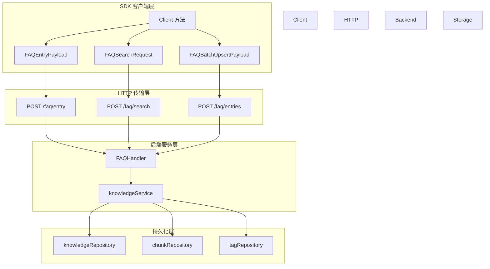

# FAQ API 模块技术深度解析

## 概述：为什么需要这个模块？

想象一下，你正在构建一个企业级知识库系统，用户每天都会提出大量重复性问题。如果每次都要从海量文档中检索答案，效率低下且体验糟糕。**FAQ API 模块**的核心价值在于：它提供了一套结构化的问答对管理机制，让系统能够"记住"那些已经被验证过的高质量答案，并在用户提问时优先匹配这些标准答案。

这个模块不是简单的 CRUD 封装——它解决的是**知识复用与检索效率**的根本矛盾。 naive 的方案可能是把所有问答存成普通文档，但这会带来三个问题：

1. **检索精度低**：普通文档检索无法区分"标准问题"和"相似问法"，导致匹配混乱
2. **批量导入困难**：企业迁移历史 FAQ 数据时，需要异步处理成千上万条记录，同步操作会超时
3. **运营效率低**：管理员需要批量启用/禁用、打标签、调整推荐状态，逐条操作不可接受

`faq_api` 模块的设计洞察在于：**FAQ 是介于结构化数据和非结构化知识之间的特殊形态**——它有明确的字段（问题、答案、标签），但又要支持语义搜索和混合检索。因此，模块采用了"同步 CRUD + 异步批量 + 混合搜索"的三层架构。

---

## 架构与数据流



### 组件角色说明

| 组件 | 架构角色 | 职责 |
|------|----------|------|
| `Client` 方法 | API 网关 | 将业务操作转换为 HTTP 请求，处理序列化/反序列化 |
| `FAQEntry` / `FAQEntryPayload` | 领域模型 | 定义 FAQ 条目的数据结构和验证规则 |
| `FAQBatchUpsertPayload` | 批量操作契约 | 封装异步导入的请求参数和模式选择 |
| `FAQSearchRequest` | 检索契约 | 定义混合搜索的阈值、优先级标签、推荐过滤等参数 |
| `FAQImportProgress` | 任务状态模型 | 跟踪异步导入任务的进度、成功/失败明细 |

### 数据流动路径

以**批量导入 FAQ**为例，数据流经以下组件：

1. 调用方构造 `FAQBatchUpsertPayload`，指定 `Mode`（append/replace）、`Entries` 列表、可选的 `DryRun` 标志
2. `Client.UpsertFAQEntries()` 将 payload 序列化为 JSON，发送 `POST /api/v1/knowledge-bases/{kb_id}/faq/entries`
3. 后端 [`FAQHandler`](../http_handlers_and_routing/http_handlers_and_routing.md) 接收请求，委托给 [`knowledgeService`](../application_services_and_orchestration/application_services_and_orchestration.md)
4. 服务层启动异步任务，返回 `FAQTaskPayload`（含 `TaskID`）
5. 调用方轮询 `GetFAQImportProgress(TaskID)` 获取进度，直到 `Status == "completed"`

这个设计的关键在于**异步解耦**：批量导入可能耗时数分钟，如果同步等待，HTTP 连接会超时。通过任务 ID 轮询机制，客户端可以灵活选择等待策略（轮询、WebSocket 推送、或事后查询）。

---

## 核心组件深度解析

### 1. FAQEntry：领域模型的核心

```go
type FAQEntry struct {
    ID                int64     `json:"id"`
    ChunkID           string    `json:"chunk_id"`
    KnowledgeID       string    `json:"knowledge_id"`
    KnowledgeBaseID   string    `json:"knowledge_base_id"`
    TagID             int64     `json:"tag_id"`
    TagName           string    `json:"tag_name"`
    IsEnabled         bool      `json:"is_enabled"`
    IsRecommended     bool      `json:"is_recommended"`
    StandardQuestion  string    `json:"standard_question"`
    SimilarQuestions  []string  `json:"similar_questions"`
    NegativeQuestions []string  `json:"negative_questions"`
    Answers           []string  `json:"answers"`
    AnswerStrategy    string    `json:"answer_strategy"`
    IndexMode         string    `json:"index_mode"`
    UpdatedAt         time.Time `json:"updated_at"`
    CreatedAt         time.Time `json:"created_at"`
    Score             float64   `json:"score,omitempty"`
    MatchType         string    `json:"match_type,omitempty"`
    MatchedQuestion   string    `json:"matched_question,omitempty"`
}
```

**设计意图**：`FAQEntry` 是 FAQ 条目的**完整运行时表示**，既包含持久化字段（如 `ID`、`StandardQuestion`），也包含检索时动态计算的字段（如 `Score`、`MatchType`、`MatchedQuestion`）。

**关键字段解析**：

- `SimilarQuestions`：这是 FAQ 区别于普通问答的关键。用户可能用不同方式问同一个问题（"如何重置密码" vs "密码忘了怎么办"），这个字段允许维护一个问法变体列表，检索时任意变体匹配都算命中。
  
- `NegativeQuestions`：**负例问题**是一个精妙的设计。有些问题看起来相似但语义不同（"如何取消订阅" vs "如何暂停订阅"），通过显式记录负例，可以在检索时降低误匹配概率。

- `IsEnabled` / `IsRecommended`：这两个布尔字段支持**运营干预**。`IsEnabled` 控制条目是否参与检索（临时下架有问题的答案），`IsRecommended` 控制是否在多个匹配结果中优先展示（运营人工标注的高质量答案）。

- `MatchedQuestion`：这是**搜索响应时动态填充**的字段。当用户搜索"密码重置"时，系统可能命中某个条目的相似问法"忘记密码怎么处理"，这个字段会记录实际命中的问法文本，帮助前端高亮显示匹配原因。

**使用注意**：`FAQEntry` 主要用于**读取场景**（列表、搜索、详情）。创建/更新时应使用 `FAQEntryPayload`，后者对字段做了更严格的区分（必填/可选）。

---

### 2. FAQEntryPayload：写入契约的精心设计

```go
type FAQEntryPayload struct {
    ID                *int64   `json:"id,omitempty"`
    StandardQuestion  string   `json:"standard_question"`
    SimilarQuestions  []string `json:"similar_questions,omitempty"`
    NegativeQuestions []string `json:"negative_questions,omitempty"`
    Answers           []string `json:"answers"`
    AnswerStrategy    *string  `json:"answer_strategy,omitempty"`
    TagID             int64    `json:"tag_id,omitempty"`
    TagName           string   `json:"tag_name,omitempty"`
    TagName           string   `json:"tag_name,omitempty"`
    IsEnabled         *bool    `json:"is_enabled,omitempty"`
    IsRecommended     *bool    `json:"is_recommended,omitempty"`
}
```

**为什么 Payload 和 Entry 要分开？**

这是一个典型的**命令 - 查询分离（CQRS）**模式。`FAQEntry` 是查询模型，包含所有字段（包括动态计算的）；`FAQEntryPayload` 是命令模型，只包含用户可控制的输入字段。

**指针字段的语义**：注意 `ID`、`AnswerStrategy`、`IsEnabled`、`IsRecommended` 都是指针类型。这不是偶然——指针可以区分"未设置"和"设置为零值"：

- `IsEnabled: nil` 表示"不修改这个字段"（部分更新）
- `IsEnabled: false` 表示"显式禁用这个条目"

这种设计让同一个 Payload 结构可以同时用于创建（所有字段有效）和更新（只传要改的字段）。

**数据迁移支持**：`ID` 字段注释说明它用于"数据迁移，必须小于自增起始值 100000000"。这是一个务实的妥协——正常情况下 ID 由数据库自增，但迁移历史数据时需要保留原 ID 以保持引用完整性。

---

### 3. FAQBatchUpsertPayload：异步批量的契约

```go
type FAQBatchUpsertPayload struct {
    Entries     []FAQEntryPayload `json:"entries"`
    Mode        string            `json:"mode"`
    KnowledgeID string            `json:"knowledge_id,omitempty"`
    TaskID      string            `json:"task_id,omitempty"`
    DryRun      bool              `json:"dry_run,omitempty"`
}
```

**设计权衡**：为什么批量导入必须是异步的？

| 方案 | 优点 | 缺点 |
|------|------|------|
| 同步处理 | 简单，立即知道结果 | 大文件会超时，阻塞连接，无法显示进度 |
| 异步任务 | 支持大文件，可轮询进度，可重试 | 需要额外的任务状态接口，客户端逻辑复杂 |

系统选择了异步方案，因为**企业 FAQ 导入通常是千级以上的批量操作**，同步处理不可行。

**Mode 字段的行为差异**：

- `"append"`：追加模式，新条目添加到现有列表，重复问题会创建新记录
- `"replace"`：替换模式，先清空现有条目再导入（谨慎使用！）

**DryRun 的价值**：这是一个**防御性设计**。在正式导入前，设置 `DryRun: true` 可以验证数据格式、检测重复问题、预览失败条目，而不会实际写入数据库。对于一次性导入上万条记录的场景，这能避免"导入一半发现格式错误"的灾难。

---

### 4. FAQSearchRequest：混合检索的控制中心

```go
type FAQSearchRequest struct {
    QueryText            string  `json:"query_text"`
    VectorThreshold      float64 `json:"vector_threshold"`
    MatchCount           int     `json:"match_count"`
    FirstPriorityTagIDs  []int64 `json:"first_priority_tag_ids"`
    SecondPriorityTagIDs []int64 `json:"second_priority_tag_ids"`
    OnlyRecommended      bool    `json:"only_recommended"`
}
```

**混合检索的含义**：FAQ 搜索不是简单的关键词匹配，而是**向量相似度 + 规则过滤**的混合：

1. 首先计算查询文本与所有 FAQ 问题的向量相似度
2. 过滤掉相似度低于 `VectorThreshold` 的条目
3. 按标签优先级重排序（第一优先级标签 > 第二优先级 > 无标签）
4. 如果 `OnlyRecommended` 为真，进一步过滤掉非推荐条目
5. 返回前 `MatchCount` 条结果

**标签优先级的业务场景**：假设一个知识库有多个产品线的 FAQ。用户搜索"如何退款"时，系统可以：
- 将用户当前订阅的产品标签设为 `FirstPriorityTagIDs`
- 将相关产品线标签设为 `SecondPriorityTagIDs`
- 确保搜索结果优先展示用户关心的产品线答案

**阈值调优建议**：`VectorThreshold` 的典型值在 0.6-0.8 之间：
- 太低（<0.5）：会返回语义不相关的结果
- 太高（>0.85）：可能漏掉表述不同但语义匹配的问题

---

### 5. FAQImportProgress：异步任务的状态机

```go
type FAQImportProgress struct {
    TaskID           string
    Status           string  // "pending" | "processing" | "completed" | "failed"
    Progress         int     // 百分比 0-100
    Total            int
    Processed        int
    SuccessCount     int
    FailedCount      int
    FailedEntries    []FAQFailedEntry
    SuccessEntries   []FAQSuccessEntry
    FailedEntriesURL string  // 失败太多时的 CSV 下载链接
    // ...
}
```

**状态机设计**：任务状态流转是线性的：`pending → processing → completed/failed`。客户端轮询时应检查 `Status` 字段，而不是仅依赖 `Progress`（因为某些阶段进度可能停滞但任务仍在运行）。

**失败处理策略**：`FailedEntries` 数组只在失败条目较少时直接返回。如果失败超过阈值（如 1000 条），系统会生成 CSV 文件并通过 `FailedEntriesURL` 提供下载。这是一个**内存保护机制**——避免单次响应携带过大数据。

**使用模式**：

```go
// 轮询直到任务完成
for {
    progress, err := client.GetFAQImportProgress(ctx, taskID)
    if err != nil {
        // 处理错误
    }
    
    if progress.Status == "completed" || progress.Status == "failed" {
        // 处理最终结果
        break
    }
    
    // 显示进度：progress.Progress%
    time.Sleep(2 * time.Second)
}
```

---

## 依赖关系分析

### 上游依赖（谁调用 faq_api）

| 调用方 | 使用场景 | 期望行为 |
|--------|----------|----------|
| [`FAQHandler`](../http_handlers_and_routing/http_handlers_and_routing.md) | HTTP 请求入口 | 需要完整的请求/响应结构体，错误码透传 |
| 前端应用 | 知识库管理界面 | 需要分页列表、批量操作、导入进度轮询 |
| [`knowledgeService`](../application_services_and_orchestration/application_services_and_orchestration.md) | 知识入库流程 | 批量导入时触发 FAQ 生成任务 |

### 下游依赖（faq_api 调用谁）

| 被调用方 | 调用目的 | 耦合程度 |
|----------|----------|----------|
| [`client.Client`](../sdk_client_library/sdk_client_library.md) | HTTP 请求执行 | 紧耦合，所有方法都通过 `c.doRequest()` |
| [`tag_api`](../tag_api/tag_api.md) | 标签管理 | 松耦合，FAQ 只存储 TagID，标签详情独立管理 |
| [`knowledge_base_api`](../knowledge_base_api/knowledge_base_api.md) | 知识库元数据 | 松耦合，通过 KnowledgeBaseID 关联 |

### 数据契约边界

**FAQ 与 Chunk 的关系**：每个 `FAQEntry` 都有 `ChunkID` 字段，表明 FAQ 是从文档 Chunk 提取生成的。但 FAQ 是**独立的生命周期**——删除原始 Chunk 不会自动删除 FAQ（需要显式调用删除接口）。这是一个有意为之的设计，因为 FAQ 可能经过人工编辑，已经与原始 Chunk 内容不同。

**FAQ 与 Tag 的关系**：FAQ 存储 `TagID` 和 `TagName` 的冗余副本。这样做的好处是查询列表时不需要联表查标签信息，缺点是标签改名时需要同步更新所有关联 FAQ。系统选择了**读性能优先**的策略。

---

## 设计决策与权衡

### 1. 同步 vs 异步：为什么 CRUD 是同步，批量是异步？

**决策**：单条创建/更新/删除使用同步接口，批量导入使用异步任务。

**权衡分析**：

| 操作类型 | 数据量 | 延迟要求 | 选择 | 理由 |
|----------|--------|----------|------|------|
| 单条 CRUD | 1 条 | <500ms | 同步 | 简单直观，前端可立即反馈 |
| 批量导入 | 100-10000 条 | 分钟级 | 异步 | 避免超时，支持进度追踪 |

**潜在问题**：如果未来需要"批量删除 1000 条"，当前设计会面临挑战——`DeleteFAQEntries` 是同步的。扩展时应考虑添加异步批量删除接口。

### 2. 标签冗余：为什么 FAQEntry 同时存 TagID 和 TagName？

**决策**：在 `FAQEntry` 中冗余存储标签名称。

**权衡分析**：

- **优点**：列表查询时不需要 JOIN 标签表，减少一次数据库查询；标签删除后 FAQ 仍能显示历史标签名
- **缺点**：标签改名时需要批量更新 FAQ；数据一致性风险

**适用场景**：这个设计适合**标签变更频率低、查询频率高**的场景。如果标签经常改名，应该改为只存 `TagID`，查询时动态关联。

### 3. 响应包装器：为什么每个响应都有 Success/Message/Code？

**决策**：所有响应都包裹在统一结构中（如 `FAQEntriesResponse`、`FAQSearchResponse`）。

**权衡分析**：

- **优点**：前端可以统一处理错误；支持业务错误码（不仅仅是 HTTP 状态码）；可以携带额外元数据
- **缺点**：响应体稍大；需要额外的反序列化步骤

**替代方案**：使用 HTTP 状态码 + 标准错误格式（如 RFC 7807）。当前设计更适合**业务错误复杂**的场景（如"部分导入成功"需要 200 状态码但携带失败明细）。

---

## 使用指南与示例

### 场景 1：创建单条 FAQ

```go
payload := &client.FAQEntryPayload{
    StandardQuestion:  "如何重置密码？",
    SimilarQuestions:  []string{"密码忘了怎么办", "找回密码流程"},
    NegativeQuestions: []string{"如何修改密码"},  // 区分"重置"和"修改"
    Answers:           []string{"请访问登录页，点击'忘记密码'链接..."},
    TagName:           "账户管理",
    IsEnabled:         boolPtr(true),
    IsRecommended:     boolPtr(true),
}

entry, err := client.CreateFAQEntry(ctx, kbID, payload)
if err != nil {
    // 处理错误
}
fmt.Printf("创建成功，ID: %d\n", entry.ID)
```

### 场景 2：批量导入（带干跑验证）

```go
// 第一步：干跑验证
dryRunPayload := &client.FAQBatchUpsertPayload{
    Entries: entries,  // []FAQEntryPayload
    Mode:    "append",
    DryRun:  true,
}

taskID, err := client.UpsertFAQEntries(ctx, kbID, dryRunPayload)
// 轮询获取验证结果
progress, _ := client.GetFAQImportProgress(ctx, taskID)
if progress.FailedCount > 0 {
    // 修复失败条目
    for _, failed := range progress.FailedEntries {
        fmt.Printf("第 %d 条失败：%s\n", failed.Index, failed.Reason)
    }
    return
}

// 第二步：正式导入
payload := &client.FAQBatchUpsertPayload{
    Entries: entries,
    Mode:    "append",
    DryRun:  false,
}
taskID, _ = client.UpsertFAQEntries(ctx, kbID, payload)
```

### 场景 3：混合搜索

```go
searchReq := &client.FAQSearchRequest{
    QueryText:       "密码重置",
    VectorThreshold: 0.7,
    MatchCount:      10,
    FirstPriorityTagIDs:  []int64{currentProductTagID},
    SecondPriorityTagIDs: []int64{relatedProductTagID},
    OnlyRecommended:  false,
}

results, err := client.SearchFAQEntries(ctx, kbID, searchReq)
for _, entry := range results {
    fmt.Printf("问题：%s (匹配问法：%s, 得分：%.2f)\n", 
        entry.StandardQuestion, entry.MatchedQuestion, entry.Score)
}
```

### 场景 4：批量更新状态

```go
// 批量禁用某些条目
byID := map[int64]client.FAQEntryFieldsUpdate{
    1001: {IsEnabled: boolPtr(false)},
    1002: {IsEnabled: boolPtr(false)},
}

err := client.UpdateFAQEntryFieldsBatch(ctx, kbID, byID, nil, nil)
```

---

## 边界情况与陷阱

### 1. 分页陷阱：Page 从 1 开始还是 0 开始？

**行为**：`ListFAQEntries` 的 `page` 参数**从 1 开始**（`page > 0` 时才添加到查询参数）。

**陷阱**：如果前端分页组件从 0 开始，第一页会返回空结果。

**建议**：在调用前统一转换：`apiPage := frontendPage + 1`

### 2. 异步任务的状态检查

**陷阱**：仅检查 `Progress == 100` 不足以判断任务完成——任务可能因错误在 50% 时停止。

**正确做法**：

```go
if progress.Status == "completed" {
    // 成功
} else if progress.Status == "failed" {
    // 失败，检查 progress.Error
} else {
    // 继续轮询
}
```

### 3. 标签更新的空值语义

`FAQEntryTagBatchRequest` 中，`nil` 值表示"移除标签"：

```go
updates := map[int64]*int64{
    1001: int64Ptr(5),   // 设置为标签 5
    1002: nil,           // 移除标签
}
```

**陷阱**：如果误传 `int64Ptr(0)`，会设置为标签 0（未分类），而不是移除标签。

### 4. 批量导入的 Mode 选择

**陷阱**：`Mode: "replace"` 会**清空整个知识库的现有 FAQ**，然后导入新数据。如果只想更新部分条目，应该用 `"append"` 配合去重逻辑。

### 5. 搜索阈值的调优

`VectorThreshold` 没有全局最优值——它取决于：
- 嵌入模型的质量
- 问题的表述多样性
- 业务对召回率/精确率的偏好

**建议**：在生产环境部署前，用历史查询日志做离线测试，找到精确率和召回率的平衡点。

---

## 扩展点

### 如何添加新的 FAQ 字段？

1. 在 `FAQEntry` 和 `FAQEntryPayload` 中添加字段
2. 更新后端 [`FAQHandler`](../http_handlers_and_routing/http_handlers_and_routing.md) 的解析逻辑
3. 更新数据库迁移脚本
4. 考虑向后兼容：新字段应该是可选的（指针或零值有效）

### 如何实现自定义导入模式？

当前 `Mode` 支持 `"append"` 和 `"replace"`。如果需要"智能合并"（根据问题去重更新）：

1. 在 `FAQBatchUpsertPayload` 中添加 `Mode: "merge"`
2. 在后端服务层实现去重逻辑（比较 `StandardQuestion` 的向量相似度）
3. 在 `FAQImportProgress` 中增加 `SkippedCount` 的详细说明

---

## 相关模块参考

- [knowledge_base_api](../knowledge_base_api/knowledge_base_api.md) — 知识库元数据管理，FAQ 的父级容器
- [tag_api](../tag_api/tag_api.md) — 标签管理，FAQ 的分类体系
- [knowledge_and_chunk_api](../knowledge_and_chunk_api/knowledge_and_chunk_api.md) — Chunk 管理，FAQ 的源数据
- [http_handlers_and_routing](../http_handlers_and_routing/http_handlers_and_routing.md) — HTTP 处理器，FAQ API 的后端入口
- [application_services_and_orchestration](../application_services_and_orchestration/application_services_and_orchestration.md) — 知识服务层，FAQ 导入的业务逻辑

---

## 总结

`faq_api` 模块的设计哲学可以概括为：**结构化数据 + 语义检索 + 运营友好**。

- **结构化数据**：通过明确的字段定义（标准问题、相似问法、负例、答案），保证数据质量
- **语义检索**：通过向量阈值、标签优先级、推荐过滤，实现智能匹配
- **运营友好**：通过异步批量、干跑验证、批量状态更新，支持大规模知识运营

理解这个模块的关键在于认识到 FAQ 不是普通文档——它是**经过人工验证的高质量知识片段**，需要在检索效率和运营灵活性之间找到平衡。
