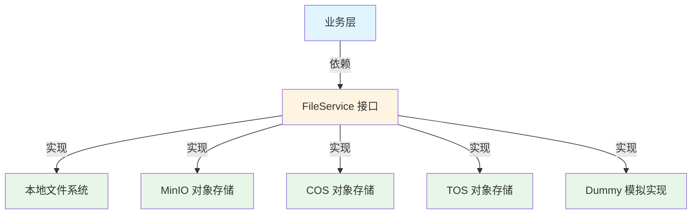

# 文件存储服务接口 (file_storage_service_interface)

## 1. 模块概述

在分布式系统中，文件存储是一个核心基础设施需求。不同的应用场景可能需要不同的存储方案：本地开发环境可能使用文件系统，生产环境可能使用云对象存储（如 MinIO、COS、TOS），而测试环境可能需要一个轻量级的模拟实现。如果没有统一的抽象层，业务代码会直接依赖具体的存储实现，导致代码耦合度高、难以测试、切换存储方案时需要大量修改。

`file_storage_service_interface` 模块正是为了解决这个问题而存在的。它定义了一套统一的文件存储操作接口，将业务逻辑与具体的存储实现解耦。通过这个接口，业务代码可以用相同的方式操作文件，而不必关心底层是本地文件系统还是云对象存储。

## 2. 架构与心智模型

### 2.1 架构视图



### 2.2 心智模型

可以把 `FileService` 接口想象成一个**通用的文件存储插座**：
- 业务层是使用这个插座的电器
- 不同的存储实现是不同的插头（本地文件系统、云存储等）
- 无论插头是什么，电器都能以相同的方式工作

这个设计遵循了**依赖倒置原则**（Dependency Inversion Principle）：高层模块（业务逻辑）不依赖低层模块（具体存储实现），两者都依赖抽象（`FileService` 接口）。

## 3. 核心组件详解

### 3.1 FileService 接口

`FileService` 是整个模块的核心，定义了文件存储的基本操作契约。

```go
type FileService interface {
    SaveFile(ctx context.Context, file *multipart.FileHeader, tenantID uint64, knowledgeID string) (string, error)
    SaveBytes(ctx context.Context, data []byte, tenantID uint64, fileName string, temp bool) (string, error)
    GetFile(ctx context.Context, filePath string) (io.ReadCloser, error)
    GetFileURL(ctx context.Context, filePath string) (string, error)
    DeleteFile(ctx context.Context, filePath string) error
}
```

#### 方法详解

##### SaveFile
**用途**：保存上传的文件（通常来自 HTTP 请求的 multipart 表单）

**参数**：
- `ctx context.Context`：上下文，用于传递请求范围的值、超时控制和取消信号
- `file *multipart.FileHeader`：上传的文件头，包含文件元数据和内容
- `tenantID uint64`：租户 ID，用于多租户隔离
- `knowledgeID string`：知识库 ID，用于组织和管理文件

**返回值**：
- `string`：保存后的文件路径（或标识符），后续可通过此路径检索文件
- `error`：操作失败时的错误信息

**设计意图**：这个方法专门针对 Web 应用中常见的文件上传场景，直接处理 `multipart.FileHeader` 类型，简化了业务层的代码。

##### SaveBytes
**用途**：将字节数组保存为文件

**参数**：
- `ctx context.Context`：上下文
- `data []byte`：要保存的字节数据
- `tenantID uint64`：租户 ID
- `fileName string`：文件名
- `temp bool`：是否为临时文件。如果为 true，文件可能会被自动清理

**返回值**：
- `string`：保存后的文件路径
- `error`：操作失败时的错误信息

**设计意图**：这个方法提供了更灵活的文件保存方式，可以处理任何字节数据，而不仅限于上传的文件。`temp` 参数支持临时文件场景，这在处理中间结果或缓存时非常有用。

##### GetFile
**用途**：检索文件内容

**参数**：
- `ctx context.Context`：上下文
- `filePath string`：文件路径（由 SaveFile 或 SaveBytes 返回）

**返回值**：
- `io.ReadCloser`：文件内容的读取器，使用完毕后需要关闭
- `error`：操作失败时的错误信息

**设计意图**：返回 `io.ReadCloser` 而不是整个字节数组，是为了支持大文件的流式读取，避免一次性加载到内存中。调用者必须负责关闭返回的读取器，以防止资源泄漏。

##### GetFileURL
**用途**：获取文件的下载 URL（如果存储后端支持）

**参数**：
- `ctx context.Context`：上下文
- `filePath string`：文件路径

**返回值**：
- `string`：文件的下载 URL
- `error`：操作失败时的错误信息

**设计意图**：这个方法支持将文件访问的负担转移到客户端。例如，云对象存储可以返回一个预签名 URL，客户端可以直接从云存储下载文件，而不需要经过应用服务器。

**注意**：这个方法是可选的，不是所有存储后端都支持。如果不支持，可能会返回错误或空字符串。

##### DeleteFile
**用途**：删除文件

**参数**：
- `ctx context.Context`：上下文
- `filePath string`：文件路径

**返回值**：
- `error`：操作失败时的错误信息

**设计意图**：提供文件删除功能，支持文件生命周期管理。

## 4. 依赖关系与数据流向

### 4.1 依赖关系

`file_storage_service_interface` 模块是一个纯接口定义模块，它不依赖任何其他模块的具体实现。相反，其他模块依赖它：

**被依赖方向**：
- [file_storage_provider_services](file_storage_provider_services.md)：实现了这个接口，提供具体的存储服务
- 业务层模块（如知识管理、文档处理等）：依赖这个接口进行文件操作

**依赖方向**：
- 标准库：`context`、`io`、`mime/multipart`

### 4.2 数据流向

以一个典型的知识库文件上传场景为例：

1. **上传文件**：
   ```
   HTTP 请求 → HTTP 处理器 → 调用 FileService.SaveFile() → 存储实现 → 返回文件路径
   ```

2. **下载文件**：
   ```
   HTTP 请求 → HTTP 处理器 → 调用 FileService.GetFileURL() 或 GetFile() → 返回 URL 或内容 → 响应客户端
   ```

3. **删除文件**：
   ```
   HTTP 请求 → HTTP 处理器 → 调用 FileService.DeleteFile() → 存储实现删除文件 → 返回结果
   ```

## 5. 设计决策与权衡

### 5.1 接口设计的简洁性 vs 完整性

**决策**：接口只包含最核心的 5 个方法，没有包含更多高级功能（如文件复制、移动、元数据管理等）

**原因**：
- 保持接口简单，降低实现成本
- 不同的存储后端对高级功能的支持差异很大，过度设计会导致某些实现难以适配
- 高级功能可以在接口之上通过组合或包装来实现

**权衡**：牺牲了一些便利性，换取了更好的兼容性和可实现性。

### 5.2 返回路径 vs 返回对象

**决策**：SaveFile 和 SaveBytes 返回字符串路径，而不是一个包含更多信息的结构体

**原因**：
- 路径是文件的最小标识符，足够用于后续操作
- 不同存储后端的元数据差异很大，难以统一
- 保持返回值简单，减少耦合

**权衡**：如果需要更多元数据，调用者需要自己保存或通过其他方式获取。

### 5.3 GetFile 返回 io.ReadCloser vs []byte

**决策**：GetFile 返回 io.ReadCloser，而不是整个字节数组

**原因**：
- 支持大文件处理，避免一次性加载到内存
- 更灵活，调用者可以按需读取
- 符合 Go 语言的惯用法

**权衡**：调用者需要负责关闭读取器，增加了使用的复杂性。如果忘记关闭，可能导致资源泄漏。

### 5.4 GetFileURL 的可选性

**决策**：GetFileURL 是接口的一部分，但允许实现返回错误（表示不支持）

**原因**：
- 本地文件系统通常不支持 URL 访问
- 云存储通常支持，但实现方式差异很大
- 提供这个方法可以在支持的场景下优化性能

**权衡**：增加了接口的复杂性，调用者需要处理不支持的情况。

### 5.5 多租户支持

**决策**：SaveFile 和 SaveBytes 都接受 tenantID 参数

**原因**：
- 多租户是系统的核心需求
- 文件存储需要按租户隔离
- 在接口层面强制要求 tenantID，避免遗漏

**权衡**：增加了方法参数的数量，但确保了多租户隔离的正确性。

## 6. 使用指南与最佳实践

### 6.1 基本使用

#### 保存上传的文件

```go
// 假设 fileService 是 FileService 的实现实例
func handleUpload(w http.ResponseWriter, r *http.Request) {
    err := r.ParseMultipartForm(10 << 20) // 10 MB
    if err != nil {
        http.Error(w, err.Error(), http.StatusBadRequest)
        return
    }

    file, handler, err := r.FormFile("file")
    if err != nil {
        http.Error(w, err.Error(), http.StatusBadRequest)
        return
    }
    defer file.Close()

    tenantID := getTenantID(r)
    knowledgeID := getKnowledgeID(r)

    filePath, err := fileService.SaveFile(r.Context(), handler, tenantID, knowledgeID)
    if err != nil {
        http.Error(w, err.Error(), http.StatusInternalServerError)
        return
    }

    w.Write([]byte(filePath))
}
```

#### 保存字节数据

```go
func saveData(ctx context.Context, data []byte, tenantID uint64) (string, error) {
    // 保存为临时文件，可能会被自动清理
    return fileService.SaveBytes(ctx, data, tenantID, "data.bin", true)
}
```

#### 读取文件

```go
func readFile(ctx context.Context, filePath string) ([]byte, error) {
    reader, err := fileService.GetFile(ctx, filePath)
    if err != nil {
        return nil, err
    }
    defer reader.Close() // 重要：必须关闭读取器

    return io.ReadAll(reader)
}
```

#### 获取下载 URL

```go
func getDownloadURL(ctx context.Context, filePath string) (string, error) {
    url, err := fileService.GetFileURL(ctx, filePath)
    if err != nil {
        // 如果不支持 URL，回退到其他方式
        return "", fmt.Errorf("URL generation not supported: %w", err)
    }
    return url, nil
}
```

#### 删除文件

```go
func deleteFile(ctx context.Context, filePath string) error {
    return fileService.DeleteFile(ctx, filePath)
}
```

### 6.2 最佳实践

1. **总是关闭 io.ReadCloser**：使用 `defer` 确保读取器被关闭，防止资源泄漏。

2. **处理 GetFileURL 的错误**：不要假设所有存储后端都支持 URL 生成，要有回退方案。

3. **合理使用临时文件**：对于中间结果，使用 `temp=true` 可以自动清理，避免存储泄漏。

4. **上下文传递**：总是传递上下文，以便支持超时、取消和追踪。

5. **路径不透明**：不要假设返回的文件路径有任何特定格式，它应该被视为不透明的标识符。

## 7. 边缘情况与注意事项

### 7.1 边缘情况

1. **大文件处理**：GetFile 返回 io.ReadCloser 可以处理大文件，但调用者需要注意内存使用。

2. **并发安全**：FileService 的实现应该是并发安全的，因为可能会有多个 goroutine 同时调用。

3. **错误恢复**：文件操作可能会失败（如网络问题、存储满了），调用者需要有适当的错误处理和重试策略。

4. **临时文件的生命周期**：临时文件的清理策略依赖于实现，不要假设临时文件会在特定时间后消失。

### 7.2 注意事项

1. **路径的不透明性**：不要解析或修改返回的文件路径，它的格式是实现细节。

2. **GetFileURL 的可选性**：如前所述，不是所有实现都支持这个方法。

3. **资源泄漏**：忘记关闭 io.ReadCloser 是常见的错误，会导致资源泄漏。

4. **多租户隔离**：确保 tenantID 正确传递，否则可能导致数据泄露或混淆。

5. **上下文的重要性**：上下文用于超时控制和取消，长时间运行的文件操作应该尊重上下文的取消信号。

## 8. 相关模块

- [file_storage_provider_services](file_storage_provider_services.md)：包含 FileService 接口的具体实现
- [content_and_knowledge_management_repositories](content_and_knowledge_management_repositories.md)：使用 FileService 进行知识内容的存储管理
- [knowledge_ingestion_extraction_and_graph_services](knowledge_ingestion_extraction_and_graph_services.md)：在知识摄取过程中使用 FileService

## 9. 总结

`file_storage_service_interface` 模块是一个简洁但强大的抽象层，它解决了多环境、多存储后端的文件存储问题。通过定义统一的接口，它将业务逻辑与具体存储实现解耦，使系统更加灵活、可测试和可维护。

这个模块的设计体现了几个重要的软件工程原则：
- **依赖倒置原则**：高层模块依赖抽象，而不是具体实现
- **接口隔离原则**：接口只包含必要的方法，不强迫实现者依赖不需要的方法
- **简单性**：保持接口简洁，降低使用和实现的成本

虽然这个模块很小，但它是整个系统的基础设施之一，为上层业务提供了可靠的文件存储能力。
