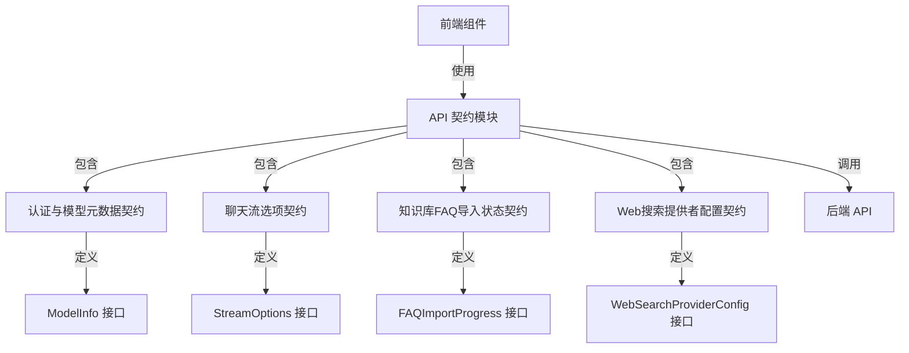

# 前端后端集成 API 契约模块 (api_contracts_for_backend_integrations)

## 概述

这个模块是前端应用与后端系统之间的"翻译官"和"契约守护者"。在复杂的前后端分离架构中，它定义了双方通信的标准语言、数据格式和交互规则，确保前端组件能够可靠地调用后端服务，同时后端能够正确理解前端的请求意图。

想象一下，前端和后端就像两个使用不同方言的人在对话。如果没有统一的翻译规则，他们可能会误解对方的意思。这个模块就像是一本标准词典和语法书，规定了每个词汇（数据结构）的含义和每个句子（API 调用）的结构，使双方能够顺畅沟通。

## 架构概览



这个模块采用了分层设计，将不同功能领域的 API 契约进行了清晰的划分：

1. **认证与模型元数据契约**：负责用户认证、租户信息和模型元数据的交互
2. **聊天流选项契约**：定义了聊天流式请求的配置选项
3. **知识库FAQ导入状态契约**：跟踪和管理FAQ导入过程的状态
4. **Web搜索提供者配置契约**：描述了不同Web搜索提供者的配置信息

## 核心设计决策

### 1. TypeScript 接口优先的契约定义

**决策**：使用 TypeScript 接口作为 API 契约的主要定义方式，而不是运行时验证库。

**原因**：
- 提供了编译时的类型检查，能在开发早期发现问题
- 与 Vue 3 前端框架的类型系统完美集成
- 减少了运行时的开销，提高了性能

**权衡**：
- 缺少运行时的数据验证，需要依赖后端的验证机制
- 在处理动态数据时需要额外的类型断言

### 2. 集中式 API 函数封装

**决策**：将所有 API 调用封装在对应的模块文件中，而不是分散在各个组件中。

**原因**：
- 统一管理 API 端点和请求格式
- 便于实现请求拦截、错误处理等横切关注点
- 提高了代码的可维护性和可测试性

**权衡**：
- 增加了一层抽象，可能会让简单的调用显得稍微复杂
- 需要维护额外的模块文件结构

### 3. 响应式流式处理设计

**决策**：为聊天流式响应设计了专门的 `useStream` 组合式函数，利用 Vue 的响应式系统。

**原因**：
- 流式响应是现代 AI 应用的核心交互模式
- Vue 的响应式系统能够优雅地处理渐进式内容更新
- 提供了统一的流式状态管理（加载中、流式传输中、错误等）

**权衡**：
- 与 Vue 框架深度耦合，降低了在其他框架中的可复用性
- 增加了状态管理的复杂性

## 子模块概览

### 认证与模型元数据契约

这个子模块定义了用户认证、租户管理和模型元数据相关的 API 契约。它包含了登录、注册、获取用户信息等核心功能的请求和响应格式，以及 `ModelInfo` 接口来描述可用的 AI 模型信息。

[查看详细文档](frontend_contracts_and_state-api_contracts_for_backend_integrations-authentication_and_model_metadata_contracts.md)

### 聊天流选项契约

这个子模块专注于聊天流式交互的配置和处理。它定义了 `StreamOptions` 接口来配置流式请求，并提供了 `useStream` 组合式函数来管理整个流式交互的生命周期。

[查看详细文档](frontend_contracts_and_state-api_contracts_for_backend_integrations-chat_streaming_option_contracts.md)

### 知识库FAQ导入状态契约

这个子模块处理知识库 FAQ 导入过程的状态跟踪和管理。它定义了 `FAQImportProgress` 接口来描述导入任务的详细状态，包括成功和失败的条目信息。

[查看详细文档](frontend_contracts_and_state-api_contracts_for_backend_integrations-knowledge_base_faq_import_status_contracts.md)

### Web搜索提供者配置契约

这个子模块定义了 Web 搜索功能相关的配置契约。它包含了 `WebSearchProviderConfig` 接口来描述不同搜索提供者的特性和配置需求。

[查看详细文档](frontend_contracts_and_state-api_contracts_for_backend_integrations-web_search_provider_configuration_contracts.md)

## 跨模块依赖

这个模块在整个前端架构中处于核心位置，它连接了前端组件层和后端服务层：

1. **被前端组件依赖**：各个 UI 组件通过这个模块调用后端 API
2. **依赖工具模块**：使用了 `@/utils/request` 来处理 HTTP 请求
3. **与状态管理交互**：通过响应式数据与前端状态管理集成

这种设计使得前端组件不需要直接了解后端 API 的细节，而是通过这个模块提供的清晰接口进行交互，提高了系统的可维护性和可扩展性。

## 使用指南

### 基本 API 调用

对于简单的 API 调用，直接导入对应的函数即可：

```typescript
import { getCurrentUser } from '@/api/auth'

const userInfo = await getCurrentUser()
if (userInfo.success) {
  // 处理用户信息
}
```

### 流式聊天使用

使用 `useStream` 组合式函数来处理流式响应：

```typescript
import { useStream } from '@/api/chat/streame'

const { output, isStreaming, startStream, stopStream } = useStream()

// 启动流式请求
await startStream({
  session_id: 'session-123',
  query: '你好，请介绍一下自己',
  method: 'POST',
  url: '/api/v1/chat'
})
```

## 注意事项

1. **类型断言的使用**：由于 API 响应是 `unknown` 类型，需要使用类型断言。确保你的断言与实际的 API 响应一致。

2. **错误处理**：API 函数通常会返回包含 `success` 字段的响应对象，而不是抛出异常。记得检查这个字段。

3. **Token 管理**：认证相关的 API 会处理 Token 的存储和刷新，但你需要确保在 Token 过期时引导用户重新登录。

4. **流式请求清理**：使用 `useStream` 时，组件卸载时会自动清理资源，但在手动停止流时也要确保调用 `stopStream`。

5. **跨租户访问**：在处理多租户场景时，注意 `X-Tenant-ID` 请求头的设置，确保访问正确的租户数据。
