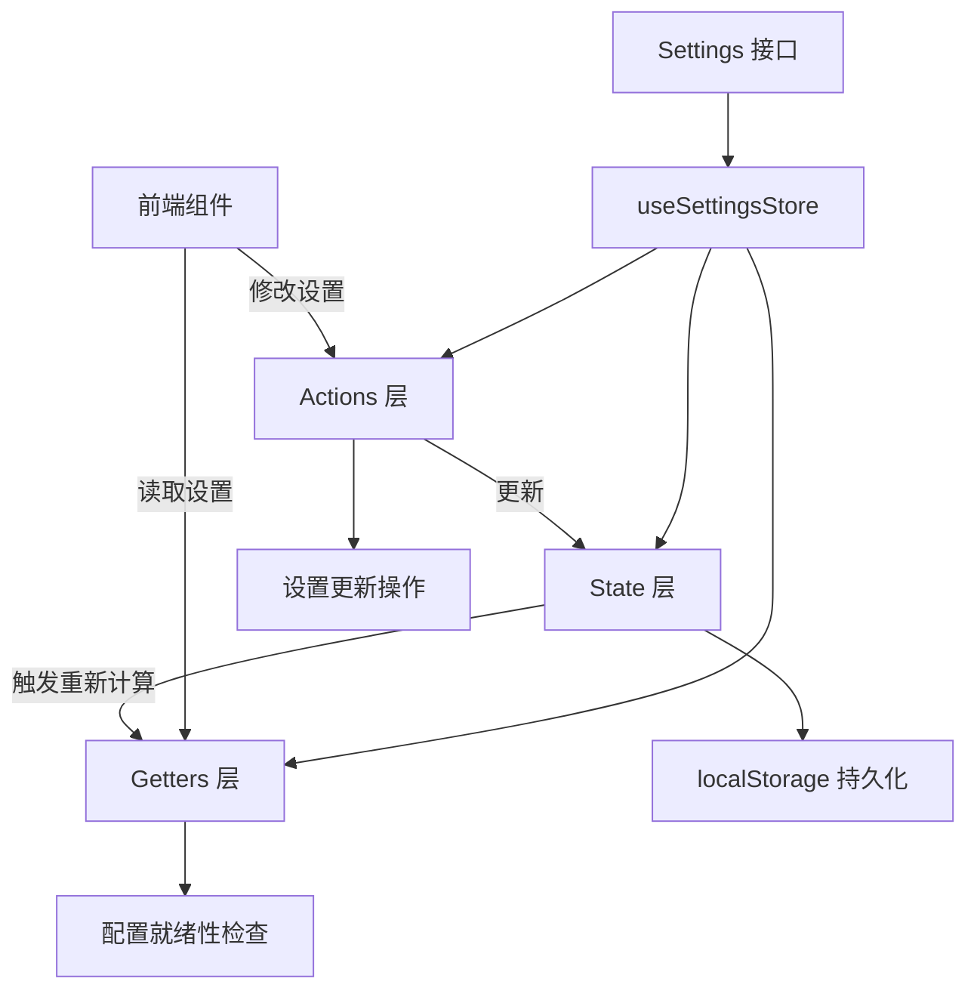
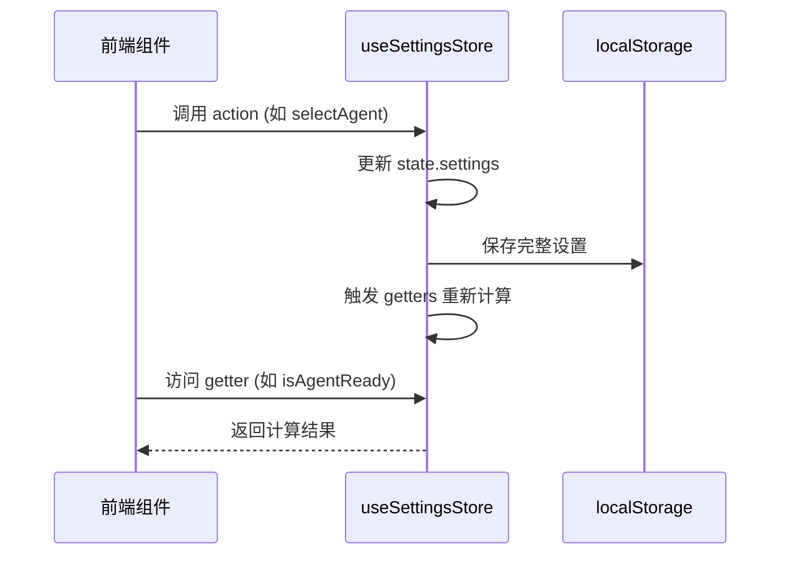

# application_settings_state_contracts 模块技术深度解析

## 1. 模块定位与问题解决

### 1.1 问题空间

在构建现代前端应用时，用户设置管理是一个核心挑战。对于 WeKnora 这样的 AI 助手平台，设置管理尤其复杂，因为它需要处理：

- **多维度配置**：从 API 端点到模型选择，从智能体配置到知识库选择，设置分散在多个维度
- **状态持久化**：用户期望刷新页面后设置保持不变，这需要可靠的本地存储机制
- **配置完整性验证**：某些功能（如智能体模式）需要多个配置项同时正确设置才能工作
- **动态切换**：用户需要在不同模式（快速问答/智能推理）、不同模型、不同知识库之间无缝切换

一个简单的键值对存储方案无法满足这些需求，因为它缺乏类型安全、配置完整性检查和状态转换逻辑。

### 1.2 解决方案概述

`application_settings_state_contracts` 模块通过以下方式解决这些问题：

1. **类型化的设置结构**：使用 TypeScript 接口定义完整的设置契约，确保类型安全
2. **集中式状态管理**：基于 Pinia 构建的 store，提供统一的设置访问和修改入口
3. **自动持久化**：所有设置变更自动同步到 localStorage，刷新页面后自动恢复
4. **配置就绪性检查**：内置 getter 方法验证不同模式下的配置完整性
5. **智能状态转换**：某些设置变更会触发相关状态的自动调整（如切换智能体时清空知识库选择）

## 2. 核心架构与心智模型

### 2.1 架构概览



### 2.2 心智模型

把这个模块想象成一个**智能配置控制面板**：

- **Settings 接口**是控制面板的设计图纸，定义了所有旋钮、开关和显示屏的位置和类型
- **State 层**是控制面板的当前状态，记录了每个旋钮的位置和开关的状态
- **Getters 层**是控制面板的指示灯和显示屏，它根据当前状态告诉你"系统是否就绪"、"智能体是否启用"等信息
- **Actions 层**是控制面板的操作按钮，你按下"切换智能体"按钮，它不仅会改变智能体选择，还会自动调整相关的配置（如清空知识库选择）
- **localStorage**是控制面板的记忆功能，即使你关掉电源再打开，它也能记住上次的设置

这个模型的核心思想是：**设置不是孤立的键值对，而是相互关联的状态集合，修改一个设置可能会影响其他设置的有效性和含义**。

## 3. 核心组件深度解析

### 3.1 Settings 接口

```typescript
interface Settings {
  endpoint: string;
  apiKey: string;
  knowledgeBaseId: string;
  isAgentEnabled: boolean;
  agentConfig: AgentConfig;
  selectedKnowledgeBases: string[];
  selectedFiles: string[];
  selectedFileKbMap: Record<string, string>;
  modelConfig: ModelConfig;
  ollamaConfig: OllamaConfig;
  webSearchEnabled: boolean;
  enableMemory: boolean;
  conversationModels: ConversationModels;
  selectedAgentId: string;
  selectedAgentSourceTenantId: string | null;
}
```

**设计意图**：
- 这个接口定义了应用设置的完整契约，是整个模块的基石
- 它采用扁平结构与嵌套对象相结合的方式，将相关设置组织在一起
- 每个字段都有明确的语义，避免了模糊的命名和类型

**关键字段解析**：
- `selectedFileKbMap`：这是一个巧妙的设计，它解决了"刷新页面后如何记住文件属于哪个知识库"的问题。在共享知识库场景下，这个映射关系对于正确重新加载文件至关重要。
- `selectedAgentSourceTenantId`：支持共享智能体功能，当使用来自其他租户的智能体时，需要这个 ID 来帮助后端正确解析模型、知识库和 MCP 工具。
- `conversationModels`：将对话相关的模型配置聚合在一起，包括摘要模型、重排模型和当前选择的对话模型。

### 3.2 AgentConfig 接口

```typescript
interface AgentConfig {
  maxIterations: number;
  temperature: number;
  allowedTools: string[];
  system_prompt?: string;
}
```

**设计意图**：
- 封装智能体运行时的核心参数
- `system_prompt` 字段使用了 `{{web_search_status}}` 占位符，支持动态注入网络搜索状态
- `allowedTools` 默认为空，需要通过 API 从后端加载，这确保了工具列表的权威性由后端控制

### 3.3 ModelConfig 与 ModelItem

```typescript
interface ModelItem {
  id: string;
  name: string;
  source: 'local' | 'remote';
  modelName: string;
  baseUrl?: string;
  apiKey?: string;
  dimension?: number;
  interfaceType?: 'ollama' | 'openai';
  isDefault?: boolean;
}

interface ModelConfig {
  chatModels: ModelItem[];
  embeddingModels: ModelItem[];
  rerankModels: ModelItem[];
  vllmModels: ModelItem[];
}
```

**设计意图**：
- 统一的模型表示：无论是聊天模型、嵌入模型还是重排模型，都使用相同的 `ModelItem` 结构
- 支持多模型管理：用户可以添加多个模型，并在它们之间切换
- 默认模型机制：每个类别都可以有一个默认模型，简化了用户选择

**关键设计决策**：
- 使用 `id` 作为模型的唯一标识符，而不是 `modelName`，因为同一个模型名可能来自不同的来源
- `dimension` 字段仅对嵌入模型有意义，`interfaceType` 仅对 VLLM 模型有意义，这种设计允许在统一结构中容纳不同类型模型的特殊需求

### 3.4 useSettingsStore - Pinia Store

这是模块的核心，它分为三个部分：State、Getters 和 Actions。

#### 3.4.1 State 层

```typescript
state: () => ({
  settings: JSON.parse(localStorage.getItem("WeKnora_settings") || JSON.stringify(defaultSettings)),
})
```

**设计意图**：
- 从 localStorage 加载设置，如果没有则使用默认设置
- 这种初始化方式确保了即使在离线状态下，应用也能以合理的默认配置启动

**默认设置的设计**：
- `endpoint` 根据环境动态设置：Docker 环境下为空字符串（使用相对路径），开发环境下为 `http://localhost:8080`
- `selectedAgentId` 默认为 `BUILTIN_QUICK_ANSWER_ID`，即快速问答模式，这是最常用的模式
- `ollamaConfig.enabled` 默认为 `true`，因为 Ollama 是本地模型的常见选择

#### 3.4.2 Getters 层

Getters 层提供了对设置的计算属性访问，最关键的是配置就绪性检查。

**isAgentReady**：
```typescript
isAgentReady: (state) => {
  const config = state.settings.agentConfig || defaultSettings.agentConfig
  const models = state.settings.conversationModels || defaultSettings.conversationModels
  return Boolean(
    config.allowedTools && config.allowedTools.length > 0 &&
    models.summaryModelId && models.summaryModelId.trim() !== '' &&
    models.rerankModelId && models.rerankModelId.trim() !== ''
  )
}
```

**设计意图**：
- 检查智能体模式是否就绪，需要满足三个条件：
  1. 配置了允许的工具
  2. 设置了摘要模型
  3. 设置了重排模型
- 这些检查确保了用户不会在配置不完整的情况下尝试使用智能体模式，避免了运行时错误

**isNormalModeReady**：
- 类似地，检查普通模式（快速问答）是否就绪，只需要设置摘要模型和重排模型

**其他 Getters**：
- 提供了对各种设置的便捷访问，如 `isAgentEnabled`、`isWebSearchEnabled` 等
- 所有 Getters 都有默认值回退，确保即使设置不完整也能返回合理的值


#### 3.4.3 Actions 层

Actions 层提供了修改设置的方法，每个方法都负责更新状态并持久化到 localStorage。

**模型管理操作**：
- `addModel`、`updateModel`、`deleteModel`、`setDefaultModel`
- 这些方法实现了模型的完整生命周期管理
- 特别值得注意的是默认模型的处理逻辑：
  - 当添加第一个模型时，自动设为默认
  - 当设置某个模型为默认时，取消其他模型的默认状态
  - 当删除默认模型时，将第一个剩余模型设为默认

**知识库选择操作**：
- `selectKnowledgeBases`、`addKnowledgeBase`、`removeKnowledgeBase`、`clearKnowledgeBases`
- 提供了灵活的知识库选择方式，支持单个添加/移除和批量替换

**文件选择操作**：
- `addFile`、`removeFile`、`clearFiles`、`setFileKbMap`
- 这些方法与知识库选择操作类似，但增加了对 `selectedFileKbMap` 的管理
- 当删除文件时，会同时从映射表中移除对应的条目

**智能体选择操作**：
```typescript
selectAgent(agentId: string, sourceTenantId?: string | null) {
  this.settings.selectedAgentId = agentId;
  this.settings.selectedAgentSourceTenantId = (sourceTenantId != null && sourceTenantId !== "") ? sourceTenantId : null;
  
  // 根据智能体类型自动切换 Agent 模式
  if (agentId === BUILTIN_QUICK_ANSWER_ID) {
    this.settings.isAgentEnabled = false;
  } else if (agentId === BUILTIN_SMART_REASONING_ID) {
    this.settings.isAgentEnabled = true;
  }
  
  // 切换智能体时重置知识库和文件选择状态
  this.settings.selectedKnowledgeBases = [];
  this.settings.selectedFiles = [];
  this.settings.selectedFileKbMap = {};
  localStorage.setItem("WeKnora_settings", JSON.stringify(this.settings));
}
```

**设计意图**：
这是一个非常聪明的设计，展示了设置之间的关联性：

1. 当切换到快速问答模式时，自动禁用智能体模式
2. 当切换到智能推理模式时，自动启用智能体模式
3. 切换智能体时，清空知识库和文件选择，因为不同智能体关联的知识库可能不同
4. 这种自动调整避免了用户在切换智能体后看到不相关的知识库选择

## 4. 数据流与依赖关系

### 4.1 数据流程图



### 4.2 依赖关系

**内部依赖**：
- `BUILTIN_QUICK_ANSWER_ID` 和 `BUILTIN_SMART_REASONING_ID` 从 `@/api/agent` 导入
- 这些常量定义了内置智能体的 ID，是智能体切换逻辑的基础

**外部依赖**：
- Pinia：状态管理库
- localStorage：浏览器本地存储 API
- `import.meta.env`：环境变量访问

**被依赖情况**：
- 前端各个组件会依赖这个 store 来读取和修改设置
- 例如，对话组件会检查 `isAgentReady` 或 `isNormalModeReady` 来决定是否可以开始对话

## 5. 设计决策与权衡

### 5.1 集中式 vs 分散式设置管理

**决策**：采用集中式设置管理，所有设置都在一个 store 中

**权衡分析**：
- ✅ 优点：
  - 统一的设置访问和修改入口，易于理解和维护
  - 设置之间的关联性更容易处理（如切换智能体时清空知识库选择）
  - 持久化逻辑集中在一个地方，避免重复代码
- ❌ 缺点：
  - store 可能会变得很大，包含很多不相关的设置
  - 修改任何设置都会触发整个 store 的更新，可能影响性能

**为什么这个选择是合理的**：
对于 WeKnora 这样的应用，设置之间的关联性很强，集中式管理的优势明显超过了劣势。而且，与设置相关的操作频率相对较低，性能影响可以忽略不计。

### 5.2 localStorage vs IndexedDB

**决策**：使用 localStorage 进行持久化

**权衡分析**：
- ✅ 优点：
  - API 简单，易于使用
  - 同步操作，代码逻辑更直接
  - 广泛支持，兼容性好
- ❌ 缺点：
  - 存储容量限制（通常 5-10MB）
  - 只能存储字符串，需要序列化/反序列化
  - 同步操作可能阻塞主线程（虽然设置操作通常很快）

**为什么这个选择是合理的**：
设置数据量通常很小，完全在 localStorage 的容量限制内。而且，设置操作的频率不高，同步操作的性能影响可以忽略。localStorage 的简单性使得代码更容易理解和维护。

### 5.3 完整保存 vs 增量保存

**决策**：每次修改都保存完整的设置对象

**权衡分析**：
- ✅ 优点：
  - 代码简单，不容易出错
  - 不会出现部分保存导致的数据不一致
  - 恢复逻辑简单，直接读取完整对象
- ❌ 缺点：
  - 即使只修改一个字段，也会保存整个对象
  - 对于大型设置对象，可能有轻微的性能影响

**为什么这个选择是合理的**：
设置对象的大小通常很小，完整保存的性能影响可以忽略。而且，这种方式大大简化了代码，减少了出错的可能性。

### 5.4 类型安全 vs 灵活性

**决策**：使用 TypeScript 接口提供严格的类型安全

**权衡分析**：
- ✅ 优点：
  - 编译时类型检查，减少运行时错误
  - 更好的 IDE 支持，自动完成和类型提示
  - 代码更易于理解和维护
- ❌ 缺点：
  - 添加新设置时需要修改接口定义
  - 对于动态设置结构，类型安全可能会限制灵活性

**为什么这个选择是合理的**：
设置结构相对稳定，不会频繁变化。类型安全带来的好处远远超过了灵活性的轻微损失。而且，通过使用可选字段和联合类型，可以在保持类型安全的同时提供一定的灵活性。


## 6. 使用指南与最佳实践

### 6.1 基本使用

**读取设置**：
```typescript
import { useSettingsStore } from "@/stores/settings";

const settingsStore = useSettingsStore();

// 直接访问 state
const endpoint = settingsStore.settings.endpoint;

// 使用 getter
const isAgentReady = settingsStore.isAgentReady;
const selectedAgentId = settingsStore.selectedAgentId;
```

**修改设置**：
```typescript
// 切换智能体
settingsStore.selectAgent(BUILTIN_SMART_REASONING_ID);

// 更新模型配置
settingsStore.updateModelConfig({
  chatModels: [newChatModel]
});

// 启用网络搜索
settingsStore.toggleWebSearch(true);
```

### 6.2 最佳实践

1. **使用 getters 而不是直接访问 state**：
   - Getters 提供了默认值回退和计算逻辑，更安全
   - 例如，使用 `settingsStore.isAgentEnabled` 而不是 `settingsStore.settings.isAgentEnabled`

2. **使用 actions 而不是直接修改 state**：
   - Actions 确保了设置的一致性和持久化
   - 例如，使用 `settingsStore.toggleAgent(true)` 而不是 `settingsStore.settings.isAgentEnabled = true`

3. **检查配置就绪性**：
   - 在使用依赖配置的功能之前，先检查对应的就绪性 getter
   - 例如，在开始智能体对话之前，先检查 `isAgentReady`

4. **处理设置加载**：
   - 应用启动时，设置可能还没有加载完成（虽然这个模块的设计是同步加载的）
   - 使用默认值回退来处理可能的未定义状态

### 6.3 扩展设置

**添加新设置的步骤**：

1. 在 `Settings` 接口中添加新字段
2. 在 `defaultSettings` 对象中添加默认值
3. 如果需要，添加对应的 getter
4. 如果需要，添加对应的 action
5. 如果新设置与其他设置有关联，在相关 actions 中添加处理逻辑

**示例**：

假设我们要添加一个"自动保存对话历史"的设置：

```typescript
// 1. 在 Settings 接口中添加
interface Settings {
  // ... 现有字段
  autoSaveHistory: boolean;
}

// 2. 在 defaultSettings 中添加默认值
const defaultSettings: Settings = {
  // ... 现有默认值
  autoSaveHistory: true,
};

// 3. 添加 getter（可选，如果需要默认值回退或计算逻辑）
getters: {
  // ... 现有 getters
  isAutoSaveHistoryEnabled: (state) => state.settings.autoSaveHistory ?? true,
},

// 4. 添加 action
actions: {
  // ... 现有 actions
  toggleAutoSaveHistory(enabled: boolean) {
    this.settings.autoSaveHistory = enabled;
    localStorage.setItem("WeKnora_settings", JSON.stringify(this.settings));
  },
}
```

## 7. 边缘情况与注意事项

### 7.1 localStorage 不可用

**情况**：浏览器禁用了 localStorage，或者在隐私模式下

**处理**：
- 当前代码没有明确处理这种情况，可能会抛出异常
- 建议添加错误处理，当 localStorage 不可用时，使用内存存储作为后备

### 7.2 设置数据损坏

**情况**：localStorage 中的设置数据被意外修改，或者格式不匹配

**处理**：
- 当前代码使用 `JSON.parse` 直接解析，如果数据损坏会抛出异常
- 建议添加数据验证和恢复逻辑，当检测到损坏时，回退到默认设置

### 7.3 版本迁移

**情况**：应用更新后，设置结构发生变化，旧版本的设置可能不兼容

**处理**：
- 当前代码没有处理版本迁移，可能导致设置丢失或错误
- 建议添加版本号到设置对象中，并在加载时检查版本，进行必要的迁移

### 7.4 共享智能体的特殊处理

**情况**：使用来自其他租户的共享智能体时，需要正确设置 `selectedAgentSourceTenantId`

**注意事项**：
- 只有在使用共享智能体时才需要设置这个字段
- 切换回非共享智能体时，要记得将其设置为 `null`
- 这个字段会影响后端对模型、知识库和 MCP 工具的解析，必须正确设置

### 7.5 模型默认状态的一致性

**情况**：确保每个模型类别始终有且只有一个默认模型

**注意事项**：
- 当前的模型管理 actions 已经处理了这个问题，但直接修改 state 可能会破坏一致性
- 始终使用提供的 actions 来管理模型，不要直接修改 `modelConfig`

## 8. 总结

`application_settings_state_contracts` 模块是 WeKnora 前端应用的核心组件之一，它通过精心设计的类型安全接口、集中式状态管理、自动持久化和智能状态转换，解决了复杂应用的设置管理问题。

这个模块的设计体现了几个重要的原则：

1. **设置不是孤立的**：它们之间存在关联性，修改一个设置可能会影响其他设置
2. **配置完整性很重要**：在用户尝试使用功能之前，检查配置是否完整可以避免运行时错误
3. **自动化可以提升用户体验**：自动调整相关设置（如切换智能体时清空知识库选择）可以减少用户的认知负担
4. **类型安全值得投资**：虽然需要额外的工作，但它可以减少错误，提高代码的可维护性

对于新加入团队的开发者，理解这个模块的设计思想和实现细节，可以帮助他们更好地使用和扩展这个模块，同时也可以为他们自己的代码设计提供参考。
