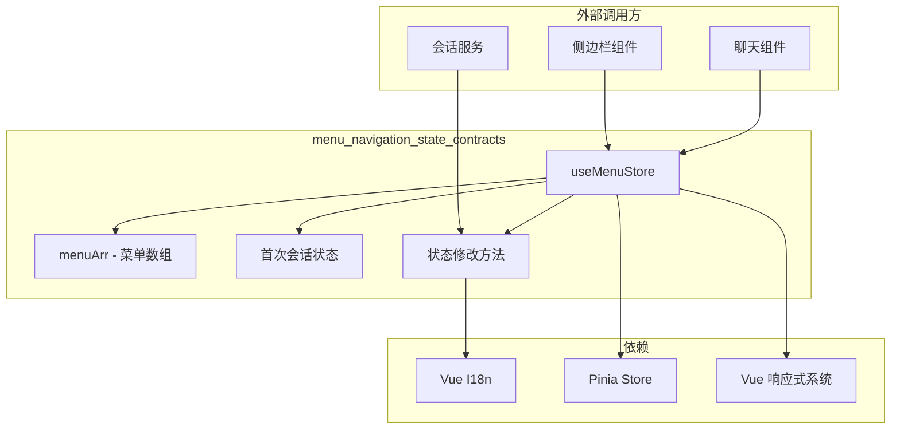

# menu_navigation_state_contracts 模块深度解析

## 一、这个模块解决什么问题？

想象你正在设计一个企业级知识库应用的侧边导航栏。这个导航栏需要满足几个看似简单但实际复杂的需求：

1. **静态菜单项** —— 知识库、智能体、组织、设置等固定入口，需要支持多语言切换
2. **动态会话列表** —— 用户每次创建新对话时，导航栏要实时新增一个会话条目
3. **会话标题更新** —— 对话过程中 AI 自动生成标题后，导航栏要同步更新显示
4. **首次会话追踪** —— 用于新用户引导流程，需要知道这是否是用户的第一个会话

如果用一个朴素的方案，你可能会在每个组件里直接操作 DOM 或者用 props 层层传递状态。但这会带来两个问题：**状态不同步**（多个组件持有同一份菜单数据的副本）和**更新不透明**（很难追踪菜单项何时被修改）。

`menu_navigation_state_contracts` 模块的核心设计洞察是：**将导航菜单视为一个集中式的、响应式的状态机**。它使用 Pinia（Vue 3 的标准状态管理库）来维护单一事实来源，任何组件都可以订阅菜单状态的变化，而无需关心状态是如何被修改的。这种模式类似于机场的航班信息显示屏 —— 后台系统更新航班状态，所有显示屏自动同步，旅客无需知道更新机制。

---

## 二、架构与心智模型

### 架构图



### 核心抽象解析

这个模块的心智模型可以理解为**一个带有特殊分支的树状状态机**：

```
menuArr (根)
├── [0] 知识库 (静态)
├── [1] 智能体 (静态)
├── [2] 组织 (静态)
├── [3] 聊天 (动态分支) ← 核心复杂点
│   └── children[] (会话列表，运行时增长)
├── [4] 设置 (静态)
└── [5] 登出 (静态)
```

**关键设计决策**：为什么聊天菜单项被特殊对待？

因为聊天会话是**用户生成的内容**，其数量和标题在应用生命周期内是未知的。其他菜单项在编译时就已经确定，只有聊天菜单需要在运行时动态扩展。这种"静态骨架 + 动态分支"的混合结构是本模块的核心抽象。

---

## 三、组件深度解析

### 3.1 MenuItem 接口

```typescript
interface MenuItem {
  title: string           // 显示文本（运行时填充）
  titleKey?: string       // i18n 翻译键（编译时定义）
  icon: string            // 图标标识符
  path: string            // 路由路径
  childrenPath?: string   // 子菜单路由前缀（仅聊天项使用）
  children?: MenuChild[]  // 子菜单项（仅聊天项使用）
}
```

**设计意图**：`title` 和 `titleKey` 的分离是一个值得注意的模式。`titleKey` 是翻译的"源代码"，`title` 是翻译后的"运行时值"。这种设计使得：

- 翻译键在代码中保持可见，便于开发者理解语义
- 运行时可以直接使用翻译后的文本，避免每次渲染都查表
- 语言切换时可以通过遍历 `titleKey` 批量更新 `title`

**潜在陷阱**：`MenuChild` 被定义为 `Record<string, any>`，这意味着子菜单项的结构是完全动态的。这给了灵活性（可以存储会话 ID、标题、时间戳等任意字段），但牺牲了类型安全。

### 3.2 useMenuStore 状态管理

#### 状态变量

| 变量 | 类型 | 用途 |
|------|------|------|
| `menuArr` | `reactive<MenuItem[]>` | 主菜单数组，包含所有顶级导航项 |
| `isFirstSession` | `ref<boolean>` | 标记是否是用户的首个会话（用于引导流程） |
| `firstQuery` | `ref<string>` | 首个会话的初始查询内容 |
| `firstMentionedItems` | `ref<any[]>` | 首个会话中提及的知识库项 |
| `firstModelId` | `ref<string>` | 首个会话使用的模型 ID |

**为什么需要追踪首个会话？** 这是典型的新用户引导（onboarding）模式。当用户第一次创建会话时，系统可能需要记录初始上下文，用于后续的产品分析或个性化推荐。

#### 核心方法详解

##### `applyMenuTranslations()`

```typescript
const applyMenuTranslations = () => {
  menuArr.forEach(item => {
    if (item.titleKey) {
      item.title = i18n.global.t(item.titleKey)
    }
  })
}
```

**工作机制**：遍历菜单数组，对每个有 `titleKey` 的项调用 i18n 翻译函数，将结果写入 `title` 字段。

**为什么不用计算属性？** 这是一个性能与简洁性的权衡。使用计算属性意味着每次组件访问 `item.title` 时都会触发翻译查找。而预先计算并存储翻译结果，只在语言切换时更新，减少了运行时开销。

##### `watch(() => i18n.global.locale.value, ...)`

```typescript
watch(
  () => i18n.global.locale.value,
  () => {
    applyMenuTranslations()
  }
)
```

**设计模式**：这是典型的"响应式副作用"模式。当 i18n 的 `locale` 变化时，自动重新应用翻译。这确保了语言切换后菜单文本立即更新，无需手动刷新或重新加载组件。

##### `updatemenuArr(obj: any)`

```typescript
const updatemenuArr = (obj: any) => {
  const chatMenu = menuArr[3]
  if (!chatMenu.children) {
    chatMenu.children = createMenuChildren()
  }
  const exists = chatMenu.children.some((item: MenuChild) => item.id === obj.id)
  if (!exists) {
    chatMenu.children.push(obj)
  }
}
```

**数据流**：当用户创建新会话时，后端返回会话对象 → 调用此方法 → 检查是否已存在（避免重复）→ 添加到聊天子菜单。

**关键细节**：使用 `item.id === obj.id` 进行去重，这假设传入的对象必须有 `id` 字段。这是一个隐式契约，调用方必须遵守。

##### `updatasessionTitle(sessionId: string, title: string)`

```typescript
const updatasessionTitle = (sessionId: string, title: string) => {
  const chatMenu = menuArr[3]
  chatMenu.children?.forEach((item: MenuChild) => {
    if (item.id === sessionId) {
      item.title = title
      item.isNoTitle = false
    }
  })
}
```

**使用场景**：会话创建时可能没有标题（显示为"新对话"），当 AI 生成标题后，调用此方法更新导航栏显示。

**隐式契约**：`isNoTitle` 字段在 `MenuItem` 接口中没有定义，但在这里被使用。这是一个技术债务点 —— 类型定义与实际使用不一致。

##### `clearMenuArr()`

```typescript
const clearMenuArr = () => {
  const chatMenu = menuArr[3]
  if (chatMenu && chatMenu.children) {
    chatMenu.children = createMenuChildren()
  }
}
```

**用途**：用户登出或切换租户时，清空会话列表。注意只清空 `children`，保留静态菜单项。

---

## 四、依赖关系与数据流

### 4.1 这个模块依赖什么？

| 依赖 | 类型 | 为什么需要 |
|------|------|-----------|
| `pinia` | 外部库 | 提供 `defineStore` 函数，创建全局状态容器 |
| `vue` (reactive, ref, watch) | 外部库 | 提供响应式原语，使状态变化自动触发 UI 更新 |
| `@/i18n` | 内部模块 | 提供多语言翻译能力 |

**耦合分析**：这个模块与 Vue 生态深度绑定。如果未来要迁移到 React 或其他框架，整个状态管理模式需要重写。但这是前端状态管理的常见权衡 —— 使用框架原生方案获得最佳集成体验。

### 4.2 谁调用这个模块？

根据模块树结构，以下组件/服务可能调用此模块：

1. **侧边栏组件** —— 读取 `menuArr` 渲染导航菜单
2. **会话创建逻辑** —— 调用 `updatemenuArr` 添加新会话
3. **会话标题生成服务** —— 调用 `updatasessionTitle` 更新标题
4. **用户认证服务** —— 调用 `clearMenuArr` 登出时清空会话

### 4.3 数据流追踪：创建一个新会话

```
用户点击"新建对话"
       ↓
ChatComponent 调用会话创建 API
       ↓
后端返回会话对象 { id: "xxx", title: "新对话", ... }
       ↓
ChatComponent 调用 menuStore.updatemenuArr(session)
       ↓
updatemenuArr 检查 id 是否已存在 → 不存在则 push 到 children
       ↓
Vue 响应式系统检测到 children 数组变化
       ↓
SidebarComponent 自动重新渲染，显示新会话
       ↓
（后续）AI 生成标题后调用 updatasessionTitle(sessionId, newTitle)
       ↓
Vue 响应式系统检测到 title 变化
       ↓
SidebarComponent 自动更新会话标题显示
```

---

## 五、设计决策与权衡

### 5.1 为什么使用魔法索引 `menuArr[3]` 访问聊天菜单？

**现状**：代码中多处出现 `const chatMenu = menuArr[3]`，硬编码了聊天菜单在数组中的位置。

**权衡分析**：

| 方案 | 优点 | 缺点 |
|------|------|------|
| 魔法索引（当前） | 简单直接，性能最优 | 脆弱，菜单顺序变化会导致 bug |
| 按 `titleKey` 查找 | 语义清晰，顺序无关 | 每次访问都要遍历，性能略低 |
| 单独的状态变量 | 类型安全，IDE 友好 | 增加状态复杂度，菜单数组不再统一 |

**为什么选择当前方案？** 在小型项目中，菜单结构相对固定，魔法索引的简洁性胜过其脆弱性。但如果项目规模扩大，建议重构为按 `titleKey` 查找或提取为独立状态。

### 5.2 为什么 `MenuChild` 是 `Record<string, any>`？

**设计意图**：会话对象可能包含多种字段（`id`、`title`、`createTime`、`modelId`、`mentionedItems` 等），且不同版本的后端可能返回不同结构。使用宽松类型避免频繁更新前端类型定义。

**风险**：失去类型检查保护，调用方可能传入缺少 `id` 字段的对象，导致运行时错误。

**改进建议**：定义明确的 `SessionMenuItem` 接口：
```typescript
interface SessionMenuItem {
  id: string
  title: string
  isNoTitle?: boolean
  createTime?: number
  [key: string]: any  // 保留扩展性
}
```

### 5.3 为什么翻译采用"预计算 + 手动更新"而非"计算属性"？

**当前方案**：
```typescript
// 初始化时计算一次
applyMenuTranslations()
// 语言切换时重新计算
watch(locale, applyMenuTranslations)
```

**替代方案**：
```typescript
const menuArr = computed(() => 
  baseMenuArr.map(item => ({
    ...item,
    title: item.titleKey ? i18n.global.t(item.titleKey) : item.title
  }))
)
```

**权衡**：预计算方案在语言切换时需要手动触发更新，但运行时访问 `title` 无开销。计算属性方案自动响应语言变化，但每次访问都要执行翻译函数。对于菜单这种"读多写少"的场景，预计算是合理的选择。

---

## 六、使用指南与示例

### 6.1 基本使用模式

```typescript
// 在组件中引入 store
import { useMenuStore } from '@/stores/menu'
const menuStore = useMenuStore()

// 读取菜单数组（用于渲染）
const menuItems = menuStore.menuArr

// 添加新会话
menuStore.updatemenuArr({
  id: 'session-123',
  title: '新对话',
  isNoTitle: true
})

// 更新会话标题
menuStore.updatasessionTitle('session-123', '关于产品定价的讨论')

// 清空会话列表（登出时）
menuStore.clearMenuArr()

// 追踪首个会话
if (menuStore.isFirstSession) {
  // 显示新用户引导
}
```

### 6.2 在模板中使用

```vue
<template>
  <nav class="sidebar">
    <div v-for="item in menuStore.menuArr" :key="item.path" class="menu-item">
      <router-link :to="item.path">
        <icon :name="item.icon" />
        <span>{{ item.title }}</span>
      </router-link>
      
      <!-- 渲染子菜单（仅聊天项有） -->
      <div v-if="item.children" class="submenu">
        <div v-for="child in item.children" :key="child.id" class="session-item">
          <router-link :to="`${item.childrenPath}/${child.id}`">
            {{ child.title }}
          </router-link>
        </div>
      </div>
    </div>
  </nav>
</template>

<script setup>
import { useMenuStore } from '@/stores/menu'
const menuStore = useMenuStore()
</script>
```

### 6.3 语言切换的自动处理

无需手动处理语言切换。模块内部已监听 `i18n.global.locale` 的变化，自动更新菜单文本：

```typescript
// 用户切换语言
i18n.global.locale.value = 'en'

// 菜单自动更新，无需额外代码
// menuStore.menuArr[0].title 从 "知识库" 变为 "Knowledge Base"
```

---

## 七、边界情况与注意事项

### 7.1 隐式契约与潜在陷阱

| 陷阱 | 描述 | 如何避免 |
|------|------|---------|
| **魔法索引依赖** | `menuArr[3]` 假设聊天菜单永远在第 4 位 | 添加注释说明，或重构为按 `titleKey` 查找 |
| **`id` 字段必需** | `updatemenuArr` 和 `updatasessionTitle` 都假设对象有 `id` | 在调用前验证，或改进类型定义 |
| **`isNoTitle` 未定义** | 接口中没有 `isNoTitle`，但代码中使用 | 更新 `MenuChild` 类型定义 |
| **类型不安全** | `MenuChild = Record<string, any>` 失去类型检查 | 定义更具体的接口，保留 `[key: string]: any` 扩展 |

### 7.2 并发更新问题

**场景**：两个组件同时调用 `updatemenuArr` 添加不同的会话。

**当前行为**：由于 Vue 的响应式系统是同步的，两个调用会按顺序执行，不会丢失更新。`exists` 检查确保不会重复添加同一会话。

**风险**：如果未来引入异步操作（如从后端获取会话列表后批量更新），可能需要考虑竞态条件。

### 7.3 内存泄漏风险

**场景**：用户长时间使用应用，创建大量会话后删除，但 `menuArr[3].children` 只增不减。

**当前行为**：`clearMenuArr` 只在登出时调用。如果应用支持会话删除功能，需要确保同时从菜单中移除。

**建议**：添加 `removeSession(sessionId: string)` 方法，在删除会话时同步更新菜单。

### 7.4 服务端渲染（SSR）兼容性

**问题**：Pinia 支持 SSR，但此模块使用了 `watch` 监听 i18n 变化。在 SSR 环境下，`watch` 可能不会按预期工作。

**当前状态**：如果应用不使用 SSR，无需担心。如果计划引入 SSR，需要测试语言切换逻辑。

---

## 八、相关模块参考

- [application_settings_state_contracts](frontend_contracts_and_state-frontend_state_store_contracts-application_settings_state_contracts.md) —— 同级的应用设置状态管理
- [api_contracts_for_backend_integrations](frontend_contracts_and_state-api_contracts_for_backend_integrations.md) —— 后端 API 契约定义
- [session_lifecycle_api](sdk_client_library-agent_session_and_message_api-session_lifecycle_api.md) —— 会话生命周期 API（与此模块的会话菜单项相关）

---

## 九、总结

`menu_navigation_state_contracts` 是一个典型的前端状态管理模块，其设计哲学可以概括为：

> **集中式状态 + 响应式更新 + 隐式契约**

它解决了导航菜单状态同步的核心问题，但在类型安全和代码可维护性上做出了一些妥协。对于新加入的开发者，理解以下三点至关重要：

1. **菜单数组是响应式的** —— 任何修改都会自动触发 UI 更新，无需手动刷新
2. **聊天菜单是特殊的** —— 它是唯一有动态子菜单的项，通过魔法索引 `menuArr[3]` 访问
3. **翻译是预计算的** —— 语言切换时批量更新，而非每次访问时动态查找

在扩展此模块时，优先考虑改进类型定义（特别是 `MenuChild`）和解耦魔法索引依赖，这将显著提高代码的健壮性和可维护性。
