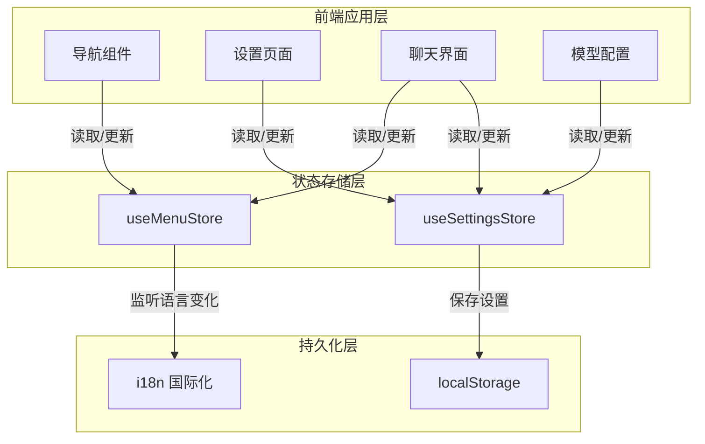

# frontend_state_store_contracts 模块深度技术解析

## 1. 模块概述

### 问题空间与存在意义

在现代前端应用中，状态管理是一个核心挑战。当应用具有复杂的导航结构、多模型配置、会话管理和用户偏好设置时，如何在组件之间高效、一致地共享状态，同时保持代码的可维护性，成为了一个关键问题。

**`frontend_state_store_contracts` 模块正是为了解决这一问题而设计的**。它充当了前端应用的"状态契约中心"，定义了两个核心状态领域的结构和行为：
1. 菜单导航状态 - 管理应用的侧边栏导航和会话列表
2. 应用设置状态 - 管理用户配置、模型选择、知识库连接等

想象一下，如果没有这个模块，每个组件都需要直接管理自己的状态，当需要在组件间共享状态时，就会通过 props 层层传递或使用事件总线，导致代码耦合度高、调试困难。这个模块就像是一个"中央信息中心"，所有组件都可以从这里获取最新状态，也可以在这里更新状态，而不需要知道其他组件的存在。

### 核心价值

- **状态一致性**：确保整个应用使用相同的状态定义和更新逻辑
- **持久化支持**：关键设置自动保存到 localStorage，刷新页面后不会丢失
- **类型安全**：通过 TypeScript 接口定义，提供编译时类型检查
- **可预测性**：集中式状态管理使得状态变化更容易追踪和调试

## 2. 架构与核心组件

### 架构概览

这个架构展示了模块的三层结构：
1. **前端应用层**：使用状态的各种组件
2. **状态存储层**：两个核心 Store，分别管理菜单和设置
3. **持久化层**：localStorage 用于设置持久化，i18n 用于菜单国际化

### 核心组件详解

#### 2.1 MenuStore - 菜单导航状态管理

**设计意图**：管理应用的主导航菜单和动态会话列表，支持国际化和会话的增删改查。

**核心数据结构**：
- `MenuItem` 接口：定义菜单项的结构，包括标题、图标、路径和子菜单
- `menuArr`：响应式数组，存储主导航项
- 会话相关状态：`isFirstSession`、`firstQuery`、`firstMentionedItems`、`firstModelId`

**关键方法**：
- `applyMenuTranslations`：根据当前语言更新菜单标题
- `updatemenuArr`：添加新会话到菜单
- `updatasessionTitle`：更新会话标题
- `clearMenuArr`：清空会话列表

**设计亮点**：
- 使用 Vue 的 `watch` 监听语言变化，自动更新菜单翻译
- 会话列表作为"聊天"菜单项的子项动态管理
- 支持首次会话的特殊状态跟踪

#### 2.2 SettingsStore - 应用设置状态管理

**设计意图**：集中管理所有用户可配置的设置，提供类型安全的接口和自动持久化。

**核心数据结构**：
- `Settings` 接口：顶层设置对象，包含所有配置项
- `ModelConfig`：多模型配置，支持聊天、嵌入、重排、VLLM 四种模型类型
- `AgentConfig`：智能体配置，包括迭代次数、温度、允许的工具等
- `ConversationModels`：当前对话使用的模型配置

**关键方法**：
- `saveSettings`：保存完整设置到 localStorage
- `updateAgentConfig`：部分更新智能体配置
- `addModel`/`updateModel`/`deleteModel`：模型管理方法
- `selectAgent`：选择智能体，自动切换模式并重置相关状态
- `toggleWebSearch`/`toggleMemory`：功能开关方法

**设计亮点**：
- 所有设置变更自动同步到 localStorage
- 提供 `isAgentReady` 和 `isNormalModeReady` 等计算属性，方便组件判断当前状态是否可用
- 模型管理支持默认模型设置，确保始终有一个可用模型
- 切换智能体时自动清空知识库和文件选择，避免状态混淆

## 3. 数据流程分析

### 3.1 菜单导航流程

当用户创建新会话时：
1. 聊天组件调用 `updatemenuArr` 或 `updataMenuChildren` 方法
2. MenuStore 更新 `menuArr[3].children` 数组
3. 导航组件检测到 `menuArr` 变化，自动重新渲染
4. 新会话出现在"聊天"菜单的子项中

当用户切换语言时：
1. i18n 的 `locale` 值变化
2. MenuStore 中的 watcher 检测到变化
3. 调用 `applyMenuTranslations` 更新所有菜单项的 `title`
4. 导航组件自动重新渲染，显示新语言的菜单

### 3.2 设置更新流程

以用户选择聊天模型为例：
1. 设置页面调用 `updateConversationModels` 方法，传入新的 `selectedChatModelId`
2. SettingsStore 更新 `settings.conversationModels`
3. 同时将新设置保存到 localStorage
4. 所有使用 `conversationModels` 的组件（如聊天界面、模型选择器）自动更新

当用户切换智能体时：
1. 组件调用 `selectAgent` 方法，传入智能体 ID 和可选的来源租户 ID
2. SettingsStore 更新 `selectedAgentId` 和 `selectedAgentSourceTenantId`
3. 根据智能体类型自动设置 `isAgentEnabled`
4. 清空 `selectedKnowledgeBases`、`selectedFiles` 和 `selectedFileKbMap`
5. 保存到 localStorage
6. 相关组件（聊天界面、知识库选择器）响应变化，重置状态

## 4. 关键设计决策与权衡

### 4.1 状态分片 vs 单一 Store

**决策**：将状态分为 `useMenuStore` 和 `useSettingsStore` 两个独立的 Store。

**权衡分析**：
- ✅ **优点**：关注点分离，每个 Store 管理自己的领域，代码更清晰
- ✅ **优点**：可以独立测试和演进
- ❌ **缺点**：如果两个 Store 之间需要共享状态，会增加复杂度
- ❌ **缺点**：开发者需要知道哪个状态在哪个 Store 中

**为什么这样选择**：在这个应用中，菜单状态和设置状态是相对独立的领域，很少需要直接交互。分离它们使得代码更易维护，同时不会增加太多复杂度。

### 4.2 直接 localStorage 持久化 vs 中间件

**决策**：在每个更新方法中直接调用 `localStorage.setItem`。

**权衡分析**：
- ✅ **优点**：实现简单，直观易懂
- ✅ **优点**：可以精确控制哪些变更需要持久化
- ❌ **缺点**：代码重复，每个更新方法都要写保存逻辑
- ❌ **缺点**：如果持久化逻辑变化（如改用 IndexedDB），需要修改很多地方

**为什么这样选择**：对于这个规模的应用，直接持久化的简单性压倒了其缺点。而且，不是所有状态变更都需要持久化（如菜单的会话列表），这种方式给了开发者更细粒度的控制。

### 4.3 完整对象替换 vs 部分更新

**决策**：同时提供 `saveSettings`（完整替换）和 `updateAgentConfig` 等（部分更新）方法。

**权衡分析**：
- ✅ **优点**：灵活性高，开发者可以根据场景选择合适的方法
- ✅ **优点**：部分更新方法更符合单一职责原则
- ❌ **缺点**：API 表面变大，需要维护更多方法
- ❌ **缺点**：可能导致开发者混淆该使用哪个方法

**为什么这样选择**：这是一个实用性优先的决策。完整替换方法在初始化和重置时很有用，而部分更新方法在日常使用中更方便。通过提供两种方式，模块可以适应不同的使用场景。

### 4.4 TypeScript 接口定义在 Store 文件中 vs 单独文件

**决策**：将所有接口定义直接放在对应的 Store 文件中。

**权衡分析**：
- ✅ **优点**：接口和使用它的代码放在一起，更容易理解和维护
- ✅ **优点**：减少文件数量，项目结构更简洁
- ❌ **缺点**：如果其他模块需要使用这些接口，会产生不必要的依赖
- ❌ **缺点**：文件可能变得很长，可读性下降

**为什么这样选择**：在这个应用中，这些接口主要被对应的 Store 使用，很少被其他模块直接引用。将它们放在一起使得代码更内聚，符合"高内聚、低耦合"的设计原则。

## 5. 子模块概览

### 5.1 menu_navigation_state_contracts

这个子模块专注于菜单导航状态的契约定义和管理。它包括 `MenuItem` 接口、菜单数组结构、会话列表管理等。这个子模块是应用导航的骨架，确保用户可以在不同功能区域之间流畅切换。

[查看详细文档](frontend_contracts_and_state-frontend_state_store_contracts-menu_navigation_state_contracts.md)

### 5.2 application_settings_state_contracts

这个子模块专注于应用设置状态的契约定义和管理。它包括 `Settings` 接口及其所有子接口、默认设置值、设置持久化逻辑等。这个子模块是应用配置的核心，确保用户的偏好设置能够被正确保存和应用。

[查看详细文档](frontend_contracts_and_state-frontend_state_store_contracts-application_settings_state_contracts.md)

## 6. 与其他模块的关系

### 6.1 依赖关系

这个模块主要依赖：
- **Pinia**：状态管理库，提供 Store 的基础架构
- **Vue 3**：响应式系统，用于状态的响应式更新
- **i18n**：国际化库，用于菜单翻译
- **localStorage**：浏览器 API，用于设置持久化

### 6.2 被依赖关系

这个模块被前端应用的几乎所有其他模块依赖：
- **导航组件**：使用 MenuStore 显示菜单和会话列表
- **设置页面**：使用 SettingsStore 显示和修改设置
- **聊天界面**：使用两个 Store，获取会话列表和当前配置
- **模型配置组件**：使用 SettingsStore 管理模型列表

### 6.3 数据契约

这个模块定义了前端应用的核心数据契约，确保所有组件对"菜单是什么"和"设置是什么"有共同的理解。这些契约通过 TypeScript 接口强制执行，减少了因类型不匹配导致的错误。

## 7. 新贡献者指南

### 7.1 常见陷阱与注意事项

1. **不要直接修改状态对象**：虽然在技术上可以直接修改 Store 中的状态对象，但这会绕过持久化逻辑。始终使用提供的方法来更新状态。

2. **注意 `selectAgent` 的副作用**：这个方法会清空知识库和文件选择，这是有意设计的，但有时会让开发者感到意外。

3. **默认模型的重要性**：系统设计为始终有一个默认模型。删除模型时，如果删除的是默认模型，系统会自动将第一个模型设为默认。添加第一个模型时，会自动设为默认。

4. **菜单翻译的时机**：菜单翻译在 Store 初始化时和语言变化时自动应用，不需要手动触发。

5. **Settings 的可选属性**：`Settings` 接口中的一些属性是可选的，Store 中使用了默认值来确保即使这些属性缺失，系统也能正常工作。

### 7.2 扩展建议

1. **添加新的设置项**：
   - 在 `Settings` 接口中添加新字段
   - 在 `defaultSettings` 中提供默认值
   - 添加对应的 getter 和 action
   - 考虑是否需要在 `selectAgent` 等方法中重置这个新设置

2. **添加新的菜单项**：
   - 在 `menuArr` 初始化数组中添加新的 `MenuItem`
   - 如果需要国际化，添加对应的 `titleKey`
   - 在语言文件中添加翻译

3. **添加状态持久化的中间件**：
   - 如果发现直接在每个方法中保存到 localStorage 太重复，可以考虑使用 Pinia 的中间件功能
   - 设计一个标记系统，指示哪些状态需要持久化

4. **添加状态验证**：
   - 在更新状态的方法中添加验证逻辑，确保设置的值符合预期
   - 例如，确保 `temperature` 在 0 到 2 之间，`maxIterations` 是正整数等

## 8. 总结

`frontend_state_store_contracts` 模块是前端应用的状态管理基石，它通过两个核心 Store 分别管理菜单导航和应用设置。模块的设计体现了关注点分离、实用性优先的原则，通过 TypeScript 接口提供类型安全，通过 localStorage 提供持久化支持。

对于新加入的团队成员，理解这个模块的设计意图和数据流程是掌握前端应用架构的关键。希望这份文档能够帮助你快速上手，并在未来的开发中做出明智的设计决策。
