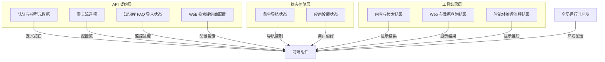

# frontend_contracts_and_state 模块文档

## 概述

`frontend_contracts_and_state` 模块是前端应用的契约中心和状态管理层，它扮演着两个关键角色：
- **契约定义者**：为前端与后端之间的所有 API 交互定义严格的 TypeScript 接口
- **状态管理者**：定义前端应用的核心状态结构，包括用户设置、菜单导航和工具结果

想象这个模块是前端应用的"交通规则手册"和"城市地图"——它规定了数据如何在系统中流动（契约），同时也定义了应用的核心布局和配置（状态）。没有这个模块，前端组件将无法可靠地与后端通信，也无法保持一致的用户体验。

## 架构概览

这个模块的架构采用了分层设计，从下到上分别是：
1. **全局运行时环境**：提供基础的环境配置支持
2. **API 契约层**：定义与后端交互的数据结构
3. **状态存储层**：管理应用的核心状态
4. **工具结果层**：定义智能体工具执行结果的数据结构

### 核心组件说明

- **API 契约**：确保前端与后端通信的数据一致性，包括认证信息、聊天流配置、导入进度和搜索提供商配置
- **状态存储**：管理菜单导航和用户设置，确保应用状态的一致性和可预测性
- **工具结果**：定义智能体执行各种工具后返回的数据结构，使前端能够统一处理不同类型的结果
- **运行时环境**：提供全局配置支持，如文件大小限制等

## 核心设计决策

### 1. 接口优先的契约设计

**决策**：使用 TypeScript 接口定义所有数据契约，而不是使用类或运行时验证。

**原因**：
- 接口在编译时提供类型安全，不会增加运行时开销
- 与后端 API 响应的 JSON 数据天然匹配
- 简化了数据转换逻辑，减少了样板代码

**权衡**：
- ✅ 优点：轻量、高效、类型安全
- ❌ 缺点：缺乏运行时验证，需要依赖后端遵守契约

### 2. 集中式状态管理

**决策**：使用 Pinia 进行状态管理，将菜单和设置等核心状态集中存储。

**原因**：
- 避免组件间 props  drilling，简化状态共享
- 提供清晰的状态变更追踪
- 支持状态持久化（如设置存储在 localStorage）

**权衡**：
- ✅ 优点：状态可预测、易于调试、支持持久化
- ❌ 缺点：增加了一定的 boilerplate，小应用可能显得过重

### 3. 工具结果的联合类型设计

**决策**：使用 TypeScript 联合类型定义所有工具结果，通过 `display_type` 字段进行区分。

**原因**：
- 允许前端统一处理不同类型的工具结果
- 提供类型安全的结果访问
- 便于扩展新的工具结果类型

**权衡**：
- ✅ 优点：类型安全、易于扩展、统一处理
- ❌ 缺点：需要类型守卫才能访问特定类型的字段

### 4. 运行时配置的全局注入

**决策**：通过 `window.__RUNTIME_CONFIG__` 全局注入运行时配置，支持 Docker 环境动态配置。

**原因**：
- 允许在不重新构建的情况下修改配置
- 支持 Docker 环境变量配置
- 提供配置优先级（运行时 > 构建时 > 默认值）

**权衡**：
- ✅ 优点：灵活、支持动态配置、易于部署
- ❌ 缺点：依赖全局对象，可能与其他库冲突

## 子模块说明

### API 契约层

- [api_contracts_for_backend_integrations](frontend_contracts_and_state-api_contracts_for_backend_integrations.md)：定义与后端交互的所有 API 契约，包括认证、聊天流、FAQ 导入和 Web 搜索配置

### 状态存储层

- [frontend_state_store_contracts](frontend_contracts_and_state-frontend_state_store_contracts.md)：管理应用的核心状态，包括菜单导航和用户设置

### 工具结果层

- [tool_result_contracts_for_content_and_retrieval](frontend_contracts_and_state-tool_result_contracts_for_content_and_retrieval.md)：内容和检索相关的工具结果类型定义
- [tool_result_contracts_for_web_and_data_queries](frontend_contracts_and_state-tool_result_contracts_for_web_and_data_queries.md)：Web 和数据查询相关的工具结果类型定义
- [tool_result_contracts_for_agent_reasoning_flow](frontend_contracts_and_state-tool_result_contracts_for_agent_reasoning_flow.md)：智能体推理流程相关的工具结果类型定义

### 全局运行时环境

- [global_runtime_environment_contracts](frontend_contracts_and_state-global_runtime_environment_contracts.md)：全局运行时环境配置，支持 Docker 动态配置

## 跨模块依赖

这个模块是前端应用的基础模块，被几乎所有其他前端组件依赖：

- **被依赖**：所有前端组件都可能使用这里定义的接口和状态
- **依赖**：
  - Vue 3 的响应式系统（用于状态管理）
  - Pinia（用于状态存储）
  - @microsoft/fetch-event-source（用于流式聊天）
  - tdesign-vue-next（用于 UI 组件）

## 新贡献者指南

### 常见陷阱

1. **契约变更的影响**：修改接口时要确保后端也做相应变更，否则会导致运行时错误
2. **状态持久化**：修改设置状态结构时要考虑旧版本 localStorage 的兼容性
3. **工具结果类型守卫**：访问工具结果特定字段时必须使用类型守卫
4. **运行时配置**：不要假设 `window.__RUNTIME_CONFIG__` 一定存在，要提供默认值

### 扩展建议

1. **添加新的工具结果类型**：
   - 在 `tool-results.ts` 中定义新接口
   - 将新接口添加到 `ToolResultData` 联合类型
   - 在 `DisplayType` 中添加新的显示类型

2. **添加新的设置项**：
   - 在 `Settings` 接口中添加新字段
   - 在 `defaultSettings` 中提供默认值
   - 添加相应的 getter 和 action

3. **添加新的 API 契约**：
   - 在相应的 API 文件中定义请求和响应接口
   - 确保与后端 API 文档一致
   - 添加类型安全的 API 调用函数
