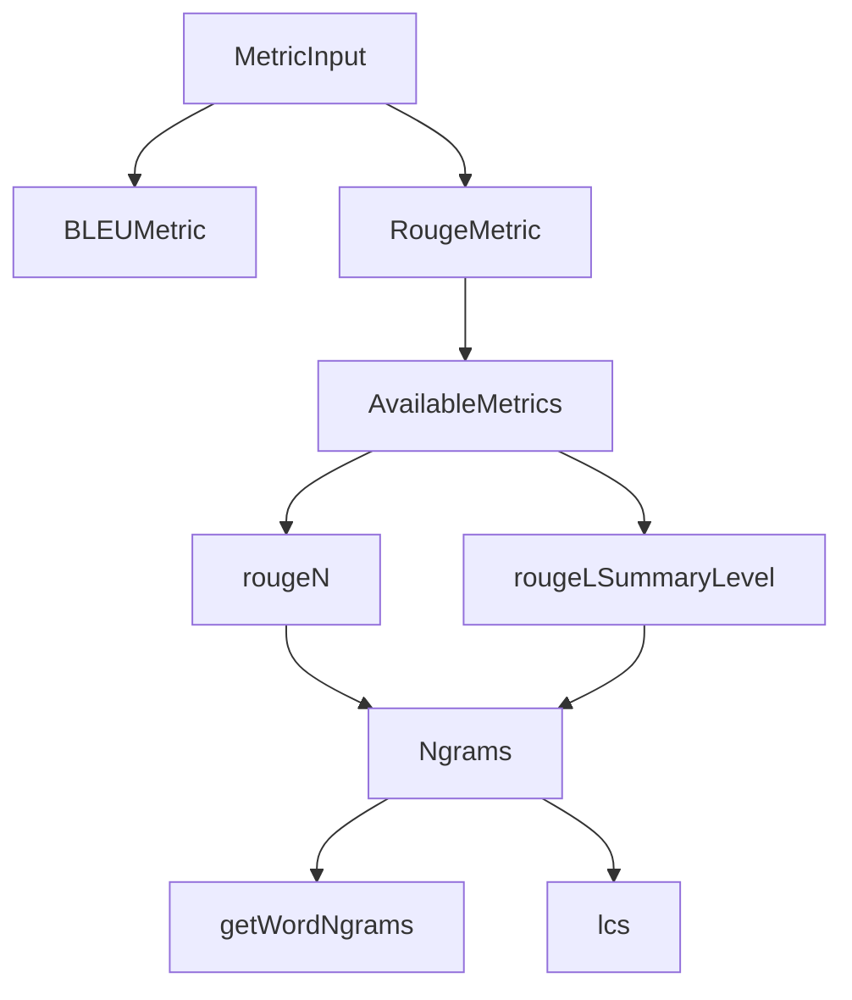

# 生成文本重叠度指标 (generation_text_overlap_metrics)

## 1. 模块概述

当我们构建一个能够生成文本的 AI 系统时，一个核心问题始终存在：如何客观地衡量生成文本的质量？这个模块提供了一套标准的文本重叠度评估指标，用于量化生成文本与参考文本之间的相似性，是评估系统性能的重要基础设施。

想象一下，你在批改学生的作文——你会关注他们是否使用了正确的词汇（n-gram匹配），是否涵盖了关键要点（召回率），以及是否有冗余内容（精确率）。这个模块就像是一个自动化的作文批改老师，只不过它使用的是数学方法而非主观判断。

本模块实现了两种业界标准的文本评估指标：
- **BLEU**：常用于机器翻译评估，基于精确率的指标
- **ROUGE**：常用于文本摘要评估，基于召回率的指标

## 2. 架构概览

这个模块的架构设计遵循了策略模式的思想：
- **统一接口**：所有指标都通过 `Compute` 方法接收相同的输入类型 `MetricInput`
- **可配置策略**：BLEU 可配置平滑和权重，ROUGE 可配置指标类型和统计量
- **共享基础设施**：两种指标都依赖于底层的 n-gram 处理和文本分割工具

数据流向非常直观：
1. 输入包含生成文本和参考文本
2. 文本被分割成句子和单词
3. 根据指标类型计算重叠度
4. 返回标准化的分数（0-1 之间）

## 3. 核心组件解析

### 3.1 BLEUMetric - 双语评估替补指标

**BLEU** (Bilingual Evaluation Understudy) 是一个基于精确率的指标，最初设计用于机器翻译评估。

**设计意图**：BLEU 的核心思想是翻译得越好，与参考译文的 n-gram 重叠就越多。它不仅仅看单个词的匹配，还看词序的保持（通过 n-gram）。

**关键设计决策**：
- **修改的精确率**：简单的精确率会奖励重复生成常见词，BLEU 通过裁剪计数解决了这个问题
- **简洁惩罚**：防止生成过短的文本作弊
- **平滑处理**：处理高阶 n-gram 可能没有匹配的情况

### 3.2 RougeMetric - 面向摘要的召回率指标

**ROUGE** (Recall-Oriented Understudy for Gisting Evaluation) 是一个基于召回率的指标家族，特别适合文本摘要评估。

**设计意图**：对于摘要任务，我们更关心是否涵盖了参考摘要中的关键信息，而不是是否精确复制了每个词——这就是 ROUGE 更关注召回率的原因。

**关键设计决策**：
- **多种 n-gram 变体**：rouge-1 到 rouge-5 捕获不同粒度的词汇重叠
- **rouge-l**：基于最长公共子序列，考虑词序但允许间隔
- **统计量选择**：可以选择 f1（平衡）、p（精确率）或 r（召回率）

### 3.3 Ngrams - n-gram 集合抽象

**Ngrams** 是整个模块的基础设施，它提供了高效的 n-gram 存储、比较和操作。

**设计意图**：将 n-gram 的处理逻辑从具体指标中分离出来，实现代码复用和关注点分离。

**关键特性**：
- **排他模式**：可以选择是否计数重复的 n-gram
- **集合操作**：支持交集、并集等集合运算
- **批处理**：可以一次性添加多个 n-gram

## 4. 设计权衡与决策

### 4.1 精确率 vs 召回率 - BLEU 与 ROUGE 的互补

**选择**：同时提供两种指标，让用户根据任务选择。

**原因**：
- 机器翻译需要精确（BLEU 优先）
- 文本摘要需要覆盖（ROUGE 优先）
- 两者结合可以给出更全面的评估

### 4.2 简洁惩罚 - 防止短文本作弊

**选择**：BLEU 中实现了简洁惩罚。

**权衡**：
- 收益：防止生成极短但精确的文本获得高分
- 代价：增加了计算复杂度，需要比较长度

**为什么这样设计**：在实践中，我们发现没有简洁惩罚的 BLEU 很容易被游戏——生成几个高概率的词就能获得不错的分数。

### 4.3 平滑处理 - 处理稀疏数据

**选择**：BLEU 提供可选的平滑处理。

**权衡**：
- 收益：即使高阶 n-gram 没有匹配，也能返回合理的分数
- 代价：可能会高估质量较差的生成文本

**为什么可选**：不同的场景有不同的需求——某些场景下，即使没有 4-gram 匹配，我们也希望得到一个非零的分数；而在另一些场景下，我们希望严格一些。

## 5. 使用指南与注意事项

### 5.1 如何选择合适的指标

| 任务类型 | 推荐指标 | 说明 |
|---------|---------|------|
| 机器翻译 | BLEU-4 | 关注精确性和词序 |
| 文本摘要 | ROUGE-1, ROUGE-2, ROUGE-L | 关注信息覆盖 |
| 通用生成 | BLEU + ROUGE 组合 | 获得全面视角 |

### 5.2 常见陷阱与注意事项

1. **不要过度依赖单一指标**：
   - 高 BLEU 分数不代表好的翻译，只是相似的翻译
   - 这些指标无法评估语义理解、创造力或风格

2. **文本预处理很重要**：
   - 当前实现使用简单的空白分割，对中文等语言可能不够
   - 大小写归一化已经内置，但可能需要额外的标准化

3. **长度敏感性**：
   - BLEU 对长度差异敏感，过短或过长的文本都会被惩罚
   - ROUGE-L 对长度相对鲁棒，但仍受影响

## 6. 子模块详解

本模块包含三个主要子模块：

- [BLEU 精确率重叠指标](application_services_and_orchestration-evaluation_dataset_and_metric_services-generation_text_overlap_metrics-bleu_precision_based_overlap_metric.md)：详细介绍 BLEU 指标的实现细节和数学原理
- [ROUGE 召回率重叠指标](application_services_and_orchestration-evaluation_dataset_and_metric_services-generation_text_overlap_metrics-rouge_recall_oriented_overlap_metric.md)：深入解析 ROUGE 指标家族的各种变体
- [N-gram 重叠原语](application_services_and_orchestration-evaluation_dataset_and_metric_services-generation_text_overlap_metrics-ngram_overlap_primitives.md)：解释底层 n-gram 处理和集合操作的实现

## 7. 与其他模块的关系

这个模块在整个系统中处于评估基础设施的位置：

- **上游依赖**：
  - `evaluation_dataset_and_metric_services`：编排评估流程，调用本模块计算指标
  - `types`：提供 `MetricInput` 数据结构

- **下游依赖**：无（这是一个相对独立的计算模块）

这种设计使得指标计算逻辑可以独立于评估流程演化，同时也便于在其他上下文中复用这些指标。
