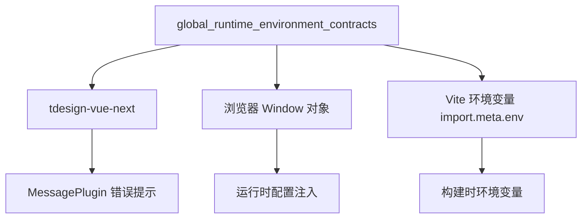

# global_runtime_environment_contracts 模块深度解析

## 一、模块存在的意义：为什么需要全局运行时环境契约

想象一下你正在部署一个前端应用到多个环境：开发环境、测试环境、生产环境，甚至多个客户各自的私有化部署。每个环境可能有不同的配置需求——比如文件上传大小限制、API 端点地址、功能开关等。传统的做法是在构建时通过环境变量固化这些配置，但这意味着**每次修改配置都需要重新构建和部署整个前端包**。

`global_runtime_environment_contracts` 模块解决的就是这个痛点。它定义了一套**运行时配置注入机制**，允许在容器启动时动态注入配置，而无需重新构建前端代码。这种模式在 Docker/Kubernetes 部署场景中尤为常见：镜像构建一次，配置在运行时注入。

该模块的核心洞察是：**前端应用的部分配置应该在运行时而非构建时确定**。它通过扩展浏览器全局 `Window` 对象，定义了一个类型安全的契约接口 `__RUNTIME_CONFIG__`，让后端或容器编排系统可以在页面加载时注入配置，前端代码则通过这个契约读取配置值。

此外，该模块还承载了一些跨组件的通用工具函数，这些函数需要访问运行时配置（如文件大小限制），因此被组织在这个模块中而非分散在各处。

---

## 二、架构心智模型：运行时配置注入模式

### 核心抽象

把这个模块想象成一个**配置桥梁**——它连接了部署环境（Docker 容器、Nginx 配置等）和前端应用代码。桥梁的两端分别是：

```
┌─────────────────────────────────────────────────────────────────┐
│                    部署环境侧                                     │
│  (Docker 环境变量 / Nginx 配置 / 容器启动参数)                      │
│         │                                                        │
│         ▼                                                        │
│  ┌──────────────────┐                                           │
│  │  window.         │  ← 配置注入点                              │
│  │  __RUNTIME_CONFIG__│                                          │
│  └──────────────────┘                                           │
└─────────────────────────────────────────────────────────────────┘
                            │
                            │  类型安全契约
                            ▼
┌─────────────────────────────────────────────────────────────────┐
│                    前端应用侧                                     │
│  ┌──────────────────────────────────────────────────────────┐   │
│  │  kbFileTypeVerification()                                 │   │
│  │         │                                                 │   │
│  │         ▼                                                 │   │
│  │  读取 MAX_FILE_SIZE_MB → 验证文件大小                      │   │
│  └──────────────────────────────────────────────────────────┘   │
└─────────────────────────────────────────────────────────────────┘
```

### 配置优先级链

模块实现了一个三层优先级链，这是理解其行为的关键：

```
运行时配置 (window.__RUNTIME_CONFIG__)
        ↓ (如果不存在)
构建时环境变量 (import.meta.env.VITE_*)
        ↓ (如果不存在)
硬编码默认值 (50MB)
```

这种设计确保了**最大灵活性**：生产环境可以通过运行时配置覆盖，开发环境可以用环境变量，而代码本身始终有一个安全的 fallback 值。

---

## 三、组件深度解析

### 3.1 Window 接口扩展 (`frontend.src.utils.index.Window`)

**目的**：为 TypeScript 提供类型安全的全局配置访问点

```typescript
declare global {
  interface Window {
    __RUNTIME_CONFIG__?: {
      MAX_FILE_SIZE_MB?: number;
    };
  }
}
```

**设计意图**：

这个接口扩展是典型的 TypeScript **声明合并（Declaration Merging）**模式。它不生成任何运行时代码，而是告诉 TypeScript 编译器："`window` 对象上可能有一个 `__RUNTIME_CONFIG__` 属性"。这样做的好处是：

1. **类型安全**：访问 `window.__RUNTIME_CONFIG__.MAX_FILE_SIZE_MB` 时不会报类型错误
2. **可选链友好**：使用 `?.` 操作符可以安全访问，即使配置未注入也不会抛出异常
3. **可扩展**：未来需要添加新配置项时，只需在此接口中添加字段

**使用方式**：

配置通常在 HTML 模板中注入，例如 Nginx 配置：

```javascript
// 在 index.html 的 <script> 标签中
window.__RUNTIME_CONFIG__ = {
  MAX_FILE_SIZE_MB: 100
};
```

**注意事项**：

- 该接口定义使用 `?` 标记所有字段为可选，这意味着代码必须处理配置缺失的情况
- 配置注入必须在任何访问它的代码执行之前完成（通常在 `<head>` 中）

---

### 3.2 文件大小验证函数 (`kbFileTypeVerification`)

**目的**：在文件上传到知识库前进行客户端验证，减少无效请求和服务器负载

**函数签名**：
```typescript
function kbFileTypeVerification(file: any, silent = false): boolean
```

**返回值语义**：
- 返回 `true` 表示**验证失败**（文件有问题）
- 返回 `false` 表示**验证通过**（文件可用）

这个返回值设计值得注意：函数名是"验证"，但返回 `true` 表示"有问题"。这是一种**错误信号优先**的设计模式，调用方可以这样使用：

```typescript
if (kbFileTypeVerification(file)) {
  // 验证失败，阻止上传
  return;
}
// 验证通过，继续上传
```

**内部逻辑流程**：

```
┌─────────────────────────────────────────────────────────────┐
│                    kbFileTypeVerification                    │
└─────────────────────────────────────────────────────────────┘
                            │
                            ▼
              ┌─────────────────────────┐
              │ 1. 提取文件扩展名         │
              │    file.name 后缀        │
              └─────────────────────────┘
                            │
                            ▼
              ┌─────────────────────────┐
              │ 2. 检查扩展名白名单       │
              │    pdf/txt/md/docx/...   │
              └─────────────────────────┘
                            │
                   ┌────────┴────────┐
                   │ 不在白名单？     │
                   └────────┬────────┘
                     Yes    │    No
                      │     │
                      ▼     ▼
                 返回 true  ┌─────────────────────────┐
                 (显示错误)  │ 3. 检查文件大小限制     │
                           │    (仅针对特定类型)       │
                           └─────────────────────────┘
                                      │
                             ┌────────┴────────┐
                             │ 超过限制？       │
                             └────────┬────────┘
                               Yes    │    No
                                │     │
                                ▼     ▼
                           返回 true  返回 false
                           (显示错误)  (验证通过)
```

**配置读取逻辑**：

```typescript
const MAX_FILE_SIZE_MB = window.__RUNTIME_CONFIG__?.MAX_FILE_SIZE_MB 
  || Number(import.meta.env.VITE_MAX_FILE_SIZE_MB) 
  || 50;
```

这行代码实现了前述的三层优先级链。注意 `Number()` 转换——环境变量是字符串，需要显式转换为数字。

**设计权衡**：

1. **客户端验证 vs 服务器验证**：此函数仅做客户端验证，服务器端必须有相同的验证逻辑。客户端验证的目的是**提升用户体验**（即时反馈）和**减少无效网络请求**，而非安全防护。

2. **硬编码文件类型白名单**：当前支持的文件类型是硬编码的。如果后端支持的文件类型发生变化，前端代码需要同步更新。更好的设计可能是从后端动态获取支持的文件类型列表。

3. **静默模式 (`silent` 参数)**：允许调用方选择是否显示错误提示。这在批量上传场景中很有用——可以收集所有错误后统一显示，而非每个文件弹出一个错误。

---

### 3.3 工具函数

#### `generateRandomString(length: number)`

**目的**：生成指定长度的随机字母数字字符串

**使用场景**：
- 生成临时文件标识符
- 生成会话 ID 或请求追踪 ID
- 生成测试数据

**实现特点**：
- 使用 `Math.random()`，**不是加密安全的**
- 适用于 UI 层面的随机性需求，不应用于安全敏感场景（如密码、令牌）

**替代方案**：
对于安全敏感场景，应使用 `crypto.getRandomValues()`：

```typescript
function generateSecureRandomString(length: number) {
  const chars = "ABCDEFGHIJKLMNOPQRSTUVWXYZabcdefghijklmnopqrstuvwxyz0123456789";
  const array = new Uint32Array(length);
  crypto.getRandomValues(array);
  return Array.from(array, n => chars[n % chars.length]).join('');
}
```

---

#### `formatStringDate(date: any)`

**目的**：将日期对象格式化为标准字符串格式 `YYYY-MM-DD HH:mm:ss`

**实现细节**：
- 使用 `padStart(2, '0')` 确保月份、日期等始终为两位数
- 接受任何 `Date` 构造函数可解析的输入（时间戳、日期字符串等）

**使用场景**：
- 表格中显示时间戳
- 日志记录
- 文件命名（避免特殊字符）

**潜在问题**：
- 没有时区处理，使用本地时区
- 没有国际化支持，格式固定为中文环境习惯

---

## 四、依赖关系与数据流

### 4.1 模块依赖



**外部依赖**：
- `tdesign-vue-next`：UI 组件库，仅用于 `MessagePlugin.error()` 显示错误提示
- 浏览器 `Window` 对象：配置注入的载体
- Vite 构建系统：提供 `import.meta.env` 访问构建时环境变量

### 4.2 被依赖关系

该模块被以下场景调用：

```
知识库文件上传流程
       │
       ▼
前端上传组件
       │
       ▼
kbFileTypeVerification()  ← 本模块
       │
       ▼
验证通过 → 调用上传 API
验证失败 → 显示错误，阻止上传
```

在代码库中，该模块位于 `frontend/src/utils/` 目录下，通常通过以下方式导入：

```typescript
import { kbFileTypeVerification, formatStringDate } from '@/utils';
```

### 4.3 数据契约

**输入契约**（`kbFileTypeVerification`）：
```typescript
{
  file: {
    name: string,      // 文件名，用于提取扩展名
    size: number       // 文件大小（字节）
  },
  silent?: boolean     // 是否静默验证
}
```

**输出契约**：
```typescript
boolean  // true = 验证失败，false = 验证通过
```

**配置契约**：
```typescript
window.__RUNTIME_CONFIG__: {
  MAX_FILE_SIZE_MB?: number  // 最大文件大小（MB）
}
```

---

## 五、设计决策与权衡

### 5.1 为什么使用 Window 对象而非 API 获取配置？

**选择**：通过 `window.__RUNTIME_CONFIG__` 注入配置

**替代方案**：应用启动时调用 `/api/config` 接口获取配置

**权衡分析**：

| 维度 | Window 注入 | API 获取 |
|------|-----------|---------|
| 加载速度 | 即时可用，无额外请求 | 需要等待 API 响应 |
| 缓存策略 | 随 HTML 缓存 | 可独立缓存 |
| 动态更新 | 需刷新页面 | 可运行时轮询更新 |
| 部署复杂度 | 需修改 HTML 生成逻辑 | 只需后端提供接口 |
| 类型安全 | 需 TypeScript 声明 | 可通过 Zod 等运行时验证 |

**选择 Window 注入的原因**：
1. **零延迟**：配置在页面加载时立即可用，无需等待 API
2. **简化架构**：不需要额外的配置服务和缓存逻辑
3. **容器友好**：Docker 启动脚本可以轻松注入配置

**代价**：
- 配置变更需要重新加载页面
- HTML 生成逻辑需要支持配置注入（如使用 envsubst 或 Nginx 模板）

---

### 5.2 为什么文件大小限制只针对特定文件类型？

**观察**：代码中对 pdf/doc/docx/txt/md 检查大小限制，但对图片 (jpg/jpeg/png) 和表格 (csv/xlsx/xls) 没有明确的大小检查。

**可能原因**：
1. 历史遗留：最初只支持文档类型，图片是后来添加的
2. 业务假设：图片和表格通常较小，不需要限制
3. 代码遗漏：应该对所有类型应用相同限制

**建议**：这是一个潜在的**不一致性**。如果服务器端对所有文件类型都有统一的大小限制，前端验证应该保持一致。

---

### 5.3 为什么返回值是 `true = 失败`？

**设计模式**：这是**错误信号优先**（Error-Signal-First）模式。

**优点**：
```typescript
// 直观的错误处理流程
if (kbFileTypeVerification(file)) {
  // 有问题，处理错误
  return;
}
// 正常流程
uploadFile(file);
```

**缺点**：
- 函数名是"验证"，通常期望 `true = 通过`
- 与 JavaScript 内置验证 API（如 `isValid`）的语义相反

**改进建议**：考虑重命名为 `hasFileError()` 或 `isFileInvalid()` 以匹配返回值语义。

---

## 六、使用指南与示例

### 6.1 配置注入示例

**Docker + Nginx 方案**：

1. 在 `index.html` 模板中：
```html
<script>
  window.__RUNTIME_CONFIG__ = {
    MAX_FILE_SIZE_MB: ${MAX_FILE_SIZE_MB}
  };
</script>
```

2. 在 Docker 启动脚本中：
```bash
export MAX_FILE_SIZE_MB=100
envsubst '${MAX_FILE_SIZE_MB}' < /usr/share/nginx/html/index.html.template > /usr/share/nginx/html/index.html
```

**开发环境配置**：

在 `.env.local` 文件中：
```bash
VITE_MAX_FILE_SIZE_MB=200
```

---

### 6.2 文件上传组件集成

```typescript
import { kbFileTypeVerification } from '@/utils';

const handleFileSelect = (file: File) => {
  // 非静默模式，自动显示错误提示
  if (kbFileTypeVerification(file)) {
    return; // 验证失败，阻止上传
  }
  
  // 验证通过，执行上传
  uploadToKnowledgeBase(file);
};

const handleBatchUpload = (files: File[]) => {
  const errors: string[] = [];
  
  files.forEach(file => {
    // 静默模式，收集错误后统一处理
    if (kbFileTypeVerification(file, true)) {
      errors.push(`${file.name}: 文件类型或大小不符合要求`);
    }
  });
  
  if (errors.length > 0) {
    MessagePlugin.error(errors.join('\n'));
    return;
  }
  
  // 批量上传
  uploadFiles(files);
};
```

---

### 6.3 扩展运行时配置

如果需要添加新的配置项，按以下步骤操作：

1. **扩展 Window 接口**：
```typescript
declare global {
  interface Window {
    __RUNTIME_CONFIG__?: {
      MAX_FILE_SIZE_MB?: number;
      API_BASE_URL?: string;
      ENABLE_FEATURE_X?: boolean;
    };
  }
}
```

2. **在 HTML 模板中注入**：
```html
<script>
  window.__RUNTIME_CONFIG__ = {
    MAX_FILE_SIZE_MB: 100,
    API_BASE_URL: "https://api.example.com",
    ENABLE_FEATURE_X: true
  };
</script>
```

3. **在代码中使用**：
```typescript
const apiUrl = window.__RUNTIME_CONFIG__?.API_BASE_URL || '/api';
```

---

## 七、边界情况与注意事项

### 7.1 配置注入时机

**关键要求**：配置注入必须在任何访问它的代码执行**之前**完成。

**错误示例**：
```html
<!-- ❌ 错误：工具模块先加载，配置后注入 -->
<script src="/assets/utils.js"></script>
<script>
  window.__RUNTIME_CONFIG__ = { MAX_FILE_SIZE_MB: 100 };
</script>
```

**正确示例**：
```html
<!-- ✅ 正确：配置先注入，应用后加载 -->
<script>
  window.__RUNTIME_CONFIG__ = { MAX_FILE_SIZE_MB: 100 };
</script>
<script src="/assets/app.js"></script>
```

---

### 7.2 类型转换陷阱

环境变量是字符串，需要显式转换：

```typescript
// ❌ 错误：字符串 "100" 在布尔上下文中始终为 true
const size = import.meta.env.VITE_MAX_FILE_SIZE_MB || 50;

// ✅ 正确：显式转换为数字
const size = Number(import.meta.env.VITE_MAX_FILE_SIZE_MB) || 50;
```

注意：`Number("0")` 返回 `0`，而 `0 || 50` 会返回 `50`。如果允许配置为 `0`，需要使用更精确的检查：

```typescript
const size = (import.meta.env.VITE_MAX_FILE_SIZE_MB !== undefined)
  ? Number(import.meta.env.VITE_MAX_FILE_SIZE_MB)
  : 50;
```

---

### 7.3 安全考虑

**客户端验证不是安全边界**：

`kbFileTypeVerification` 仅用于提升用户体验，**不能替代服务器端验证**。恶意用户可以：
- 绕过前端 JavaScript 直接调用 API
- 修改 `window.__RUNTIME_CONFIG__` 的值
- 使用 curl/Postman 等工具直接发送请求

**服务器端必须有**：
- 相同的文件类型白名单验证
- 相同的文件大小限制
- 文件内容验证（防止伪装扩展名）

---

### 7.4 浏览器兼容性

- `?.` 可选链操作符：需要 ES2020+ 支持
- `padStart()`：需要 ES2017+ 支持
- `import.meta.env`：Vite 特有，不适用于其他构建工具

对于需要支持旧浏览器的场景，需要 Babel 转译或使用 polyfill。

---

### 7.5 测试注意事项

**单元测试**：
```typescript
// 模拟运行时配置
Object.defineProperty(window, '__RUNTIME_CONFIG__', {
  value: { MAX_FILE_SIZE_MB: 100 },
  writable: true,
});

// 模拟环境变量
import.meta.env.VITE_MAX_FILE_SIZE_MB = '200';
```

**测试用例覆盖**：
1. 运行时配置存在时的行为
2. 运行时配置缺失、环境变量存在时的行为
3. 两者都缺失时使用默认值的行为
4. 各种文件类型的验证结果
5. 边界大小（正好等于限制、超过 1 字节等）

---

## 八、相关模块参考

- [frontend_contracts_and_state](frontend_contracts_and_state.md)：前端状态管理和 API 契约的父模块
- [sdk_client_library](sdk_client_library.md)：后端 API 客户端库，文件上传最终调用的接口
- [knowledge_and_chunk_api](knowledge_and_chunk_api.md)：知识库和分块相关的 API 契约

---

## 九、总结

`global_runtime_environment_contracts` 模块虽然代码量不大，但承载了重要的架构职责：

1. **运行时配置注入**：通过扩展 `Window` 接口，实现了容器化部署场景下的动态配置能力
2. **配置优先级链**：运行时 > 构建时 > 默认值，平衡了灵活性和可维护性
3. **客户端验证**：在文件上传流程中提供即时反馈，减少无效请求

理解这个模块的关键是把握其**桥梁角色**——它连接了部署环境和应用代码，让配置管理更加灵活。对于新加入的开发者，最重要的是理解配置注入的时机和优先级，以及在扩展配置时需要同时更新接口声明和注入逻辑。
