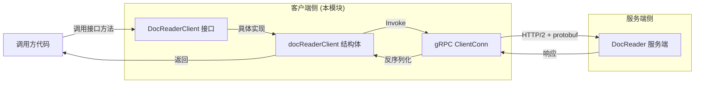

# go_grpc_client_interface_and_transport_impl 模块深度解析

## 概述：为什么需要这个模块

想象一下，你的系统需要调用一个远程服务来解析各种格式的文档（PDF、Word、Excel 等）——这个服务可能运行在另一个进程、另一台机器，甚至另一个语言环境中。你不能直接调用它的函数，你需要一种**类型安全的远程过程调用（RPC）机制**。

`go_grpc_client_interface_and_transport_impl` 模块正是解决这个问题的。它提供了 DocReader 服务的 **gRPC 客户端接口和传输实现**，让 Go 代码能够像调用本地函数一样调用远程文档解析服务。这个模块是自动生成的（由 `protoc-gen-go-grpc` 从 protobuf 定义生成），它封装了所有网络通信、序列化/反序列化的复杂性，只暴露简洁的方法签名给调用者。

**核心洞察**：这个模块的本质是一个**类型安全的 RPC 存根（stub）**。它把"调用远程服务"这个复杂的网络操作，简化为"调用一个 Go 接口方法"这样直观的编程模型。调用者无需关心 HTTP/2 连接、protobuf 编码、超时重试等底层细节，只需关注业务层面的请求和响应。

---

## 架构与数据流



### 组件角色说明

| 组件 | 角色 | 职责 |
|------|------|------|
| `DocReaderClient` | 接口契约 | 定义客户端可以调用的方法签名，是调用方依赖的抽象 |
| `docReaderClient` | 传输实现 | 持有 `grpc.ClientConnInterface`，实际执行 RPC 调用 |
| `grpc.ClientConnInterface` | 连接抽象 | gRPC 提供的连接接口，封装了连接池、负载均衡、重试等 |

### 数据流追踪：以 `ReadFromFile` 为例

1. **调用方** 调用 `client.ReadFromFile(ctx, request)`
2. **docReaderClient** 接收调用，将 `*ReadFromFileRequest` 作为输入
3. **gRPC 框架** 通过 `c.cc.Invoke()` 执行：
   - 序列化请求为 protobuf 二进制
   - 通过 HTTP/2 发送到服务端 `/docreader.DocReader/ReadFromFile` 端点
   - 等待响应或超时
4. **响应返回** 后反序列化为 `*ReadResponse`
5. **调用方** 获得结构化响应或错误

这个流程对调用方完全透明——你看到的只是一个普通的 Go 函数调用。

---

## 组件深度解析

### DocReaderClient 接口

```go
type DocReaderClient interface {
    ReadFromFile(ctx context.Context, in *ReadFromFileRequest, opts ...grpc.CallOption) (*ReadResponse, error)
    ReadFromURL(ctx context.Context, in *ReadFromURLRequest, opts ...grpc.CallOption) (*ReadResponse, error)
}
```

**设计意图**：这是一个典型的 **接口隔离** 设计。接口只暴露两个方法，分别对应两种文档读取场景：
- `ReadFromFile`：从本地文件系统读取（文件路径需在服务端可访问）
- `ReadFromURL`：从远程 URL 读取（服务端会下载并解析）

**为什么是接口而不是结构体？** 这是 Go 的标准实践：
- 调用方依赖接口，便于测试时注入 mock 实现
- 实现细节（`docReaderClient`）对调用方隐藏
- 未来可以替换实现（如添加缓存层、重试层）而不改变调用方代码

**参数设计解读**：
- `ctx context.Context`：支持超时控制、取消传播、请求追踪。如果调用方取消上下文，RPC 会立即终止
- `opts ...grpc.CallOption`：可变参数允许调用方覆盖默认行为（如设置超时、认证 token、压缩等）
- 返回 `(*ReadResponse, error)`：标准的 Go 错误处理模式，成功时 error 为 nil

### docReaderClient 结构体

```go
type docReaderClient struct {
    cc grpc.ClientConnInterface
}
```

**核心抽象**：这个结构体只持有一个字段——`grpc.ClientConnInterface`。这是一个关键的设计决策：

1. **无状态设计**：结构体本身不保存任何请求相关的状态，所有状态通过参数传递。这意味着同一个客户端实例可以安全地被多个 goroutine 并发使用。

2. **连接抽象**：使用 `ClientConnInterface` 而不是具体的 `*grpc.ClientConn`，这允许：
   - 测试时注入 mock 连接
   - 未来可以包装连接添加中间件（如日志、指标）

**方法实现模式**（以 `ReadFromFile` 为例）：

```go
func (c *docReaderClient) ReadFromFile(ctx context.Context, in *ReadFromFileRequest, opts ...grpc.CallOption) (*ReadResponse, error) {
    cOpts := append([]grpc.CallOption{grpc.StaticMethod()}, opts...)
    out := new(ReadResponse)
    err := c.cc.Invoke(ctx, DocReader_ReadFromFile_FullMethodName, in, out, cOpts...)
    if err != nil {
        return nil, err
    }
    return out, nil
}
```

**关键细节解析**：

1. **`grpc.StaticMethod()` 的自动注入**：注意 `cOpts` 的构建方式——它总是把 `grpc.StaticMethod()` 放在选项列表的最前面。这是 gRPC-Go v1.64.0+ 的要求，用于性能优化（避免方法名的动态分配）。调用方传入的 `opts` 会追加在后面，所以调用方无法覆盖这个设置。

2. **输出对象的预分配**：`out := new(ReadResponse)` 在调用 `Invoke` 之前分配响应对象。gRPC 框架会直接填充这个对象，避免额外的内存分配。

3. **错误透传**：如果 `Invoke` 返回错误，直接返回 `nil, err`。gRPC 错误包含丰富的状态信息（如错误码、详情），调用方可以用 `status.FromError()` 解析。

### NewDocReaderClient 构造函数

```go
func NewDocReaderClient(cc grpc.ClientConnInterface) DocReaderClient {
    return &docReaderClient{cc}
}
```

**使用模式**：调用方先创建 gRPC 连接，然后用它构造客户端：

```go
conn, err := grpc.Dial("docreader-service:8080", grpc.WithTransportCredentials(...))
if err != nil {
    // 处理错误
}
client := NewDocReaderClient(conn)
response, err := client.ReadFromFile(ctx, request)
```

**设计权衡**：为什么构造函数接受 `ClientConnInterface` 而不是服务地址？
- **灵活性**：调用方可以完全控制连接的配置（TLS、认证、负载均衡策略等）
- **连接复用**：多个客户端可以共享同一个连接，减少资源消耗
- **测试友好**：测试时可以传入 mock 连接

---

## 依赖关系分析

### 本模块依赖什么

| 依赖 | 类型 | 为什么需要 |
|------|------|-----------|
| `google.golang.org/grpc` | 外部库 | gRPC 运行时，提供连接管理、序列化、网络传输 |
| `context` | 标准库 | 超时控制和请求生命周期管理 |
| `ReadFromFileRequest`, `ReadFromURLRequest`, `ReadResponse` | 同包 protobuf 生成 | 请求/响应的数据结构定义 |

**关键耦合点**：
- 与 `grpc` 包的版本强耦合（代码中有编译时断言 `const _ = grpc.SupportPackageIsVersion9`）
- 与 protobuf 生成的消息类型强耦合（如果 `docreader.proto` 变更，需要重新生成）

### 谁依赖本模块

根据模块树，本模块的父模块是 [`grpc_service_interfaces_and_clients`](grpc_service_interfaces_and_clients.md)，同级的还有：
- [`go_grpc_server_contracts_and_compatibility_guards`](go_grpc_server_contracts_and_compatibility_guards.md)：服务端接口定义
- [`python_grpc_stub_and_servicer_bindings`](python_grpc_stub_and_servicer_bindings.md)：Python 端的 gRPC 绑定

**实际调用方**（需要进一步探索代码确认，但根据架构推断）：
- [`docreader_pipeline`](docreader_pipeline.md) 中的解析器组件会调用这个客户端来请求文档解析
- 可能通过依赖注入的方式传递给需要文档解析能力的服务

**数据契约**：
- 输入：`*ReadFromFileRequest` 或 `*ReadFromURLRequest`（包含文件路径/URL、解析配置等）
- 输出：`*ReadResponse`（包含解析后的文档内容、chunk 列表、元数据等）

---

## 设计决策与权衡

### 1. 为什么使用 gRPC 而不是 REST/JSON？

**选择 gRPC 的原因**：
- **性能**：protobuf 二进制序列化比 JSON 更紧凑，HTTP/2 多路复用减少连接开销
- **类型安全**：protobuf schema 在编译时检查，避免运行时字段名拼写错误
- **多语言互操作**：同一份 proto 可以生成 Go、Python、Java 等语言的代码（见同级 Python 绑定模块）
- **流式支持**：虽然当前只有 unary RPC，但 gRPC 原生支持流式（未来扩展无需改协议）

**代价**：
- 需要 protobuf 编译步骤，开发流程稍复杂
- 调试不如 REST 直观（二进制数据需要专门工具解析）
- 浏览器支持有限（需要 grpc-web 代理）

### 2. 为什么是生成的代码而不是手写？

**核心原因**：**契约驱动开发**。protobuf 定义是"单一事实来源"（single source of truth），客户端和服务端的代码都从同一份 proto 生成，保证接口一致性。

**权衡**：
- ✅ 接口变更时，编译错误会立即暴露不兼容的调用
- ✅ 减少手写样板代码，降低人为错误
- ❌ 不能直接修改生成的代码（需要在 proto 层面修改）
- ❌ 生成的代码风格固定，无法优化特定场景

### 3. 为什么接口和实现在同一个包？

这是 `protoc-gen-go-grpc` 的标准输出格式。虽然 Go 社区有时会将接口放在 `interface` 包、实现在 `internal` 包，但这里选择简化：

- **优点**：调用方只需 import 一个包
- **缺点**：接口和实现耦合在一起，但因为是生成代码，这个耦合是可接受的

### 4. 为什么没有重试、超时等高级功能？

这些功能在 **gRPC 连接层** 配置，而不是客户端层：

```go
// 超时在调用方控制
ctx, cancel := context.WithTimeout(context.Background(), 30*time.Second)
defer cancel()

// 重试在连接配置
conn, _ := grpc.Dial(address,
    grpc.WithDefaultServiceConfig(`{"loadBalancingPolicy":"round_robin"}`),
)
```

**设计哲学**：客户端只负责传输，策略由调用方决定。这符合 **关注点分离** 原则。

---

## 使用指南与示例

### 基本使用模式

```go
import (
    "context"
    "time"
    "google.golang.org/grpc"
    "google.golang.org/grpc/credentials/insecure"
    proto "your/module/docreader/proto"
)

// 1. 创建连接
conn, err := grpc.Dial(
    "docreader-service:8080",
    grpc.WithTransportCredentials(insecure.NewCredentials()),
)
if err != nil {
    log.Fatal(err)
}
defer conn.Close()

// 2. 创建客户端
client := proto.NewDocReaderClient(conn)

// 3. 调用服务（带超时）
ctx, cancel := context.WithTimeout(context.Background(), 30*time.Second)
defer cancel()

request := &proto.ReadFromFileRequest{
    FilePath: "/data/document.pdf",
    // 其他配置字段...
}

response, err := client.ReadFromFile(ctx, request)
if err != nil {
    // 处理错误（可能是网络错误、服务端错误等）
    log.Printf("RPC failed: %v", err)
    return
}

// 4. 使用响应
for _, chunk := range response.Chunks {
    processChunk(chunk)
}
```

### 高级用法：自定义 CallOption

```go
// 设置认证 token
authOption := grpc.PerRPCCredentials(oauth.Token{AccessToken: "xxx"})

// 设置压缩
compressOption := grpc.UseCompressor("gzip")

response, err := client.ReadFromURL(
    ctx,
    request,
    authOption,
    compressOption,
)
```

### 错误处理最佳实践

```go
import "google.golang.org/grpc/status"

response, err := client.ReadFromFile(ctx, request)
if err != nil {
    st, ok := status.FromError(err)
    if ok {
        switch st.Code() {
        case codes.DeadlineExceeded:
            // 超时，可以重试
        case codes.Unavailable:
            // 服务不可用，检查连接
        case codes.InvalidArgument:
            // 请求参数错误，检查输入
        default:
            // 其他错误
        }
    }
}
```

---

## 边界情况与注意事项

### 1. 这是生成代码，不要手动修改

**风险**：如果直接修改这个文件，下次 protobuf 重新生成时你的修改会丢失。

**正确做法**：如果需要扩展功能，应该：
- 在 proto 文件中添加新的 RPC 方法
- 或者在调用方包装客户端（装饰器模式）

```go
// 装饰器示例：添加日志
type loggingClient struct {
    client proto.DocReaderClient
}

func (c *loggingClient) ReadFromFile(ctx context.Context, in *proto.ReadFromFileRequest, opts ...grpc.CallOption) (*proto.ReadResponse, error) {
    log.Printf("Calling ReadFromFile: %v", in.FilePath)
    return c.client.ReadFromFile(ctx, in, opts...)
}
```

### 2. 连接管理责任在调用方

这个模块**不负责**创建或管理 gRPC 连接。调用方需要：
- 确保连接在调用前已建立
- 处理连接失败的情况
- 在适当时机关闭连接（通常是应用退出时）

**常见错误**：每次调用都创建新连接（性能极差）。正确做法是**复用连接**。

### 3. 上下文传播很重要

如果调用链路中有多个服务，确保传递上下文：

```go
// 正确：传递调用方的 ctx
func processDocument(ctx context.Context, client proto.DocReaderClient) error {
    _, err := client.ReadFromFile(ctx, request)
    return err
}

// 错误：使用 background ctx，丢失超时和追踪信息
func processDocument(ctx context.Context, client proto.DocReaderClient) error {
    _, err := client.ReadFromFile(context.Background(), request) // ❌
    return err
}
```

### 4. 并发安全性

`docReaderClient` 是**无状态**的，同一个实例可以安全地在多个 goroutine 中并发使用。但底层的 `grpc.ClientConn` 有自己的并发限制和连接池配置，需要参考 gRPC 文档调优。

### 5. 版本兼容性

代码中有编译时断言：
```go
const _ = grpc.SupportPackageIsVersion9
```

这确保生成的代码与 gRPC-Go 版本兼容。如果升级 gRPC 库后编译失败，需要：
1. 升级 `protoc-gen-go-grpc` 工具
2. 重新生成 protobuf 代码

---

## 相关模块参考

- [grpc_service_interfaces_and_clients](grpc_service_interfaces_and_clients.md) — 父模块，包含本模块及服务端接口
- [go_grpc_server_contracts_and_compatibility_guards](go_grpc_server_contracts_and_compatibility_guards.md) — 服务端接口定义和兼容性保护
- [docreader_pipeline](docreader_pipeline.md) — 文档解析管道，可能是本模块的主要调用方
- [protobuf_request_and_data_contracts](protobuf_request_and_data_contracts.md) — protobuf 消息定义

---

## 总结

`go_grpc_client_interface_and_transport_impl` 是一个典型的 **gRPC 客户端存根模块**，它的价值在于：

1. **抽象复杂性**：把网络通信、序列化、错误处理等底层细节封装起来
2. **类型安全**：通过接口和生成的代码，在编译时捕获接口不匹配
3. **多语言互操作**：与 Python 服务端/客户端无缝通信

理解这个模块的关键是认识到：**它不是业务逻辑，而是基础设施**。它的设计目标是稳定、高效、可预测，而不是灵活多变。当你需要调用 DocReader 服务时，这个模块让你感觉像是在调用本地函数——这正是优秀基础设施的标志。
