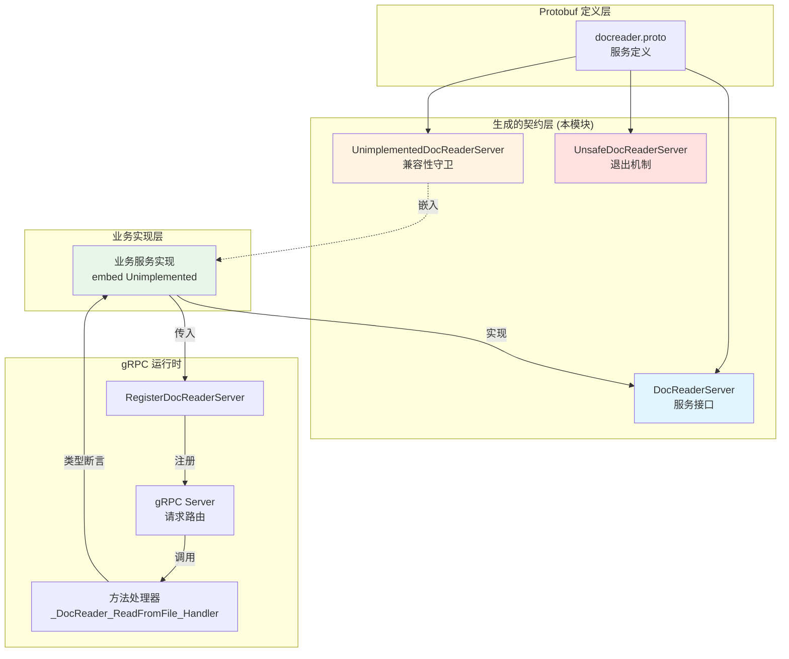

# go_grpc_server_contracts_and_compatibility_guards 模块深度解析

## 概述：为什么需要这个模块？

想象你正在运营一个文档处理服务，客户端遍布各个微服务。某天你需要添加一个新的 RPC 方法 `ReadFromBase64`，但此时线上还有几十个旧版本的客户端和服务端实例在运行。如果处理不当，这次升级会导致所有旧服务实例编译失败或运行时崩溃。

`go_grpc_server_contracts_and_compatibility_guards` 模块解决的正是这个**服务演进中的兼容性问题**。它是 gRPC-Go 代码生成器产生的"契约层"，定义了服务端必须遵守的接口规范，同时通过一套巧妙的"兼容性守卫"机制，确保服务在迭代过程中不会破坏现有部署。

这个模块的核心价值在于：**它让 gRPC 服务能够安全地向前演进**。当你向 `.proto` 文件添加新方法时，旧的服务实现不会突然编译失败，旧的客户端也不会因为服务端升级而崩溃。这种设计是构建可维护、可演进的微服务架构的基石。

---

## 架构与数据流



### 架构角色解析

这个模块在整体架构中扮演**契约定义者**和**兼容性守护者**的双重角色：

1. **契约定义者**：`DocReaderServer` 接口定义了服务端的完整 API 契约，任何实现都必须遵守这个接口。

2. **兼容性守护者**：`UnimplementedDocReaderServer` 通过提供所有方法的默认实现（返回 `Unimplemented` 错误），确保当 proto 文件新增方法时，旧代码仍能编译通过。

3. **注册与路由桥梁**：`RegisterDocReaderServer` 函数和 `_DocReader_*_Handler` 处理器将业务实现与 gRPC 运行时连接起来，处理请求的解码、类型断言和方法调用。

### 数据流追踪

以 `ReadFromFile` 请求为例，数据流经以下路径：

```
客户端请求 → gRPC 运行时 → _DocReader_ReadFromFile_Handler 
→ 解码 ReadFromFileRequest → 类型断言 srv.(DocReaderServer) 
→ 调用业务实现的 ReadFromFile 方法 → 返回 ReadResponse
```

关键在于 `RegisterDocReaderServer` 中的**嵌入验证**：它在服务注册时检查 `UnimplementedDocReaderServer` 是否按值嵌入（而非指针），如果是指针嵌入则会在启动时 panic。这是一种"快速失败"的设计哲学——宁愿在启动时崩溃，也不要在运行时因为空指针导致难以调试的问题。

---

## 核心组件深度解析

### 1. `DocReaderServer` 接口

**设计目的**：定义 DocReader 服务的完整服务端契约。

```go
type DocReaderServer interface {
    ReadFromFile(context.Context, *ReadFromFileRequest) (*ReadResponse, error)
    ReadFromURL(context.Context, *ReadFromURLRequest) (*ReadResponse, error)
    mustEmbedUnimplementedDocReaderServer()
}
```

**关键设计点**：

- **`mustEmbedUnimplementedDocReaderServer()` 方法**：这是一个"标记方法"，它本身没有实际业务逻辑，唯一作用是强制实现者必须嵌入 `UnimplementedDocReaderServer`。这是 Go 语言中实现"接口扩展性"的经典模式。

- **为什么需要这个标记方法？** 如果没有它，开发者可以直接实现 `DocReaderServer` 接口而不嵌入 `UnimplementedDocReaderServer`。当 proto 文件新增方法时，这些实现会编译失败。有了这个标记方法，编译器会强制要求嵌入，从而获得默认实现，保证向前兼容。

- **上下文参数**：每个方法都接收 `context.Context`，这是 Go 服务开发的标准实践，用于传递超时、取消信号和追踪信息。

**返回值约定**：
- 成功时返回响应对象和 `nil` 错误
- 失败时返回 `nil` 响应和适当的 `status.Error`

### 2. `UnimplementedDocReaderServer` 结构体

**设计目的**：提供所有方法的默认实现，实现向前兼容。

```go
type UnimplementedDocReaderServer struct{}

func (UnimplementedDocReaderServer) ReadFromFile(context.Context, *ReadFromFileRequest) (*ReadResponse, error) {
    return nil, status.Errorf(codes.Unimplemented, "method ReadFromFile not implemented")
}
// ... 其他方法类似
func (UnimplementedDocReaderServer) mustEmbedUnimplementedDocReaderServer() {}
func (UnimplementedDocReaderServer) testEmbeddedByValue()                   {}
```

**为什么按值嵌入而非指针？**

这是本模块最精妙的设计之一。注释中明确说明：

> NOTE: this should be embedded by value instead of pointer to avoid a nil pointer dereference when methods are called.

**原因分析**：

```go
// ❌ 错误方式：指针嵌入
type MyServer struct {
    *proto.UnimplementedDocReaderServer
}

// ✅ 正确方式：值嵌入
type MyServer struct {
    proto.UnimplementedDocReaderServer
}
```

如果按指针嵌入，当开发者忘记初始化该字段时，调用未实现的方法会导致空指针解引用 panic。而按值嵌入，即使没有显式初始化，Go 的零值规则会确保结构体有合法的默认值，方法调用会返回 `Unimplemented` 错误而非崩溃。

**`testEmbeddedByValue()` 的作用**：

这是一个"启动时验证"方法。`RegisterDocReaderServer` 会检查实现是否按值嵌入：

```go
if t, ok := srv.(interface{ testEmbeddedByValue() }); ok {
    t.testEmbeddedByValue()
}
```

如果是指针嵌入且为 `nil`，这个类型断言会失败，或者方法调用会 panic。这种设计将潜在的运行时错误提前到服务启动时暴露。

### 3. `UnsafeDocReaderServer` 接口

**设计目的**：提供一个"退出机制"，允许开发者选择不使用向前兼容保护。

```go
type UnsafeDocReaderServer interface {
    mustEmbedUnimplementedDocReaderServer()
}
```

**使用场景**：

这个接口的设计哲学是"推荐但不强制"。注释明确指出：

> Use of this interface is not recommended, as added methods to DocReaderServer will result in compilation errors.

当你嵌入 `UnsafeDocReaderServer` 而非 `UnimplementedDocReaderServer` 时，你放弃了向前兼容保护。这意味着：
- 代码更简洁（不需要嵌入额外的结构体）
- 但当 proto 文件新增方法时，你的代码会编译失败

**为什么存在这个选项？**

某些场景下，团队可能希望"编译失败"作为变更通知机制——当 proto 文件变更时，强制所有实现者显式处理新方法，而不是静默地返回 `Unimplemented` 错误。这是一种"显式优于隐式"的设计选择。

### 4. `RegisterDocReaderServer` 函数

**设计目的**：将服务实现注册到 gRPC 运行时。

```go
func RegisterDocReaderServer(s grpc.ServiceRegistrar, srv DocReaderServer) {
    if t, ok := srv.(interface{ testEmbeddedByValue() }); ok {
        t.testEmbeddedByValue()
    }
    s.RegisterService(&DocReader_ServiceDesc, srv)
}
```

**关键行为**：

1. **嵌入验证**：通过类型断言检查 `testEmbeddedByValue()` 方法是否存在并可调用
2. **服务注册**：调用底层 `grpc.ServiceRegistrar` 完成注册

**设计权衡**：

这里有一个微妙的权衡：验证逻辑是"最佳努力"的。如果 `srv` 实现了 `testEmbeddedByValue()` 方法但嵌入的是指针且为 `nil`，调用该方法会 panic。这看似是缺陷，实则是设计——它确保问题在服务启动时暴露，而不是在第一次请求时。

### 5. 方法处理器 (`_DocReader_*_Handler`)

**设计目的**：桥接 gRPC 运行时和业务实现。

```go
func _DocReader_ReadFromFile_Handler(srv interface{}, ctx context.Context, dec func(interface{}) error, interceptor grpc.UnaryServerInterceptor) (interface{}, error) {
    in := new(ReadFromFileRequest)
    if err := dec(in); err != nil {
        return nil, err
    }
    if interceptor == nil {
        return srv.(DocReaderServer).ReadFromFile(ctx, in)
    }
    info := &grpc.UnaryServerInfo{
        Server:     srv,
        FullMethod: DocReader_ReadFromFile_FullMethodName,
    }
    handler := func(ctx context.Context, req interface{}) (interface{}, error) {
        return srv.(DocReaderServer).ReadFromFile(ctx, req.(*ReadFromFileRequest))
    }
    return interceptor(ctx, in, info, handler)
}
```

**数据流解析**：

1. **请求解码**：`dec(in)` 将原始字节解码为 `ReadFromFileRequest`
2. **拦截器链**：如果配置了拦截器（如日志、认证、追踪），请求会先经过拦截器处理
3. **类型断言**：`srv.(DocReaderServer)` 将通用接口转换为具体服务类型
4. **方法调用**：调用业务实现的 `ReadFromFile` 方法

**拦截器模式的意义**：

这是典型的**责任链模式**。拦截器可以在请求到达业务逻辑前进行检查、修改或拒绝，也可以在响应返回后进行处理。常见的拦截器包括：
- 认证/授权拦截器
- 日志记录拦截器
- 链路追踪拦截器
- 限流拦截器

---

## 依赖关系分析

### 本模块依赖什么？

| 依赖类型 | 具体依赖 | 原因 |
|---------|---------|------|
| gRPC 运行时 | `google.golang.org/grpc` | 服务注册、调用选项、客户端/服务端接口 |
| gRPC 状态码 | `google.golang.org/grpc/codes` | 定义错误类型（如 `Unimplemented`） |
| gRPC 状态 | `google.golang.org/grpc/status` | 创建带状态码的错误 |
| 上下文 | `context` | 传递超时、取消信号 |
| Protobuf 消息 | `ReadFromFileRequest`, `ReadFromURLRequest`, `ReadResponse` | 定义在 `docreader.proto` 中 |

### 什么依赖本模块？

根据模块树，以下模块依赖本模块：

1. **[docreader_pipeline](docreader_pipeline.md)** 中的 `grpc_service_interfaces_and_clients` 子模块
   - `DocReaderClient`：客户端接口，用于调用 DocReader 服务
   - `DocReaderStub` / `DocReaderServicer`：Python gRPC 绑定

2. **业务服务实现**（未在提供的代码中显示，但必然存在）
   - 实现 `DocReaderServer` 接口的具体服务
   - 通常位于 `internal/service/docreader/` 或类似路径

### 数据契约

**请求 - 响应契约**：

| 方法 | 请求类型 | 响应类型 | 语义 |
|-----|---------|---------|------|
| `ReadFromFile` | `ReadFromFileRequest` | `ReadResponse` | 从文件路径读取并解析文档 |
| `ReadFromURL` | `ReadFromURLRequest` | `ReadResponse` | 从 URL 下载并解析文档 |

**错误契约**：

| 错误码 | 触发条件 | 处理建议 |
|-------|---------|---------|
| `Unimplemented` | 方法未实现（默认行为） | 检查服务实现是否正确嵌入 `UnimplementedDocReaderServer` |
| `InvalidArgument` | 请求参数无效 | 检查文件路径或 URL 格式 |
| `NotFound` | 文件或 URL 不可达 | 检查资源是否存在 |
| `Internal` | 服务端内部错误 | 查看服务端日志 |

---

## 设计决策与权衡

### 1. 向前兼容 vs 编译时安全

**选择**：优先向前兼容，通过 `UnimplementedDocReaderServer` 提供默认实现。

**权衡**：
- ✅ 服务可以平滑升级，旧实现不会因为 proto 变更而编译失败
- ❌ 未实现的方法会在运行时返回错误，而非编译时报错

**替代方案**：
- 不使用 `mustEmbedUnimplementedDocReaderServer()` 标记方法，让开发者自由选择
- 使用 `UnsafeDocReaderServer` 放弃兼容保护，获得编译时检查

**为什么当前设计更优**：

在微服务架构中，服务往往由不同团队维护，部署节奏不一致。向前兼容确保：
1.  proto 文件变更不会阻塞其他团队的开发
2.  灰度发布时，新旧版本可以共存
3.  回滚操作不会导致编译失败

### 2. 值嵌入 vs 指针嵌入

**选择**：强制值嵌入，通过 `testEmbeddedByValue()` 验证。

**权衡**：
- ✅ 避免空指针解引用，零值安全
- ❌ 结构体稍大（但 `UnimplementedDocReaderServer` 是空结构体，实际无开销）

**深层原因**：

这是 Go 语言中"零值可用"哲学的体现。空结构体的零值是合法的，方法调用不会 panic。而指针的零值是 `nil`，方法调用会 panic。在基础设施代码中，"启动时 panic" 优于 "运行时 panic"，因为前者更容易被发现和修复。

### 3. 生成代码 vs 手写代码

**选择**：完全由 protoc-gen-go-grpc 生成，禁止手动修改。

**权衡**：
- ✅ 与 proto 定义保持同步，减少人为错误
- ❌ 无法添加自定义逻辑（但可以通过接口实现扩展）

**文件头注释明确说明**：
```go
// Code generated by protoc-gen-go-grpc. DO NOT EDIT.
```

**扩展方式**：

如果需要自定义行为，应该：
1. 在业务代码中实现 `DocReaderServer` 接口
2. 使用装饰器模式包装生成的客户端/服务端
3. 通过 gRPC 拦截器添加横切关注点

---

## 使用指南与示例

### 正确的服务实现方式

```go
package docreader

import (
    "context"
    "your-module/docreader/proto"
)

// DocReaderService 是 DocReader 服务的业务实现
type DocReaderService struct {
    proto.UnimplementedDocReaderServer // ✅ 按值嵌入
}

// ReadFromFile 实现从文件读取文档的逻辑
func (s *DocReaderService) ReadFromFile(ctx context.Context, req *proto.ReadFromFileRequest) (*proto.ReadResponse, error) {
    // 业务逻辑
    // 1. 验证文件路径
    // 2. 读取文件内容
    // 3. 解析文档
    // 4. 返回 chunk 列表
    return &proto.ReadResponse{
        Chunks: chunks,
    }, nil
}

// ReadFromURL 实现从 URL 读取文档的逻辑
func (s *DocReaderService) ReadFromURL(ctx context.Context, req *proto.ReadFromURLRequest) (*proto.ReadResponse, error) {
    // 业务逻辑
    return &proto.ReadResponse{}, nil
}

// 服务注册
func Register(server *grpc.Server) {
    svc := &DocReaderService{}
    proto.RegisterDocReaderServer(server, svc)
}
```

### 常见的错误实现

```go
// ❌ 错误 1：指针嵌入（可能导致空指针 panic）
type DocReaderService struct {
    *proto.UnimplementedDocReaderServer
}

// ❌ 错误 2：未嵌入 UnimplementedDocReaderServer
type DocReaderService struct{}
// 编译错误：DocReaderService 未实现 mustEmbedUnimplementedDocReaderServer()

// ❌ 错误 3：忘记实现所有方法
type DocReaderService struct {
    proto.UnimplementedDocReaderServer
}
func (s *DocReaderService) ReadFromFile(...) { ... }
// 缺少 ReadFromURL 实现 - 会返回 Unimplemented 错误
```

### 添加新方法的流程

当需要添加新的 RPC 方法（如 `ReadFromBase64`）时：

1. **修改 proto 文件**：
```protobuf
service DocReader {
    rpc ReadFromFile(ReadFromFileRequest) returns (ReadResponse);
    rpc ReadFromURL(ReadFromURLRequest) returns (ReadResponse);
    rpc ReadFromBase64(ReadFromBase64Request) returns (ReadResponse); // 新增
}
```

2. **重新生成代码**：
```bash
protoc --go-grpc_out=. --go-grpc_opt=paths=source_relative docreader.proto
```

3. **更新业务实现**：
```go
func (s *DocReaderService) ReadFromBase64(ctx context.Context, req *proto.ReadFromBase64Request) (*proto.ReadResponse, error) {
    // 实现新方法
}
```

**关键点**：在步骤 3 完成前，旧代码仍能编译通过（因为 `UnimplementedDocReaderServer` 提供了默认实现），但调用新方法会返回 `Unimplemented` 错误。这为灰度发布提供了时间窗口。

---

## 边界情况与注意事项

### 1. 启动时验证的局限性

`RegisterDocReaderServer` 的嵌入验证是"最佳努力"的。以下情况可能绕过验证：

```go
// 这种情况会绕过验证，因为类型断言失败
type DocReaderService struct{}
func (s *DocReaderService) ReadFromFile(...) { ... }
func (s *DocReaderService) ReadFromURL(...) { ... }
// 没有嵌入 UnimplementedDocReaderServer，但手动实现了 mustEmbedUnimplementedDocReaderServer()

func (s *DocReaderService) mustEmbedUnimplementedDocReaderServer() {}
```

**建议**：遵循团队代码规范，始终嵌入 `UnimplementedDocReaderServer`，不要手动实现标记方法。

### 2. 拦截器链中的错误处理

如果拦截器返回错误，业务方法不会被调用。确保拦截器的错误处理逻辑正确：

```go
// 拦截器示例
func authInterceptor(ctx context.Context, req interface{}, info *grpc.UnaryServerInfo, handler grpc.UnaryHandler) (interface{}, error) {
    if !isAuthenticated(ctx) {
        return nil, status.Error(codes.Unauthenticated, "unauthorized")
    }
    return handler(ctx, req) // 继续调用业务方法
}
```

### 3. 上下文超时与取消

业务实现必须尊重 `context.Context`：

```go
func (s *DocReaderService) ReadFromFile(ctx context.Context, req *proto.ReadFromFileRequest) (*proto.ReadResponse, error) {
    // ✅ 定期检查上下文状态
    select {
    case <-ctx.Done():
        return nil, ctx.Err()
    default:
    }
    
    // 长时间运行的操作
    result, err := s.processFile(ctx, req.FilePath)
    if err != nil {
        return nil, err
    }
    
    return &proto.ReadResponse{Chunks: result}, nil
}
```

### 4. 错误码选择

使用适当的 gRPC 状态码：

| 场景 | 推荐状态码 |
|-----|-----------|
| 文件不存在 | `NotFound` |
| 文件格式不支持 | `InvalidArgument` |
| 解析超时 | `DeadlineExceeded` |
| 内部处理错误 | `Internal` |
| 服务过载 | `ResourceExhausted` |

---

## 与其他模块的关系

- **[docreader_pipeline](docreader_pipeline.md)**：本模块定义的 `DocReaderServer` 接口由 `docreader_pipeline` 中的具体解析器实现。`docreader_pipeline` 还包含对应的客户端接口 `DocReaderClient`，用于跨进程调用。

- **[platform_infrastructure_and_runtime](platform_infrastructure_and_runtime.md)**：gRPC 服务器的启动和配置依赖于该模块中的 `ServerConfig` 和日志组件。

- **[http_handlers_and_routing](http_handlers_and_routing.md)**：如果系统同时提供 HTTP 和 gRPC 接口，HTTP 处理器可能通过 gRPC 客户端调用本模块定义的服务。

---

## 总结

`go_grpc_server_contracts_and_compatibility_guards` 模块是 gRPC 服务架构中的"隐形守护者"。它通过三个核心组件——`DocReaderServer` 接口、`UnimplementedDocReaderServer` 结构体和 `UnsafeDocReaderServer` 接口——构建了一套完整的兼容性保护机制。

理解这个模块的关键在于把握其设计哲学：**在微服务架构中，向前兼容比编译时严格检查更重要**。通过值嵌入、启动时验证和默认实现，它确保服务可以平滑演进，同时为开发者提供了清晰的扩展路径。

对于新加入的贡献者，记住三条黄金法则：
1. **始终按值嵌入** `UnimplementedDocReaderServer`
2. **实现所有方法**，不要依赖默认实现（除非是有意为之）
3. **尊重上下文**，正确处理超时和取消信号

遵循这些原则，你的服务实现将能够与系统的其他部分和谐共存，并在未来的演进中保持稳定。
