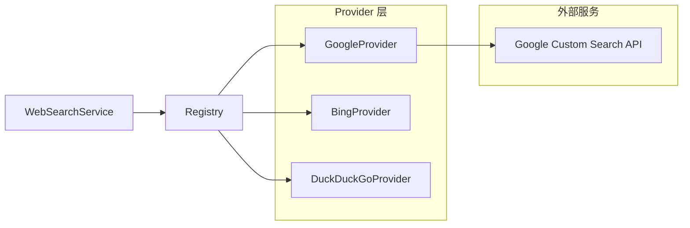

# Google Provider Implementation

## 概述

想象一下，你的系统需要支持多个搜索引擎 —— Google、Bing、DuckDuckGo —— 但上层业务逻辑不应该关心具体用的是哪一个。`google_provider_implementation` 模块就是这个多 provider 架构中的 Google 适配器。它的核心职责是将系统统一的搜索请求"翻译"成 Google Custom Search API 能理解的语言，然后把 Google 返回的结果"翻译"回系统内部的标准格式。

这个模块存在的根本原因是：**搜索引擎的 API 千差万别，但业务代码需要一致的接口**。Google 有自己的认证方式（API Key + Engine ID）、自己的请求格式、自己的响应结构。如果让上层代码直接处理这些差异，每增加一个搜索引擎就要改一遍业务逻辑。这个模块通过实现 `WebSearchProvider` 接口，把 Google 的特殊性封装起来，让系统其他部分可以无感知地切换或扩展搜索 provider。

## 架构定位



这个模块在系统中的角色是一个**协议适配器**：

1. **上游**：被 `WebSearchService` 通过 `WebSearchProvider` 接口调用，不暴露任何 Google 特有的细节
2. **下游**：依赖 Google 官方的 `customsearch/v1` SDK，处理所有 HTTP 请求、认证、序列化
3. **横向**：与 `BingProvider`、`DuckDuckGoProvider` 平级，都实现同一个接口，可互换

数据流向非常直接：`WebSearchService.Search()` → `Registry.GetProvider("google")` → `GoogleProvider.Search()` → Google API → 结果转换 → 返回标准 `WebSearchResult` 列表。

## 核心组件详解

### GoogleProvider 结构体

```go
type GoogleProvider struct {
    srv      *customsearch.Service
    apiKey   string
    engineID string
    baseURL  string
}
```

这是整个模块的唯一核心类型，持有所有与 Google API 交互所需的状态。四个字段的分工很清晰：

- `srv`：Google SDK 生成的服务客户端，封装了 HTTP 传输、认证头、请求构建等底层细节。这是最重的依赖，初始化成本最高。
- `apiKey` 和 `engineID`：Google Custom Search 的双因子认证。API Key 标识"谁在调用"，Engine ID 标识"用哪个搜索引擎配置"。两者都从配置 URL 中解析出来，运行时不再改变。
- `baseURL`：原始配置 URL，主要用于调试和日志，实际请求由 `srv` 管理。

**设计意图**：这个结构体是典型的"胖客户端"模式 —— 初始化时完成所有重型工作（创建 SDK 服务实例），后续每次搜索调用都是轻量级的方法调用。这样做的好处是搜索延迟最小化，代价是启动时需要确保配置可用。

### NewGoogleProvider 构造函数

```go
func NewGoogleProvider() (interfaces.WebSearchProvider, error)
```

这个函数的设计有一个值得注意的特点：**配置通过单个环境变量的 URL 传递**，而不是分开的环境变量。`GOOGLE_SEARCH_API_URL` 的格式类似：

```
https://www.googleapis.com/customsearch/v1?engine_id=xxx&api_key=yyy
```

这种设计有几个考量：

1. **端点可配置**：虽然 Google 的端点通常固定，但某些企业可能有代理或镜像服务，允许修改 `https://www.googleapis.com` 部分
2. **参数内聚**：`engine_id` 和 `api_key` 作为查询参数放在一起，逻辑上它们都属于"连接凭证"
3. **简化环境变量管理**：只需要一个环境变量，而不是三个（API_URL、API_KEY、ENGINE_ID）

但这种设计也有代价：解析逻辑变复杂了，需要先 `url.Parse()` 再 `Query().Get()`，而且错误信息不够直观（比如 "engine_id is empty" 不会告诉你是哪个环境变量有问题）。

函数内部的关键步骤：

1. 读取并解析配置 URL
2. 提取 `engine_id` 和 `api_key`，验证非空
3. 构建 Google SDK 的 `ClientOption` 列表：`option.WithAPIKey(apiKey)` 设置认证，`option.WithEndpoint(...)` 设置端点
4. 调用 `customsearch.NewService()` 创建服务实例
5. 返回填充好的 `GoogleProvider` 实例

**注意**：这里使用了 `context.Background()` 创建服务，但实际搜索请求会传入调用方的 `ctx`。这是合理的，因为服务实例创建是一次性的，而搜索请求需要支持超时和取消。

### GoogleProviderInfo 注册函数

```go
func GoogleProviderInfo() types.WebSearchProviderInfo
```

这个函数返回 provider 的元数据，用于在 UI 或配置界面展示可用选项。返回的 `WebSearchProviderInfo` 包含：

- `ID: "google"`：系统内部标识符，用于从 Registry 获取 provider
- `Name: "Google"`：人类可读名称
- `Free: false`：标记为付费服务（Google Custom Search 有免费额度但本质是商业 API）
- `RequiresAPIKey: true`：提示用户需要配置凭证
- `Description: "Google Custom Search API"`：简短描述

这个设计体现了**自注册模式**：每个 provider 自己声明自己的元数据，Registry 不需要硬编码 provider 列表。添加新 provider 时只需实现接口并提供 Info 函数，Registry 自动发现。

### Search 方法

```go
func (p *GoogleProvider) Search(
    ctx context.Context,
    query string,
    maxResults int,
    includeDate bool,
) ([]*types.WebSearchResult, error)
```

这是 provider 的核心业务方法，签名与 `WebSearchProvider` 接口完全一致。让我们逐层分析它的设计：

**参数设计**：
- `ctx`：支持请求超时和取消，对于外部 API 调用至关重要
- `query`：搜索关键词，空值会直接返回错误
- `maxResults`：期望的最大结果数，但注意 Google API 有自己限制（单次最多 10 条）
- `includeDate`：**这个参数被忽略了** —— 这是一个设计缺陷，下文会详细讨论

**请求构建逻辑**：
```go
cseCall := p.srv.Cse.List().Context(ctx).Cx(p.engineID).Q(query)
```
这是 Google SDK 的链式 API：`Cse.List()` 创建请求构建器，`Context(ctx)` 绑定上下文，`Cx(p.engineID)` 设置搜索引擎 ID，`Q(query)` 设置查询词。这种设计让请求配置非常直观。

**结果数处理**：
```go
if maxResults > 0 {
    cseCall = cseCall.Num(int64(maxResults))
} else {
    cseCall = cseCall.Num(5)
}
```
这里有一个默认值策略：如果调用方没有指定 `maxResults`（传 0 或负数），默认请求 5 条结果。这个默认值的选择是合理的 —— 足够提供上下文，又不会浪费 API 配额。

**语言硬编码**：
```go
cseCall = cseCall.Hl("ch-zh")
```
这一行将搜索结果的语言固定为简体中文。**这是一个隐式假设**：系统的主要用户群体使用中文。如果系统需要国际化，这里应该从配置或用户偏好中读取语言参数。

**响应转换**：
```go
for _, item := range resp.Items {
    result := &types.WebSearchResult{
        Title:   item.Title,
        URL:     item.Link,
        Snippet: item.Snippet,
        Source:  "google",
    }
    results = append(results, result)
}
```
这里完成了从 Google 响应格式到系统内部格式的映射。注意 `Source: "google"` 字段 —— 这允许上层知道结果来源，对于结果去重、来源偏好排序、计费统计都有用。

**缺失的功能**：`includeDate` 参数完全没有使用。Google Custom Search API 支持通过 `DateRestrict` 参数限制结果的时间范围（如 `d1` 表示最近一天），但这里没有实现。如果上层调用方期望这个参数生效，会得到不符合预期的结果。

## 依赖关系分析

### 上游调用者

`GoogleProvider` 被以下组件调用：

1. **WebSearchService**（[retrieval_and_web_search_services](#)）：主要调用者，负责协调搜索请求、选择 provider、合并结果
2. **Registry**（[web_search_provider_registry](#)）：在初始化时调用 `GoogleProviderInfo()` 注册 provider 元数据

调用链示例：
```
HTTP Handler (WebSearchHandler)
    → WebSearchService.Search()
        → Registry.GetProvider("google")
            → GoogleProvider.Search()
                → Google Custom Search API
```

### 下游依赖

`GoogleProvider` 依赖以下外部组件：

1. **google.golang.org/api/customsearch/v1**：Google 官方 Go SDK，处理所有 HTTP 通信、认证、JSON 序列化
2. **google.golang.org/api/option**：SDK 的配置选项包
3. **internal/types.WebSearchProviderInfo** 和 **WebSearchResult**：系统内部类型定义
4. **internal/types/interfaces.WebSearchProvider**：接口定义

### 数据契约

**输入契约**（通过 `Search` 方法参数）：
- `query` 不能为空，否则返回错误
- `maxResults` 为 0 或负数时使用默认值 5
- `ctx` 应该设置合理的超时（建议 5-10 秒），否则可能长时间阻塞

**输出契约**（返回值）：
- 成功时返回 `[]*WebSearchResult`，可能为空切片（无结果）但不为 nil
- 失败时返回 error，调用方应该检查网络错误、认证错误、配额错误等

**隐式契约**：
- Google API 的配额限制：免费账户每天 100 次查询，超出会返回 429 错误
- 单次请求最多返回 10 条结果，如果需要更多需要分页（当前未实现）
- 搜索结果的语言固定为简体中文

## 设计决策与权衡

### 1. 配置方式：URL 编码 vs 多环境变量

**选择**：使用单个 URL 环境变量 `GOOGLE_SEARCH_API_URL`，通过查询参数传递 `engine_id` 和 `api_key`。

**权衡**：
- ✅ 优点：环境变量数量少，端点可配置，参数逻辑内聚
- ❌ 缺点：解析逻辑复杂，错误信息不直观，无法单独覆盖某个参数

**替代方案**：使用三个独立环境变量 `GOOGLE_API_URL`、`GOOGLE_API_KEY`、`GOOGLE_ENGINE_ID`。这样更清晰，但增加了配置复杂度。

**建议**：如果系统配置框架支持结构化配置（如 YAML/JSON），应该迁移到结构化配置，而不是依赖环境变量解析。

### 2. 语言硬编码

**选择**：在 `Search` 方法中硬编码 `Hl("ch-zh")`。

**权衡**：
- ✅ 优点：简单，确保中文用户获得中文结果
- ❌ 缺点：无法支持多语言用户，国际化受阻

**改进方向**：从 `WebSearchConfig` 或用户偏好中读取语言参数，作为 `Search` 方法的可选参数。

### 3. includeDate 参数被忽略

**现状**：`Search` 方法接收 `includeDate bool` 参数但完全不使用。

**可能原因**：
- 开发时遗漏了实现
- Google API 的日期限制语法复杂，暂时跳过
- 上层调用方实际上没有使用这个功能

**影响**：如果调用方期望按日期过滤结果，会得到错误的行为。这是一个**静默失败**的设计缺陷。

**修复建议**：
```go
if includeDate {
    // 限制为最近 30 天
    cseCall = cseCall.DateRestrict("m1")
}
```

### 4. 同步调用 vs 异步/批量

**选择**：`Search` 方法是同步的，每次调用发起一次 HTTP 请求。

**权衡**：
- ✅ 优点：简单直观，错误处理直接
- ❌ 缺点：无法利用批量查询优化，高并发时可能触发 API 限流

**改进方向**：如果系统需要高频搜索，可以考虑在 `WebSearchService` 层实现请求合并和缓存。

### 5. 无结果缓存

**现状**：每次搜索都直接调用 Google API，不缓存结果。

**权衡**：
- ✅ 优点：结果总是最新的
- ❌ 缺点：相同查询重复调用，浪费配额，增加延迟

**改进方向**：在 `WebSearchService` 层实现短期缓存（如 5 分钟），使用查询词作为缓存键。

## 使用示例

### 基本使用

```go
// 创建 provider（通常在应用启动时）
provider, err := web_search.NewGoogleProvider()
if err != nil {
    log.Fatalf("Failed to create Google provider: %v", err)
}

// 执行搜索
ctx, cancel := context.WithTimeout(context.Background(), 10*time.Second)
defer cancel()

results, err := provider.Search(ctx, "Golang 最佳实践", 10, false)
if err != nil {
    log.Printf("Search failed: %v", err)
    return
}

for _, r := range results {
    fmt.Printf("Title: %s\n", r.Title)
    fmt.Printf("URL: %s\n", r.URL)
    fmt.Printf("Snippet: %s\n\n", r.Snippet)
}
```

### 通过 Registry 使用

```go
// 注册 provider
registry := web_search.NewRegistry()
registry.Register(web_search.GoogleProviderInfo(), web_search.NewGoogleProvider)

// 获取并使用
provider, err := registry.GetProvider("google")
if err != nil {
    // 处理错误
}
results, err := provider.Search(ctx, query, maxResults, includeDate)
```

### 配置示例

`.env` 文件：
```bash
GOOGLE_SEARCH_API_URL=https://www.googleapis.com/customsearch/v1?engine_id=0123456789abcdef&api_key=AIzaSyXXXXXXXXXXXXXXXXXXXXXXXXX
```

## 边界情况与注意事项

### 1. 认证失败

Google API 可能返回以下认证相关错误：
- **403 Forbidden**：API Key 无效或已过期
- **400 Bad Request**：Engine ID 不存在或配置错误
- **429 Too Many Requests**：超出配额限制

这些错误会从 `cseCall.Do()` 返回，调用方应该区分处理。特别是 429 错误，应该实现指数退避重试。

### 2. 空查询处理

```go
if len(query) == 0 {
    return nil, fmt.Errorf("query is empty")
}
```
这个检查是必要的，因为 Google API 对空查询的行为未定义。但错误信息可以更具体，比如包含调用栈信息帮助调试。

### 3. 结果数限制

Google Custom Search API 单次请求最多返回 10 条结果。如果调用方请求 50 条，当前实现会请求 50 条但 Google 只返回 10 条。**这不是错误，但可能不符合调用方预期**。

如果需要更多结果，需要实现分页：
```go
// 伪代码示例
for startIdx := 1; startIdx <= maxResults; startIdx += 10 {
    cseCall = p.srv.Cse.List().Context(ctx).Cx(p.engineID).Q(query).Start(int64(startIdx))
    resp, err := cseCall.Do()
    // 处理结果
}
```

### 4. 上下文超时

强烈建议调用方设置合理的超时：
```go
ctx, cancel := context.WithTimeout(context.Background(), 10*time.Second)
defer cancel()
```
否则网络问题可能导致请求永久阻塞。Google API 的 P99 延迟通常在 1-2 秒，5-10 秒超时是合理的。

### 5. 并发安全

`GoogleProvider` 实例是**并发安全**的：
- `srv` 是只读的，初始化后不再修改
- `apiKey`、`engineID`、`baseURL` 都是只读字段
- `Search` 方法没有修改任何状态

可以在多个 goroutine 中共享同一个 provider 实例。

## 扩展点

### 添加新的搜索参数

如果需要支持 Google API 的其他参数（如站点限制 `SiteSearch`、文件类型 `FileType`），可以：

1. 修改 `WebSearchProvider` 接口（影响所有 provider，需谨慎）
2. 在 `Search` 方法中添加可选参数（当前方法签名已固定，需考虑兼容性）
3. 创建 `GoogleProvider` 特有的扩展方法（破坏接口抽象，不推荐）

**推荐方案**：在 `WebSearchProvider` 接口中增加一个 `SetOptions(map[string]string)` 方法，允许 provider 特定的配置。

### 支持多语言

修改 `Search` 方法签名：
```go
func (p *GoogleProvider) Search(
    ctx context.Context,
    query string,
    maxResults int,
    includeDate bool,
    language string,  // 新增参数
) ([]*types.WebSearchResult, error)
```

但这需要同时修改接口和所有其他 provider 实现。更好的方式是从配置中读取默认语言：
```go
// 在 NewGoogleProvider 中
language := os.Getenv("GOOGLE_SEARCH_LANGUAGE")
if language == "" {
    language = "ch-zh"
}
// 在 Search 中使用
cseCall = cseCall.Hl(language)
```

## 相关模块

- [Web Search Service](retrieval_and_web_search_services.md)：调用此 provider 的上层服务
- [Web Search Provider Registry](retrieval_and_web_search_services.md)：provider 注册和发现机制
- [Bing Provider Implementation](retrieval_and_web_search_services.md)：同级别的 Bing provider 实现
- [DuckDuckGo Provider Implementation](retrieval_and_web_search_services.md)：同级别的 DuckDuckGo provider 实现
- [Web Search Handler](evaluation_and_web_search_handlers.md)：HTTP 层入口

## 总结

`google_provider_implementation` 是一个典型的适配器模式实现，将 Google Custom Search API 封装成系统统一的 `WebSearchProvider` 接口。它的核心价值在于**隔离变化**：Google API 的变化不会波及上层业务逻辑，系统可以无缝切换或并行使用多个搜索 provider。

主要的设计亮点：
- 清晰的职责边界：只负责协议转换，不负责业务逻辑
- 自注册模式：provider 元数据由自己声明，Registry 无需硬编码
- 并发安全：实例可在多个 goroutine 中共享

需要改进的地方：
- `includeDate` 参数未实现，应修复或从接口中移除
- 语言硬编码限制了国际化
- 配置解析逻辑可以简化，错误信息可以更友好
- 缺少结果缓存和分页支持

对于新贡献者，建议从修复 `includeDate` 参数开始熟悉代码，然后考虑添加多语言支持和结果缓存功能。
