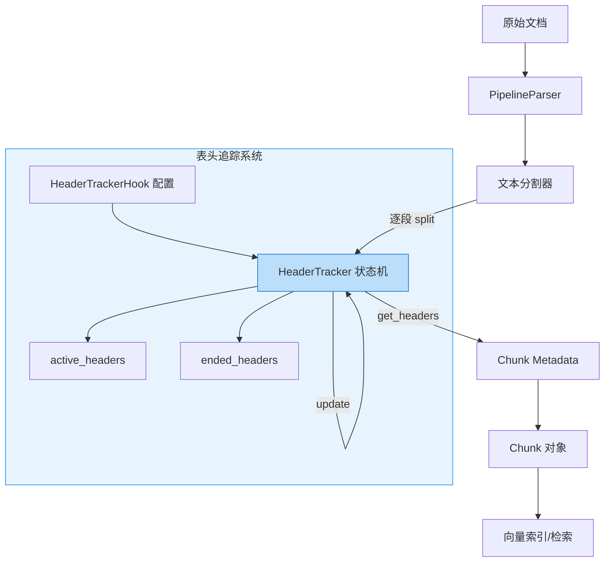

# header_tracking_and_split_hooks 模块深度解析

## 概述：为什么需要表头追踪？

想象你正在阅读一本技术手册，书中有一个跨越三页的复杂表格。当你把这三页撕下来分给三个人分别阅读时，第二页和第三页的读者会面临一个问题：**他们看到的表格行没有表头**，无法理解每一列的含义。

这就是文档分块（chunking）过程中的核心困境：为了适配向量检索和 LLM 上下文窗口限制，我们需要将长文档切分成小块，但**切分操作会破坏文档的结构上下文**。一个位于表格中间的 chunk 不知道它属于哪个表格，一个在代码块中的 chunk 不知道这是什么语言的代码。

`header_tracking_and_split_hooks` 模块解决的正是这个问题。它实现了一个**状态化的表头追踪机制**，在文档被切分的过程中，持续追踪哪些"结构头"（表格头、代码块标记、章节标题等）当前处于"活跃"状态，并将这些上下文信息注入到每个 chunk 的 metadata 中。这样，下游的检索和生成系统就能知道："这个 chunk 是一个 Python 代码块的一部分"或"这些行属于用户信息表格"。

这个设计的核心洞察是：**文档结构是有状态的**。表头一旦开始，就会持续影响后续内容，直到遇到明确的结束标记。这种"开始 - 持续 - 结束"的模式非常适合用状态机来建模。

## 架构与数据流



### 组件角色说明

| 组件 | 职责 | 类比 |
|------|------|------|
| `HeaderTrackerHook` | 定义一种表头模式的"识别规则" | 机场安检的"违禁品识别规则"——什么算开始、什么算结束、如何提取关键信息 |
| `HeaderTracker` | 维护表头状态的"状态机" | 机场安检员——根据规则判断当前旅客是否携带违禁品，并记录在案 |
| `DEFAULT_CONFIGS` | 预置的常见场景配置 | 预设的常见违禁品清单（液体、刀具等） |
| `Chunk.metadata` | 承载表头上下文信息的容器 | 旅客的登机牌——记录安检结果供后续环节使用 |

### 数据流详解

1. **初始化阶段**：`HeaderTracker` 使用 `DEFAULT_CONFIGS` 或自定义配置初始化，`active_headers` 和 `ended_headers` 为空
2. **逐段处理**：分割器每产生一个 split（文本片段），调用 `tracker.update(split)`
3. **状态更新**：
   - 检查是否有活跃表头的结束标记 → 若有，移入 `ended_headers`
   - 检查是否有新表头的开始标记 → 若有，加入 `active_headers`
   - 若所有表头都结束了，清空 `ended_headers`（为下一轮循环做准备）
4. **上下文注入**：调用 `tracker.get_headers()` 获取当前活跃表头的拼接文本，写入 chunk 的 metadata

这个流程的关键在于**状态是跨 split 累积的**。第一个 split 检测到表格开始，第二个 split 虽然没有表格标记，但 `active_headers` 仍然保留着表格信息，直到遇到结束标记。

## 核心组件深度解析

### HeaderTrackerHook：表头识别规则的定义

`HeaderTrackerHook` 是一个配置类，它回答了一个根本问题：**如何识别一种特定类型的结构头？**

```python
HeaderTrackerHook(
    start_pattern=r"^\s*(?:\|[^|\n]*)+[\r\n]+\s*(?:\|\s*:?-{3,}:?\s*)+\|?[\r\n]+$",
    end_pattern=r"^\s*$|^\s*[^|\s].*$",
    priority=15,
    case_sensitive=False,
)
```

#### 设计决策分析

**为什么用正则表达式而不是固定字符串？**

文档结构的开始/结束标记往往有变体。以 Markdown 表格为例：
- 表头可能有前导空格
- 分隔行的对齐标记 `:` 可有可无
- 行尾可能有或没有 `|`

正则表达式提供了必要的灵活性。`start_pattern` 中的 `(?:\|[^|\n]*)+` 匹配任意数量的表格列，`:?-{3,}:?` 匹配带可选对齐的分隔线。这种模式匹配能力是固定字符串无法提供的。

**为什么需要 `extract_header_fn`？**

有些场景下，匹配的整个内容不是我们想要的表头标识。例如代码块：
```python
start_pattern=r"^\s*```(\w+).*"
extract_header_fn=lambda m: f"```{m.group(1)}"  # 只保留语言标识
```

这里我们只想提取 ` ```python` 而不是整行 ` ```python def hello():`。`extract_header_fn` 提供了这种提取逻辑的注入点，遵循**依赖倒置原则**——Hook 定义匹配规则，调用者决定如何提取关键信息。

**优先级系统的设计意图**

`priority` 字段解决了**规则冲突**问题。考虑这个场景：
```
| 列 1 | 列 2 |
|------|------|
| ```code | data |
```

表格内的代码标记不应该触发代码块 Hook。通过给代码块更高的优先级（20 > 15），系统会先检查代码块规则，如果匹配成功就标记为代码块，表格规则就不会再触发。优先级的降序排序（`DEFAULT_CONFIGS.sort(key=lambda x: -x.priority)`）确保了高优先级规则先被评估。

**`case_sensitive` 的局限性**

注意文档字符串中的说明："仅当传入字符串 pattern 时生效"。这是因为 `__init__` 中只在字符串转正则时应用 `re.IGNORECASE` 标志：

```python
flags = 0 if kwargs.get("case_sensitive", True) else re.IGNORECASE
if isinstance(start_pattern, str):
    start_pattern = re.compile(start_pattern, flags | re.DOTALL)
```

如果调用者直接传入 `Pattern` 对象，这个参数会被忽略。这是一个**隐式契约**，调用者需要知晓。

### HeaderTracker：状态机的实现

`HeaderTracker` 是整个模块的核心，它维护了一个**有限状态机**来追踪表头的生命周期。

#### 状态变量解析

```python
active_headers: Dict[int, str]  # priority -> header_content
ended_headers: set[int]         # priorities that have ended
```

**为什么用 priority 作为 key 而不是 hook 的 id？**

这是一个权衡设计：
- **优点**：priority 天然具有排序能力，`get_headers()` 可以按优先级降序拼接表头；同时，同一优先级的 hook 只会保留一个活跃状态，避免了同类型表头嵌套的复杂情况
- **缺点**：如果两个不同的 hook 配置使用相同 priority，它们会互相覆盖

这个设计假设：**同一类型的结构头不会嵌套**。表格内不会有另一个表格，代码块内不会有另一个代码块（同语言）。这个假设在大多数文档场景中成立。

#### `update()` 方法的状态转换逻辑

```python
def update(self, split: str) -> Dict[int, str]:
    # 1. 检查结束标记
    for config in self.header_hook_configs:
        if config.priority in self.active_headers and config.end_pattern.search(split):
            self.ended_headers.add(config.priority)
            del self.active_headers[config.priority]
    
    # 2. 检查开始标记
    for config in self.header_hook_configs:
        if config.priority not in self.active_headers and config.priority not in self.ended_headers:
            match = config.start_pattern.search(split)
            if match:
                header = config.extract_header_fn(match)
                self.active_headers[config.priority] = header
                new_headers[config.priority] = header
    
    # 3. 清空结束标记
    if not self.active_headers:
        self.ended_headers.clear()
    
    return new_headers
```

**步骤 1 先于步骤 2 的原因**

这是一个关键的时序决策。考虑这个边界情况：
```
| 表头 |
|------|
| 数据 |
普通文本
| 新表头 |
|------|
```

当处理到"普通文本"这一 split 时：
- 如果先检查开始标记：可能误判新表头开始（如果正则不够严格）
- 先检查结束标记：确保旧表头先被关闭，避免状态污染

**步骤 3 的设计意图**

`ended_headers` 的作用是**防止在同一 split 内重复触发**。考虑：
```
| 表头 |
|------|
| 数据 |
```

如果这个内容在一个 split 内，步骤 1 会检测到结束标记（假设分隔行被识别为结束），步骤 2 会检测到开始标记。如果没有 `ended_headers`，步骤 2 会重新激活表头，导致状态错误。`ended_headers` 确保：一旦某个优先级的表头在当前 split 中结束，它就不能在同一 split 中重新开始。

步骤 3 在 `active_headers` 为空时清空 `ended_headers`，这是为**下一轮循环**做准备。当所有表头都结束后，系统应该能够识别新的表头开始。

#### `get_headers()` 的拼接策略

```python
def get_headers(self) -> str:
    sorted_headers = sorted(self.active_headers.items(), key=lambda x: -x[0])
    return "\n".join([header for _, header in sorted_headers])
```

按优先级降序排序确保了**外层结构在前，内层结构在后**。例如：
```
# 第一章
```python
print("hello")
```
```

如果同时有章节标题 Hook（priority=10）和代码块 Hook（priority=20），拼接结果是：
```
```python
# 第一章
```

这个顺序对于下游理解上下文很重要——先知道是代码块，再知道属于哪个章节。

## 依赖关系分析

### 上游依赖：谁调用这个模块？

从模块树来看，`header_tracking_and_split_hooks` 位于 `docreader_pipeline → document_models_and_chunking_support` 下，它的直接消费者应该是**文档分割器**（text splitter）。虽然提供的代码中没有直接展示调用点，但从架构位置可以推断：

1. **分割器**（可能在 `docreader.splitter` 包中）在切分文档时，对每个 split 调用 `HeaderTracker.update()`
2. **Chunk 构建器**在创建 `Chunk` 对象时，调用 `HeaderTracker.get_headers()` 并将结果写入 `metadata`

```python
# 推断的调用模式
tracker = HeaderTracker()
for split in splitter.split(document_content):
    tracker.update(split)
    headers = tracker.get_headers()
    chunk = Chunk(
        content=split,
        metadata={"headers": headers, ...}
    )
```

### 下游依赖：谁消费这个模块的输出？

`Chunk.metadata` 中的表头信息会被以下组件使用：

1. **[chunk_management_api](chunk_management_api.md)**：存储和检索 chunk 时，metadata 中的 headers 可以作为过滤条件
2. **[retrieval_engine_and_search_contracts](retrieval_engine_and_search_contracts.md)**：检索时可以利用 headers 进行结构化过滤（如"只搜索代码块中的内容"）
3. **[chat_pipeline_plugins_and_flow](chat_pipeline_plugins_and_flow.md)**：生成回答时，headers 可以帮助 LLM 理解 chunk 的上下文

### 数据契约

`HeaderTracker` 与外部的数据交换点：

| 接口 | 方向 | 数据类型 | 契约说明 |
|------|------|----------|----------|
| `__init__` | 输入 | `List[HeaderTrackerHook]` | 调用者可以提供自定义配置，默认使用 `DEFAULT_CONFIGS` |
| `update()` | 输入 | `str` (split 文本) | 每次调用代表一个新的文本片段 |
| `update()` | 输出 | `Dict[int, str]` | 返回**本次新增**的表头，不是全部活跃表头 |
| `get_headers()` | 输出 | `str` | 返回所有活跃表头的拼接文本，空字符串表示无活跃表头 |
| `active_headers` | 内部状态 | `Dict[int, str]` | 外部不应直接修改 |

**关键契约**：`update()` 返回的是**增量**（新激活的表头），不是全量。这个设计允许调用者只在表头变化时执行某些操作（如日志记录），而不是每个 split 都处理。

## 设计权衡与替代方案

### 权衡 1：状态机 vs 上下文窗口

**当前方案**：用状态机追踪表头，每个 chunk 只携带当前活跃的表头字符串

**替代方案**：扩大 chunk 的重叠区域（overlap），让表头物理上出现在每个 chunk 中

**为什么选择状态机**：
- **token 效率**：重叠区域会重复消耗 token，状态机只存储一次表头引用
- **精确性**：重叠可能导致表头与内容错位（表头属于上一个 chunk，但出现在当前 chunk 开头）
- **可扩展性**：状态机可以追踪多层嵌套结构，重叠只能携带固定长度的上下文

**代价**：
- **实现复杂度**：状态机需要维护正确的状态转换逻辑
- **调试难度**：状态错误比内容错误更难排查

### 权衡 2：正则匹配 vs 语法解析

**当前方案**：用正则表达式匹配表头开始/结束

**替代方案**：用 Markdown/代码的语法解析器（如 `markdown` 库）构建 AST，从 AST 提取结构信息

**为什么选择正则**：
- **轻量级**：不需要引入额外的解析库依赖
- **灵活性**：可以匹配非标准的变体格式
- **性能**：正则匹配比完整解析快

**代价**：
- **准确性**：正则无法处理嵌套、转义等复杂情况
- **维护成本**：正则表达式难以阅读和调试

这个权衡反映了模块的定位：**文档解析的预处理阶段**，不需要 100% 准确，但需要快速、轻量的启发式匹配。

### 权衡 3：优先级系统 vs 嵌套栈

**当前方案**：用 priority 区分不同 hook，同一 priority 只能有一个活跃状态

**替代方案**：用栈结构支持同类型表头嵌套（如代码块内的代码块）

**为什么选择优先级**：
- **简化状态管理**：不需要处理嵌套深度、匹配计数等复杂逻辑
- **符合常见场景**：大多数文档中，表格不会嵌套表格，代码块不会嵌套代码块

**代价**：
- **边缘场景失效**：如果文档真的包含嵌套结构，状态机会错误地关闭外层表头

这是一个**针对常见场景优化**的设计，牺牲了边缘场景的正确性换取实现的简洁性。

## 使用指南与示例

### 基础用法：使用默认配置

```python
from docreader.splitter.header_hook import HeaderTracker

tracker = HeaderTracker()

# 处理文档 split
splits = ["| 姓名 | 年龄 |\n", "|------|------|\n", "| 张三 | 25 |\n"]
for split in splits:
    new_headers = tracker.update(split)
    headers = tracker.get_headers()
    print(f"Split: {split.strip()!r}, Headers: {headers!r}")
```

输出：
```
Split: '| 姓名 | 年龄 |', Headers: '| 姓名 | 年龄 |\n|------|------|\n'
Split: '|------|------|', Headers: '| 姓名 | 年龄 |\n|------|------|\n'
Split: '| 张三 | 25 |', Headers: '| 姓名 | 年龄 |\n|------|------|\n'
```

### 自定义配置：添加章节标题追踪

```python
from docreader.splitter.header_hook import HeaderTracker, HeaderTrackerHook

custom_configs = [
    # 章节标题（# 开头）
    HeaderTrackerHook(
        start_pattern=r"^#\s+.+$",
        end_pattern=r"^##?\s+.+$|^\s*$",  # 遇到下一级标题或空行结束
        extract_header_fn=lambda m: m.group(0).strip(),
        priority=5,  # 低优先级，让表格和代码块优先
    ),
    *HeaderTracker.DEFAULT_CONFIGS  # 保留默认配置
]

tracker = HeaderTracker(header_hook_configs=custom_configs)
```

### 与 ChunkingConfig 集成

```python
from docreader.models.read_config import ChunkingConfig
from docreader.splitter.header_hook import HeaderTracker

config = ChunkingConfig(chunk_size=512, chunk_overlap=50)
tracker = HeaderTracker()

# 在分割循环中集成
for chunk_data in split_document(content, config):
    tracker.update(chunk_data["text"])
    chunk = Chunk(
        content=chunk_data["text"],
        metadata={
            "headers": tracker.get_headers(),
            "chunk_size": config.chunk_size,
        }
    )
```

## 边界情况与陷阱

### 陷阱 1：`ended_headers` 的清空时机

`ended_headers` 只在 `active_headers` 为空时清空。这意味着：

```python
# 场景：表 A 结束，表 B 立即开始
tracker.update("表 A 结束标记")  # active_headers 为空，ended_headers 清空
tracker.update("表 B 开始标记")  # 可以正常激活
```

但如果表 A 和表 B 之间有内容：
```python
tracker.update("表 A 结束标记")  # active_headers 为空，ended_headers 清空
tracker.update("中间内容")      # 无变化
tracker.update("表 B 开始标记")  # 可以正常激活
```

这个逻辑是正确的，但调用者不应假设 `ended_headers` 会在表头结束后立即清空。

### 陷阱 2：正则的 `re.DOTALL` 标志

`__init__` 中编译正则时使用了 `re.DOTALL`：
```python
start_pattern = re.compile(start_pattern, flags | re.DOTALL)
```

这意味着 `.` 可以匹配换行符。如果你的 pattern 依赖 `.` 不匹配换行的默认行为，需要显式使用 `[^\n]`。

### 陷阱 3：`extract_header_fn` 的异常处理

`extract_header_fn` 是用户提供的回调，如果它抛出异常，`update()` 会 propagates 异常：

```python
HeaderTrackerHook(
    start_pattern=r"...",
    extract_header_fn=lambda m: m.group(1),  # 如果 group(1) 不存在会抛异常
)
```

**建议**：在 `extract_header_fn` 中做防御性编程：
```python
extract_header_fn=lambda m: m.group(1) if m.lastindex and m.group(1) else m.group(0)
```

### 陷阱 4：大小写敏感的局限性

如前所述，`case_sensitive` 只在传入字符串 pattern 时生效：

```python
# 有效
HeaderTrackerHook(start_pattern=r"TABLE", case_sensitive=False)

# 无效 - pattern 已经是编译后的正则，case_sensitive 被忽略
HeaderTrackerHook(start_pattern=re.compile(r"TABLE"), case_sensitive=False)
```

如果需要大小写不敏感的编译正则，应该直接传入标志：
```python
HeaderTrackerHook(start_pattern=re.compile(r"TABLE", re.IGNORECASE))
```

### 边界情况：空 split

```python
tracker.update("")  # 不会触发任何匹配，但会执行结束标记检查
```

如果 `end_pattern` 可以匹配空字符串（如 `r"^\s*$"`），空 split 会触发表头结束。这通常是期望行为（空行表示表格结束），但调用者需要知晓。

### 边界情况：同一 split 内开始和结束

```python
# 一个 split 内包含完整的表格
tracker.update("| 表头 |\n|------|\n| 数据 |")
```

根据 `update()` 的逻辑：
1. 先检查结束标记 → 可能匹配到 `| 数据 |` 之后的隐式结束
2. 再检查开始标记 → 由于 `ended_headers` 已包含该 priority，不会重新激活

这可能导致表头状态丢失。解决方案是确保 `end_pattern` 足够严格，不会在表格内容行匹配。

## 扩展点

### 添加新的 Hook 类型

模块设计支持通过 `header_hook_configs` 参数注入自定义配置：

```python
# 支持 LaTeX 表格
latex_table_hook = HeaderTrackerHook(
    start_pattern=r"^\\begin\{tabular\}",
    end_pattern=r"^\\end\{tabular\}",
    priority=25,
)

tracker = HeaderTracker(header_hook_configs=[latex_table_hook, *DEFAULT_CONFIGS])
```

### 扩展 `HeaderTracker` 子类

如果需要更复杂的状态逻辑，可以继承 `HeaderTracker`：

```python
class NestedHeaderTracker(HeaderTracker):
    """支持嵌套表头的追踪器"""
    
    def update(self, split: str) -> Dict[int, str]:
        # 重写状态转换逻辑
        ...
```

但注意，这会破坏 `priority` 作为唯一 key 的假设，需要重新设计状态存储结构。

## 相关模块

- **[document_chunk_data_model](document_chunk_data_model.md)**：`Chunk` 数据模型，表头信息的最终承载者
- **[chunking_configuration](chunking_configuration.md)**：`ChunkingConfig` 定义分块参数，与表头追踪协同工作
- **[parser_pipeline_orchestration](parser_pipeline_orchestration.md)**：`PipelineParser` 在解析流程中可能调用表头追踪
- **[retrieval_engine_and_search_contracts](retrieval_engine_and_search_contracts.md)**：检索引擎可以利用 chunk metadata 中的表头信息进行结构化过滤

## 总结

`header_tracking_and_split_hooks` 是一个**小而精**的模块，它用状态机的思想解决了文档分块中的上下文丢失问题。核心设计亮点包括：

1. **Hook 配置与状态分离**：`HeaderTrackerHook` 定义规则，`HeaderTracker` 维护状态，符合单一职责原则
2. **优先级驱动的冲突解决**：用简单的整数优先级处理规则冲突，避免了复杂的优先级图或嵌套栈
3. **增量返回设计**：`update()` 返回新增表头而非全量，允许调用者做增量优化
4. **正则的灵活性与轻量性权衡**：选择正则而非完整解析器，符合预处理阶段的定位

理解这个模块的关键是把握它的**状态机本质**——它不是简单的模式匹配，而是在时间维度上累积状态，将"此刻的 split"与"之前的历史"关联起来。这种设计模式在文档处理、流式解析、协议解析等场景中都有广泛应用。
