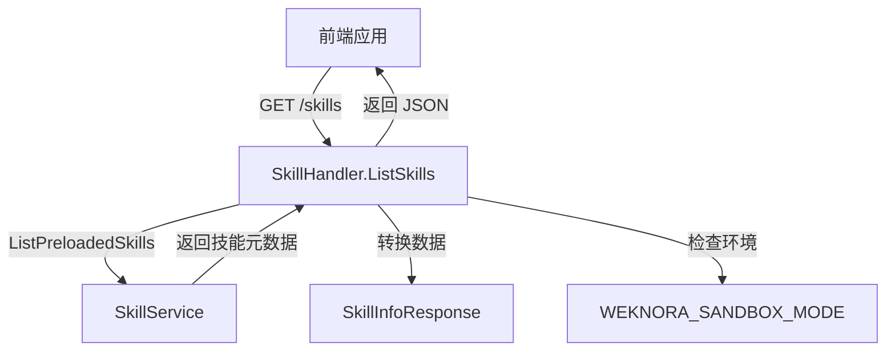

# Agent Skill Catalog Handlers 技术深度解析

## 1. 模块概述

**agent_skill_catalog_handlers** 模块是系统中负责处理 Agent 技能目录相关 HTTP 请求的关键组件。这个模块的核心职责是将前端的技能查询请求转换为后端服务调用，并将结果以适当的格式返回给前端。

### 问题场景：在一个支持自定义 Agent 的平台中，前端需要展示可用的预装技能列表，以便用户选择和配置 Agent 的能力。如果没有这个模块，前端将直接与复杂的服务层耦合，违反了分层架构原则。该模块通过提供标准化的 HTTP 接口，实现了前后端解耦，同时统一了错误处理和响应格式。

## 2. 核心组件解析

### 2.1 SkillHandler 结构体

**SkillHandler** 是该模块的核心处理器，它是一个典型的 HTTP 请求处理器，负责接收和处理技能相关的 HTTP 请求。

```go
type SkillHandler struct {
	skillService interfaces.SkillService
}
```

**设计意图**：
- **依赖注入**：通过构造函数 `NewSkillHandler` 注入 `SkillService` 接口，而不是直接实例化具体实现，这使得代码更易于测试和维护。
- **单一职责**：该结构体只负责 HTTP 请求处理的协调工作，实际的业务逻辑委托给 `skillService` 处理。

### 2.2 SkillInfoResponse 结构体

**SkillInfoResponse** 定义了返回给前端的技能信息数据结构。

```go
type SkillInfoResponse struct {
	Name        string `json:"name"`
	Description string `json:"description"`
}
```

**设计意图**：
- **数据传输对象 (DTO)**：专门用于前端展示的数据结构，与内部业务模型解耦。
- **JSON 标签**：明确指定了 JSON 序列化时的字段名，确保前端能正确解析。

## 3. 核心功能：ListSkills

### 功能概述
`ListSkills` 方法是该模块的主要功能，负责获取预装技能列表并返回给前端。

### 数据流分析
1. **请求接收**：通过 Gin 框架接收 HTTP GET 请求到 `/skills` 端点
2. **上下文传递**：将 HTTP 请求的上下文传递给服务层
3. **服务调用**：调用 `skillService.ListPreloadedSkills(ctx)` 获取技能元数据
4. **数据转换**：将内部元数据转换为前端可用的响应格式
5. **环境检查**：检查沙箱环境状态，判断技能是否可用
6. **响应返回**：将结果以 JSON 格式返回给前端

### 关键实现细节

```go
// ListSkills 获取预装 Skills 列表
func (h *SkillHandler) ListSkills(c *gin.Context) {
	ctx := c.Request.Context()

	skillsMetadata, err := h.skillService.ListPreloadedSkills(ctx)
	if err != nil {
		logger.ErrorWithFields(ctx, err, nil)
		c.Error(errors.NewInternalServerError("Failed to list skills: " + err.Error()))
		return
	}

	// 转换为响应格式
	var response []SkillInfoResponse
	for _, meta := range skillsMetadata {
		response = append(response, SkillInfoResponse{
			Name:        meta.Name,
			Description: meta.Description,
		})
	}

	// 检查沙箱模式
	sandboxMode := os.Getenv("WEKNORA_SANDBOX_MODE")
	skillsAvailable := sandboxMode != "" && sandboxMode != "disabled"

	logger.Infof(ctx, "skills_available: %v, sandboxMode: %s", skillsAvailable, sandboxMode)

	c.JSON(http.StatusOK, gin.H{
		"success":          true,
		"data":             response,
		"skills_available": skillsAvailable,
	})
}
```

## 4. 架构角色与数据流

### 架构位置
该模块处于系统架构的 **HTTP 接口层**，位于：
- **上层**：前端应用（通过 HTTP 请求）
- **下层**：[agent_configuration_and_capability_services](application_services_and_orchestration-agent_identity_tenant_and_configuration_services-agent_configuration_and_capability_services.md)（通过 `SkillService` 接口）

### 数据流向


## 5. 设计决策与权衡

### 5.1 依赖注入 vs 直接实例化
**选择**：使用依赖注入模式，通过构造函数注入 `SkillService`
**原因**：
- 提高了代码的可测试性，可以轻松模拟 `SkillService`
- 降低了耦合度，`SkillHandler` 不依赖于具体的实现
- 符合 SOLID 原则中的依赖倒置原则

### 5.2 环境变量检查 vs 配置服务
**选择**：直接在处理器中检查环境变量 `WEKNORA_SANDBOX_MODE`
**权衡**：
- 优点：实现简单，直接明了
- 缺点：与环境变量直接耦合，降低了可测试性
- 改进空间：可以考虑将环境检查封装到配置服务中

### 5.3 统一响应格式
**选择**：使用 `gin.H` 构建统一的响应结构
**原因**：
- 提供了一致的响应格式，便于前端处理
- 包含了 `success` 字段，明确表示请求成功状态
- 额外提供了 `skills_available` 字段，为前端提供了 UI 控制的依据

## 6. 关键合约与依赖

### 依赖关系
- **输入**：来自前端的 HTTP GET 请求到 `/skills` 端点
- **输出**：包含技能列表和可用性状态的 JSON 响应
- **内部依赖**：`interfaces.SkillService` 接口
- **环境依赖**：`WEKNORA_SANDBOX_MODE` 环境变量

### 与其他模块的关系
- **调用者**：前端应用（通过 HTTP）
- **被调用者**：[agent_configuration_and_capability_services](application_services_and_orchestration-agent_identity_tenant_and_configuration_services-agent_configuration_and_capability_services.md) 中的 `SkillService` 实现

## 7. 使用与扩展

### 基本使用
该模块通过 Gin 框架的路由系统注册到 HTTP 服务器，主要端点为 `/skills`，支持 GET 请求。

### 扩展点
- **添加新的技能相关端点：可以在 `SkillHandler` 中添加新的方法
- **自定义响应格式：修改 `SkillInfoResponse` 结构体
- **添加权限控制：** 在方法中添加中间件或权限检查逻辑

## 8. 注意事项与常见问题

### 环境变量配置
- **重要**：确保 `WEKNORA_SANDBOX_MODE` 环境变量的正确配置，它直接影响技能的可用性状态。
- **有效值**：空字符串或 `"disabled"` 表示技能不可用，其他值表示技能可用。

### 错误处理
- 当服务层返回错误时，会记录详细日志并返回 500 内部服务器错误。
- 错误信息会包含服务层返回的具体错误信息，便于调试。

### 性能考虑
- 目前该方法是无状态的，可以安全地并发处理多个请求。
- 技能列表的获取依赖于服务层的实现，需要注意服务层的性能。

## 9. 总结

**agent_skill_catalog_handlers** 模块是一个简洁而关键的 HTTP 接口层组件，它通过标准化的接口将前端与后端服务层连接起来。它的设计遵循了良好的软件工程实践，如依赖注入、单一职责原则等，同时提供了清晰的错误处理和响应格式。该模块的核心价值在于解耦前后端，提供统一的接口，同时为前端提供了必要的技能信息和可用性状态。
