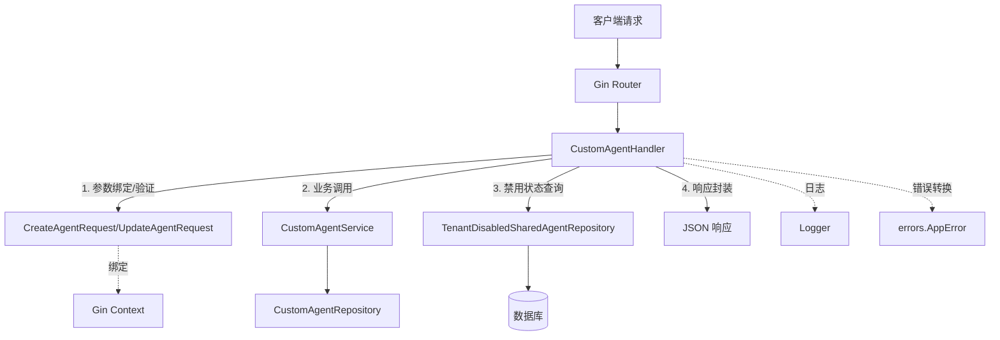

# Custom Agent Profile Management Handlers 技术深度剖析

## 1. 模块概述

### 问题空间

在多租户智能体平台中，每个租户都需要管理自己的自定义智能体配置。这些配置包括智能体的基本信息（名称、描述、头像）和行为配置（系统提示词、工具使用、检索策略等）。一个简单的 CRUD 接口是不够的，因为我们还需要处理：

- 内置智能体与自定义智能体的权限隔离
- 租户级别的智能体禁用状态
- 提示词占位符的动态管理
- 智能体复制功能以简化配置

这就是 `custom_agent_profile_management_handlers` 模块存在的原因——它提供了一套完整的 HTTP 接口，专门处理自定义智能体的生命周期管理，同时确保租户隔离和权限控制。

### 核心价值

这个模块是智能体配置管理的**HTTP 网关层**，它将外部 API 请求转换为内部服务调用，处理参数验证、错误转换、日志记录等横切关注点，让业务逻辑层保持纯粹。

---

## 2. 架构与数据流向

### 架构图



### 架构角色解析

这个模块在整个系统中扮演**HTTP 适配层**的角色：

1. **请求接收器**：接收来自客户端的 HTTP 请求，通过 Gin 框架路由到对应的处理方法
2. **参数转换器**：将 JSON 请求体绑定到强类型的请求模型（`CreateAgentRequest`/`UpdateAgentRequest`）
3. **服务协调者**：调用 `CustomAgentService` 执行核心业务逻辑，同时可能查询 `TenantDisabledSharedAgentRepository` 获取租户级禁用状态
4. **响应封装器**：将业务结果转换为标准的 JSON 响应格式
5. **错误适配器**：将内部错误转换为统一的 `AppError` 格式，设置合适的 HTTP 状态码

### 关键数据流向

#### 创建智能体流程
1. 客户端发送 `POST /agents` 请求
2. `CreateAgent` 方法接收请求，解析 JSON 到 `CreateAgentRequest`
3. 将请求模型转换为 `types.CustomAgent` 领域模型
4. 调用 `service.CreateAgent` 执行业务逻辑
5. 封装结果为 `{success: true, data: createdAgent}` 并返回 201 状态码

#### 列表智能体流程
1. 客户端发送 `GET /agents` 请求
2. `ListAgents` 方法调用 `service.ListAgents` 获取所有智能体
3. 从 Gin Context 获取当前租户 ID
4. 调用 `disabledRepo.ListDisabledOwnAgentIDs` 获取该租户禁用的自有智能体 ID 列表
5. 封装结果为包含 `data` 和 `disabled_own_agent_ids` 的响应

---

## 3. 核心组件深度剖析

### CustomAgentHandler 结构体

**设计意图**：这是一个典型的依赖注入风格的处理器，通过构造函数接收依赖，而不是在内部创建它们。这种设计使得单元测试变得容易——我们可以注入 mock 的 service 和 repository。

**依赖关系**：
- `service interfaces.CustomAgentService`：核心业务逻辑的入口
- `disabledRepo interfaces.TenantDisabledSharedAgentRepository`：租户禁用状态的数据访问

**为什么使用接口而不是具体实现**？
这是一个关键的设计决策。通过依赖接口，这个模块与具体的业务逻辑实现解耦。这意味着：
1. 我们可以在不修改 handler 代码的情况下替换 service 实现
2. 单元测试时可以轻松注入 mock 对象
3. 符合"依赖倒置原则"——高层模块（handler）不依赖低层模块（具体 service），两者都依赖抽象

### CreateAgentRequest / UpdateAgentRequest

**设计意图**：这些是专门为 HTTP 请求设计的数据传输对象（DTO），它们与领域模型 `types.CustomAgent` 分离，有几个重要原因：

1. **API 契约稳定性**：API 结构可以独立于内部领域模型演变
2. **验证关注点分离**：可以在 DTO 上使用 Gin 的 binding 标签进行参数验证
3. **字段选择性暴露**：不需要将内部字段（如创建时间、租户 ID）暴露给 API

**关键区别**：
- `CreateAgentRequest` 的 `Name` 字段有 `binding:"required"` 标签，因为创建时必须提供名称
- `UpdateAgentRequest` 的所有字段都是可选的，因为更新时可能只修改部分字段

### 核心方法解析

#### CreateAgent

这个方法展示了典型的 handler 模式：

1. **上下文提取**：从 Gin Context 提取标准库 Context
2. **参数绑定**：使用 `c.ShouldBindJSON` 将请求体绑定到模型
3. **模型转换**：将请求模型转换为领域模型
4. **服务调用**：委托给 service 层执行实际业务逻辑
5. **错误处理**：将 service 错误转换为 HTTP 错误
6. **响应封装**：返回标准 JSON 响应

**值得注意的细节**：
- 使用 `secutils.SanitizeForLog` 对敏感数据进行日志 sanitize
- 专门处理 `service.ErrAgentNameRequired` 错误，返回 400 而不是 500
- 创建成功返回 201 Created 状态码而不是 200 OK

#### ListAgents

这个方法有一个特别的设计：它不仅返回智能体列表，还返回当前租户禁用的自有智能体 ID 列表。

**为什么在同一个接口返回**？
这是一个性能优化。前端在显示智能体列表时需要同时知道哪些被禁用了。如果分成两个接口，前端需要发起两次请求，增加了网络开销。通过一次请求返回所有需要的数据，减少了网络往返。

**数据来源分离**：
- 智能体列表来自 `service.ListAgents`
- 禁用 ID 列表来自 `disabledRepo.ListDisabledOwnAgentIDs`

这种分离保持了单一职责——service 负责智能体管理，repository 负责禁用状态管理。

#### UpdateAgent / DeleteAgent

这两个方法都体现了**权限控制**的设计：

- 它们都处理 `service.ErrCannotModifyBuiltin` 和 `service.ErrCannotDeleteBuiltin` 错误
- 这些错误被转换为 403 Forbidden 状态码

**为什么内置智能体不能修改/删除**？
内置智能体是平台提供的标准功能，确保所有租户都有一致的基础体验。允许修改或删除会破坏平台的一致性和可预测性。

#### GetPlaceholders

这个方法是一个**元数据接口**，它不操作智能体实例，而是返回提示词占位符的定义。

**设计意图**：
前端需要知道哪些占位符可用，以便在提示词编辑器中提供自动补全和验证。这个接口让前端可以动态获取这些信息，而不是硬编码在前端代码中。

**返回结构**：
返回一个按字段类型分组的占位符映射，这样前端可以根据当前编辑的字段类型显示相关的占位符。

---

## 4. 依赖关系分析

### 上游依赖（被谁调用）

这个模块被 HTTP 路由层调用，具体是通过 Gin 的路由配置将 `/agents` 路径的请求映射到 `CustomAgentHandler` 的方法。

### 下游依赖（调用谁）

1. **interfaces.CustomAgentService**：核心业务逻辑接口
   - 职责：智能体的创建、读取、更新、删除、复制等业务逻辑

2. **interfaces.TenantDisabledSharedAgentRepository**：租户禁用状态数据访问接口
   - 职责：管理租户对共享智能体的禁用状态

### 数据契约

**输入契约**：
- `CreateAgentRequest`：必须包含 `name`，可选 `description`、`avatar`、`config`
- `UpdateAgentRequest`：所有字段都是可选的
- URL 参数：`id` 用于标识具体智能体

**输出契约**：
- 成功响应：`{success: true, data: ...}`
- 错误响应：`errors.AppError` 格式，包含错误码和详情

---

## 5. 设计决策与权衡

### 1. DTO 与领域模型分离

**决策**：创建独立的 `CreateAgentRequest` 和 `UpdateAgentRequest`，而不是直接使用 `types.CustomAgent`

**权衡**：
- ✅ 优点：API 契约与内部实现解耦，可以独立演变
- ✅ 优点：可以在 DTO 层进行专门的验证和序列化
- ❌ 缺点：增加了代码重复，需要维护两个相似的结构
- ❌ 缺点：需要在 DTO 和领域模型之间进行转换

**为什么这样选择**：
对于面向外部的 API，契约稳定性比代码简洁性更重要。通过分离 DTO，我们可以自由地重构内部领域模型，而不破坏外部 API。

### 2. 依赖注入 vs 直接创建依赖

**决策**：通过构造函数注入 `service` 和 `disabledRepo`

**权衡**：
- ✅ 优点：提高可测试性，可以轻松注入 mock 依赖
- ✅ 优点：明确表达了组件的依赖关系
- ✅ 优点：符合依赖倒置原则
- ❌ 缺点：增加了使用时的复杂度，需要先创建依赖再创建 handler

**为什么这样选择**：
对于可测试性和可维护性的长期收益，稍微增加的使用复杂度是值得的。

### 3. 集中式错误处理 vs 内联错误处理

**决策**：在每个 handler 方法中内联处理错误，将 service 错误转换为 HTTP 错误

**权衡**：
- ✅ 优点：每个方法可以精确控制错误转换逻辑
- ✅ 优点：错误处理逻辑与业务逻辑靠近，易于理解
- ❌ 缺点：存在一些重复代码（如类似的 switch err 块）
- ❌ 缺点：如果要统一修改错误处理策略，需要修改多个地方

**为什么这样选择**：
不同的端点需要不同的错误处理策略，集中式处理会增加不必要的复杂性。内联处理提供了更好的灵活性和可读性。

### 4. ListAgents 返回复合数据

**决策**：在同一个接口中返回智能体列表和禁用 ID 列表

**权衡**：
- ✅ 优点：减少网络往返，提高性能
- ✅ 优点：前端使用方便，一次请求获取所有需要的数据
- ❌ 缺点：违反了单一职责原则，一个接口做了两件事
- ❌ 缺点：如果前端只需要其中一部分数据，会造成带宽浪费

**为什么这样选择**：
在这个场景下，前端几乎总是同时需要这两部分数据。性能收益超过了设计纯度的损失。

---

## 6. 使用指南与最佳实践

### 常见使用模式

#### 创建智能体

```go
// 前端请求示例
POST /agents
{
  "name": "我的智能体",
  "description": "一个帮助处理文档的智能体",
  "avatar": "https://example.com/avatar.png",
  "config": {
    "agent_mode": "chat",
    "system_prompt": "你是一个乐于助人的助手..."
  }
}
```

#### 更新智能体

```go
// 前端请求示例
PUT /agents/agent-123
{
  "name": "更新后的智能体名称",
  "description": "更新后的描述"
}
```

### 扩展点

虽然这个模块本身设计得比较稳定，但有几个潜在的扩展点：

1. **添加新的智能体操作**：可以在 `CustomAgentHandler` 中添加新方法，遵循现有的模式
2. **自定义响应格式**：如果需要改变响应格式，可以修改各个方法中的 `c.JSON` 调用
3. **添加请求验证**：可以在 `CreateAgentRequest` 和 `UpdateAgentRequest` 中添加更多的 binding 标签

### 注意事项

1. **不要在 handler 中添加业务逻辑**：handler 应该只负责 HTTP 相关的工作，业务逻辑应该委托给 service 层
2. **始终 sanitize 日志数据**：使用 `secutils.SanitizeForLog` 处理用户输入，避免敏感信息泄露
3. **正确设置 HTTP 状态码**：201 用于创建，200 用于成功的查询/更新/删除，400 用于客户端错误，403 用于权限错误，404 用于资源不存在，500 用于服务器错误
4. **保持错误消息友好**：返回给客户端的错误消息应该清晰，但不要泄露内部实现细节

---

## 7. 边缘情况与陷阱

### 常见陷阱

1. **忘记处理内置智能体的保护**：在添加新的修改操作时，要确保像 `UpdateAgent` 和 `DeleteAgent` 一样处理内置智能体的保护
2. **忽略租户上下文**：虽然这个模块本身不直接处理租户隔离（这是 service 层的责任），但在 `ListAgents` 中需要正确获取租户 ID 来查询禁用状态
3. **参数验证不完整**：依赖 Gin 的 binding 标签进行验证，但有些复杂的验证可能需要额外的代码
4. **错误转换遗漏**：当 service 层添加新的错误类型时，要记得在 handler 中添加相应的错误转换

### 边缘情况

1. **并发更新同一个智能体**：这个模块本身不处理并发控制，这是 service 层和数据层的责任
2. **智能体配置很大**：如果 `config` 字段非常大，可能会遇到请求大小限制，需要在网关层或 Gin 配置中适当调整
3. **禁用状态查询失败**：在 `ListAgents` 中，如果禁用状态查询失败，代码会忽略错误（`disabledOwnIDs, _ := ...`），这种设计是为了确保即使禁用状态查询失败，智能体列表仍然可以返回

---

## 8. 总结

`custom_agent_profile_management_handlers` 模块是一个设计良好的 HTTP 适配层，它将外部 API 请求转换为内部服务调用，同时处理参数验证、错误转换、日志记录等横切关注点。

关键设计亮点：
- 依赖注入提高可测试性
- DTO 与领域模型分离保护 API 契约
- 清晰的错误处理和转换策略
- 性能优化的复合响应

作为一个新加入团队的开发者，理解这个模块的关键是认识到它的"适配器"角色——它不应该包含业务逻辑，而应该专注于 HTTP 相关的工作。
