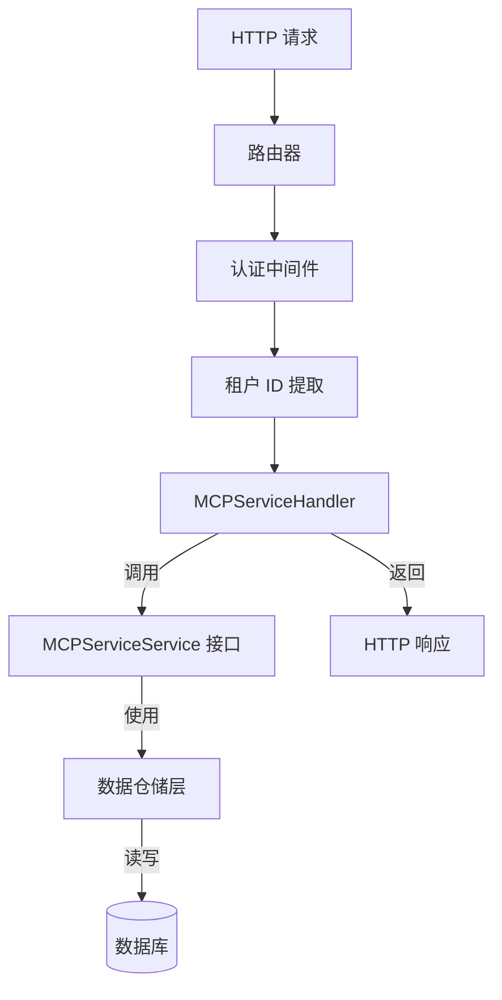

# MCP服务管理HTTP handlers 模块技术深度解析

## 1. 概述

`mcp_service_management_handlers` 模块是 WeKnora 平台中负责 MCP (Model Context Protocol) 服务配置管理的 HTTP 接口层，它将底层的业务逻辑暴露为 RESTful API。

### 1.1 为什么需要这个模块？

在 WeKnora 这种多租户 Agent 平台中，MCP 服务是扩展 Agent 能力的核心机制。MCP 允许 Agent 连接外部服务（如数据库、文件系统、API 等），因此需要一个集中的地方来：
- 为每个租户管理不同的 MCP 服务配置
- 提供安全的、带权限控制的配置管理接口
- 支持测试连接、查看工具/资源等运维操作
- 提供多种传输方式（SSE、HTTP、Stdio）的统一抽象

### 1.2 核心组件

该模块的核心是 `internal.handler.mcp_service.MCPServiceHandler`，它是一个结构体，封装了所有 MCP 服务相关的 HTTP 请求处理逻辑。

---

## 2. 架构设计与数据流向

### 2.1 整体架构



**架构解释：**

1. **请求入口**：HTTP 请求首先经过路由器和中间件链，进行认证、租户 ID 提取等预处理
2. **Handler 层**：`MCPServiceHandler` 负责接收并解析请求，验证参数，然后委托给服务层处理
3. **服务层**：`MCPServiceService` 接口定义了业务逻辑契约，实际的业务逻辑由实现该接口的服务提供
4. **数据层**：通过数据仓储层与数据库交互，持久化 MCP 服务配置

### 2.2 数据流转

以创建 MCP 服务为例，数据的流向是：

```
HTTP Request (JSON) 
  ↓
c.ShouldBindJSON(&service)  → 反序列化为 types.MCPService
  ↓
c.GetUint64(types.TenantIDContextKey.String())  → 提取租户 ID
  ↓
service.TenantID = tenantID  → 绑定租户
  ↓
h.mcpServiceService.CreateMCPService(ctx, &service)  → 调用服务层
  ↓
c.JSON(http.StatusOK, gin.H{...})  → 构造响应
```

---

## 3. 核心组件详解

### 3.1 MCPServiceHandler 结构体

```go
type MCPServiceHandler struct {
    mcpServiceService interfaces.MCPServiceService
}
```

**设计意图：**
- 使用依赖注入模式，通过构造函数注入 `MCPServiceService` 接口
- 这样设计使得 Handler 层与具体的服务实现解耦，便于测试和替换

### 3.2 HTTP 接口方法

#### 3.2.1 CreateMCPService - 创建 MCP 服务

**功能：** 为当前租户创建一个新的 MCP 服务配置

**关键实现细节：**
1. **参数绑定与验证**：使用 `c.ShouldBindJSON` 将请求体反序列化为 `types.MCPService`
2. **租户隔离**：从请求上下文中提取租户 ID，并强制绑定到服务对象上，防止越权操作
3. **错误处理**：对于参数错误返回 400，对于服务层错误返回 500，并记录详细日志
4. **敏感信息处理**：在日志中对服务名称进行安全处理，防止信息泄露

**返回格式：**
```json
{
  "success": true,
  "data": { ... MCPService 对象 ... }
}
```

#### 3.2.2 UpdateMCPService - 更新 MCP 服务

**功能：** 部分更新 MCP 服务配置

**关键实现细节：**
1. **部分更新处理**：使用 `map[string]interface{}` 来接收更新数据，这样可以处理部分字段更新，包括布尔值的 `false`
2. **字段映射**：手动将 map 中的数据映射到 `MCPService` 结构体，确保类型安全
3. **空值处理**：对于 URL 字段，特别处理了显式设置为 `null` 的情况
4. **类型转换**：对于嵌套配置（如 `stdio_config`、`auth_config`），进行递归的类型断言和转换

**为什么使用 map 而不是直接绑定到结构体？**
这是一个重要的设计决策。如果直接使用结构体绑定，会有两个问题：
1. 无法区分"字段未提供"和"字段提供了但值为零值"（例如 `enabled: false`）
2. 对于嵌套对象，部分更新会更复杂

使用 map 可以精确控制哪些字段需要更新，同时保留未更新字段的原值。

#### 3.2.3 TestMCPService - 测试 MCP 服务连接

**功能：** 测试 MCP 服务是否可以正常连接，并返回可用的工具和资源列表

**关键实现细节：**
1. **错误包装**：即使测试失败，也返回 200 状态码，但在响应体中标记 `success: false`
2. **结果包含**：成功时会返回服务提供的工具和资源列表，这样前端可以一次性获取所有信息

**为什么失败时也返回 200？**
这是一个用户体验设计。测试连接是一个预期可能失败的操作，返回 200 并在响应体中包含详细错误信息，比返回 500 更友好，前端可以更好地展示错误信息。

#### 3.2.4 其他方法

- **ListMCPServices**：获取当前租户的所有 MCP 服务列表
- **GetMCPService**：根据 ID 获取单个 MCP 服务详情
- **DeleteMCPService**：删除指定的 MCP 服务
- **GetMCPServiceTools**：获取 MCP 服务提供的工具列表
- **GetMCPServiceResources**：获取 MCP 服务提供的资源列表

---

## 4. 依赖分析

### 4.1 输入依赖

该模块依赖以下核心组件：

1. **`github.com/gin-gonic/gin`**：HTTP 框架，用于处理请求和响应
2. **`internal/types`**：定义了 `MCPService`、`MCPTestResult` 等数据模型
3. **`internal/types/interfaces`**：定义了 `MCPServiceService` 接口，是 Handler 与服务层的契约
4. **`internal/errors`**：定义了应用错误类型，如 `NewBadRequestError`、`NewInternalServerError`
5. **`internal/logger`**：日志记录工具
6. **`internal/utils`**：安全工具，如 `secutils.SanitizeForLog` 用于日志脱敏

### 4.2 被谁依赖

该模块被 HTTP 路由层依赖，路由会将 `/mcp-services` 路径的请求转发给 `MCPServiceHandler` 的相应方法处理。

### 4.3 数据契约

**输入契约：**
- 请求体必须是有效的 JSON，符合 `types.MCPService` 的结构
- 请求上下文必须包含 `types.TenantIDContextKey` 对应的租户 ID

**输出契约：**
- 成功响应：`{"success": true, "data": ...}`
- 错误响应：通过 `c.Error()` 设置错误，由错误处理中间件统一转换为 JSON 格式

---

## 5. 设计决策与权衡

### 5.1 租户隔离的实现方式

**决策**：在每个 Handler 方法中从上下文提取租户 ID，并强制绑定到业务对象上，而不是依赖服务层处理。

**理由**：
- **防御性编程**：确保即使服务层有 bug，也不会出现跨租户数据访问
- **职责分离**：Handler 层负责 HTTP 相关的安全检查（认证、授权、租户隔离），服务层专注于业务逻辑
- **一致性**：所有接口都遵循相同的模式，代码更易维护

**权衡**：
- 优点：安全性高，租户隔离强制实施
- 缺点：每个方法都有重复的租户 ID 提取代码

### 5.2 部分更新的实现

**决策**：使用 `map[string]interface{}` 接收更新数据，然后手动映射到结构体。

**理由**：
- **精确控制**：可以区分"未提供"和"零值"
- **灵活性**：不需要为不同的更新场景定义多个结构体
- **兼容性**：前端可以只发送需要更新的字段

**权衡**：
- 优点：灵活，精确
- 缺点：代码冗长，需要手动处理类型断言和转换

### 5.3 错误处理策略

**决策**：
- 参数验证错误返回 400
- 服务层错误返回 500
- 测试连接失败返回 200 但在响应体中标记失败

**理由**：
- 遵循 HTTP 状态码语义
- 对于测试连接这种"预期可能失败"的操作，返回 200 更符合用户体验

---

## 6. 使用示例与最佳实践

### 6.1 创建 MCP 服务示例

```bash
curl -X POST http://localhost:8080/mcp-services \
  -H "Authorization: Bearer YOUR_TOKEN" \
  -H "Content-Type: application/json" \
  -d '{
    "name": "My MCP Service",
    "description": "A test MCP service",
    "transport_type": "sse",
    "url": "https://example.com/mcp",
    "headers": {
      "Authorization": "Bearer SERVICE_TOKEN"
    },
    "auth_config": {
      "api_key": "my-api-key"
    },
    "advanced_config": {
      "timeout": 30,
      "retry_count": 3
    }
  }'
```

### 6.2 部分更新示例

```bash
curl -X PUT http://localhost:8080/mcp-services/SERVICE_ID \
  -H "Authorization: Bearer YOUR_TOKEN" \
  -H "Content-Type: application/json" \
  -d '{
    "enabled": false,
    "description": "Updated description"
  }'
```

### 6.3 最佳实践

1. **始终验证租户 ID**：不要假设请求上下文中一定有租户 ID，要进行零值检查
2. **敏感信息脱敏**：在日志中使用 `secutils.SanitizeForLog` 处理敏感数据
3. **错误信息要详细但安全**：返回给用户的错误信息不要包含内部实现细节，但要足够清晰
4. **使用统一的响应格式**：所有成功响应都使用 `{"success": true, "data": ...}` 格式

---

## 7. 边缘情况与注意事项

### 7.1 常见陷阱

1. **布尔值的零值问题**：在更新操作中，要特别注意 `enabled: false` 的情况，使用 map 而不是结构体绑定可以避免这个问题
2. **空指针解引用**：在处理 `URL`、`AuthConfig` 等指针字段时，要进行 nil 检查
3. **租户 ID 丢失**：如果中间件没有正确设置租户 ID，所有操作都会失败，要确保中间件链正确配置
4. **敏感信息泄露**：不要在日志中记录完整的 API Key、Token 等敏感信息

### 7.2 安全考虑

1. **租户隔离**：所有操作都强制绑定租户 ID，防止越权访问
2. **输入验证**：使用 Gin 的绑定功能进行基本的输入验证
3. **敏感信息处理**：在日志中对敏感信息进行脱敏处理
4. **认证与授权**：依赖中间件进行认证，租户 ID 本身就是一种授权机制

---

## 8. 总结

`mcp_service_management_handlers` 模块是 WeKnora 平台中连接 HTTP 世界与 MCP 服务管理业务逻辑的桥梁。它采用了清晰的分层架构，使用依赖注入实现解耦，通过强制租户隔离确保安全性。

该模块的设计体现了以下原则：
- **防御性编程**：在每个入口点进行安全检查
- **用户体验优先**：对于测试连接等操作，返回友好的错误信息
- **灵活性与精确性**：使用 map 处理部分更新，精确控制字段变更
- **可维护性**：代码结构清晰，职责分离明确

对于新开发者来说，理解这个模块的关键是掌握租户隔离的实现方式、部分更新的处理策略，以及错误处理的设计思想。
