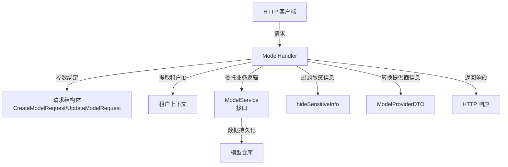

# model_catalog_management_handlers 模块深度解析

## 1. 问题定位与模块使命

在多租户 AI 平台中，模型配置管理是一个核心挑战。不同租户需要配置自己的 LLM、嵌入模型和重排序模型，同时系统需要提供内置模型供所有租户使用。这个模块解决了以下关键问题：

- **模型配置的 CRUD 操作**：允许租户创建、查询、更新和删除自己的模型配置
- **敏感信息保护**：内置模型的 API Key 和 BaseURL 等敏感信息需要对租户隐藏
- **模型提供商适配**：需要为前端提供标准化的模型提供商信息，包括默认 URL 和支持的模型类型
- **前后端类型映射**：前端使用的模型类型标识（如 "chat"）与后端内部类型（如 "KnowledgeQA"）需要转换

如果没有这个模块，每个 API 端点都需要重复处理租户上下文、敏感信息过滤、错误处理等逻辑，导致代码冗余和维护困难。

## 2. 核心抽象与心智模型

可以将这个模块想象成**模型配置管理的"前台接待员"**：

- **ModelHandler** 是接待员，负责接收 HTTP 请求、验证参数、提取租户上下文
- **CreateModelRequest/UpdateModelRequest** 是接待员使用的"申请表单"，规范了请求数据的格式
- **ModelProviderDTO** 是接待员整理后的"厂商目录"，将后端复杂的提供商信息转换为前端易于消费的格式
- **hideSensitiveInfo** 是接待员的"信息过滤机制"，确保敏感信息不会泄露给租户

核心数据流转：
```
HTTP 请求 → 参数绑定 → 租户上下文提取 → 业务逻辑委托 → 敏感信息过滤 → HTTP 响应
```

## 3. 架构设计与数据流

### 3.1 组件架构图



### 3.2 关键数据流详解

#### 模型创建流程
1. **请求接收**：`CreateModel` 方法接收 HTTP POST 请求
2. **参数验证**：使用 Gin 的 `ShouldBindJSON` 绑定并验证请求参数
3. **租户上下文**：从 Gin 上下文提取 `TenantID`，确保操作在租户隔离环境下进行
4. **模型构建**：将请求数据转换为 `types.Model` 对象，并进行日志脱敏处理
5. **业务委托**：调用 `service.CreateModel` 执行实际的创建逻辑
6. **响应处理**：过滤敏感信息后返回创建成功的模型

#### 模型列表获取流程
1. **请求接收**：`ListModels` 方法接收 HTTP GET 请求
2. **租户验证**：确保租户 ID 存在
3. **数据获取**：调用 `service.ListModels` 获取当前租户的所有模型
4. **敏感信息过滤**：遍历模型列表，对每个内置模型调用 `hideSensitiveInfo`
5. **响应返回**：返回过滤后的模型列表

#### 模型提供商列表获取流程
1. **请求接收**：`ListModelProviders` 方法接收 HTTP GET 请求
2. **类型映射**：将前端模型类型（如 "chat"）转换为后端类型（如 "KnowledgeQA"）
3. **数据获取**：调用 `provider.ListByModelType` 或 `provider.List` 获取提供商信息
4. **格式转换**：将后端提供商信息转换为 `ModelProviderDTO`，包括默认 URL 和模型类型的前端映射
5. **响应返回**：返回转换后的提供商列表

## 4. 核心组件深度解析

### 4.1 ModelHandler 结构体

**职责**：HTTP 请求处理的入口点，负责协调各个组件完成模型管理操作。

**设计亮点**：
- **依赖注入**：通过 `NewModelHandler` 接收 `interfaces.ModelService` 接口，实现了与业务逻辑层的解耦
- **单一职责**：每个方法只处理一个 HTTP 端点，逻辑清晰
- **错误处理**：统一的错误处理模式，将业务错误转换为适当的 HTTP 状态码

**关键方法**：
- `CreateModel`：处理模型创建请求
- `GetModel`：获取单个模型详情
- `ListModels`：获取模型列表
- `UpdateModel`：更新模型配置
- `DeleteModel`：删除模型
- `ListModelProviders`：获取模型提供商列表

### 4.2 请求结构体

#### CreateModelRequest
**职责**：定义模型创建请求的数据结构和验证规则。

**设计亮点**：
- 使用 Gin 的 binding 标签进行参数验证
- 直接使用 `types.ModelType` 和 `types.ModelSource` 类型，确保类型安全
- 包含所有必要的模型配置字段

#### UpdateModelRequest
**职责**：定义模型更新请求的数据结构。

**设计亮点**：
- 所有字段都是可选的，允许部分更新
- 与 `CreateModelRequest` 保持字段一致性，但去掉了 required 标签

### 4.3 hideSensitiveInfo 函数

**职责**：保护内置模型的敏感信息不被泄露。

**设计亮点**：
- **不可变操作**：返回模型的副本，而不是修改原对象
- **精确过滤**：只对内置模型（`IsBuiltin` 为 true）进行敏感信息过滤
- **保留必要信息**：隐藏 APIKey 和 BaseURL，但保留嵌入维度等其他参数

**实现细节**：
```go
func hideSensitiveInfo(model *types.Model) *types.Model {
    if !model.IsBuiltin {
        return model
    }
    
    // 创建副本并隐藏敏感信息
    return &types.Model{
        // ... 复制非敏感字段
        Parameters: types.ModelParameters{
            BaseURL: "",  // 清空
            APIKey:  "",  // 清空
            // 保留其他参数
        },
    }
}
```

### 4.4 ModelProviderDTO 结构体

**职责**：将后端的模型提供商信息转换为前端易于消费的格式。

**设计亮点**：
- **前端友好**：使用前端熟悉的字段名和类型标识
- **完整信息**：包含提供商标识符、显示名称、描述、默认 URL 和支持的模型类型
- **类型映射**：通过 `modelTypeToFrontend` 函数将后端类型转换为前端类型

### 4.5 modelTypeToFrontend 函数

**职责**：实现后端模型类型到前端模型类型的映射。

**设计亮点**：
- **集中管理**：类型映射逻辑集中在一个函数中，易于维护
- **默认处理**：对于未知类型，直接返回原类型字符串，保证兼容性

**映射关系**：
- `types.ModelTypeKnowledgeQA` → "chat"
- `types.ModelTypeEmbedding` → "embedding"
- `types.ModelTypeRerank` → "rerank"
- `types.ModelTypeVLLM` → "vllm"

## 5. 依赖关系分析

### 5.1 依赖的模块

| 模块 | 用途 | 耦合度 |
|------|------|--------|
| `interfaces.ModelService` | 业务逻辑委托 | 高（核心依赖） |
| `types.Model` | 模型数据结构 | 中 |
| `errors` | 错误处理 | 中 |
| `logger` | 日志记录 | 中 |
| `provider` | 模型提供商信息 | 中 |
| `secutils` | 日志脱敏 | 低 |
| `gin` | Web 框架 | 高（基础设施） |

### 5.2 被依赖的模块

这个模块主要被 HTTP 路由层依赖，用于注册模型管理相关的端点。

### 5.3 数据契约

**输入契约**：
- 创建/更新模型：符合 `CreateModelRequest`/`UpdateModelRequest` 结构的 JSON
- 查询模型：URL 路径中的模型 ID
- 列表查询：可选的模型类型查询参数

**输出契约**：
- 成功响应：`{"success": true, "data": ...}` 格式
- 错误响应：通过 `c.Error()` 设置的 `errors.AppError`

## 6. 设计决策与权衡

### 6.1 敏感信息过滤策略

**决策**：在 HTTP 响应层过滤敏感信息，而不是在业务逻辑层。

**理由**：
- **关注点分离**：业务逻辑层不需要关心哪些信息应该对前端隐藏
- **灵活性**：如果未来需要改变过滤策略，只需要修改这一个地方
- **安全性**：确保敏感信息不会意外泄露，即使业务逻辑层返回了完整数据

**权衡**：
- 优点：安全性高，灵活性好
- 缺点：需要创建模型副本，有轻微的性能开销

### 6.2 前后端类型映射

**决策**：在 HTTP 处理层进行类型映射，而不是统一使用一种类型标识。

**理由**：
- **兼容性**：后端使用更语义化的类型名称（如 KnowledgeQA），前端使用更通用的名称（如 chat）
- **演进独立**：前后端可以独立演进类型系统，只要保持映射关系正确

**权衡**：
- 优点：前后端解耦，各自可以使用更适合自己的类型名称
- 缺点：需要维护映射关系，增加了一定的复杂性

### 6.3 部分更新策略

**决策**：在 `UpdateModel` 中，只有非空字段才会被更新。

**理由**：
- **灵活性**：允许客户端只发送需要更新的字段
- **简单性**：不需要复杂的补丁机制或差异比较

**权衡**：
- 优点：实现简单，使用灵活
- 缺点：无法区分"将字段设置为空"和"不更新该字段"（当前设计中不支持将字段设置为空）

### 6.4 错误处理模式

**决策**：使用 `errors.AppError` 封装错误，并通过 Gin 的 `c.Error()` 机制返回。

**理由**：
- **统一错误格式**：所有错误都遵循相同的格式
- **HTTP 状态码映射**：可以将不同类型的错误映射到适当的 HTTP 状态码

**权衡**：
- 优点：错误处理统一，客户端易于处理
- 缺点：需要定义和维护多种错误类型

## 7. 使用指南与最佳实践

### 7.1 基本使用

**创建 ModelHandler 实例**：
```go
modelService := // 实现了 interfaces.ModelService 的实例
modelHandler := NewModelHandler(modelService)
```

**注册路由**：
```go
router.POST("/models", modelHandler.CreateModel)
router.GET("/models", modelHandler.ListModels)
router.GET("/models/:id", modelHandler.GetModel)
router.PUT("/models/:id", modelHandler.UpdateModel)
router.DELETE("/models/:id", modelHandler.DeleteModel)
router.GET("/models/providers", modelHandler.ListModelProviders)
```

### 7.2 最佳实践

1. **租户上下文确保**：
   - 始终确保在 Gin 上下文中设置了 `TenantIDContextKey`，否则所有模型操作都会失败
   - 建议在中间件中统一设置租户上下文

2. **敏感信息保护**：
   - 不要修改 `hideSensitiveInfo` 函数的逻辑，除非你完全理解其安全 implications
   - 如果需要添加新的敏感字段，记得在这个函数中进行过滤

3. **类型映射维护**：
   - 添加新的模型类型时，记得同时更新 `modelTypeToFrontend` 函数
   - 确保前端和后端的类型映射保持一致

4. **错误处理**：
   - 业务逻辑层应该返回有意义的错误，HTTP 层会将其转换为适当的 HTTP 状态码
   - 对于 `service.ErrModelNotFound`，会自动转换为 404 状态码

## 8. 常见陷阱与注意事项

### 8.1 内置模型的更新限制

**陷阱**：尝试更新内置模型会失败，因为业务逻辑层可能不允许修改内置模型。

**注意事项**：
- `UpdateModel` 方法中虽然有对内置模型的敏感信息过滤，但实际上内置模型应该是不可更新的
- 前端应该根据 `IsBuiltin` 字段禁用内置模型的编辑功能

### 8.2 参数更新的模糊性

**陷阱**：无法通过 `UpdateModelRequest` 将字段设置为空字符串或零值。

**注意事项**：
- 当前实现中，空字符串字段会被忽略，不会更新
- 如果需要支持将字段设置为空，需要修改更新逻辑，可能需要使用指针类型或特殊的标记值

### 8.3 租户 ID 的可靠性

**陷阱**：如果租户 ID 没有正确设置在 Gin 上下文中，所有模型操作都会失败。

**注意事项**：
- 确保在中间件中正确设置租户 ID
- 不要假设租户 ID 一定存在，代码中已经有检查，但最好在更上层确保

### 8.4 模型类型映射的完整性

**陷阱**：添加新的模型类型后，忘记更新 `modelTypeToFrontend` 函数，导致前端无法正确识别。

**注意事项**：
- 添加新模型类型时，更新 `modelTypeToFrontend` 函数
- 更新 `ListModelProviders` 方法中的类型映射逻辑
- 考虑添加单元测试来验证类型映射的完整性

## 9. 扩展点与未来演进方向

### 9.1 可能的扩展点

1. **模型验证扩展**：
   - 当前只有基本的参数绑定验证，可以添加更复杂的业务规则验证
   - 例如：验证模型名称的唯一性、参数格式的正确性等

2. **批量操作支持**：
   - 可以添加批量创建、更新、删除模型的端点
   - 特别适用于初始化或迁移场景

3. **模型配置模板**：
   - 可以添加模型配置模板功能，允许用户从模板创建模型
   - 减少配置错误，提高用户体验

4. **模型使用统计**：
   - 可以添加模型使用情况的统计端点
   - 帮助用户了解模型的使用频率和性能

### 9.2 技术债务与改进方向

1. **更新逻辑改进**：
   - 当前的部分更新逻辑比较简单，可以考虑使用更强大的补丁机制
   - 例如：使用 JSON Patch 或类似的标准

2. **日志脱敏增强**：
   - 当前只对模型名称和类型进行了脱敏，可以考虑更全面的脱敏策略
   - 可以使用结构化日志，更好地控制敏感信息

3. **测试覆盖**：
   - 可以添加更多的单元测试和集成测试
   - 特别关注敏感信息过滤、类型映射等关键逻辑

## 10. 总结

`model_catalog_management_handlers` 模块是模型配置管理的 HTTP 接入层，它通过清晰的职责划分、良好的依赖注入设计和完善的安全机制，为上层提供了简单易用的模型管理 API。

这个模块的核心价值在于：
- **安全**：通过敏感信息过滤保护内置模型的配置
- **灵活**：通过类型映射支持前后端独立演进
- **可靠**：通过统一的错误处理和租户隔离确保操作的正确性

理解这个模块的关键是把握其"前台接待员"的角色——它不处理核心业务逻辑，而是负责请求的接收、验证、上下文提取、响应格式化等辅助工作，将真正的业务逻辑委托给下层的 `ModelService`。
