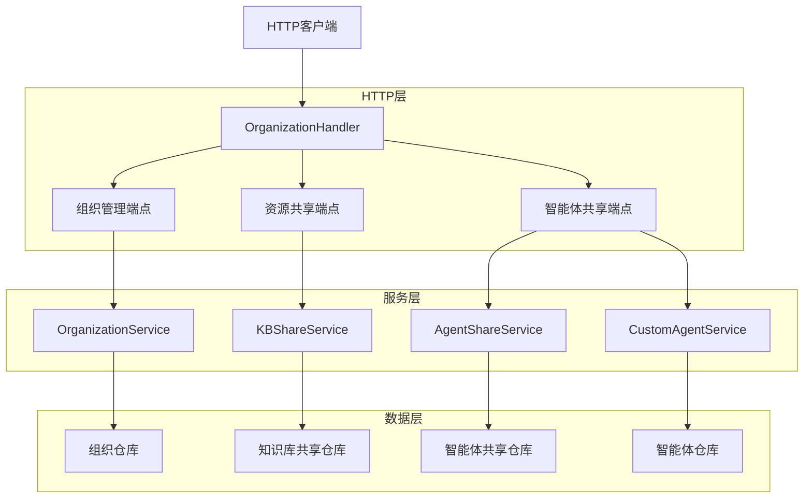
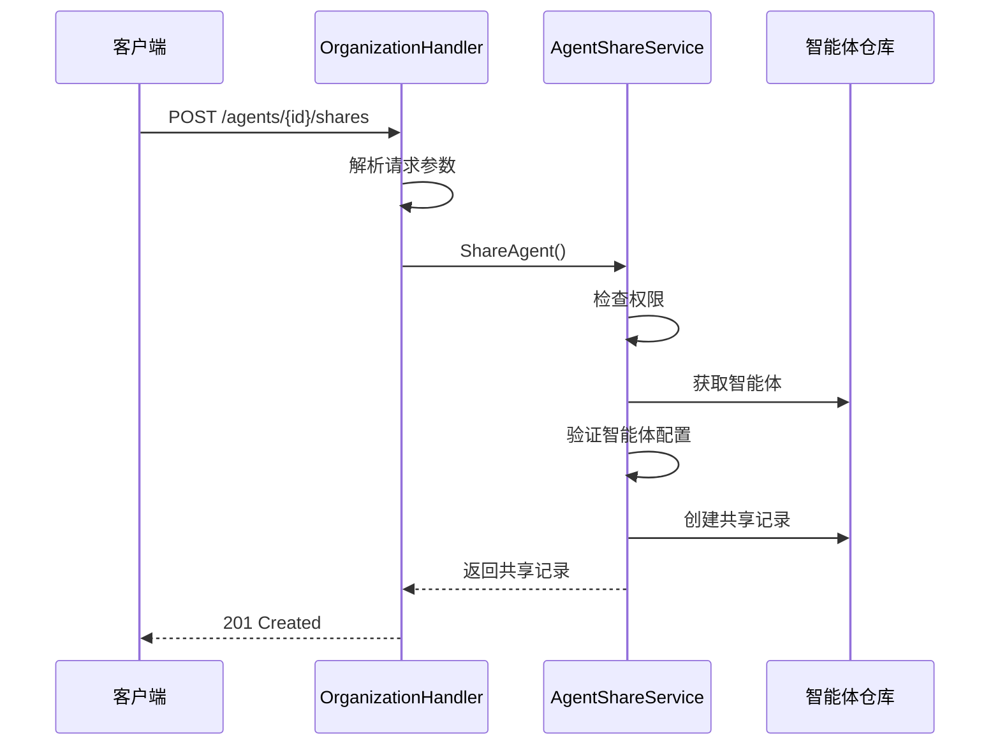
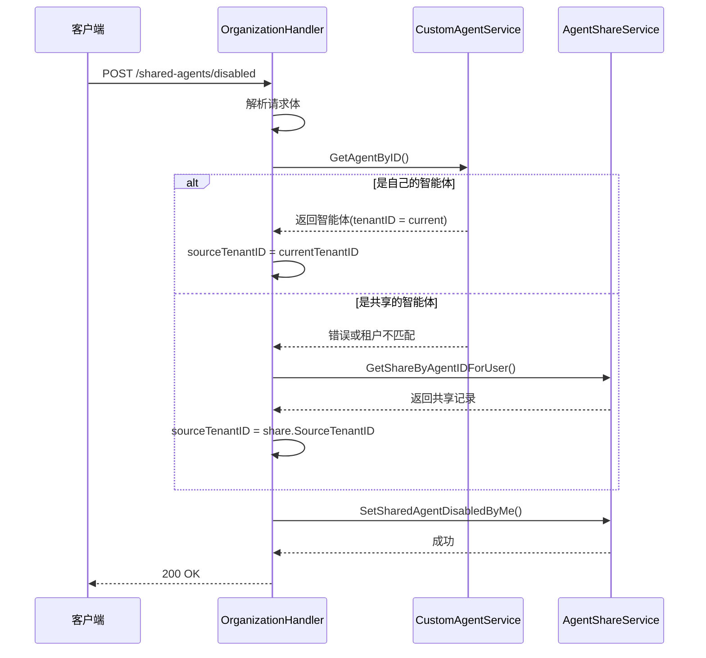
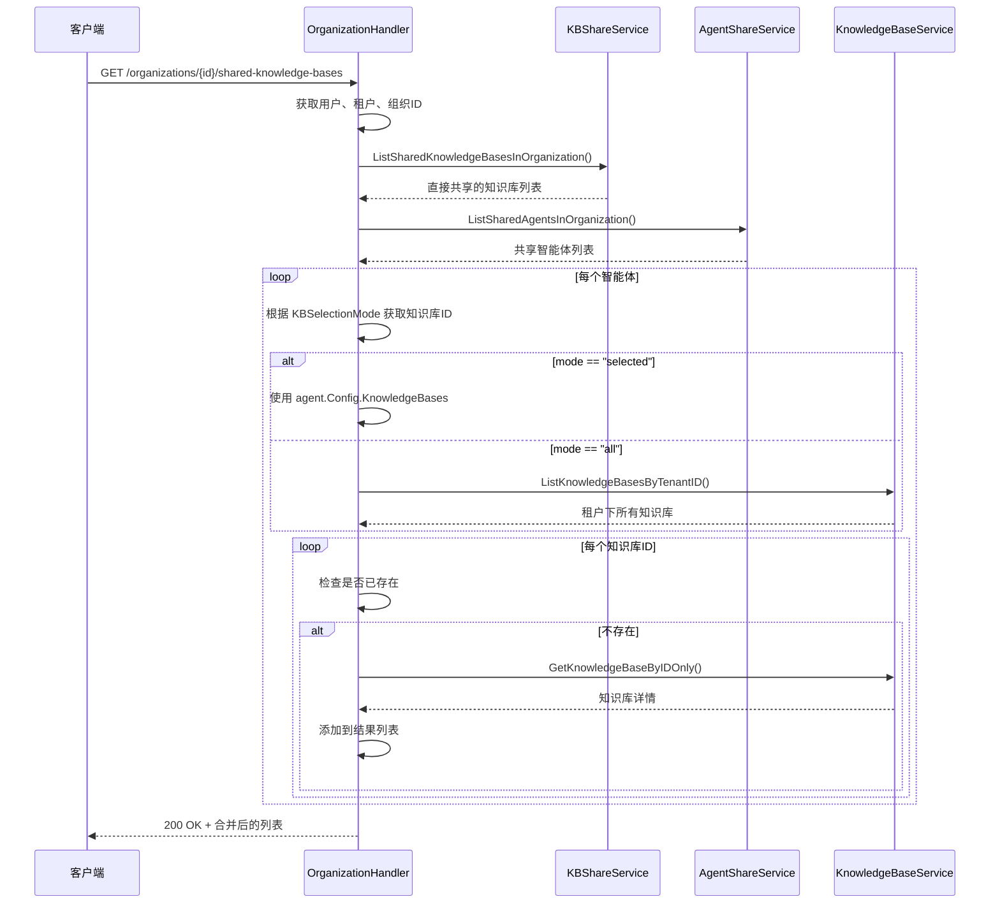

# 组织共享智能体访问处理器 (organization_shared_agent_access_handlers)

## 1. 问题领域与模块定位

在多用户协作的智能体平台中，组织资源共享是一个核心需求。想象一下：你创建了一个配置完善的智能体，希望团队成员也能使用，但你不想让每个人都复制一份配置；或者你希望在组织内统一管理智能体的可用性，让用户可以选择隐藏某些不常用的共享智能体。

**这就是本模块要解决的问题：**
- 提供组织级别的智能体共享机制
- 允许用户个性化控制共享智能体的可见性
- 统一处理组织内资源（知识库、智能体）的访问权限

如果没有这个模块，我们可能会面临：
- 每个用户都需要手动复制智能体配置，导致配置漂移
- 无法控制组织内资源的访问权限
- 用户界面被大量不需要的共享智能体塞满

## 2. 核心架构与心智模型

### 2.1 架构概览



### 2.2 心智模型

可以将这个模块想象成**组织资源的"门户管理员"**：

1. **组织是一个共享空间**：就像一个办公室，里面有各种资源（智能体、知识库）
2. **共享是资源的"借阅"**：资源所有者把资源放到共享空间，其他人可以"借阅"使用，但不能修改原件
3. **权限是"借阅级别"**：不同的角色（查看者、编辑者、管理员）有不同的使用权限
4. **禁用是"个人书架"**：用户可以把不需要的共享资源从自己的"书架"上拿掉，但不影响其他人使用

## 3. 核心组件深度解析

### 3.1 OrganizationHandler 结构体

这是整个模块的核心，负责协调所有 HTTP 请求的处理。

```go
type OrganizationHandler struct {
    orgService         interfaces.OrganizationService
    shareService       interfaces.KBShareService
    agentShareService  interfaces.AgentShareService
    customAgentService interfaces.CustomAgentService
    userService        interfaces.UserService
    kbService          interfaces.KnowledgeBaseService
    knowledgeRepo      interfaces.KnowledgeRepository
    chunkRepo          interfaces.ChunkRepository
}
```

**设计意图**：
- 使用依赖注入，便于测试和组件替换
- 聚合多个服务，提供统一的 HTTP 接口
- 保持 handler 层的轻薄，主要负责请求/响应转换

### 3.2 智能体共享功能

#### ShareAgent - 共享智能体到组织

```go
func (h *OrganizationHandler) ShareAgent(c *gin.Context) {
    // 解析请求参数
    // 调用 agentShareService.ShareAgent
    // 返回共享记录
}
```

**工作流程**：
1. 验证用户是否有共享权限（仅编辑者和管理员可共享）
2. 检查智能体是否完全配置（必须设置聊天模型等）
3. 创建共享记录
4. 返回共享信息

**设计亮点**：
- 权限检查在服务层完成，handler 只负责传递上下文
- 智能体配置验证确保共享的智能体是可用的

#### ListSharedAgents - 获取共享给我的智能体

```go
func (h *OrganizationHandler) ListSharedAgents(c *gin.Context) {
    // 获取当前用户和租户
    // 调用 agentShareService.ListSharedAgents
    // 返回智能体列表
}
```

#### SetSharedAgentDisabledByMe - 设置智能体是否被我禁用

这是一个非常巧妙的设计，让我们来仔细看看：

```go
type SetSharedAgentDisabledByMeRequest struct {
    AgentID  string `json:"agent_id" binding:"required"`
    Disabled bool   `json:"disabled"`
}

func (h *OrganizationHandler) SetSharedAgentDisabledByMe(c *gin.Context) {
    // 1. 获取当前用户和租户
    // 2. 解析请求体
    // 3. 确定智能体的源租户ID
    //    - 如果是自己的智能体，使用当前租户ID
    //    - 如果是共享的智能体，从共享记录中获取
    // 4. 调用 agentShareService.SetSharedAgentDisabledByMe
}
```

**设计意图**：
- 这是一个**用户级别的个性化设置**，不影响其他用户
- 需要确定 `sourceTenantID`，因为智能体可能来自：
  - 用户自己的租户（自己创建的智能体）
  - 其他租户通过组织共享的智能体

**为什么需要 sourceTenantID？**
因为智能体 ID 在不同租户间可能重复，需要 `(sourceTenantID, agentID)` 作为唯一标识。

### 3.3 组织内资源聚合功能

#### listSpaceKnowledgeBasesInOrganization - 聚合组织内知识库

这是一个内部辅助方法，用于聚合组织内的知识库：

```go
func (h *OrganizationHandler) listSpaceKnowledgeBasesInOrganization(
    ctx context.Context, 
    orgID string, 
    userID string, 
    tenantID uint64
) ([]*types.OrganizationSharedKnowledgeBaseItem, error) {
    // 1. 获取直接共享的知识库
    // 2. 获取组织内共享的智能体
    // 3. 从智能体配置中提取关联的知识库
    // 4. 合并去重，返回完整列表
}
```

**设计亮点**：
- 不仅包含直接共享的知识库，还包含通过共享智能体间接获得的知识库
- 使用 `directKbIDs` map 进行去重，避免重复显示
- 为通过智能体获得的知识库标记 `SourceFromAgent` 信息

**为什么需要聚合间接知识库？**
因为当你共享一个智能体时，该智能体使用的知识库也应该对组织成员可见，否则智能体可能无法正常工作。

## 4. 数据流转与关键操作

### 4.1 智能体共享流程



### 4.2 禁用共享智能体流程



### 4.3 获取组织内知识库列表流程



## 5. 设计决策与权衡

### 5.1 Handler 层的职责定位

**决策**：Handler 层保持轻薄，主要负责：
- HTTP 请求解析和验证
- 调用服务层
- 响应格式化和错误处理

**为什么这样设计？**
- ✅ 便于测试：服务层可以独立测试，不依赖 HTTP 上下文
- ✅ 复用性：服务层可以被其他调用方使用（如 gRPC、命令行等）
- ✅ 关注点分离：Handler 只关心 HTTP 协议，服务层关心业务逻辑

**权衡**：
- ❌ 增加了一层抽象，代码稍显冗长
- ❌ 简单的 CRUD 操作也需要经过多层

### 5.2 资源聚合在 Handler 层完成

**决策**：`listSpaceKnowledgeBasesInOrganization` 在 Handler 层实现，而不是在服务层

**为什么这样设计？**
- ✅ 这是一个 API 层面的聚合需求，不是核心业务逻辑
- ✅ 避免服务层之间的循环依赖
- ✅ 可以灵活调整聚合逻辑，不影响服务层

**权衡**：
- ❌ Handler 层变得稍重
- ❌ 聚合逻辑难以被其他模块复用

### 5.3 sourceTenantID 的推导逻辑

**决策**：在 `SetSharedAgentDisabledByMe` 中，先尝试获取智能体，判断是否是自己的，否则从共享记录中获取

**为什么这样设计？**
- ✅ 支持禁用自己的智能体（虽然"禁用"对自己的智能体意义不大）
- ✅ 统一的接口，不需要区分是自己的还是共享的
- ✅ 利用已有的服务方法，不需要创建新的查询

**权衡**：
- ❌ 可能会有两次数据库查询（先查智能体，再查共享记录）
- ❌ 逻辑稍显复杂

### 5.4 批量获取 vs 单次获取

**决策**：在 `buildResourceCountsByOrg` 和 `listSpaceKnowledgeBasesInOrganization` 中，使用批量接口获取数据，然后在内存中处理

**为什么这样设计？**
- ✅ 性能更好：减少数据库往返次数
- ✅ 避免 N+1 查询问题

**权衡**：
- ❌ 内存占用更高：需要一次性加载所有数据
- ❌ 逻辑更复杂：需要在内存中进行关联和聚合

## 6. 依赖关系分析

### 6.1 核心依赖

| 依赖接口 | 用途 | 来源模块 |
|---------|------|---------|
| `OrganizationService` | 组织管理核心业务 | [agent_identity_tenant_and_configuration_services](../application_services_and_orchestration-agent_identity_tenant_and_configuration_services.md) |
| `KBShareService` | 知识库共享业务 | [agent_identity_tenant_and_configuration_services](../application_services_and_orchestration-agent_identity_tenant_and_configuration_services.md) |
| `AgentShareService` | 智能体共享业务 | [agent_identity_tenant_and_configuration_services](../application_services_and_orchestration-agent_identity_tenant_and_configuration_services.md) |
| `CustomAgentService` | 智能体管理业务 | [agent_identity_tenant_and_configuration_services](../application_services_and_orchestration-agent_identity_tenant_and_configuration_services.md) |
| `KnowledgeBaseService` | 知识库管理业务 | [knowledge_ingestion_extraction_and_graph_services](../application_services_and_orchestration-knowledge_ingestion_extraction_and_graph_services.md) |

### 6.2 数据契约

这个模块依赖的关键数据类型：
- `types.CreateOrganizationRequest` - 创建组织请求
- `types.ShareKnowledgeBaseRequest` - 共享资源请求（重用为智能体共享）
- `types.SetSharedAgentDisabledByMeRequest` - 禁用智能体请求（本模块定义）
- `types.OrganizationSharedKnowledgeBaseItem` - 组织共享知识库项

## 7. 使用指南与常见模式

### 7.1 共享智能体

```http
POST /agents/{agent_id}/shares
Authorization: Bearer <token>
Content-Type: application/json

{
  "organization_id": "org-123",
  "permission": "viewer"
}
```

**注意事项**：
- 只有组织的编辑者和管理员可以共享智能体
- 智能体必须完全配置（设置聊天模型等）
- 权限级别会受到用户在组织中的角色限制

### 7.2 禁用/启用共享智能体

```http
POST /shared-agents/disabled
Authorization: Bearer <token>
Content-Type: application/json

{
  "agent_id": "agent-123",
  "disabled": true
}
```

**注意事项**：
- 这是个人设置，不影响其他用户
- 可以禁用自己的智能体或共享的智能体
- 禁用后智能体不会出现在对话下拉列表中

### 7.3 获取组织内所有知识库

```http
GET /organizations/{org_id}/shared-knowledge-bases
Authorization: Bearer <token>
```

**返回数据结构**：
```json
{
  "success": true,
  "data": [
    {
      "knowledge_base": {...},
      "share_id": "share-123",
      "organization_id": "org-123",
      "is_mine": false,
      "source_from_agent": {
        "agent_id": "agent-123",
        "agent_name": "My Agent",
        "kb_selection_mode": "selected"
      }
    }
  ],
  "total": 10
}
```

## 8. 边界情况与陷阱

### 8.1 智能体 ID 冲突

**问题**：不同租户可能有相同 ID 的智能体

**解决方案**：
- 始终使用 `(sourceTenantID, agentID)` 作为唯一标识
- 在 `SetSharedAgentDisabledByMe` 中正确推导 `sourceTenantID`

### 8.2 知识库去重

**问题**：同一个知识库可能通过多个智能体共享，也可能直接共享

**解决方案**：
- 使用 `directKbIDs` map 跟踪已添加的知识库
- 优先显示直接共享的知识库（因为权限可能更高）

### 8.3 权限叠加

**问题**：用户在组织中的角色和共享权限可能不同

**解决方案**：
- 有效权限 = min(共享权限, 用户在组织中的角色)
- 在 `ListOrgShares` 和 `ListOrgAgentShares` 中计算 `MyPermission`

### 8.4 智能体配置变更

**问题**：共享后智能体的知识库配置变更，组织成员看到的知识库列表可能过时

**当前行为**：
- 每次请求 `ListOrganizationSharedKnowledgeBases` 时都会重新计算
- 没有缓存，所以总是能看到最新的配置

**权衡**：
- ✅ 数据总是最新的
- ❌ 性能开销较大

### 8.5 租户级别的禁用 vs 用户级别的禁用

**注意**：本模块的 `SetSharedAgentDisabledByMe` 是**租户级别**的设置，不是用户级别的

**设计意图**：
- 假设一个租户内的用户共享相同的智能体可见性设置
- 减少数据存储量

**潜在问题**：
- 如果一个租户内有多个用户，他们的设置会相互覆盖

## 9. 总结与回顾

`organization_shared_agent_access_handlers` 模块是组织资源共享的 HTTP 层门面，它通过优雅的设计解决了以下问题：

1. **组织资源共享**：提供了知识库和智能体的共享机制
2. **个性化可见性**：允许用户控制共享智能体的可见性
3. **资源聚合**：智能地聚合直接共享和间接获得的资源
4. **权限管理**：正确处理组织角色和共享权限的叠加

关键设计亮点：
- 使用依赖注入保持组件解耦
- Handler 层保持轻薄，服务层负责业务逻辑
- 智能的资源聚合和去重
- 统一的接口处理自己的和共享的智能体

在使用这个模块时，需要注意：
- 智能体的唯一标识是 `(sourceTenantID, agentID)`
- 权限是叠加的，不是独立的
- 禁用设置是租户级别的，不是用户级别的
- 资源聚合没有缓存，每次都会重新计算