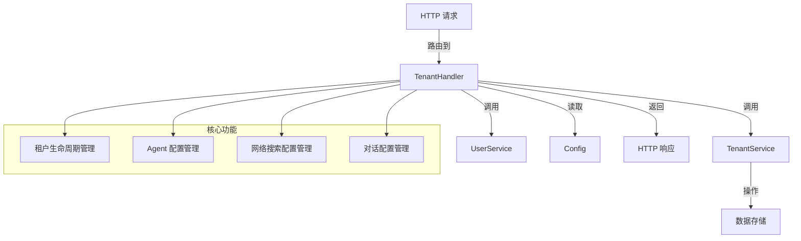

# Tenant Agent Configuration Handlers 模块技术深度解析

## 1. 模块概述

### 什么问题这个模块解决？

在多租户系统中，每个租户通常需要有自己独特的配置，以满足其特定的业务需求。`tenant_agent_configuration_handlers` 模块正是为了解决这一问题而设计的，它提供了一套完整的 HTTP 接口，用于管理租户级别的配置，包括：

- 租户本身的生命周期管理（创建、查询、更新、删除）
- 租户级别的 Agent 配置
- 租户级别的网络搜索配置
- 租户级别的对话配置

如果没有这个模块，每个租户可能只能使用系统的默认配置，无法根据自身需求进行定制，这将大大降低系统的灵活性和可扩展性。

### 核心设计思想

这个模块采用了经典的分层架构设计，将 HTTP 请求处理与业务逻辑分离。它通过 `TenantHandler` 结构体封装了所有与租户配置相关的 HTTP 处理函数，这些函数负责：
1. 解析和验证 HTTP 请求
2. 调用相应的服务层接口处理业务逻辑
3. 处理可能的错误并返回适当的 HTTP 响应

## 2. 架构设计

### 组件关系图



### 架构说明

1. **HTTP 层**：接收来自客户端的 HTTP 请求，解析参数，验证请求格式。
2. **Handler 层**：由 `TenantHandler` 结构体实现，负责协调各个服务组件，处理业务流程。
3. **Service 层**：通过接口（`TenantService`、`UserService`）与业务逻辑层交互，实现了与具体实现的解耦。
4. **Config 层**：提供系统级别的默认配置，当租户没有自定义配置时使用。

这种设计使得模块具有良好的可测试性和可扩展性，可以方便地替换服务层的实现而不影响 HTTP 处理逻辑。

## 3. 核心组件详解

### TenantHandler 结构体

`TenantHandler` 是整个模块的核心，它封装了所有与租户配置相关的 HTTP 处理函数。

```go
type TenantHandler struct {
    service     interfaces.TenantService
    userService interfaces.UserService
    config      *config.Config
}
```

**设计意图**：
- 通过依赖注入的方式接收 `TenantService`、`UserService` 和 `Config`，实现了与具体实现的解耦。
- 这种设计使得我们可以在测试时轻松替换这些依赖为 mock 对象。

### AgentConfigRequest 结构体

`AgentConfigRequest` 用于解析更新 Agent 配置的请求体。

```go
type AgentConfigRequest struct {
    MaxIterations     int      `json:"max_iterations"`
    ReflectionEnabled bool     `json:"reflection_enabled"`
    AllowedTools      []string `json:"allowed_tools"`
    Temperature       float64  `json:"temperature"`
    SystemPrompt      string   `json:"system_prompt,omitempty"`
}
```

**设计意图**：
- 专门为 Agent 配置更新设计的请求体结构，与内部的 `types.AgentConfig` 分离，提供了 API 版本控制的灵活性。
- 包含了对 Agent 行为有重要影响的参数，如最大迭代次数、温度参数等。

## 4. 关键功能分析

### 租户生命周期管理

模块提供了完整的租户生命周期管理功能，包括创建、查询、更新、删除和列表租户。

**关键流程**（以创建租户为例）：
1. 解析请求体为 `types.Tenant` 结构
2. 调用 `service.CreateTenant` 执行实际的创建逻辑
3. 处理可能的错误，区分应用级错误和系统级错误
4. 返回创建成功的租户信息

```go
func (h *TenantHandler) CreateTenant(c *gin.Context) {
    // ... 解析请求
    createdTenant, err := h.service.CreateTenant(ctx, &tenantData)
    // ... 错误处理和响应
}
```

### Agent 配置管理

这是模块的核心功能之一，允许租户自定义其 Agent 的行为。

**关键流程**（以更新 Agent 配置为例）：
1. 解析请求体为 `AgentConfigRequest` 结构
2. 验证配置参数的有效性（如最大迭代次数必须在 1-30 之间）
3. 从上下文中获取当前租户
4. 更新租户的 Agent 配置
5. 调用 `service.UpdateTenant` 保存更改

**设计亮点**：
- 支持统一的系统提示词配置，使用 `{{web_search_status}}` 占位符实现灵活的提示词定制。
- 提供了默认配置，当租户没有自定义配置时使用。

### 网络搜索配置管理

允许租户自定义网络搜索的行为，如最大结果数等。

### 对话配置管理

允许租户自定义对话的行为，如提示词模板、温度参数、最大轮数等。

## 5. 数据流向分析

### 典型的配置更新流程

1. **请求接收**：HTTP 请求到达 `TenantHandler` 的相应方法（如 `UpdateTenantKV`）
2. **请求路由**：根据 `key` 参数路由到具体的配置更新方法（如 `updateTenantAgentConfigInternal`）
3. **参数解析**：将请求体解析为相应的配置结构
4. **参数验证**：验证配置参数的有效性
5. **租户获取**：从请求上下文中获取当前租户
6. **配置更新**：更新租户的配置字段
7. **持久化**：调用 `service.UpdateTenant` 保存更改到数据库
8. **响应返回**：返回更新后的配置信息

## 6. 设计决策与权衡

### 1. 接口依赖与具体实现分离

**决策**：`TenantHandler` 依赖于 `interfaces.TenantService` 和 `interfaces.UserService` 接口，而不是具体的实现。

**原因**：
- 提高了代码的可测试性，可以轻松使用 mock 对象进行单元测试
- 提高了代码的可扩展性，可以在不修改 HTTP 层代码的情况下替换服务层实现

**权衡**：
- 增加了一定的抽象层，可能会让初学者感到困惑
- 但这种抽象带来的好处远大于其成本

### 2. 配置验证在 Handler 层进行

**决策**：在 HTTP 处理函数中对配置参数进行验证，而不是完全依赖服务层。

**原因**：
- 可以尽早返回错误，避免不必要的服务层调用
- 提供更具体的错误信息，改善 API 使用者的体验

**权衡**：
- 可能会导致一些验证逻辑重复
- 但考虑到 HTTP 层和服务层可能对验证有不同的关注点，这种重复是可以接受的

### 3. 统一的 KV 配置接口

**决策**：使用 `/tenants/kv/{key}` 接口统一处理不同类型的配置更新。

**原因**：
- 提供了一致的 API 设计，减少了客户端的学习成本
- 便于后续添加新的配置类型，只需在 switch 语句中添加新的 case

**权衡**：
- 可能会让 API 看起来不够直观
- 但通过良好的文档和示例，可以弥补这一不足

## 7. 使用指南与注意事项

### 常见使用模式

#### 更新 Agent 配置

```http
PUT /tenants/kv/agent-config
Content-Type: application/json

{
    "max_iterations": 10,
    "reflection_enabled": true,
    "allowed_tools": ["web_search", "knowledge_base"],
    "temperature": 0.7,
    "system_prompt": "你是一个有用的助手{{web_search_status}}"
}
```

#### 获取租户配置

```http
GET /tenants/kv/agent-config
```

### 注意事项与陷阱

1. **上下文依赖**：许多方法依赖于从上下文中获取租户信息，确保在调用这些方法之前已经正确设置了上下文。

2. **配置验证**：确保传递的配置参数在有效范围内，例如 `max_iterations` 必须在 1-30 之间，`temperature` 必须在 0-2 之间。

3. **错误处理**：模块区分了应用级错误和系统级错误，客户端应根据不同的错误类型采取不同的处理策略。

4. **默认配置**：当租户没有自定义配置时，系统会返回默认配置，确保你的客户端能够处理这种情况。

## 8. 扩展与维护

### 添加新的配置类型

1. 在 `types` 包中定义新的配置结构
2. 在 `Tenant` 结构中添加相应的字段
3. 在 `TenantHandler` 中添加获取和更新该配置的方法
4. 在 `GetTenantKV` 和 `UpdateTenantKV` 方法的 switch 语句中添加新的 case

### 测试建议

1. 使用 mock 对象测试 `TenantHandler`，避免依赖真实的服务层实现
2. 测试各种边界情况，如无效的配置参数、缺失的上下文等
3. 测试错误处理逻辑，确保各种错误都能被正确处理和返回

通过以上的深度解析，我们可以看到 `tenant_agent_configuration_handlers` 模块是一个设计良好、功能完善的模块，它为多租户系统中的租户配置管理提供了完整的解决方案。
