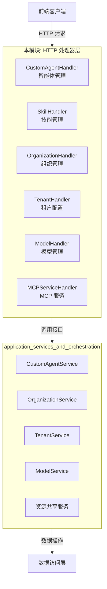

# 智能体、租户、组织与模型管理 HTTP 处理器

这个模块是整个系统的**资源管理层门面**，它将复杂的业务逻辑包装成简洁的 RESTful API 端点，让前端能够管理智能体、组织、租户、模型和 MCP 服务。

## 1. 模块概述

想象一下这个模块是一个**办公大楼的前台接待区**：
- 它不直接处理业务逻辑（就像前台不写代码）
- 它负责验证访客身份（权限检查）
- 它将请求转发给内部相应的部门（服务层）
- 它把内部的复杂响应整理成标准格式返回给外部（HTTP 响应）

这个模块解决的核心问题是：**如何将复杂的多租户、组织协作、智能体管理等业务能力，以安全、一致、易用的方式暴露给前端**。

## 2. 架构设计

### 2.1 整体架构图



### 2.2 核心设计思想

这个模块遵循**清洁架构**原则，采用了以下关键设计：

1. **职责单一**：每个 Handler 只负责一类资源的 HTTP 处理
2. **依赖倒置**：Handler 依赖接口而非具体实现，便于测试
3. **薄处理器层**：Handler 只做请求解析、响应格式化，业务逻辑全下放
4. **统一错误处理**：所有错误都通过 `errors.AppError` 标准化

## 3. 核心组件详解

### 3.1 CustomAgentHandler - 智能体管理

`CustomAgentHandler` 是智能体生命周期的 HTTP 入口，它提供了完整的 CRUD 操作，以及复制、占位符管理等高级功能。

**设计亮点**：
- 将"禁用共享智能体"的状态与智能体列表一起返回，减少前端请求次数
- 内置智能体不可修改/删除，通过服务层错误码保障
- 复制功能保留原智能体的所有配置，但生成新的 ID

**关键数据流**：
```
创建智能体请求 → 解析 CreateAgentRequest → 构造 CustomAgent 对象 
→ 调用 service.CreateAgent → 返回创建结果
```

### 3.2 OrganizationHandler - 组织与共享管理

`OrganizationHandler` 是最复杂的 Handler 之一，它不仅管理组织本身，还处理组织成员、资源共享、加入申请等协作功能。

**核心功能**：
- 组织生命周期管理（创建、更新、删除）
- 成员管理（邀请、移除、角色变更）
- 资源共享（知识库、智能体的共享与权限控制）
- 加入流程（邀请码、申请审核、权限升级）

**设计亮点**：
- `buildResourceCountsByOrg` 方法一次性计算所有组织的资源数量，避免 N+1 查询
- 有效权限计算：`min(共享权限, 用户在组织中的角色)`
- 合并显示直接共享的知识库和通过智能体间接可见的知识库

### 3.3 TenantHandler - 租户级配置

`TenantHandler` 管理租户信息和租户级别的全局配置，这些配置会影响租户下的所有会话和智能体。

**配置范围**：
- Agent 配置：最大迭代次数、温度、系统提示词等
- 对话配置：检索参数、重写策略、回退策略等
- 网络搜索配置：结果数量、提供者选择等

**设计亮点**：
- KV 模式的统一配置入口，通过路径参数区分不同配置类型
- 未配置时返回默认值，保证前端总能获得有效配置
- 配置参数有严格的校验逻辑（如温度必须在 0-2 之间）

### 3.4 ModelHandler - 模型目录管理

`ModelHandler` 管理租户可用的模型，包括系统内置模型和用户自定义模型。

**设计亮点**：
- `hideSensitiveInfo` 函数确保内置模型的 API Key 等敏感信息不泄露
- 前后端模型类型映射（KnowledgeQA → chat），保持 API 友好
- 模型厂商列表动态生成，便于扩展新的模型提供者

### 3.5 MCPServiceHandler - MCP 服务管理

`MCPServiceHandler` 管理 MCP (Model Context Protocol) 服务的配置和连接测试。

**设计亮点**：
- 支持部分更新（使用 map 而非结构体），可以单独更新某个字段
- 支持多种传输类型（HTTP、Stdio），通过统一的接口处理
- 包含连接测试功能，在保存配置前验证服务可用性

## 4. 关键设计决策

### 4.1 为什么 Handler 层这么"薄"？

**决策**：Handler 只做请求解析、参数验证、响应格式化，所有业务逻辑都在 Service 层。

**原因**：
- 业务逻辑可以被非 HTTP 入口复用（如 CLI、gRPC）
- 更容易编写单元测试（不需要启动 HTTP 服务器）
- 职责清晰，代码更易维护

**权衡**：
- ✅ 优点：业务逻辑复用性强、测试简单
- ⚠️ 缺点：多了一层抽象，简单功能会显得繁琐

### 4.2 为什么使用接口依赖？

**决策**：所有 Handler 都通过接口（如 `interfaces.CustomAgentService`）依赖服务层，而非具体实现。

**原因**：
- 可以轻松 mock 服务层进行单元测试
- 便于替换实现而不改变 Handler 代码
- 明确了 Handler 与服务层的契约

**示例**：
```go
type CustomAgentHandler struct {
    service     interfaces.CustomAgentService  // 依赖接口
    disabledRepo interfaces.TenantDisabledSharedAgentRepository
}
```

### 4.3 为什么组织资源统计在 Handler 层计算？

**决策**：`buildResourceCountsByOrg` 和 `listSpaceKnowledgeBasesInOrganization` 等复杂统计逻辑在 Handler 层实现。

**原因**：
- 这些是为了前端展示的聚合逻辑，不属于核心业务逻辑
- 可以灵活调整展示逻辑而不影响服务层
- 减少服务层的职责膨胀

**权衡**：
- ✅ 优点：服务层保持干净，展示逻辑灵活
- ⚠️ 缺点：Handler 层变得复杂，部分逻辑可能重复

## 5. 数据流转分析

### 5.1 创建智能体的完整流程

```
1. 前端发送 POST /agents 请求
   ↓
2. CustomAgentHandler.CreateAgent 接收请求
   ↓
3. 解析 JSON 到 CreateAgentRequest
   ↓
4. 构造 types.CustomAgent 对象
   ↓
5. 调用 service.CreateAgent(ctx, agent)
   ├─→ 验证智能体名称
   ├─→ 检查权限
   └─→ 保存到数据库
   ↓
6. 返回创建的智能体信息
   ↓
7. 前端收到 201 Created 响应
```

### 5.2 加入组织的完整流程

```
1. 用户通过邀请码预览组织信息
   ↓
2. 提交加入申请（或直接加入）
   ↓
3. OrganizationHandler.JoinByInviteCode 处理
   ├─→ 验证邀请码有效性
   ├─→ 检查组织成员限制
   ├─→ 检查是否需要审核
   └─→ 创建成员记录/加入申请
   ↓
4. 如果需要审核，管理员收到通知
   ↓
5. 管理员审核通过/拒绝
   ↓
6. 用户最终加入或被拒绝
```

## 6. 注意事项与最佳实践

### 6.1 新开发者需要注意的点

1. **上下文依赖**：很多 Handler 方法依赖 Gin 上下文中的 `tenant_id`、`user_id` 等信息，这些是由中间件设置的。

2. **敏感信息处理**：内置模型的 API Key 等敏感信息在返回前端前会被隐藏，确保不要在其他地方意外泄露。

3. **权限检查**：大多数操作都有服务层的权限检查，但 Handler 层有时也会做初步验证。

4. **错误码约定**：使用 `errors` 包中定义的错误类型，确保前端能正确处理不同错误。

### 6.2 常见陷阱

1. **忘记设置 TenantID**：创建资源时记得从上下文中获取 `tenant_id` 并设置到对象上。

2. **N+1 查询问题**：在 `OrganizationHandler` 中我们能看到如何通过批量查询避免这个问题。

3. **直接返回内部错误**：不要直接把 service 层的错误返回给前端，应该包装成 `AppError`。

4. **忽略部分更新**：对于更新操作，注意区分"零值"和"未设置"，使用 map 或指针可以避免这个问题。

## 7. 子模块导航

这个模块包含以下子模块，每个子模块都有详细的文档：

- [custom_agent_profile_management_handlers](http_handlers_and_routing-agent_tenant_organization_and_model_management_handlers-custom_agent_profile_management_handlers.md) - 智能体配置管理
- [agent_skill_catalog_handlers](http_handlers_and_routing-agent_tenant_organization_and_model_management_handlers-agent_skill_catalog_handlers.md) - 技能目录管理
- [organization_shared_agent_access_handlers](http_handlers_and_routing-agent_tenant_organization_and_model_management_handlers-organization_shared_agent_access_handlers.md) - 组织共享访问
- [tenant_agent_configuration_handlers](http_handlers_and_routing-agent_tenant_organization_and_model_management_handlers-tenant_agent_configuration_handlers.md) - 租户智能体配置
- [model_catalog_management_handlers](http_handlers_and_routing-agent_tenant_organization_and_model_management_handlers-model_catalog_management_handlers.md) - 模型目录管理
- [mcp_service_management_handlers](http_handlers_and_routing-agent_tenant_organization_and_model_management_handlers-mcp_service_management_handlers.md) - MCP 服务管理

## 8. 与其他模块的关系

- **依赖上游**：
  - [application_services_and_orchestration](application_services_and_orchestration.md) - 提供业务逻辑实现
  - [core_domain_types_and_interfaces](core_domain_types_and_interfaces.md) - 定义接口契约和数据模型
  
- **被下游依赖**：
  - 前端通过 HTTP API 直接调用
  - 可能被 API 网关或其他集成服务调用

这个模块是系统的**对外接口层**，它将内部复杂的业务能力以标准化的方式暴露给外部，是整个系统与前端交互的桥梁。
