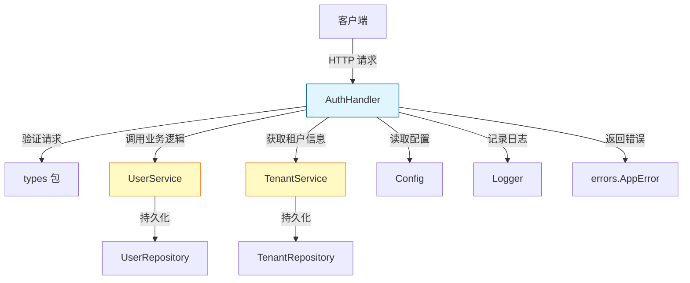

# Auth Endpoint Handler 模块深度解析

## 1. 模块概述

`auth_endpoint_handler` 模块是系统认证基础设施的 HTTP 层入口，它将 RESTful API 请求转换为内部认证服务调用。想象它是一个"认证门户保安"——它不直接管理用户账户或签发令牌，而是检查访客的请求格式，确保他们携带正确的凭证，然后引导他们到内部的用户和租户管理服务进行实际处理。

这个模块解决的核心问题是：**如何将无状态的 HTTP 请求安全、一致地转换为有状态的认证操作**，同时保持 API 层与业务逻辑层的清晰分离。

## 2. 架构设计

### 2.1 组件关系图



### 2.2 架构角色与数据流向

`AuthHandler` 在系统中扮演**认证 API 网关**的角色，它是 HTTP 层与业务服务层之间的适配器。数据流向遵循标准的请求-响应模式：

1. **请求接收**：Gin 框架将 HTTP 请求路由到对应的处理方法
2. **请求解析**：将 JSON 负载绑定到类型安全的请求结构
3. **输入验证**：检查必填字段和基本格式
4. **服务调用**：委托业务逻辑到 `UserService` 和 `TenantService`
5. **响应转换**：将服务结果转换为 HTTP 响应
6. **错误处理**：将服务错误转换为标准化的 HTTP 错误响应

## 3. 核心组件深度解析

### 3.1 AuthHandler 结构体

`AuthHandler` 是一个轻量级的结构体，它遵循依赖注入模式，将所有外部依赖显式地传入构造函数。

```go
type AuthHandler struct {
    userService   interfaces.UserService
    tenantService interfaces.TenantService
    configInfo    *config.Config
}
```

**设计意图**：
- **依赖注入**：通过构造函数注入依赖，提高了可测试性和可替换性
- **接口抽象**：依赖于 `interfaces.UserService` 和 `interfaces.TenantService` 接口，而不是具体实现，实现了松耦合
- **配置分离**：将配置信息作为独立依赖，便于在不同环境中切换配置

### 3.2 NewAuthHandler 构造函数

```go
func NewAuthHandler(configInfo *config.Config,
    userService interfaces.UserService, tenantService interfaces.TenantService) *AuthHandler {
    return &AuthHandler{
        configInfo:    configInfo,
        userService:   userService,
        tenantService: tenantService,
    }
}
```

这个构造函数体现了**显式依赖**的设计原则——它清楚地表明了 `AuthHandler` 需要什么才能正常工作，而不是在内部隐式创建这些依赖。

### 3.3 主要处理方法

#### 3.3.1 Register - 用户注册

**功能**：处理新用户注册请求，创建用户账户。

**关键流程**：
1. 检查 `DISABLE_REGISTRATION` 环境变量，决定是否允许注册
2. 解析并验证请求参数
3. 调用 `userService.Register` 创建用户
4. 返回成功响应

**设计亮点**：
- **环境变量控制**：通过环境变量动态禁用注册功能，无需重新部署
- **敏感数据脱敏**：使用 `secutils.SanitizeForLog` 确保日志中不泄露敏感信息
- **多层验证**：先进行基本格式验证，再委托服务层进行业务规则验证

#### 3.3.2 Login - 用户登录

**功能**：验证用户凭证并返回访问令牌。

**关键流程**：
1. 解析登录请求
2. 验证必填字段
3. 调用 `userService.Login` 进行认证
4. 根据认证结果返回适当的 HTTP 状态码

**设计亮点**：
- **清晰的状态码语义**：成功返回 200，认证失败返回 401
- **委托认证逻辑**：不直接处理密码验证，而是将其委托给服务层
- **详细的日志记录**：记录登录尝试和结果，便于审计和故障排查

#### 3.3.3 Logout - 用户登出

**功能**：撤销当前访问令牌，使会话失效。

**关键流程**：
1. 从 Authorization 头中提取 Bearer 令牌
2. 验证令牌格式
3. 调用 `userService.RevokeToken` 撤销令牌
4. 返回成功响应

**设计亮点**：
- **显式令牌撤销**：支持服务器端主动使令牌失效，增强安全性
- **格式验证**：严格检查 Authorization 头格式，提前拒绝无效请求
- **错误映射**：将服务层错误映射为适当的 HTTP 状态码

#### 3.3.4 RefreshToken - 刷新令牌

**功能**：使用刷新令牌获取新的访问令牌，延长用户会话。

**关键流程**：
1. 解析刷新令牌请求
2. 调用 `userService.RefreshToken` 生成新令牌
3. 返回新的访问令牌和刷新令牌

**设计亮点**：
- **令牌轮换**：每次刷新都返回新的刷新令牌，增强安全性
- **内联请求结构**：使用匿名结构体定义请求格式，简化代码
- **一致的响应格式**：保持与其他认证端点相同的响应结构

#### 3.3.5 GetCurrentUser - 获取当前用户信息

**功能**：返回当前登录用户的详细信息和关联的租户信息。

**关键流程**：
1. 从上下文中获取当前用户
2. 如需获取租户信息，调用 `tenantService.GetTenantByID`
3. 组装用户和租户信息返回

**设计亮点**：
- **优雅降级**：如果获取租户信息失败，不会导致整个请求失败
- **配置驱动的权限**：根据配置决定是否允许跨租户访问
- **上下文传播**：利用请求上下文传递用户身份信息

#### 3.3.6 ChangePassword - 修改密码

**功能**：允许当前用户修改登录密码。

**关键流程**：
1. 解析密码修改请求
2. 获取当前用户信息
3. 调用 `userService.ChangePassword` 更新密码
4. 返回成功响应

**设计亮点**：
- **双重验证**：既验证请求格式，也验证旧密码的正确性
- **密码强度要求**：通过 `binding:"min=6"` 强制新密码最小长度
- **用户上下文**：从上下文中获取当前用户，防止越权操作

#### 3.3.7 ValidateToken - 验证令牌

**功能**：验证访问令牌的有效性并返回关联的用户信息。

**关键流程**：
1. 从 Authorization 头中提取令牌
2. 验证令牌格式
3. 调用 `userService.ValidateToken` 验证令牌
4. 返回验证结果和用户信息

**设计亮点**：
- **集中验证**：提供统一的令牌验证端点，便于其他服务集成
- **用户信息返回**：验证成功后返回用户信息，减少后续查询
- **格式一致性**：与 Logout 方法共享令牌提取逻辑，保持代码一致性

## 4. 依赖分析

### 4.1 输入依赖

`AuthHandler` 依赖以下核心组件：

| 依赖 | 类型 | 用途 |
|------|------|------|
| `interfaces.UserService` | 接口 | 处理用户认证和账户管理的业务逻辑 |
| `interfaces.TenantService` | 接口 | 提供租户信息查询功能 |
| `*config.Config` | 结构体 | 提供运行时配置信息 |
| `*gin.Context` | 框架上下文 | 处理 HTTP 请求和响应 |

### 4.2 输出依赖

其他模块对 `AuthHandler` 的依赖主要是通过 HTTP 路由注册，没有直接的代码依赖。

### 4.3 数据契约

`AuthHandler` 使用以下核心数据类型：
- `types.RegisterRequest` / `types.RegisterResponse`：注册请求和响应
- `types.LoginRequest` / `types.LoginResponse`：登录请求和响应
- `types.User`：用户实体
- `types.Tenant`：租户实体
- `errors.AppError`：标准化错误类型

## 5. 设计决策与权衡

### 5.1 依赖注入 vs 隐式依赖

**决策**：采用显式依赖注入模式

**原因**：
- 提高可测试性：可以轻松模拟服务依赖进行单元测试
- 增强可维护性：依赖关系清晰可见，便于理解和修改
- 支持灵活性：可以轻松替换服务实现而不修改 handler 代码

**权衡**：
- 增加了构造函数的参数数量
- 调用方需要了解并提供所有依赖

### 5.2 接口抽象 vs 具体实现

**决策**：依赖于接口而不是具体实现

**原因**：
- 实现了松耦合：handler 不关心服务的具体实现细节
- 支持多态：可以在运行时切换不同的服务实现
- 便于测试：可以轻松创建模拟接口实现

**权衡**：
- 增加了一层抽象，可能稍微降低代码可读性
- 需要维护接口定义的稳定性

### 5.3 环境变量控制 vs 配置文件

**决策**：使用环境变量控制注册功能开关

**原因**：
- 动态性：可以在不重启应用的情况下改变行为（在某些部署环境中）
- 安全性：敏感配置可以通过环境变量注入，避免提交到代码仓库
- 云原生友好：符合现代云应用的配置最佳实践

**权衡**：
- 配置分散：部分配置在环境变量中，部分在配置文件中
- 缺乏类型安全：环境变量是字符串，需要手动解析和验证

### 5.4 敏感数据脱敏

**决策**：在记录日志前对敏感数据进行脱敏处理

**原因**：
- 安全性：防止敏感信息（如密码、完整邮箱）泄露到日志中
- 合规性：满足数据保护法规的要求
- 可审计性：仍然可以记录关键操作信息，便于问题排查

**权衡**：
- 增加了日志处理的开销
- 需要确保所有敏感数据都被正确脱敏

### 5.5 错误处理策略

**决策**：将服务层错误转换为标准化的 HTTP 错误响应

**原因**：
- 一致性：为客户端提供统一的错误格式
- 清晰性：使用适当的 HTTP 状态码传达错误类型
- 安全性：不向客户端暴露内部错误细节

**权衡**：
- 可能丢失一些内部错误信息
- 需要维护错误类型到 HTTP 状态码的映射

## 6. 使用指南与示例

### 6.1 注册路由

要使用 `AuthHandler`，需要先在 Gin 路由中注册相应的端点：

```go
// 初始化依赖
configInfo := config.LoadConfig()
userService := user.NewService(...)
tenantService := tenant.NewService(...)

// 创建 handler
authHandler := handler.NewAuthHandler(configInfo, userService, tenantService)

// 注册路由
router := gin.Default()
authGroup := router.Group("/auth")
{
    authGroup.POST("/register", authHandler.Register)
    authGroup.POST("/login", authHandler.Login)
    authGroup.POST("/logout", authHandler.Logout)
    authGroup.POST("/refresh", authHandler.RefreshToken)
    authGroup.GET("/me", authMiddleware, authHandler.GetCurrentUser)
    authGroup.POST("/change-password", authMiddleware, authHandler.ChangePassword)
    authGroup.GET("/validate", authMiddleware, authHandler.ValidateToken)
}
```

### 6.2 常见使用模式

#### 用户注册

```bash
curl -X POST http://localhost:8080/auth/register \
  -H "Content-Type: application/json" \
  -d '{
    "username": "john_doe",
    "email": "john@example.com",
    "password": "securepassword123"
  }'
```

#### 用户登录

```bash
curl -X POST http://localhost:8080/auth/login \
  -H "Content-Type: application/json" \
  -d '{
    "email": "john@example.com",
    "password": "securepassword123"
  }'
```

#### 获取当前用户信息

```bash
curl -X GET http://localhost:8080/auth/me \
  -H "Authorization: Bearer YOUR_ACCESS_TOKEN"
```

## 7. 边缘情况与陷阱

### 7.1 注册功能禁用

**陷阱**：当 `DISABLE_REGISTRATION=true` 时，注册端点会返回 403 错误，但客户端可能没有正确处理这个状态码。

**注意**：确保客户端能够正确识别并显示"注册功能已禁用"的提示信息。

### 7.2 租户信息获取失败

**陷阱**：`GetCurrentUser` 方法在获取租户信息失败时不会返回错误，而是会忽略租户信息。

**注意**：如果租户信息对客户端至关重要，需要在客户端检查响应中是否包含租户信息。

### 7.3 令牌格式验证

**陷阱**：`Logout` 和 `ValidateToken` 方法对 Authorization 头格式有严格要求，必须是 `Bearer <token>` 格式。

**注意**：确保客户端发送的 Authorization 头格式正确，特别是 Bearer 关键字的大小写和空格。

### 7.4 密码修改的验证

**陷阱**：`ChangePassword` 方法只在服务层验证旧密码的正确性，客户端可能会在收到成功响应前显示"密码修改成功"。

**注意**：确保客户端只有在收到 200 响应后才显示成功消息。

### 7.5 令牌刷新的安全性

**陷阱**：`RefreshToken` 方法返回新的刷新令牌，但旧的刷新令牌可能仍然有效（取决于服务层实现）。

**注意**：确保客户端在收到新的刷新令牌后立即替换旧的令牌，并安全地存储。

## 8. 总结

`auth_endpoint_handler` 模块是一个设计良好的 HTTP 层组件，它遵循清晰的架构原则，将 API 层与业务逻辑层分离。通过依赖注入和接口抽象，它实现了高内聚、低耦合的设计，同时提供了完整的认证功能端点。

该模块的设计体现了许多优秀的软件工程实践：
- 明确的职责划分
- 显式的依赖管理
- 安全的敏感数据处理
- 一致的错误处理
- 详细的日志记录

对于新加入团队的开发者来说，理解这个模块的设计原则和实现细节将有助于他们更好地理解整个系统的认证流程，并能够安全地扩展和修改相关功能。
