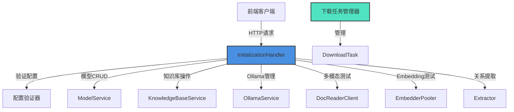

# 初始化引导与模型设置模块 (initialization_bootstrap_and_model_setup)

## 1. 模块概述

### 1.1 问题空间与解决方案

在构建企业级知识库系统时，初始化配置是一个复杂且关键的环节。用户需要配置多种模型（LLM、Embedding、Rerank、VLM）、文档分块策略、多模态存储、知识图谱提取等多个组件，而这些组件之间存在复杂的依赖关系和验证逻辑。

**朴素解决方案的问题**：
- 每个组件单独配置会导致用户体验碎片化
- 缺乏统一的验证机制，容易出现配置不一致
- 模型可用性无法在配置阶段验证，导致后续使用时才发现问题
- Ollama等本地模型的下载和管理缺乏统一界面

**本模块的设计洞察**：
将所有初始化相关的操作聚合到一个统一的HTTP处理器中，提供端到端的配置体验，包括模型验证、知识库配置、Ollama模型管理、多模态功能测试等。

### 1.2 模块角色

该模块在系统架构中扮演**配置网关**的角色，是前端进行系统初始化和知识库配置的主要入口。它负责：
- 接收并验证复杂的初始化请求
- 协调多个服务完成模型创建和知识库配置
- 提供模型可用性验证功能
- 管理Ollama模型的下载和状态监控
- 测试多模态处理功能

## 2. 核心架构与数据流

### 2.1 组件架构图



### 2.2 核心数据流

#### 知识库初始化流程

1. **请求接收**：`InitializeByKB` 接收包含所有配置的 `InitializationRequest`
2. **请求绑定**：`bindInitializationRequest` 解析并验证请求结构
3. **知识库获取**：`getKnowledgeBaseForInitialization` 验证知识库存在
4. **配置验证**：`validateInitializationConfigs` 验证所有子配置
   - 多模态配置验证
   - Rerank配置验证
   - 知识图谱配置验证
5. **模型处理**：`processInitializationModels` 创建或更新模型
   - 构建模型描述符
   - 检查现有模型
   - 创建或更新模型
6. **配置应用**：`applyKnowledgeBaseInitialization` 应用配置到知识库
7. **保存更新**：通过知识库仓库保存更改

#### Ollama模型下载流程

1. **请求接收**：`DownloadOllamaModel` 接收模型下载请求
2. **服务检查**：验证Ollama服务可用性
3. **模型检查**：检查模型是否已存在
4. **任务创建**：创建 `DownloadTask` 并加入全局任务映射
5. **异步下载**：启动goroutine执行 `downloadModelAsync`
6. **进度更新**：通过 `pullModelWithProgress` 回调更新任务状态
7. **状态查询**：客户端通过 `GetDownloadProgress` 轮询进度

## 3. 核心组件详解

### 3.1 InitializationHandler

**职责**：核心HTTP处理器，聚合所有初始化相关功能

**设计意图**：
- 采用门面模式，将复杂的初始化逻辑封装在单一入口点
- 依赖注入设计，通过构造函数接收所有依赖，便于测试和替换
- 方法职责单一，每个公开方法对应一个HTTP端点，内部辅助方法处理具体逻辑

**关键依赖**：
```go
type InitializationHandler struct {
    config           *config.Config
    tenantService    interfaces.TenantService
    modelService     interfaces.ModelService
    kbService        interfaces.KnowledgeBaseService
    kbRepository     interfaces.KnowledgeBaseRepository
    knowledgeService interfaces.KnowledgeService
    ollamaService    *ollama.OllamaService
    docReaderClient  *client.Client
    pooler           embedding.EmbedderPooler
}
```

### 3.2 下载任务管理

**全局状态设计**：
```go
var (
    downloadTasks = make(map[string]*DownloadTask)
    tasksMutex    sync.RWMutex
)
```

**设计意图**：
- 使用包级全局变量管理下载任务，确保任务状态在整个应用生命周期内可见
- 采用读写锁保护并发访问，平衡读多写少的场景
- 任务状态通过异步下载流程更新，客户端通过轮询获取最新状态

**DownloadTask结构**：
```go
type DownloadTask struct {
    ID        string     // 唯一任务ID
    ModelName string     // 模型名称
    Status    string     // pending, downloading, completed, failed
    Progress  float64    // 0-100的进度值
    Message   string     // 状态消息
    StartTime time.Time  // 开始时间
    EndTime   *time.Time // 结束时间（可选）
}
```

### 3.3 模型描述符模式

**设计意图**：
使用 `modelDescriptor` 作为中间层，将请求数据转换为内部模型表示，隔离请求格式变化对核心逻辑的影响。

**转换流程**：
```
InitializationRequest → []modelDescriptor → []*types.Model
```

**关键方法**：
- `buildModelDescriptors`: 从请求构建描述符列表
- `modelDescriptor.toModel()`: 将描述符转换为内部模型

### 3.4 配置验证层

**设计意图**：
将验证逻辑从主流程中分离，使主流程保持清晰，同时便于单独测试验证逻辑。

**验证层次**：
1. **请求结构验证**：Gin的binding标签
2. **业务规则验证**：各子配置验证方法
3. **外部服务验证**：模型连接性测试

## 4. 依赖分析

### 4.1 入站依赖

该模块被路由层调用，主要通过HTTP端点接收请求：
- `/initialization/kb/{kbId}` - 知识库初始化
- `/initialization/kb/{kbId}/config` - 知识库配置读写
- `/initialization/ollama/*` - Ollama相关操作
- `/initialization/models/*` - 模型检查和测试
- `/initialization/multimodal/test` - 多模态功能测试
- `/initialization/extract/*` - 关系提取
- `/initialization/fabri/*` - 示例数据生成

### 4.2 出站依赖

| 依赖 | 用途 | 耦合度 |
|------|------|--------|
| `interfaces.ModelService` | 模型CRUD操作 | 高 |
| `interfaces.KnowledgeBaseService` | 知识库查询 | 中 |
| `interfaces.KnowledgeBaseRepository` | 知识库更新 | 高 |
| `ollama.OllamaService` | Ollama模型管理 | 高 |
| `client.Client` (DocReader) | 多模态处理测试 | 中 |
| `embedding.EmbedderPooler` | Embedding模型测试 | 中 |
| `chatpipline.Extractor` | 关系提取 | 中 |

### 4.3 数据契约

**关键请求结构**：
- `InitializationRequest`: 完整知识库初始化请求
- `KBModelConfigRequest`: 知识库配置更新请求
- `RemoteModelCheckRequest`: 远程模型检查请求
- `TextRelationExtractionRequest`: 文本关系提取请求

**关键响应结构**：
- 所有端点返回统一格式 `{"success": bool, "data": ..., "message": ...}`
- 下载任务进度通过 `DownloadTask` 结构返回

## 5. 设计决策与权衡

### 5.1 全局下载任务状态 vs 持久化

**决策**：使用内存中的全局映射管理下载任务，不持久化到数据库

**理由**：
- 下载任务是短期的，应用重启后任务自然失效
- 简化实现，避免数据库表设计和迁移
- 性能更好，无需数据库IO

**权衡**：
- 应用重启会丢失任务状态
- 多实例部署时任务状态不共享
- 无法查看历史下载记录

### 5.2 同步验证 vs 异步验证

**决策**：模型连接性验证采用同步方式，在请求响应周期内完成

**理由**：
- 验证通常很快（几秒内）
- 用户需要立即知道配置是否正确
- 简化用户体验，无需轮询验证结果

**权衡**：
- 某些情况下可能导致请求超时
- 对慢速网络不够友好

### 5.3 大结构体 vs 细粒度接口

**决策**：`InitializationHandler` 是一个包含很多方法的大结构体

**理由**：
- 所有功能都属于"初始化"这个内聚的职责域
- 共享相同的依赖集
- 便于前端找到所有相关端点

**权衡**：
- 违反单一职责原则（从某些角度看）
- 测试时可能需要mock更多依赖
- 文件较大（超过1000行）

### 5.4 直接依赖服务 vs 通过事件

**决策**：直接调用依赖服务，不使用事件

**理由**：
- 初始化流程需要强一致性和立即反馈
- 事务性要求高，所有步骤要么成功要么失败
- 流程相对简单，不需要异步解耦

**权衡**：
- 耦合度较高
- 没有审计日志（除非在服务内部实现）
- 难以扩展后置处理步骤

## 6. 使用指南与最佳实践

### 6.1 知识库初始化流程

```go
// 1. 准备初始化请求
req := InitializationRequest{
    LLM: struct{...}{
        Source: "openai",
        ModelName: "gpt-4",
        BaseURL: "https://api.openai.com/v1",
        APIKey: "sk-...",
    },
    Embedding: struct{...}{...},
    DocumentSplitting: struct{...}{...},
    // ... 其他配置
}

// 2. 发送请求到 /initialization/kb/{kbId}
// 3. 处理响应，获取创建的模型和更新后的知识库
```

### 6.2 Ollama模型下载流程

```go
// 1. 首先检查Ollama服务状态
// GET /initialization/ollama/status

// 2. 检查模型是否已存在
// POST /initialization/ollama/models/check
// {"models": ["llama2"]}

// 3. 开始下载
// POST /initialization/ollama/models/download
// {"modelName": "llama2"}
// 获取 taskId

// 4. 轮询进度
// GET /initialization/ollama/download/{taskId}
```

### 6.3 最佳实践

1. **配置前验证**：在调用初始化接口前，先使用模型检查接口验证模型可用性
2. **Embedding模型不变更**：一旦知识库有文件，不要尝试更改Embedding模型
3. **下载任务管理**：实现下载任务列表的定期清理，避免内存泄漏
4. **超时设置**：为模型检查和测试接口设置合理的客户端超时
5. **错误处理**：妥善处理401/403/404等不同类型的模型连接错误

## 7. 边缘情况与注意事项

### 7.1 知识库已有文件时的Embedding模型变更

**限制**：当知识库中已有文件时，无法更改Embedding模型

**原因**：
- 已有文件的向量嵌入是使用旧模型生成的
- 更改模型会导致向量空间不匹配，检索失效
- 重新嵌入所有文件成本高且复杂

**处理方式**：
- 模块会检查知识库是否有文件
- 如果有文件且尝试更改Embedding模型，返回错误
- 用户需要创建新知识库或删除所有文件

### 7.2 Ollama服务不可用

**表现**：所有Ollama相关端点返回错误

**处理**：
- 每个Ollama端点都会先检查服务可用性
- 尝试启动服务（如果配置了自动启动）
- 向客户端返回清晰的错误信息

### 7.3 多模态存储配置

**注意事项**：
- MinIO的密钥从环境变量读取，不是从请求
- COS配置需要完整的SecretID/SecretKey/Region/BucketName/AppID
- 存储配置与VLM配置是独立的，但都需要多模态启用

### 7.4 关系提取文本长度限制

**限制**：最多5000字符

**原因**：
- 平衡提取质量和处理时间
- 避免LLM上下文溢出
- 太长的文本会导致提取效果下降

## 8. 未来改进方向

1. **下载任务持久化**：考虑将下载任务状态保存到数据库，支持应用重启后恢复
2. **异步初始化流程**：对于非常复杂的初始化，考虑采用异步流程+事件通知
3. **配置模板**：支持保存和加载初始化配置模板
4. **批量模型检查**：支持一次检查多个模型的可用性
5. **配置预检查**：在应用配置前进行更全面的预检查，包括存储连接性等
6. **WebSocket实时进度**：替代轮询方式，使用WebSocket推送下载进度

## 9. 相关模块

- [模型目录服务](../data_access_repositories-content_and_knowledge_management_repositories-model_catalog_repository.md)
- [知识库管理](../application_services_and_orchestration-knowledge_ingestion_extraction_and_graph_services.md)
- [Ollama工具](../model_providers_and_ai_backends-ollama_model_metadata_and_service_utils.md)
- [文档处理管道](../docreader_pipeline.md)
