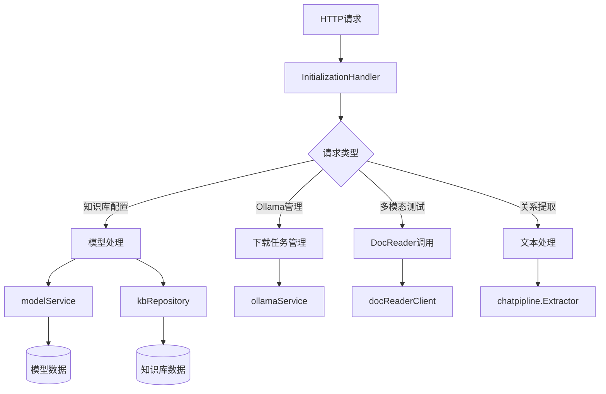

# 初始化、提取和多模态合约模块技术深度解析

## 1. 模块概览

### 1.1 核心价值与问题解决

这个模块是系统的"初始化指挥中心"，主要解决以下关键问题：

1. **知识库配置管理**：为知识库配置和管理各种AI模型（LLM、Embedding、Rerank、VLM）
2. **模型初始化与验证**：确保配置的模型能够正常连接和工作
3. **多模态功能测试**：验证图像理解和处理能力
4. **知识图谱构建支持**：从文本中提取实体和关系，构建知识图谱
5. **Ollama模型管理**：本地模型的下载、状态检查和管理

想象一下，这个模块就像是一个"AI实验室管理员"，负责为每个知识库准备合适的"实验设备"（模型），确保它们正常工作，并提供测试和验证功能。

### 1.2 模块在系统中的位置

本模块位于 `http_handlers_and_routing` 层级下，是系统与外部交互的重要接口层。它向上接收HTTP请求，向下协调多个核心服务：

- 模型服务 (`modelService`)
- 知识库服务 (`kbService`)
- Ollama服务 (`ollamaService`)
- 文档阅读器客户端 (`docReaderClient`)

## 2. 核心架构与组件

### 2.1 核心组件概览

| 组件 | 类型 | 职责 |
|------|------|------|
| `InitializationHandler` | 结构体 | 主要的HTTP请求处理器，封装了所有初始化相关功能 |
| `InitializationRequest` | 结构体 | 完整的知识库初始化请求参数 |
| `KBModelConfigRequest` | 结构体 | 简化版的知识库模型配置请求 |
| `DownloadTask` | 结构体 | Ollama模型下载任务信息 |
| `testMultimodalForm` | 结构体 | 多模态功能测试表单数据 |
| `TextRelationExtractionRequest/Response` | 结构体 | 文本关系提取的请求和响应 |
| `FabriTextRequest/Response` | 结构体 | 示例文本生成的请求和响应 |
| `FabriTagRequest/Response` | 结构体 | 标签生成的请求和响应 |

### 2.2 架构设计与数据流



这个模块采用了**分层处理**的架构模式：

1. **请求接收层**：通过Gin框架接收HTTP请求
2. **参数验证层**：对输入参数进行严格验证
3. **业务逻辑层**：处理核心业务逻辑
4. **服务协调层**：协调各个下层服务完成工作
5. **响应构建层**：构建合适的HTTP响应返回给客户端

## 3. 核心功能深度解析

### 3.1 知识库配置管理

知识库配置管理是本模块的核心功能，包括两个主要接口：

#### 3.1.1 `InitializeByKB` - 完整初始化

这个函数是知识库初始化的"总指挥"，它的工作流程如下：

1. **请求绑定与验证**：解析并验证初始化请求
2. **知识库获取**：获取目标知识库信息
3. **配置验证**：验证多模态、Rerank、知识图谱等配置
4. **模型处理**：创建或更新所需的AI模型
5. **配置应用**：将配置应用到知识库
6. **保存更新**：持久化知识库配置

**设计亮点**：
- 使用 `modelDescriptor` 模式统一处理不同类型的模型
- 支持模型的创建和更新，避免重复创建
- 严格的配置验证确保系统稳定性

#### 3.1.2 `UpdateKBConfig` - 配置更新

这个函数专注于更新现有知识库的配置，它的特殊之处在于：

1. **Embedding模型保护**：如果知识库已有文件，禁止修改Embedding模型（避免向量不匹配）
2. **模型存在性验证**：确保引用的模型真实存在
3. **配置完整性检查**：确保各种配置的完整性和一致性

### 3.2 Ollama模型管理

Ollama模型管理功能提供了本地模型的完整生命周期管理：

#### 3.2.1 下载任务管理

使用 `DownloadTask` 结构体和全局任务管理器实现异步下载：

```go
type DownloadTask struct {
    ID        string     `json:"id"`
    ModelName string     `json:"modelName"`
    Status    string     `json:"status"` // pending, downloading, completed, failed
    Progress  float64    `json:"progress"`
    Message   string     `json:"message"`
    StartTime time.Time  `json:"startTime"`
    EndTime   *time.Time `json:"endTime,omitempty"`
}
```

**设计亮点**：
- 使用 `sync.RWMutex` 保证并发安全
- 异步下载不阻塞HTTP响应
- 实时进度更新和状态查询

#### 3.2.2 模型状态检查

提供多个接口检查Ollama服务和模型状态：
- `CheckOllamaStatus`：检查Ollama服务可用性
- `CheckOllamaModels`：检查指定模型是否已安装
- `ListOllamaModels`：列出所有已安装模型

### 3.3 多模态功能测试

`TestMultimodalFunction` 接口提供了端到端的多模态功能测试：

1. **表单数据解析**：支持multipart/form-data格式
2. **文件验证**：验证文件类型和大小
3. **配置解析**：解析文档分割和存储配置
4. **DocReader调用**：调用文档阅读器服务处理图像
5. **结果提取**：从响应中提取Caption和OCR结果

**设计亮点**：
- 支持多种存储类型（COS、MinIO）
- 自动适配Ollama场景的Base URL
- 完整的错误处理和用户友好的错误信息

### 3.4 文本关系提取

`ExtractTextRelations` 接口实现了从文本中提取实体和关系的功能：

1. **文本验证**：限制文本长度（5000字符）
2. **模型初始化**：根据配置初始化聊天模型
3. **提示模板**：使用结构化提示模板指导提取
4. **关系提取**：使用 `chatpipline.Extractor` 进行提取
5. **结果清理**：移除未知关系类型

**设计亮点**：
- 使用配置驱动的提示模板
- 支持自定义标签和关系类型
- 结果后处理确保数据质量

### 3.5 示例数据生成

提供两个辅助功能帮助用户测试知识图谱构建：

1. **`FabriText`**：根据标签生成示例文本
2. **`FabriTag`**：随机生成标签组合

这些功能虽然简单，但对于用户快速测试和理解知识图谱功能非常有帮助。

## 4. 模型处理流水线

### 4.1 模型描述符模式

模块使用 `modelDescriptor` 结构体统一处理不同类型的模型：

```go
type modelDescriptor struct {
    modelType     types.ModelType
    name          string
    source        types.ModelSource
    description   string
    baseURL       string
    apiKey        string
    dimension     int
    interfaceType string
}
```

**设计优势**：
1. **统一接口**：所有模型类型使用相同的处理流程
2. **易于扩展**：新增模型类型只需添加新的描述符
3. **关注点分离**：模型创建逻辑与业务逻辑分离

### 4.2 模型处理流程

```go
func (h *InitializationHandler) processInitializationModels(
    ctx context.Context,
    kb *types.KnowledgeBase,
    kbIdStr string,
    req *InitializationRequest,
) ([]*types.Model, error)
```

这个函数实现了完整的模型处理流程：

1. **构建描述符**：从请求中构建模型描述符
2. **查找现有模型**：检查知识库是否已有相关模型
3. **更新或创建**：根据情况更新现有模型或创建新模型
4. **返回处理结果**：返回处理后的模型列表

## 5. 设计决策与权衡

### 5.1 配置验证策略

**决策**：在应用配置前进行严格的多步骤验证

**原因**：
- 避免无效配置导致的系统不稳定
- 提前发现问题，提供友好的错误信息
- 保护已有数据的完整性（如Embedding模型保护）

**权衡**：
- ✅ 提高系统稳定性
- ✅ 改善用户体验
- ❌ 增加了代码复杂度
- ❌ 稍微延长了请求处理时间

### 5.2 异步下载设计

**决策**：使用异步任务模式处理Ollama模型下载

**原因**：
- 模型下载可能需要很长时间，不应该阻塞HTTP响应
- 提供实时进度反馈改善用户体验
- 支持多个下载任务并行进行

**权衡**：
- ✅ 更好的用户体验
- ✅ 支持长时间运行的任务
- ❌ 增加了内存开销（任务状态存储）
- ❌ 需要处理任务状态同步问题

### 5.3 模型处理统一化

**决策**：使用模型描述符模式统一处理不同类型的模型

**原因**：
- 减少代码重复
- 提高代码可维护性
- 便于添加新的模型类型

**权衡**：
- ✅ 代码更简洁
- ✅ 易于扩展
- ❌ 增加了一层抽象
- ❌ 对于特殊情况可能需要额外处理

## 6. 关键依赖与数据契约

### 6.1 核心依赖

| 依赖 | 用途 | 交互方式 |
|------|------|----------|
| `interfaces.ModelService` | 模型管理 | 创建、更新、查询模型 |
| `interfaces.KnowledgeBaseService` | 知识库管理 | 获取知识库信息 |
| `interfaces.KnowledgeBaseRepository` | 知识库持久化 | 保存知识库配置 |
| `ollama.OllamaService` | Ollama管理 | 模型下载、状态检查 |
| `client.Client` (DocReader) | 多模态处理 | 图像理解和OCR |
| `chatpipline.Extractor` | 关系提取 | 文本实体和关系提取 |

### 6.2 重要数据契约

#### 6.2.1 知识库配置契约

`InitializationRequest` 定义了完整的知识库配置结构，包括：
- LLM模型配置
- Embedding模型配置
- Rerank模型配置（可选）
- 多模态配置（可选）
- 文档分割配置
- 知识图谱提取配置（可选）
- 问题生成配置（可选）

#### 6.2.2 模型契约

所有模型都遵循 `types.Model` 结构，包含：
- 模型类型和来源
- 基本信息（名称、描述）
- 连接参数（BaseURL、APIKey）
- 类型特定参数（如Embedding维度）

## 7. 常见问题与注意事项

### 7.1 常见陷阱

1. **Embedding模型修改限制**
   - 一旦知识库中有文件，Embedding模型就不能修改
   - 原因：避免向量空间不匹配导致检索失败

2. **多模态配置完整性**
   - 启用多模态时必须同时配置VLM和存储
   - 不同存储类型有不同的必填字段

3. **知识图谱依赖**
   - 启用知识图谱提取需要配置Neo4j
   - 必须先提取实体和关系才能保存配置

### 7.2 性能考虑

1. **模型创建/更新**
   - 每次初始化都会涉及多个模型的创建或更新
   - 对于大型系统，考虑添加批量操作支持

2. **异步下载**
   - 下载任务状态存储在内存中
   - 系统重启后任务状态会丢失
   - 对于生产环境，考虑持久化任务状态

### 7.3 安全注意事项

1. **敏感信息处理**
   - 内置模型的API Key和Base URL在返回时会被隐藏
   - 但在日志中可能仍有记录，注意日志脱敏

2. **文件上传限制**
   - 多模态测试有文件大小限制（默认50MB）
   - 只允许上传图片文件

## 8. 扩展与定制点

### 8.1 支持新的模型类型

要支持新的模型类型：

1. 在 `types.ModelType` 中添加新类型
2. 在 `buildModelDescriptors` 中添加新的描述符
3. 在 `findExistingModelID` 中添加查找逻辑
4. 在 `extractModelIDs` 中添加提取逻辑
5. 在 `applyKnowledgeBaseInitialization` 中添加应用逻辑

### 8.2 自定义验证逻辑

配置验证逻辑分布在多个函数中：
- `validateMultimodalConfig`
- `validateRerankConfig`
- `validateNodeExtractConfig`

可以根据需要修改或添加验证函数。

### 8.3 新的存储类型支持

在 `applyKnowledgeBaseInitialization` 和 `testMultimodalWithDocReader` 中添加新的存储类型支持。

## 9. 总结

`initialization_extraction_and_multimodal_contracts` 模块是系统的"初始化指挥中心"，负责知识库配置、模型管理、多模态测试和知识图谱构建支持。它采用了分层处理、模型描述符、异步任务等设计模式，提供了强大而灵活的功能。

这个模块的设计体现了以下原则：
1. **配置驱动**：通过配置而非硬编码控制行为
2. **验证先行**：在应用配置前进行严格验证
3. **用户体验优先**：提供友好的错误信息和进度反馈
4. **统一抽象**：使用模型描述符统一处理不同类型的模型

对于新加入团队的开发者，理解这个模块的关键是：
1. 掌握模型描述符模式
2. 理解配置验证的重要性
3. 熟悉异步任务处理方式
4. 注意各个安全限制和保护机制
