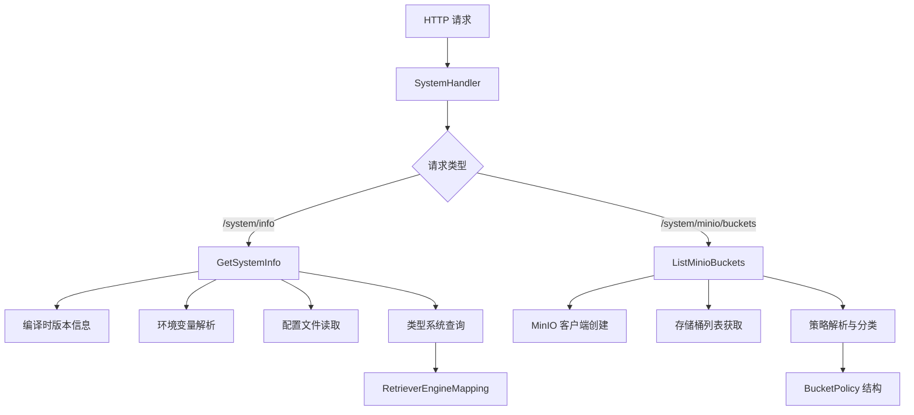

# system_info_and_bucket_policy_operations 模块技术深度解析

## 概述

`system_info_and_bucket_policy_operations` 模块是系统运维和诊断的关键入口点，它提供了两个核心功能：暴露系统运行时配置信息和 MinIO 存储桶及其访问策略的管理接口。这个模块就像系统的"仪表盘"，让运维人员和开发者能够快速了解系统的底层基础设施配置状态，而无需深入检查各个配置文件或环境变量。

## 架构与数据流程



这个模块的架构相对简单直接，采用了典型的 HTTP 处理器模式。`SystemHandler` 作为核心协调者，接收请求并将其路由到相应的处理方法。对于系统信息查询，它会从多个来源（编译时注入的变量、环境变量、配置文件、类型系统）聚合数据；对于 MinIO 存储桶操作，它会创建临时客户端与 MinIO 服务交互，解析复杂的 S3 策略文档并将其简化为易于理解的分类。

## 核心组件深度解析

### SystemHandler 结构体

`SystemHandler` 是这个模块的核心，它持有两个关键依赖：
- `cfg *config.Config`：系统配置对象，提供对配置文件的访问
- `neo4jDriver neo4j.Driver`：Neo4j 数据库驱动，用于检测图数据库是否启用

这种设计遵循了依赖注入模式，使得 `SystemHandler` 在测试时可以轻松替换这些依赖。值得注意的是，MinIO 客户端并没有被作为依赖注入进来，而是在需要时动态创建，这是因为 MinIO 的配置完全来自环境变量，且连接是短暂的。

### GetSystemInfo 方法

这个方法是系统信息的聚合器，它从以下几个来源收集数据：

1. **编译时注入的版本信息**：`Version`、`CommitID`、`BuildTime`、`GoVersion` 这些变量在编译时通过 `-ldflags` 注入，提供了二进制文件的构建元数据。
2. **关键词索引引擎**：通过解析 `RETRIEVE_DRIVER` 环境变量并查询 `types.GetRetrieverEngineMapping()` 来确定支持关键词检索的引擎。
3. **向量存储引擎**：优先从配置文件获取，如果没有则回退到环境变量和类型系统查询。
4. **图数据库引擎**：通过检查 `neo4jDriver` 是否为 nil 来确定。
5. **MinIO 启用状态**：通过检查必要的环境变量是否都已设置来确定。

这里的一个关键设计决策是配置来源的优先级：配置文件 > 环境变量 > 默认值。这种设计允许在不同环境中灵活配置，同时保持合理的默认行为。

### ListMinioBuckets 方法

这个方法不仅仅是列出存储桶，更重要的是它解析了每个存储桶的访问策略并进行了分类。处理流程如下：

1. 首先检查 MinIO 是否启用，如果未启用则返回 400 错误。
2. 从环境变量获取 MinIO 配置并创建临时客户端。
3. 列出所有存储桶。
4. 对每个存储桶，获取其策略并解析。
5. 将策略分类为 "public"、"private" 或 "custom"。

这里的一个重要设计选择是每次请求都创建新的 MinIO 客户端，而不是复用连接。这种设计虽然会有一些性能开销，但它避免了维护长连接的复杂性，特别是考虑到这是一个管理接口，调用频率不会很高。

### 策略解析系统

策略解析是这个模块中最复杂的部分之一，它涉及到将 S3 风格的复杂策略文档简化为三个分类：

- **public**：允许公开读取访问（Principal 为 "*" 且包含 s3:GetObject 动作）
- **private**：没有策略或策略不允许公开访问
- **custom**：有策略但不符合公开读取的标准模式

`parseBucketPolicy` 函数是这个系统的核心，它使用了宽松的解析策略：如果无法解析策略 JSON，就将其归类为 "custom"。这种设计确保了即使遇到非标准策略，系统也能继续工作，而不会崩溃。

## 依赖分析

### 入站依赖

这个模块被 HTTP 路由系统调用，通常是在 `auth_initialization_and_system_operations_handlers` 父模块中进行路由注册。它没有被其他业务逻辑模块直接依赖，而是作为一个独立的管理接口存在。

### 出站依赖

- **config.Config**：提供对系统配置文件的访问，特别是向量数据库配置。
- **neo4j.Driver**：用于检测图数据库是否启用。
- **types.GetRetrieverEngineMapping()**：这是一个关键依赖，它提供了检索引擎及其能力的映射。
- **minio-go/v7**：MinIO 客户端库，用于与 MinIO 服务交互。
- **gin-gonic/gin**：HTTP 框架，用于处理请求和响应。

### 数据契约

这个模块的输入完全来自 HTTP 请求路径和环境变量，没有请求体。输出则是标准化的 JSON 响应，包含 `code`、`msg` 和 `data` 字段。这种统一的响应格式使得前端可以一致地处理所有响应。

## 设计决策与权衡

### 1. 配置来源的优先级

**决策**：配置文件 > 环境变量 > 默认值

**理由**：配置文件提供了最结构化和可管理的配置方式，应该优先使用。环境变量适合于容器化部署和 secrets 管理。默认值确保了系统在最小配置下也能运行。

**权衡**：这种多来源的配置方式增加了代码的复杂性，但提供了更大的灵活性。

### 2. MinIO 客户端的动态创建

**决策**：每次请求都创建新的 MinIO 客户端，而不是复用连接

**理由**：MinIO 配置来自环境变量，可能在运行时变化（虽然不常见）。此外，这是一个管理接口，调用频率不高，连接创建的开销可以接受。

**权衡**：牺牲了一些性能以换取简单性和灵活性。

### 3. 策略分类的简化

**决策**：将复杂的 S3 策略简化为三个分类

**理由**：对于大多数运维场景，只需要知道存储桶是否公开可访问即可。完整的策略信息对于管理接口来说过于详细。

**权衡**：丢失了一些策略细节，但大大提高了可用性。

### 4. 宽松的错误处理

**决策**：在策略解析失败时，将其归类为 "custom" 而不是返回错误

**理由**：确保即使遇到非标准策略，系统也能继续工作，提供部分信息比没有信息好。

**权衡**：可能会掩盖一些策略格式错误，但提高了系统的健壮性。

## 使用指南

### 获取系统信息

```go
// 路由注册
router.GET("/system/info", systemHandler.GetSystemInfo)

// 响应示例
{
  "code": 0,
  "msg": "success",
  "data": {
    "version": "v1.0.0",
    "commit_id": "abc123",
    "build_time": "2023-01-01T00:00:00Z",
    "go_version": "go1.19",
    "keyword_index_engine": "elasticsearch",
    "vector_store_engine": "milvus",
    "graph_database_engine": "Neo4j",
    "minio_enabled": true
  }
}
```

### 列出 MinIO 存储桶

```go
// 路由注册
router.GET("/system/minio/buckets", systemHandler.ListMinioBuckets)

// 响应示例
{
  "code": 0,
  "msg": "success",
  "success": true,
  "data": {
    "buckets": [
      {
        "name": "public-docs",
        "policy": "public",
        "created_at": "2023-01-01 12:00:00"
      },
      {
        "name": "private-data",
        "policy": "private",
        "created_at": "2023-01-02 10:30:00"
      }
    ]
  }
}
```

## 边缘情况与注意事项

### 1. 环境变量的大小写敏感性

**注意**：所有环境变量都是大小写敏感的，特别是 `RETRIEVE_DRIVER` 和 MinIO 相关的变量。

**建议**：在部署文档中明确说明环境变量的大小写要求。

### 2. MinIO 策略解析的限制

**注意**：策略解析只检查公开读取访问，不考虑其他权限（如写入、列出等）。此外，它只识别标准的 S3 策略格式，对于自定义的复杂策略可能会误分类为 "custom"。

**建议**：在 UI 中提供查看原始策略的选项，以便在需要时进行详细检查。

### 3. 检索引擎能力的动态性

**注意**：检索引擎的能力是通过 `types.GetRetrieverEngineMapping()` 动态查询的，这意味着如果类型系统中的映射发生变化，系统信息也会相应变化。

**建议**：确保类型系统中的映射保持一致，并在变化时进行充分测试。

### 4. 编译时变量的注入

**注意**：版本信息变量需要在编译时通过 `-ldflags` 注入，否则它们会保持为 "unknown"。

**建议**：在构建脚本中确保正确注入这些变量，并在 CI/CD 流程中验证它们。

## 参考链接

- [config 模块](platform_infrastructure_and_runtime-runtime_configuration_and_bootstrap.md) - 系统配置管理
- [types 模块](core_domain_types_and_interfaces.md) - 核心类型系统，特别是检索引擎映射
- [file_storage_provider_services](application_services_and_orchestration-file_storage_provider_services.md) - 文件存储服务的业务逻辑层
