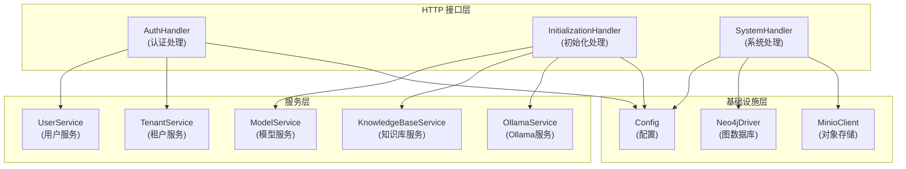

# 认证、初始化与系统操作处理器

## 概述

`auth_initialization_and_system_operations_handlers` 模块是系统的 HTTP 接口层核心组件，负责处理用户认证、系统初始化配置和系统信息查询等关键功能。它就像系统的"前台接待"，管理着用户如何进入系统、如何配置系统，以及如何了解系统的运行状态。

这个模块解决了三个核心问题：
1. **用户身份管理**：提供注册、登录、登出等认证功能，确保只有授权用户才能访问系统
2. **系统初始化配置**：帮助用户配置知识库、模型、存储等核心组件，使系统能够正常工作
3. **系统信息暴露**：提供系统版本、引擎配置、存储桶信息等运维数据，便于监控和调试

## 架构概览

这个模块采用了清晰的分层架构：

1. **HTTP 接口层**：由三个主要处理器组成，每个处理器负责一类功能
   - `AuthHandler`：处理所有与用户认证相关的请求
   - `InitializationHandler`：处理系统初始化和配置相关的请求
   - `SystemHandler`：处理系统信息查询和管理相关的请求

2. **服务层**：处理器通过接口依赖各种服务，实现了业务逻辑与 HTTP 处理的解耦

3. **基础设施层**：提供配置、数据库连接等底层支持

## 核心设计理念

### 1. 关注点分离
每个处理器只负责自己领域内的功能，避免了代码混杂。例如，认证逻辑完全包含在 `AuthHandler` 中，与初始化逻辑互不干扰。

### 2. 接口依赖
处理器通过接口而非具体实现依赖服务，这使得代码更易于测试和扩展。例如，`AuthHandler` 依赖 `UserService` 接口，而不是某个具体的实现类。

### 3. 配置驱动
系统行为主要通过配置和环境变量控制，而不是硬编码。例如，注册功能可以通过 `DISABLE_REGISTRATION` 环境变量禁用，而无需修改代码。

### 4. 异步处理
对于耗时操作（如下载模型），采用异步处理模式，避免阻塞 HTTP 请求。

## 子模块概述

### [认证端点处理器](http_handlers_and_routing-auth_initialization_and_system_operations_handlers-auth_endpoint_handler.md)
负责用户注册、登录、登出、令牌刷新等认证相关功能。它是系统的安全门卫，确保只有合法用户才能访问系统资源。

### [初始化引导与模型设置](http_handlers_and_routing-auth_initialization_and_system_operations_handlers-initialization_bootstrap_and_model_setup.md)
处理知识库配置、模型管理、Ollama 集成等初始化功能。它帮助用户将系统从"开箱"状态配置到"可用"状态。

### [初始化提取与多模态契约](http_handlers_and_routing-auth_initialization_and_system_operations_handlers-initialization_extraction_and_multimodal_contracts.md)
提供文本关系提取、多模态处理测试等高级功能。它是系统知识图谱构建和多模态能力的入口点。

### [系统信息与存储桶策略操作](http_handlers_and_routing-auth_initialization_and_system_operations_handlers-system_info_and_bucket_policy_operations.md)
提供系统版本信息、存储桶管理等运维功能。它帮助运维人员了解系统状态和管理存储资源。

## 跨模块依赖

这个模块与系统的其他部分有着紧密的联系：

1. **依赖服务层**：通过接口依赖 `UserService`、`TenantService`、`ModelService` 等服务
2. **依赖配置模块**：需要从 `config` 模块获取系统配置
3. **依赖类型定义**：使用 `types` 模块定义的请求/响应结构和接口
4. **被路由模块依赖**：路由模块会将 HTTP 请求分发到这些处理器

## 设计权衡

### 1. 环境变量 vs 配置文件
**选择**：同时支持环境变量和配置文件，环境变量优先级更高
**原因**：环境变量更适合容器化部署，配置文件更适合本地开发
**权衡**：增加了配置管理的复杂性，但提高了部署灵活性

### 2. 同步 vs 异步处理
**选择**：简单操作同步处理，耗时操作异步处理
**原因**：同步处理简单直观，异步处理避免阻塞
**权衡**：异步处理增加了代码复杂度，但提高了系统响应性

### 3. 直接依赖 vs 接口依赖
**选择**：通过接口依赖服务
**原因**：接口依赖更易于测试和扩展
**权衡**：增加了接口定义的工作量，但提高了代码的可维护性

## 注意事项

### 1. 敏感信息处理
- 所有敏感信息（如密码、API 密钥）在日志中都需要经过脱敏处理
- 不要在响应中返回敏感信息

### 2. 错误处理
- 所有错误都应该通过统一的错误类型返回
- 错误信息应该对用户友好，同时包含足够的调试信息

### 3. 并发安全
- `InitializationHandler` 中的下载任务管理器使用了互斥锁确保并发安全
- 在修改共享状态时，注意使用适当的同步机制

### 4. 配置验证
- 在使用配置前，务必进行验证
- 提供清晰的错误信息，帮助用户正确配置系统

### 5. 向后兼容
- 修改接口时，注意保持向后兼容
- 如果必须引入破坏性变更，考虑版本化接口

这个模块是系统与外界交互的重要接口，它的设计质量直接影响系统的易用性和可维护性。通过遵循上述设计原则和注意事项，我们可以确保这个模块持续健康地发展。
