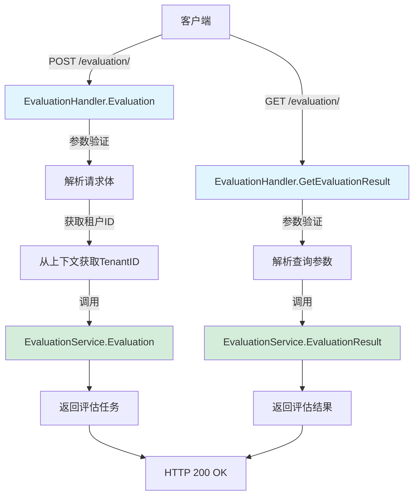

# evaluation_endpoint_handler 模块技术深度解析

## 1. 问题空间与存在意义

在构建和优化知识驱动的 AI 应用时，评估是一个至关重要但常被忽视的环节。团队需要能够客观地衡量：
- 知识库检索的质量（召回率、精确率、排序质量）
- LLM 生成回答的准确性（与标准答案的一致性）
- 不同模型、知识库配置的性能对比

如果没有专门的评估端点，这些测试就会变成零散的手动操作，难以规模化和可重复。`evaluation_endpoint_handler` 模块解决了这个问题，它提供了一个标准化的 HTTP 接口，让团队可以：
1. 提交评估任务（指定数据集、知识库、模型）
2. 查询评估结果
3. 将评估流程集成到 CI/CD 流水线中

## 2. 心智模型与核心抽象

可以把这个模块想象成一个**评估任务的接待台**：

- **接待员**：`EvaluationHandler` 本身，负责接待评估请求
- **请求表单**：`EvaluationRequest` 和 `GetEvaluationRequest` 结构体，标准化请求参数
- **后台执行**：`EvaluationService` 接口（由服务层实现），实际执行评估逻辑
- **安全检查**：`secutils.SanitizeForLog`，防止敏感信息泄露到日志

这个模块的核心设计理念是**关注点分离**：它不关心评估算法的具体实现，只负责将 HTTP 请求转换为服务层调用，并将结果返回给客户端。

## 3. 架构与数据流



### 数据流转详解

1. **评估任务提交流程**：
   - 客户端发送 POST 请求到 `/evaluation/`，包含数据集 ID、知识库 ID、聊天模型 ID 和重排序模型 ID
   - `EvaluationHandler.Evaluation` 方法接收请求，首先解析 JSON 请求体到 `EvaluationRequest` 结构体
   - 从 Gin 上下文中提取租户 ID（由认证中间件设置）
   - 对所有 ID 参数进行日志安全处理（防止敏感信息泄露）
   - 调用 `EvaluationService.Evaluation` 方法，传递处理后的参数
   - 将返回的评估任务包装在成功响应中返回给客户端

2. **评估结果查询流程**：
   - 客户端发送 GET 请求到 `/evaluation/`，包含任务 ID 查询参数
   - `EvaluationHandler.GetEvaluationResult` 方法接收请求，解析查询参数到 `GetEvaluationRequest` 结构体
   - 对任务 ID 进行日志安全处理
   - 调用 `EvaluationService.EvaluationResult` 方法获取结果
   - 将结果包装在成功响应中返回给客户端

## 4. 核心组件深度解析

### EvaluationHandler 结构体

```go
type EvaluationHandler struct {
    evaluationService interfaces.EvaluationService
}
```

这是模块的核心结构，采用了**依赖注入**模式。它不直接创建 `EvaluationService` 实例，而是通过构造函数接收一个实现了该接口的对象。这种设计带来了几个关键优势：
- **可测试性**：可以轻松注入 mock 服务进行单元测试
- **灵活性**：服务层的实现可以替换而不影响处理器
- **解耦**：处理器只依赖接口，不依赖具体实现

### NewEvaluationHandler 构造函数

```go
func NewEvaluationHandler(evaluationService interfaces.EvaluationService) *EvaluationHandler {
    return &EvaluationHandler{evaluationService: evaluationService}
}
```

这是一个标准的工厂函数，遵循 Go 的惯用模式。它确保 `EvaluationHandler` 始终处于有效状态（服务依赖已初始化）。

### EvaluationRequest 结构体

```go
type EvaluationRequest struct {
    DatasetID       string `json:"dataset_id"`
    KnowledgeBaseID string `json:"knowledge_base_id"`
    ChatModelID     string `json:"chat_id"`
    RerankModelID   string `json:"rerank_id"`
}
```

这个结构体定义了评估请求的参数契约。注意字段标签的使用：
- `json:"xxx"`：指定 JSON 序列化/反序列化的字段名
- 所有字段都是字符串类型，这是因为它们都是标识符，不需要复杂结构

### Evaluation 方法

这是模块的主要方法，处理评估任务的创建。让我们分析其关键设计决策：

1. **上下文传递**：`ctx := c.Request.Context()` - 将 HTTP 请求上下文传递给服务层，确保请求取消、超时等信号能够传播
2. **参数绑定**：`c.ShouldBind(&request)` - 使用 Gin 的绑定机制解析请求体，自动处理验证
3. **租户 ID 获取**：`c.Get(string(types.TenantIDContextKey))` - 从上下文中获取租户标识，这是多租户系统的关键
4. **日志安全**：`secutils.SanitizeForLog()` - 对所有标识符进行安全处理，防止日志注入和敏感信息泄露
5. **错误处理**：使用自定义错误类型（`errors.NewBadRequestError`、`errors.NewUnauthorizedError`），提供清晰的错误语义
6. **响应格式**：统一使用 `gin.H` 包装响应，确保 API 响应格式的一致性

### GetEvaluationResult 方法

这个方法处理评估结果的查询，与 `Evaluation` 方法类似，但更简单：
- 它从查询参数而非请求体中获取参数
- 不需要租户 ID（假设任务 ID 本身已包含租户上下文或服务层会验证）
- 直接调用服务层获取结果

## 5. 依赖分析

### 上游依赖（调用本模块的组件）

- **Gin 路由框架**：负责将 HTTP 请求路由到本模块的处理方法
- **认证中间件**：在请求到达本模块之前验证用户身份，并将租户 ID 设置到上下文中
- **日志中间件**：可能在请求处理前后记录日志

### 下游依赖（本模块调用的组件）

- **interfaces.EvaluationService**：核心服务接口，定义了评估操作的契约
  - `Evaluation()`：创建评估任务
  - `EvaluationResult()`：获取评估结果
- **logger**：日志记录工具，用于记录请求处理过程
- **errors**：自定义错误类型，提供标准化的错误响应
- **secutils**：安全工具，用于日志敏感信息处理
- **types**：核心类型定义，包括上下文键类型

### 数据契约

本模块与服务层之间的契约非常清晰：
- 输入：字符串标识符（数据集 ID、知识库 ID、模型 ID、任务 ID）
- 输出：服务层返回的任意类型（`interface{}`），由处理器直接包装在响应中

这种设计使得服务层可以灵活地返回不同类型的任务和结果对象，而不需要处理器了解具体细节。

## 6. 设计决策与权衡

### 1. 依赖注入 vs 直接实例化

**选择**：依赖注入
**原因**：
- 提高可测试性：可以轻松 mock 服务层进行单元测试
- 降低耦合：处理器不关心服务层的具体实现
- 符合单一职责原则：处理器只负责 HTTP 层面的逻辑，服务创建由外部负责

**权衡**：
- 增加了一点点复杂度：需要外部创建服务实例并传入
- 但这是值得的，因为它带来的好处远大于成本

### 2. 统一响应格式 vs 直接返回服务结果

**选择**：统一响应格式（`{"success": true, "data": ...}`）
**原因**：
- 客户端可以统一处理所有 API 响应
- 便于在网关层进行统一处理
- 提供了扩展点（未来可以添加更多元数据字段）

**权衡**：
- 响应体多了一层包装
- 但这是 API 设计的最佳实践，几乎没有缺点

### 3. 日志安全处理 vs 直接记录原始数据

**选择**：使用 `secutils.SanitizeForLog()` 处理所有标识符
**原因**：
- 防止敏感信息泄露到日志
- 防止日志注入攻击
- 符合安全最佳实践

**权衡**：
- 多了一次函数调用
- 但在这个场景下性能影响可以忽略不计，而安全收益巨大

### 4. 错误类型细分 vs 通用错误

**选择**：使用细分的错误类型（`BadRequestError`、`UnauthorizedError`、`InternalServerError`）
**原因**：
- 客户端可以根据错误类型采取不同的处理策略
- HTTP 状态码与错误类型对应，符合 RESTful 设计原则
- 便于监控和告警

**权衡**：
- 需要创建和维护多个错误类型
- 但这是 API 设计的标准做法，值得投入

### 5. 处理器不验证业务逻辑 vs 完整验证

**选择**：处理器只做基本的参数格式验证，业务逻辑验证交给服务层
**原因**：
- 保持处理器的简洁性
- 业务逻辑应该集中在服务层，避免重复验证
- 符合分层架构原则

**权衡**：
- 一些简单的业务错误（如不存在的 ID）需要到服务层才能发现
- 但这是合理的架构分层，处理器不应该了解业务规则

## 7. 使用示例与最佳实践

### 示例 1：提交评估任务

```go
// 客户端代码示例
client := &http.Client{}
requestBody := map[string]string{
    "dataset_id":        "dataset-123",
    "knowledge_base_id": "kb-456",
    "chat_id":           "chat-model-789",
    "rerank_id":         "rerank-model-012",
}
jsonBody, _ := json.Marshal(requestBody)
req, _ := http.NewRequest("POST", "https://api.example.com/evaluation/", bytes.NewBuffer(jsonBody))
req.Header.Set("Content-Type", "application/json")
req.Header.Set("Authorization", "Bearer your-token-here")
resp, _ := client.Do(req)
defer resp.Body.Close()
// 处理响应...
```

### 示例 2：查询评估结果

```go
// 客户端代码示例
client := &http.Client{}
req, _ := http.NewRequest("GET", "https://api.example.com/evaluation/?task_id=task-123", nil)
req.Header.Set("Authorization", "Bearer your-token-here")
resp, _ := client.Do(req)
defer resp.Body.Close()
// 处理响应...
```

### 最佳实践

1. **错误处理**：客户端应该检查 `success` 字段，并根据 HTTP 状态码处理错误
2. **轮询策略**：评估任务可能需要较长时间，客户端应该实现合理的轮询策略（带退避）
3. **身份验证**：始终在请求中包含有效的身份验证令牌
4. **参数验证**：在发送请求前，客户端应该验证参数的格式（如非空字符串）

## 8. 边缘情况与陷阱

### 1. 租户 ID 缺失

**问题**：如果认证中间件没有正确设置租户 ID，`c.Get()` 会返回 false，导致请求失败
**解决**：确保认证中间件在路由到评估处理器之前执行，并正确设置租户 ID

### 2. 参数解析失败

**问题**：如果请求体格式不正确（如无效 JSON），`c.ShouldBind()` 会返回错误
**解决**：客户端应该确保发送正确格式的 JSON，并设置正确的 `Content-Type` 头

### 3. 服务层错误

**问题**：服务层可能返回各种错误（如不存在的数据集、权限不足等）
**解决**：处理器将所有服务层错误转换为 500 错误，这可能不够精细。未来可以考虑让服务层返回特定的错误类型，处理器根据类型设置不同的 HTTP 状态码

### 4. 日志安全

**问题**：如果忘记使用 `secutils.SanitizeForLog()`，可能会将敏感信息记录到日志中
**解决**：在代码审查中特别注意这一点，考虑使用静态分析工具检测此类问题

### 5. 并发安全

**问题**：处理器本身是无状态的，所以是并发安全的，但服务层需要保证并发安全
**解决**：确保服务层实现正确处理并发请求

## 9. 扩展与演进路径

### 可能的未来改进

1. **更细粒度的错误处理**：让服务层返回特定的错误类型，处理器根据类型设置不同的 HTTP 状态码和错误消息
2. **请求验证增强**：使用更强大的验证库（如 go-playground/validator）添加参数验证规则
3. **异步任务状态更新**：添加 WebSocket 或 SSE 端点，实时推送评估任务状态更新
4. **批量评估**：添加批量提交评估任务的端点
5. **评估配置**：允许在请求中指定更详细的评估配置（如指标选择、超时设置等）

### 扩展点

- **中间件集成**：可以轻松添加限流、监控、审计等中间件，而不需要修改处理器代码
- **服务层替换**：由于使用了依赖注入和接口，可以轻松替换服务层实现
- **响应格式扩展**：可以在不破坏客户端的情况下，向响应中添加更多元数据字段

## 10. 相关模块参考

- [tenant_and_evaluation_api](sdk_client_library-tenant_and_evaluation_api.md)：定义了评估相关的 API 契约
- [evaluation_dataset_and_metric_services](application_services_and_orchestration-evaluation_dataset_and_metric_services.md)：实现了评估服务的核心逻辑
- [evaluation_request_contracts](http_handlers_and_routing-evaluation_and_web_search_handlers-evaluation_request_contracts.md)：定义了评估请求的数据契约

---

通过这个模块，团队可以标准化评估流程，将其集成到开发和部署流水线中，持续监控和改进系统的质量。它的设计遵循了良好的架构原则，保持了简洁性和灵活性，为未来的扩展留出了空间。
