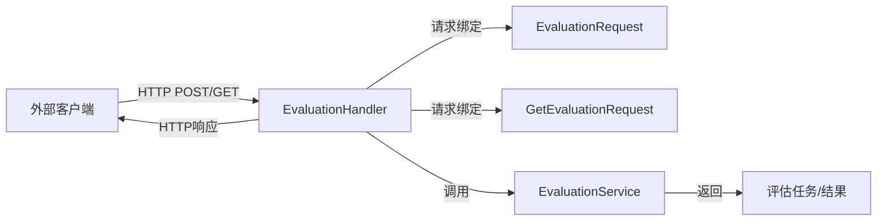

# evaluation_request_contracts 模块技术深度解析

## 1. 模块概述

`evaluation_request_contracts` 模块是系统中处理评估相关 HTTP 请求的核心组件，它定义了评估功能的 API 契约，并负责将外部 HTTP 请求转换为内部服务调用。这个模块位于 `http_handlers_and_routing` 层级下，是连接外部客户端与内部评估服务的桥梁。

### 解决的核心问题

在评估系统中，我们需要处理两种主要操作：发起新的评估任务和查询已有评估任务的结果。这个模块通过定义清晰的请求契约，确保了：
- API 的一致性和可预测性
- 请求参数的有效性验证
- 租户级别的安全隔离
- 与内部服务的解耦

## 2. 架构设计

### 核心组件关系图



### 数据流程

1. **评估任务发起流程**：
   - 客户端发送 POST 请求到 `/evaluation/` 端点
   - `EvaluationHandler.Evaluation` 方法接收请求
   - 使用 `gin` 的绑定机制将 JSON 数据解析为 `EvaluationRequest` 结构体
   - 从请求上下文中提取租户 ID
   - 调用 `evaluationService.Evaluation` 方法
   - 返回评估任务信息

2. **评估结果查询流程**：
   - 客户端发送 GET 请求到 `/evaluation/` 端点，携带 `task_id` 查询参数
   - `EvaluationHandler.GetEvaluationResult` 方法接收请求
   - 使用 `gin` 的绑定机制将查询参数解析为 `GetEvaluationRequest` 结构体
   - 调用 `evaluationService.EvaluationResult` 方法
   - 返回评估结果

## 3. 核心组件深度解析

### 3.1 EvaluationHandler 结构体

`EvaluationHandler` 是这个模块的核心控制器，它负责处理所有与评估相关的 HTTP 请求。

```go
type EvaluationHandler struct {
    evaluationService interfaces.EvaluationService
}
```

**设计意图**：
- 通过依赖注入 `evaluationService` 实现了与具体业务逻辑的解耦
- 遵循了单一职责原则，只负责 HTTP 层的处理
- 便于单元测试，可以轻松 mock `evaluationService`

### 3.2 EvaluationRequest 结构体

`EvaluationRequest` 定义了发起评估任务所需的参数契约。

```go
type EvaluationRequest struct {
    DatasetID       string `json:"dataset_id"`        // 用于评估的数据集ID
    KnowledgeBaseID string `json:"knowledge_base_id"` // 要评估的知识库ID
    ChatModelID     string `json:"chat_id"`           // 使用的聊天模型ID
    RerankModelID   string `json:"rerank_id"`         // 使用的重排序模型ID
}
```

**设计细节**：
- 使用 JSON 标签明确了字段与请求体的映射关系
- 所有字段都是字符串类型，确保了 API 的简洁性和通用性
- 通过字段名和注释清晰表达了每个参数的用途

### 3.3 GetEvaluationRequest 结构体

`GetEvaluationRequest` 定义了查询评估结果所需的参数契约。

```go
type GetEvaluationRequest struct {
    TaskID string `form:"task_id" binding:"required"` // 评估任务ID，必填
}
```

**设计亮点**：
- 使用 `form` 标签表明这是从查询参数中获取数据
- `binding:"required"` 标签确保了参数的存在性，由 gin 框架自动验证
- 简洁的设计反映了查询操作的本质：只需要一个任务标识符

## 4. 关键方法解析

### 4.1 Evaluation 方法

```go
func (e *EvaluationHandler) Evaluation(c *gin.Context)
```

这个方法处理评估任务的发起请求，是模块中最复杂的方法之一。

**处理流程**：
1. 从 gin 上下文中提取请求上下文
2. 记录日志，标记请求开始处理
3. 绑定请求体到 `EvaluationRequest` 结构体
4. 从上下文中获取租户 ID，确保多租户安全
5. 记录详细的评估参数日志（使用 `secutils.SanitizeForLog` 进行安全处理）
6. 调用评估服务创建任务
7. 返回成功响应或错误信息

**安全设计**：
- 使用 `secutils.SanitizeForLog` 对敏感数据进行日志清理，防止信息泄露
- 从请求上下文中提取租户 ID，而不是从请求参数中获取，确保了租户隔离

### 4.2 GetEvaluationResult 方法

```go
func (e *EvaluationHandler) GetEvaluationResult(c *gin.Context)
```

这个方法处理评估结果的查询请求，相对简洁但同样重要。

**处理流程**：
1. 从 gin 上下文中提取请求上下文
2. 记录日志，标记请求开始处理
3. 绑定查询参数到 `GetEvaluationRequest` 结构体
4. 调用评估服务获取结果
5. 返回成功响应或错误信息

## 5. 设计决策与权衡

### 5.1 依赖注入 vs 直接实例化

**决策**：使用依赖注入方式提供 `evaluationService`。

**理由**：
- 提高了代码的可测试性，可以轻松 mock 服务进行单元测试
- 降低了耦合度，Handler 不需要知道 Service 的具体实现
- 符合依赖倒置原则，高层模块不依赖低层模块，都依赖抽象

### 5.2 请求参数验证策略

**决策**：使用 gin 框架的绑定机制和标签进行参数验证。

**理由**：
- 利用框架提供的功能，减少了重复代码
- 声明式的验证方式，使代码更清晰易读
- 集中式的验证逻辑，便于维护

**权衡**：
- 优点：代码简洁，利用成熟框架
- 缺点：验证逻辑与框架强耦合，难以迁移到其他框架

### 5.3 日志安全处理

**决策**：使用 `secutils.SanitizeForLog` 对所有敏感数据进行日志清理。

**理由**：
- 防止敏感信息（如 ID、密钥等）泄露到日志中
- 统一的安全处理机制，确保一致性
- 符合安全最佳实践

## 6. 依赖关系分析

### 6.1 依赖的模块

- `interfaces.EvaluationService`：核心业务逻辑接口，定义在 [evaluation_dataset_and_metric_contracts](../core_domain_types_and_interfaces-evaluation_dataset_and_metric_contracts.md) 模块中
- `gin`：HTTP 框架，用于处理请求和响应
- `logger`：日志工具，用于记录请求处理过程
- `errors`：错误处理工具，用于生成标准化的错误响应
- `types`：核心类型定义，包括租户上下文键
- `secutils`：安全工具，用于日志敏感数据清理

### 6.2 被依赖的模块

- `evaluation_endpoint_handler`：路由配置模块，将 HTTP 请求路由到此 Handler
- 外部客户端：通过 HTTP API 直接调用此模块提供的功能

## 7. 使用指南与最佳实践

### 7.1 发起评估任务

```go
// 示例：发起评估任务的 HTTP 请求
POST /evaluation/
Content-Type: application/json

{
    "dataset_id": "dataset-123",
    "knowledge_base_id": "kb-456",
    "chat_id": "model-789",
    "rerank_id": "rerank-012"
}
```

### 7.2 查询评估结果

```go
// 示例：查询评估结果的 HTTP 请求
GET /evaluation/?task_id=task-abc123
```

### 7.3 最佳实践

1. **错误处理**：始终检查返回的 `success` 字段，确保请求成功处理
2. **任务轮询**：评估任务可能需要较长时间，建议使用指数退避策略轮询结果
3. **租户隔离**：确保在请求头中包含正确的认证信息，以维护租户隔离
4. **参数验证**：在客户端也进行基本的参数验证，减少无效请求

## 8. 边缘情况与注意事项

### 8.1 租户 ID 缺失

如果请求上下文中缺少租户 ID，系统将返回 401 未授权错误。这通常发生在认证中间件未正确配置或请求未包含有效认证信息时。

### 8.2 参数验证失败

如果请求参数不符合要求（如缺少必填字段），系统将返回 400 错误，包含详细的错误信息。

### 8.3 服务层错误

如果评估服务内部发生错误，系统将返回 500 内部服务器错误。客户端应重试或联系技术支持。

### 8.4 日志安全

所有日志输出都经过安全清理，但仍应避免在生产环境中记录过于详细的请求信息，以防止潜在的信息泄露。

## 9. 扩展与维护

### 9.1 添加新的评估参数

如果需要添加新的评估参数，只需在 `EvaluationRequest` 结构体中添加相应字段，并更新相关的文档和验证逻辑。

### 9.2 支持新的评估操作

要支持新的评估操作，可以在 `EvaluationHandler` 中添加新的方法，并在路由配置中注册相应的端点。

### 9.3 替换评估服务

由于使用了依赖注入和接口抽象，替换底层的评估服务实现相对简单，只需提供一个新的 `interfaces.EvaluationService` 实现即可。

## 10. 总结

`evaluation_request_contracts` 模块是系统评估功能的 HTTP 层门面，它通过清晰的契约定义、安全的请求处理和灵活的架构设计，为外部客户端提供了可靠的评估 API。这个模块体现了良好的软件工程实践，包括依赖注入、单一职责、接口抽象等，同时也充分考虑了安全性和可维护性。
