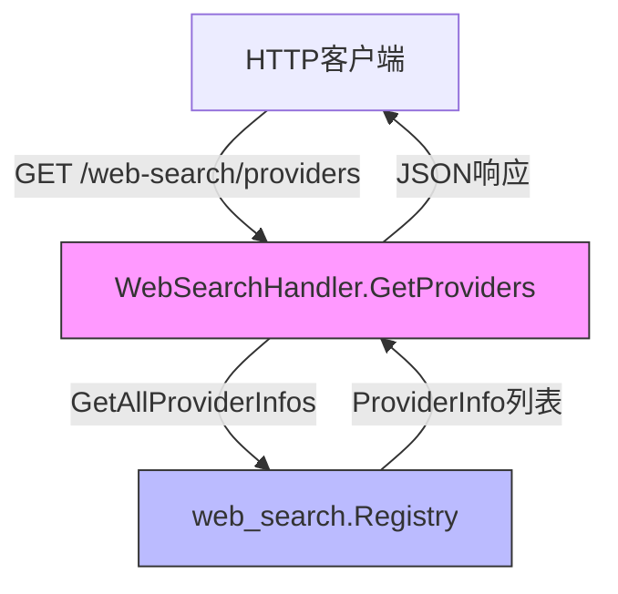

# Web Search Endpoint Handler 技术深度解析

## 1. 模块概述与问题解决

`web_search_endpoint_handler` 模块是系统 HTTP 层与 Web 搜索服务之间的关键桥梁。它主要解决的问题是：**将外部 HTTP 请求干净、安全地转换为内部 Web 搜索服务的调用，同时保持与系统其余部分的低耦合和高可扩展性**。

在没有这个模块的情况下，直接将 HTTP 路由处理代码混入业务逻辑会导致：
- HTTP 层与服务层的强耦合
- 难以测试核心业务逻辑
- 安全、日志、错误处理等横切关注点的分散

### 核心抽象

这个模块的本质是一个**适配器**：它接收来自 Gin 框架的 HTTP 请求上下文，将其转换为内部服务可以理解的纯 Go 调用，并将内部服务的响应包装回标准的 HTTP 响应格式。

---

## 2. 架构与数据流动



### 架构角色说明

1. **WebSearchHandler**：HTTP 层适配器
   - 接收并验证 HTTP 请求
   - 管理请求上下文和日志记录
   - 协调服务调用和响应格式化

2. **web_search.Registry**：服务层提供者注册表
   - 维护可用 Web 搜索提供者的配置
   - 提供提供者信息查询接口
   - 处理提供者的生命周期管理

### 数据流细节

当一个请求到达 `GetProviders` 方法时：
1. 从 Gin 上下文提取请求上下文
2. 记录日志标记请求开始
3. 调用 `registry.GetAllProviderInfos()` 获取提供者列表
4. 记录返回的提供者数量
5. 将结果包装为标准响应格式返回给客户端

---

## 3. 核心组件深度解析

### WebSearchHandler 结构体

```go
type WebSearchHandler struct {
    registry *web_search.Registry
}
```

**设计意图**：
- 采用**依赖注入**模式，通过构造函数接收 `web_search.Registry`
- 保持对服务层的最小依赖，只依赖接口而非具体实现
- 便于单元测试（可以轻松 mock Registry）

### NewWebSearchHandler 构造函数

```go
func NewWebSearchHandler(registry *web_search.Registry) *WebSearchHandler {
    return &amp;WebSearchHandler{
        registry: registry,
    }
}
```

**设计考量**：
- 显式声明依赖，使组件的依赖关系清晰可见
- 遵循 Go 的惯用法，返回指针类型以避免拷贝
- 没有额外的初始化逻辑，保持构造函数简洁

### GetProviders 方法

这是目前模块中唯一的处理方法，展示了典型的 HTTP 处理模式：

```go
func (h *WebSearchHandler) GetProviders(c *gin.Context) {
    ctx := c.Request.Context()
    logger.Info(ctx, "Getting web search providers")

    providers := h.registry.GetAllProviderInfos()

    logger.Infof(ctx, "Returning %d web search providers", len(providers))
    c.JSON(http.StatusOK, gin.H{
        "success": true,
        "data":    providers,
    })
}
```

**关键设计点**：

1. **上下文传递**：从 `c.Request.Context()` 提取上下文并贯穿整个调用链
   - 支持请求超时控制
   - 保留请求追踪信息
   - 便于日志关联

2. **结构化日志**：使用 `logger.Info` 和 `logger.Infof` 记录关键节点
   - 请求开始时记录操作
   - 请求结束时记录结果大小
   - 便于问题排查和性能监控

3. **标准响应格式**：使用 `gin.H` 包装统一的响应结构
   - `success` 字段标识操作结果
   - `data` 字段承载实际数据
   - 便于前端统一处理响应

---

## 4. 依赖分析

### 入站依赖（谁调用它）

此模块由 HTTP 路由系统调用，主要依赖：
- [Gin Web 框架](https://github.com/gin-gonic/gin)：提供 HTTP 路由和上下文管理
- [http_handlers_and_routing.routing_middleware_and_background_task_wiring](http_handlers_and_routing-routing_middleware_and_background_task_wiring.md)：可能包含的中间件和路由配置

### 出站依赖（它调用谁）

- [web_search.Registry](application_services_and_orchestration-retrieval_and_web_search_services-web_search_orchestration_registry_and_state.md)：核心服务层组件，管理 Web 搜索提供者
- [internal/logger](platform_infrastructure_and_runtime-platform_utilities_lifecycle_observability_and_security.md)：日志系统
- net/http：标准 HTTP 状态码

### 数据契约

**输入契约**：
- HTTP GET 请求，无需额外参数
- 期望通过身份验证（由中间件处理）

**输出契约**：
```json
{
  "success": true,
  "data": [/* ProviderInfo 列表 */]
}
```

---

## 5. 设计决策与权衡

### 依赖注入 vs 全局变量

**选择**：通过构造函数显式注入 `web_search.Registry`

**原因**：
- 提高可测试性：可以轻松注入 mock Registry 进行单元测试
- 明确依赖关系：从构造函数签名就能看出组件需要什么
- 降低耦合：不依赖全局状态，便于独立演进

**权衡**：
- 增加了一点点初始化代码复杂度
- 但换来的是更清晰的架构和更好的可测试性

### 简洁的错误处理

**观察**：当前实现没有显式的错误处理路径

**分析**：
- 获取提供者列表被认为是"应该总是成功"的操作
- Registry 的内部错误可能已经通过日志记录
- 对于这种管理类 API，简化处理是可接受的

**潜在改进空间**：
- 如果 Registry 未来可能返回错误，应添加错误处理分支
- 可考虑添加 500 错误响应的情况

### 统一响应格式

**选择**：使用 `{"success": true, "data": ...}` 格式

**原因**：
- 前端可以统一处理所有 API 响应
- 便于添加额外的元数据（如分页信息、警告等）
- 符合团队的 API 设计规范

---

## 6. 使用与扩展

### 当前用法

在路由设置中注册处理器：

```go
// 假设在路由设置代码中
registry := web_search.NewRegistry(/* 配置 */)
webSearchHandler := NewWebSearchHandler(registry)

router.GET("/web-search/providers", webSearchHandler.GetProviders)
```

### 扩展模式

如需添加新的 Web 搜索相关端点，可遵循以下模式：

1. 在 `WebSearchHandler` 中添加新方法
2. 保持一致的日志记录模式
3. 使用相同的响应格式
4. 适当处理错误情况

示例扩展：

```go
// Search executes a web search using the specified provider
func (h *WebSearchHandler) Search(c *gin.Context) {
    ctx := c.Request.Context()
    
    // 1. 解析请求参数
    var req SearchRequest
    if err := c.ShouldBindJSON(&amp;req); err != nil {
        c.JSON(http.StatusBadRequest, gin.H{"success": false, "error": err.Error()})
        return
    }
    
    logger.Infof(ctx, "Executing web search with provider: %s", req.Provider)
    
    // 2. 调用服务层
    results, err := h.registry.Search(ctx, req.Provider, req.Query)
    if err != nil {
        logger.Errorf(ctx, "Search failed: %v", err)
        c.JSON(http.StatusInternalServerError, gin.H{"success": false, "error": "Search failed"})
        return
    }
    
    // 3. 返回响应
    logger.Infof(ctx, "Search returned %d results", len(results))
    c.JSON(http.StatusOK, gin.H{
        "success": true,
        "data":    results,
    })
}
```

---

## 7. 边缘情况与注意事项

### 隐式契约

1. **身份验证**：方法上的 Swagger 注释表明需要 `Bearer` 和 `ApiKeyAuth`，但实际验证由中间件处理
2. **上下文传播**：假设传入的上下文已包含必要的追踪信息和超时控制
3. **Registry 可用性**：假设 Registry 在调用时已完全初始化并可用

### 潜在陷阱

1. **错误处理缺失**：如果 Registry 内部发生错误，当前实现会默默地忽略它并返回空列表
2. **缺少请求验证**：目前没有对请求进行额外的验证（虽然这个端点不需要参数）
3. **日志仅记录成功路径**：没有考虑失败场景的日志记录

### 操作考虑

- **监控**：建议为 `/web-search/providers` 端点添加基本的监控指标（调用次数、延迟）
- **配置热重载**：如果提供者配置支持热重载，此端点应能反映最新配置
- **性能**：由于每次调用都获取所有提供者信息，如果提供者列表很大，考虑添加缓存

---

## 8. 参考文档

- [Web Search Orchestration Registry](application_services_and_orchestration-retrieval_and_web_search_services-web_search_orchestration_registry_and_state.md)
- [HTTP Routing Middleware](http_handlers_and_routing-routing_middleware_and_background_task_wiring.md)
- [Web Search Provider Implementations](application_services_and_orchestration-retrieval_and_web_search_services-web_search_provider_implementations.md)
- [Logging System](platform_infrastructure_and_runtime-platform_utilities_lifecycle_observability_and_security.md)
