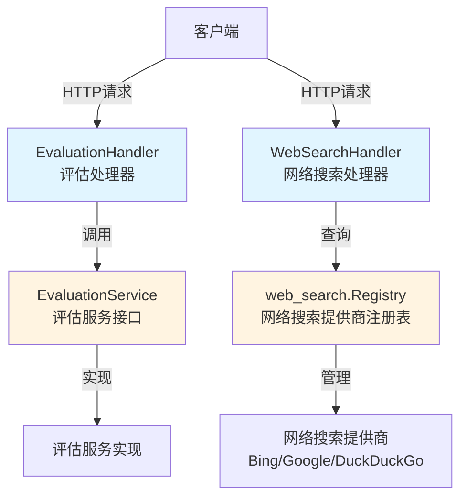

# 评估与网络搜索处理器模块

## 概述

`evaluation_and_web_search_handlers` 模块是系统的 HTTP 接入层组件，负责处理评估任务管理和网络搜索相关的 RESTful API 请求。这个模块扮演着"网关"和"适配器"的角色，将外部 HTTP 请求转换为内部服务调用，并将结果格式化为标准的 HTTP 响应返回给客户端。

**为什么这个模块存在？**

在构建 AI 驱动的知识库问答系统时，我们需要两个关键能力：
1. **评估能力**：系统需要能够测试和衡量知识库检索与生成的质量，这就需要创建评估任务、执行评估、获取评估结果的完整流程
2. **网络搜索发现能力**：系统需要能够查询可用的网络搜索提供商，以便在知识库之外补充实时信息

如果没有这个模块，我们可能会直接在业务逻辑中处理 HTTP 请求，导致：
- HTTP 层与业务逻辑层强耦合
- 难以进行单元测试
- 安全、日志、错误处理等横切关注点分散

这个模块将这两个能力的 HTTP 接口封装在一起，提供了统一的接入点，同时保持了内部服务的解耦。

## 架构概览



### 核心组件角色

1. **EvaluationHandler**：评估相关请求的 HTTP 处理器
   - 接收创建评估任务的 POST 请求
   - 接收获取评估结果的 GET 请求
   - 负责请求参数验证、租户上下文提取、错误处理
   - 将请求委托给内部的 EvaluationService

2. **WebSearchHandler**：网络搜索相关请求的 HTTP 处理器
   - 提供查询可用网络搜索提供商的接口
   - 直接与 web_search.Registry 交互获取提供商信息

3. **请求契约模型**：
   - `EvaluationRequest`：创建评估任务的请求参数
   - `GetEvaluationRequest`：获取评估结果的请求参数

## 关键设计决策

### 1. 关注点分离：Handler 只负责 HTTP 层逻辑

**决策**：Handler 层只处理 HTTP 相关的职责（参数绑定、上下文提取、响应格式化），实际业务逻辑完全委托给内部服务。

**为什么这样设计？**
- ✅ **可测试性**：Handler 可以通过模拟服务接口进行单元测试
- ✅ **复用性**：内部服务可以被其他接入层（如 gRPC）复用
- ✅ **单一职责**：Handler 不需要知道评估是如何执行的，只需要知道如何调用服务

**替代方案**：如果将业务逻辑直接放在 Handler 中，会导致代码耦合，难以测试和维护。

### 2. 租户上下文从 Gin Context 提取

**决策**：通过 `c.Get(string(types.TenantIDContextKey))` 从请求上下文中获取租户 ID，而不是从请求参数中获取。

**为什么这样设计？**
- ✅ **安全性**：租户 ID 来自认证中间件设置的上下文，防止用户伪造租户信息
- ✅ **一致性**：所有需要租户信息的 Handler 都采用相同的方式获取
- ✅ **简化 API**：客户端不需要在每个请求中都传递租户 ID

**隐含契约**：这个设计假设在请求到达 Handler 之前，已经有中间件完成了认证并将租户 ID 写入了 Gin Context。如果中间件缺失，Handler 会返回 401 错误。

### 3. 参数敏感信息脱敏

**决策**：使用 `secutils.SanitizeForLog()` 对日志中的 ID 参数进行脱敏处理。

**为什么这样设计？**
- ✅ **安全性**：防止敏感信息（如数据集 ID、知识库 ID）泄漏到日志中
- ✅ **合规性**：满足数据隐私和安全审计要求

### 4. WebSearchHandler 直接依赖 Registry 而非 Service

**决策**：WebSearchHandler 直接依赖 `web_search.Registry`，而不是通过一个 Service 层。

**为什么这样设计？**
- ✅ **简单性**：获取提供商列表是一个简单的查询操作，不需要额外的业务逻辑
- ✅ **直接性**：Registry 本身就是一个信息源，直接访问可以减少一层抽象

**权衡**：如果未来需要在获取提供商列表时添加复杂的业务逻辑（如权限控制、动态过滤），可能需要引入 Service 层。

## 子模块概述

本模块包含以下子模块：

- **[评估请求契约](http_handlers_and_routing-evaluation_and_web_search_handlers-evaluation_request_contracts.md)**：定义评估相关的请求数据结构
- **[评估端点处理器](http_handlers_and_routing-evaluation_and_web_search_handlers-evaluation_endpoint_handler.md)**：实现评估任务创建和结果查询的 HTTP 处理逻辑
- **[网络搜索端点处理器](http_handlers_and_routing-evaluation_and_web_search_handlers-web_search_endpoint_handler.md)**：实现网络搜索提供商查询的 HTTP 处理逻辑

## 跨模块依赖

### 上游依赖（被本模块依赖）

- **[评估数据集与指标服务](application_services_and_orchestration-evaluation_dataset_and_metric_services.md)**：提供 `EvaluationService` 接口，Handler 通过这个接口执行评估任务和获取结果
- **[网络搜索编排注册表与状态](application_services_and_orchestration-retrieval_and_web_search_services-web_search_orchestration_registry_and_state.md)**：提供 `web_search.Registry`，用于查询可用的网络搜索提供商
- **[核心领域类型与接口](core_domain_types_and_interfaces.md)**：提供 `types.TenantIDContextKey` 等类型定义
- **[评估数据集与指标契约](core_domain_types_and_interfaces-evaluation_dataset_and_metric_contracts.md)**：定义 `EvaluationService` 接口

### 下游依赖（依赖本模块）

- **[路由中间件与后台任务布线](http_handlers_and_routing-routing_middleware_and_background_task_wiring.md)**：将本模块的 Handler 注册到 HTTP 路由中

## 数据流分析

### 评估任务创建流程

```
1. 客户端发送 POST /evaluation/ 请求
   ↓
2. Gin 路由将请求转发给 EvaluationHandler.Evaluation
   ↓
3. Handler 从 Gin Context 提取租户 ID（由认证中间件设置）
   ↓
4. Handler 绑定并验证 EvaluationRequest 参数
   ↓
5. Handler 调用 evaluationService.Evaluation() 方法
   ↓
6. 服务层执行评估任务创建逻辑（本模块不关心具体实现）
   ↓
7. Handler 接收返回的任务对象，格式化为 JSON 响应
   ↓
8. 客户端收到包含任务 ID 的响应
```

### 评估结果查询流程

```
1. 客户端发送 GET /evaluation/?task_id=xxx 请求
   ↓
2. Gin 路由将请求转发给 EvaluationHandler.GetEvaluationResult
   ↓
3. Handler 绑定并验证 GetEvaluationRequest 参数
   ↓
4. Handler 调用 evaluationService.EvaluationResult() 方法
   ↓
5. 服务层获取评估结果（本模块不关心具体实现）
   ↓
6. Handler 接收返回的结果对象，格式化为 JSON 响应
   ↓
7. 客户端收到评估结果
```

### 网络搜索提供商查询流程

```
1. 客户端发送 GET /web-search/providers 请求
   ↓
2. Gin 路由将请求转发给 WebSearchHandler.GetProviders
   ↓
3. Handler 调用 registry.GetAllProviderInfos() 方法
   ↓
4. Registry 返回所有可用的提供商信息
   ↓
5. Handler 格式化为 JSON 响应
   ↓
6. 客户端收到提供商列表
```

## 新贡献者注意事项

### 1. 租户上下文的隐含依赖

**陷阱**：EvaluationHandler 假设 Gin Context 中已经设置了租户 ID。如果在没有认证中间件的环境中测试，会直接返回 401 错误。

**解决方案**：在测试时，需要手动设置 Gin Context 中的租户 ID：
```go
c.Set(string(types.TenantIDContextKey), "test-tenant-id")
```

### 2. 错误处理约定

**注意**：Handler 使用 `c.Error()` 来设置错误，而不是直接返回错误响应。这依赖于全局错误处理中间件来将 AppError 转换为合适的 HTTP 响应。

### 3. 日志记录规范

**要求**：所有日志都应该包含请求上下文（`ctx`），并且敏感信息必须通过 `secutils.SanitizeForLog()` 处理。

### 4. 接口依赖方向

**设计原则**：Handler 依赖接口（`interfaces.EvaluationService`）而不是具体实现，这使得可以轻松替换服务实现或进行模拟测试。

### 5. 扩展点

如果需要添加新的评估相关接口，可以：
1. 在 `EvaluationHandler` 中添加新方法
2. 定义对应的请求结构
3. 在 `interfaces.EvaluationService` 中添加新方法（如果需要）
4. 更新路由注册

如果需要添加新的网络搜索相关接口，可以：
1. 在 `WebSearchHandler` 中添加新方法
2. 考虑是否需要在 `web_search.Registry` 中添加对应功能
3. 更新路由注册
