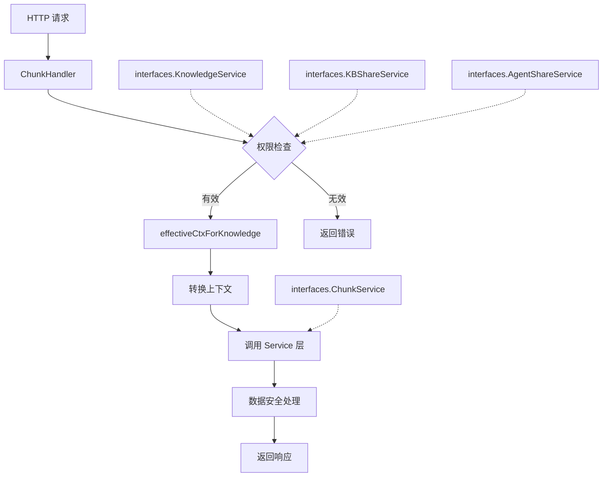

# chunk_content_http_handlers 模块深度技术解析

## 1. 模块概述

想象一下：你有一个知识库系统，里面有无数个文档被切分成了无数个小分块。用户可能是文档的所有者，也可能是通过共享获得访问权限的人，他们都需要查看、修改或删除这些分块。你如何确保只有有权限的人才能操作？如何处理跨租户的数据访问？`chunk_content_http_handlers` 模块就是解决这个问题的关键。

这个模块是知识库分块管理的 HTTP 接入层，它负责将外部的 RESTful 请求转换为内部的业务逻辑调用，同时承担了**权限验证**、**上下文转换**和**数据安全**的重要职责。它不仅处理所有者的操作，还巧妙地支持了跨租户的共享知识库访问场景。

## 2. 核心架构

让我们通过一个架构图来理解这个模块的设计：



这个模块的设计采用了典型的**分层架构**，但有一个非常独特的设计：**上下文转换模式**。核心思想是将 HTTP 请求层的上下文（基于当前登录用户的租户）转换为业务逻辑层需要的上下文（基于数据实际所属的租户）。

让我们看看数据是如何流动的：

1. **请求接入**：外部 HTTP 请求到达 `ChunkHandler` 的对应方法
2. **参数提取与清洗**：从 URL 路径、查询参数或请求体中提取数据，并进行安全清洗
3. **权限验证**：通过 `effectiveCtxForKnowledge` 进行复杂的权限检查
4. **上下文转换**：创建带有正确 `effectiveTenantID` 的新上下文
5. **业务调用**：使用转换后的上下文调用 Service 层
6. **数据安全处理**：对返回的数据进行显示安全清理
7. **响应返回**：将结果包装成标准的 JSON 格式返回

## 3. 核心组件深度解析

### 3.1 ChunkHandler 结构体

`ChunkHandler` 是整个模块的核心，它通过依赖注入的方式整合了四个关键服务接口：

```go
type ChunkHandler struct {
    service           interfaces.ChunkService
    kgService         interfaces.KnowledgeService
    kbShareService    interfaces.KBShareService
    agentShareService interfaces.AgentShareService
}
```

**设计意图**：
- **接口依赖**：依赖接口而非具体实现，提高了可测试性和灵活性
- **权限组合**：通过组合不同的服务接口，实现了多维度的权限检查
- **关注点分离**：HTTP 处理逻辑与业务逻辑完全分离

这种设计使得我们可以轻松地 mock 这些依赖进行单元测试，同时也为未来的功能扩展提供了良好的基础。

### 3.2 effectiveCtxForKnowledge 方法

这是整个模块最关键也最巧妙的方法，它解决了**跨租户数据访问**这个复杂问题。

```go
func (h *ChunkHandler) effectiveCtxForKnowledge(c *gin.Context, knowledgeID string, requiredPermission types.OrgMemberRole) (context.Context, error)
```

**工作原理**：

这个方法就像一个**智能门禁系统**，它会按照以下顺序检查访问权限：

1. **基本认证检查**：确认用户已登录且有有效的租户 ID
2. **所有者检查**：如果知识属于当前租户，直接放行
3. **知识库共享检查**：如果通过 `kbShareService` 检查到用户有共享权限，验证权限级别后放行
4. **代理共享检查**：如果是只读操作，通过 `agentShareService` 检查是否可以通过共享的代理访问

**设计亮点**：
- **上下文转换**：返回的不是简单的 boolean，而是一个带有 `effectiveTenantID` 的新上下文
- **渐进式权限检查**：从最简单的检查开始，逐步深入复杂的检查
- **灵活性**：支持多种共享场景，包括直接共享知识库和通过代理间接共享

### 3.3 validateAndGetChunk 方法

这个方法是一个**前置验证器**，它封装了更新和删除操作的共同验证逻辑：

```go
func (h *ChunkHandler) validateAndGetChunk(c *gin.Context) (*types.Chunk, string, context.Context, error)
```

**职责**：
1. 验证路径参数的有效性
2. 进行权限检查并获取有效上下文
3. 获取分块数据
4. 验证分块是否属于指定的知识

**设计意图**：
- **代码复用**：避免在 UpdateChunk 和 DeleteChunk 中重复相同的验证逻辑
- **一致性保证**：确保所有修改操作都经过相同的验证流程
- **提前失败**：在执行业务逻辑前就发现并返回错误

### 3.4 HTTP 处理方法

模块提供了六个主要的 HTTP 处理方法，每个方法都有明确的职责：

| 方法 | 路径 | 功能 | 关键设计点 |
|------|------|------|-----------|
| GetChunkByIDOnly | /chunks/by-id/{id} | 通过 ID 获取分块 | 先获取分块再验证权限 |
| ListKnowledgeChunks | /chunks/{knowledge_id} | 列出知识下的分块 | 分页参数验证和限制 |
| UpdateChunk | /chunks/{knowledge_id}/{id} | 更新分块 | 部分更新模式 |
| DeleteChunk | /chunks/{knowledge_id}/{id} | 删除分块 | 通过 validateAndGetChunk 验证 |
| DeleteChunksByKnowledgeID | /chunks/{knowledge_id} | 删除知识下所有分块 | 批量操作权限验证 |
| DeleteGeneratedQuestion | /chunks/by-id/{id}/questions | 删除分块的生成问题 | 支持问题级别的操作 |

**设计模式**：
- **单一职责**：每个方法只处理一个 HTTP 端点
- **参数验证**：所有输入都经过验证和安全清洗
- **错误处理**：统一的错误处理和日志记录模式

## 4. 数据安全与上下文转换

这个模块在数据安全方面有两个非常重要的设计：

### 4.1 数据安全清洗

模块使用了两个关键的安全工具函数：

1. **secutils.SanitizeForLog**：在记录日志前清洗敏感数据
2. **secutils.SanitizeForDisplay**：在返回数据前清洗可能的恶意内容

**设计意图**：
- **日志安全**：防止敏感数据泄露到日志中
- **XSS 防护**：在返回用户输入的内容前进行清理，防止跨站脚本攻击

### 4.2 上下文转换机制

这是模块最核心的设计模式之一。让我们理解它的工作原理：

```
用户请求 (租户 A) 
    ↓
[验证权限]
    ↓
创建新上下文 (租户 B - 数据实际所属租户)
    ↓
[调用 Service 层]
    ↓
Service 层使用租户 B 的上下文操作数据
```

**为什么需要这种转换？**

在多租户系统中，数据通常按租户隔离存储。但当支持共享功能时，用户可能需要访问其他租户的数据。如果我们直接在 Service 层处理这种情况，会导致业务逻辑变得复杂且难以维护。

通过在 HTTP 处理层进行上下文转换，我们实现了：
- **关注点分离**：Service 层只需要处理单一租户的逻辑
- **权限集中管理**：所有权限检查都在 HTTP 层完成
- **向后兼容**：Service 层不需要知道共享功能的存在

## 5. 依赖关系分析

### 5.1 模块依赖

这个模块依赖于以下关键接口：

1. **interfaces.ChunkService**：分块业务逻辑的核心接口
2. **interfaces.KnowledgeService**：知识查询接口，用于验证知识存在性
3. **interfaces.KBShareService**：知识库共享权限检查接口
4. **interfaces.AgentShareService**：代理共享权限检查接口

**设计意图**：
- **依赖倒置**：依赖抽象接口而非具体实现
- **可测试性**：可以轻松 mock 这些接口进行单元测试
- **灵活性**：可以更换不同的实现而不影响 HTTP 层

### 5.2 数据流

让我们以 `GetChunkByIDOnly` 为例，追踪数据的完整流动路径：

```
1. HTTP GET /chunks/by-id/{id}
   ↓
2. ChunkHandler.GetChunkByIDOnly()
   ↓
3. 提取并验证 chunkID
   ↓
4. h.service.GetChunkByIDOnly() - 获取分块数据（无租户过滤）
   ↓
5. h.effectiveCtxForKnowledge() - 验证访问权限
   ├─ h.kgService.GetKnowledgeByIDOnly() - 获取知识信息
   ├─ 检查是否为所有者
   ├─ 检查知识库共享权限
   └─ 检查代理共享权限
   ↓
6. secutils.SanitizeForDisplay() - 清理分块内容
   ↓
7. 返回 JSON 响应
```

**关键观察**：
- 先获取数据再验证权限的模式，支持跨租户数据访问
- 多重权限检查确保了安全性
- 最后一步的安全清理防止了 XSS 攻击

## 6. 设计决策与权衡

### 6.1 先获取数据再验证权限 vs 先验证权限再获取数据

**选择**：先获取数据再验证权限（在 GetChunkByIDOnly 中）

**原因**：
- 只知道分块 ID 时，无法预先知道它属于哪个知识
- 需要通过分块获取知识 ID，然后才能进行权限检查

**权衡**：
- ✅ 优点：支持仅通过分块 ID 访问的场景
- ⚠️ 缺点：会有一次额外的数据库查询，且可能给未授权用户透露"分块是否存在"的信息

**缓解措施**：
- 权限检查失败时返回通用的错误信息，不区分"分块不存在"和"无权限访问"

### 6.2 上下文转换 vs Service 层多租户支持

**选择**：在 HTTP 层进行上下文转换

**原因**：
- 保持 Service 层的简单性，不需要处理复杂的跨租户逻辑
- 权限检查集中在 HTTP 层，更容易审计和维护
- 向后兼容，Service 层不需要修改

**权衡**：
- ✅ 优点：Service 层保持简洁，职责清晰
- ⚠️ 缺点：HTTP 层变得复杂，需要理解业务权限规则

### 6.3 渐进式权限检查 vs 一次性权限检查

**选择**：渐进式权限检查

**原因**：
- 性能优化：简单的检查先执行，快速失败
- 兼容性：支持多种共享场景，从简单到复杂
- 可扩展性：可以轻松添加新的权限检查方式

**权衡**：
- ✅ 优点：性能好，灵活，可扩展
- ⚠️ 缺点：逻辑相对复杂，需要仔细处理每个检查点

### 6.4 部分更新 vs 完全替换

**选择**：部分更新（在 UpdateChunk 中）

**原因**：
- 灵活性：客户端可以只发送需要修改的字段
- 网络效率：减少不必要的数据传输
- 安全性：避免意外覆盖不应该修改的字段

**权衡**：
- ✅ 优点：灵活，高效，安全
- ⚠️ 缺点：需要区分"字段未提供"和"字段设为空值"的情况

## 7. 使用指南与最佳实践

### 7.1 路由配置

这个模块的路由应该在应用启动时配置，通常如下：

```go
chunkHandler := NewChunkHandler(...)
router.GET("/chunks/by-id/:id", chunkHandler.GetChunkByIDOnly)
router.GET("/chunks/:knowledge_id", chunkHandler.ListKnowledgeChunks)
router.PUT("/chunks/:knowledge_id/:id", chunkHandler.UpdateChunk)
router.DELETE("/chunks/:knowledge_id/:id", chunkHandler.DeleteChunk)
router.DELETE("/chunks/:knowledge_id", chunkHandler.DeleteChunksByKnowledgeID)
router.DELETE("/chunks/by-id/:id/questions", chunkHandler.DeleteGeneratedQuestion)
```

### 7.2 依赖注入

创建 `ChunkHandler` 时，需要注入四个依赖：

```go
handler := NewChunkHandler(
    chunkService,      // 必须：分块服务
    knowledgeService,  // 必须：知识服务
    kbShareService,    // 可选：知识库共享服务（可为 nil）
    agentShareService, // 可选：代理共享服务（可为 nil）
)
```

**注意**：如果 `kbShareService` 或 `agentShareService` 为 nil，对应的共享功能将不可用，但不会影响基本功能。

### 7.3 错误处理

模块使用了自定义的错误类型，建议在中间件中统一处理：

```go
func ErrorHandler(c *gin.Context) {
    c.Next()
    
    for _, err := range c.Errors {
        if appErr, ok := err.Err.(*errors.AppError); ok {
            c.JSON(appErr.HTTPStatus, gin.H{
                "success": false,
                "error":   appErr.Message,
            })
            return
        }
    }
}
```

## 8. 边缘情况与注意事项

### 8.1 跨租户数据访问的性能考虑

当访问共享知识库时，会有多次额外的服务调用来验证权限。在高并发场景下，这可能成为性能瓶颈。

**建议**：
- 考虑在 `KBShareService` 和 `AgentShareService` 中实现缓存
- 对于频繁访问的共享知识库，可以考虑更优化的权限检查策略

### 8.2 分块内容的安全清理

模块在返回分块内容前会调用 `secutils.SanitizeForDisplay` 进行清理。这意味着：
- 客户端收到的内容可能与数据库中存储的不完全一致
- 如果需要原始内容（例如用于编辑），需要考虑额外的接口

### 8.3 分页参数的限制

`ListKnowledgeChunks` 对分页参数有硬性限制：
- `page_size` 最大为 100
- 超过限制会被自动调整

这是为了防止：
- 客户端请求过大的页面导致性能问题
- 数据库查询返回过多数据消耗内存

### 8.4 部分更新的语义

`UpdateChunk` 采用部分更新模式，但需要注意：
- `Content` 字段只有在非空时才更新
- `IsEnabled` 字段总是更新（即使请求中没有提供，默认值为 false）

这种不一致的行为可能导致混淆，建议：
- 客户端总是提供明确的值，而不是依赖默认值
- 未来可以考虑使用指针类型来区分"未提供"和"零值"

### 8.5 DeleteGeneratedQuestion 的权限模型

`DeleteGeneratedQuestion` 方法要求 `OrgRoleEditor` 权限，这意味着：
- 只有编辑者及以上角色可以删除生成的问题
- 查看者无法删除，即使是他们自己生成的问题

如果需要更细粒度的控制，可能需要扩展权限模型。

## 9. 总结

`chunk_content_http_handlers` 模块是一个设计精巧的 HTTP 处理层，它解决了多租户环境下分块管理的复杂问题。其核心价值在于：

1. **上下文转换模式**：优雅地解决了跨租户数据访问问题
2. **渐进式权限检查**：灵活支持多种共享场景
3. **数据安全意识**：从日志到响应的全方位安全考虑
4. **依赖倒置设计**：高度可测试和可扩展的架构

虽然有一些可以改进的地方（如部分更新的语义一致性），但整体而言，这是一个高质量的模块，为上层应用提供了可靠的分块管理 HTTP 接口。

## 10. 相关模块

- [content_and_knowledge_management_repositories-knowledge_and_corpus_storage_repositories](../data_access_repositories-content_and_knowledge_management_repositories-knowledge_and_corpus_storage_repositories.md)：分块数据的持久化层
- [knowledge_ingestion_extraction_and_graph_services](../application_services_and_orchestration-knowledge_ingestion_extraction_and_graph_services.md)：知识和分块的业务逻辑层
- [core_domain_types_and_interfaces-knowledge_graph_retrieval_and_content_contracts](../core_domain_types_and_interfaces-knowledge_graph_retrieval_and_content_contracts.md)：分块相关的核心类型定义
