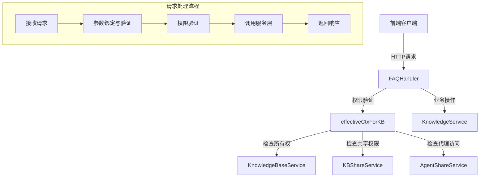

# FAQ内容操作HTTP处理器模块深度解析

## 1. 模块概览

这个模块是系统中FAQ知识库内容管理的HTTP接口层，它为前端提供了完整的FAQ条目生命周期管理能力，包括创建、查询、更新、删除、搜索、导入导出等操作。简单来说，它就像是FAQ知识库的"接待员"——接收来自前端的HTTP请求，验证权限和参数，然后将实际工作委托给下层的服务层处理。

## 2. 核心架构

### 2.1 架构图



### 2.2 核心组件角色

- **FAQHandler**: 中心协调者，持有所有必要的服务依赖，提供所有FAQ相关的HTTP处理方法
- **effectiveCtxForKB**: 权限守卫，确保用户对知识库有合法访问权限，并返回带有有效租户ID的上下文
- **请求结构体**: 如 `faqDeleteRequest`、`faqEntryTagBatchRequest` 等，定义了特定操作的请求格式和验证规则

## 3. 核心组件深度解析

### 3.1 FAQHandler 结构体

这是模块的核心，它通过依赖注入的方式持有四个关键服务接口：

```go
type FAQHandler struct {
    knowledgeService  interfaces.KnowledgeService
    kbService         interfaces.KnowledgeBaseService
    kbShareService    interfaces.KBShareService
    agentShareService interfaces.AgentShareService
}
```

**设计意图**：采用依赖注入而非直接创建依赖，这样做有两个关键优势：
1. **可测试性**：在单元测试中可以轻松注入mock服务
2. **解耦**：Handler只依赖接口，不关心具体实现，便于后续替换或扩展

### 3.2 effectiveCtxForKB 方法

这是模块中最复杂也最重要的方法之一，它实现了一个多阶段的权限验证流程：

**验证流程**：
1. 首先从上下文中提取租户ID和用户ID，确保用户已认证
2. 验证知识库ID不为空
3. 检查知识库是否属于当前租户——如果是，直接放行
4. 如果不是，检查是否通过知识库共享机制获得了访问权限
5. 如果还没有，检查是否可以通过共享的Agent间接访问知识库（仅当需要的是Viewer权限时）
6. 如果以上都失败，返回403 Forbidden错误

**设计亮点**：
- **上下文转换**：当访问共享知识库时，会将上下文中的租户ID替换为知识库源租户的ID，这样下游服务就能正确访问到数据
- **权限降级**：对于只读操作，提供了更多的访问途径（如通过共享Agent），而编辑操作则要求更严格的权限
- **日志记录**：所有共享访问都会被记录，便于审计和问题排查

### 3.3 主要处理方法

模块提供了丰富的处理方法，覆盖了FAQ管理的完整生命周期：

#### 3.3.1 ListEntries - 查询FAQ列表
支持分页、标签筛选、关键词搜索、字段选择和排序。注意它使用了 `types.OrgRoleViewer` 权限，意味着任何有查看权限的用户都可以调用。

#### 3.3.2 UpsertEntries - 批量导入FAQ
这是一个异步操作，返回task_id供后续查询进度。支持dry_run模式，可以在实际导入前验证数据。设计上统一使用 `UpsertFAQEntries` 方法，通过DryRun字段区分模式，避免了代码重复。

#### 3.3.3 SearchFAQ - 搜索FAQ
实现了混合搜索功能，支持两级优先级标签召回。这里有一个细节：它会自动修正MatchCount参数，确保在1-200的合理范围内，这是一种防御性编程的体现。

#### 3.3.4 ExportEntries - 导出FAQ
将FAQ导出为CSV文件。注意它添加了BOM（字节顺序标记）`0xEF, 0xBB, 0xBF`，这是为了确保Excel能正确识别UTF-8编码的CSV文件，是一个很实用的细节处理。

### 3.4 请求结构体

模块定义了几个专用的请求结构体：

- **faqDeleteRequest**: 要求IDs数组至少有一个元素
- **faqEntryTagBatchRequest**: 使用map结构，key是条目ID，value是标签ID（nil表示移除标签）
- **addSimilarQuestionsRequest**: 要求相似问题列表至少有一个元素
- **updateLastFAQImportResultDisplayStatusRequest**: 使用oneof验证确保display_status只能是"open"或"close"

这些结构体都使用了binding标签进行验证，将参数验证逻辑 declarative 地定义在结构体上，使代码更清晰。

## 4. 数据流向分析

让我们以一个典型的"创建FAQ条目"场景为例，追踪数据的完整流向：

1. **请求接收**：前端发送POST请求到 `/knowledge-bases/{id}/faq/entry`
2. **参数提取**：从URL路径提取知识库ID，从请求体绑定 `types.FAQEntryPayload`
3. **权限验证**：调用 `effectiveCtxForKB`，使用 `types.OrgRoleEditor` 权限
4. **上下文转换**：如果知识库是共享的，上下文会被转换为源租户上下文
5. **服务调用**：调用 `knowledgeService.CreateFAQEntry` 执行实际创建
6. **响应返回**：将创建的FAQ条目包装在标准响应格式中返回

整个流程中，Handler层的职责很清晰：它不做实际的业务逻辑，只负责HTTP层面的处理——参数绑定、权限验证、调用服务、返回响应。

## 5. 设计决策与权衡

### 5.1 统一权限验证 vs 分散验证

**决策**：将权限验证逻辑集中在 `effectiveCtxForKB` 方法中，所有处理方法都调用它。

**权衡**：
- ✅ **优点**：避免代码重复，确保权限逻辑一致，修改权限规则时只需改一处
- ❌ **缺点**：这个方法变得比较复杂，需要处理多种场景

**为什么这样选择**：对于权限这种安全敏感的逻辑，一致性比代码简洁更重要。集中管理可以避免出现"某个端点忘了验证权限"的安全漏洞。

### 5.2 同步 vs 异步操作

**决策**：单个FAQ的创建/更新是同步的，批量导入是异步的。

**权衡**：
- 同步操作：用户体验好，立即得到结果，但不适合耗时操作
- 异步操作：可以处理大数据量，但需要额外的进度查询机制

**为什么这样选择**：单个FAQ操作通常很快，同步处理更直接；批量导入可能涉及成千上万条数据，还需要进行重复检查、内容安全审核等耗时操作，异步处理可以避免请求超时。

### 5.3 直接使用Gin Context vs 抽象

**决策**：直接使用Gin的Context，没有进一步抽象。

**权衡**：
- ✅ **优点**：简单直接，利用Gin提供的所有功能
- ❌ **缺点**：与Gin框架耦合，如果将来要换框架会比较麻烦

**为什么这样选择**：在可预见的将来，更换Web框架的可能性很低，与Gin耦合带来的便利性超过了其风险。

## 6. 使用指南与最佳实践

### 6.1 常见使用模式

所有处理方法都遵循相同的模式：
```go
func (h *FAQHandler) SomeOperation(c *gin.Context) {
    // 1. 提取基本信息
    ctx := c.Request.Context()
    kbID := secutils.SanitizeForLog(c.Param("id"))
    
    // 2. 权限验证
    effCtx, err := h.effectiveCtxForKB(c, kbID, types.OrgRoleEditor)
    if err != nil {
        c.Error(err)
        return
    }
    
    // 3. 参数绑定与验证
    var req SomeRequest
    if err := c.ShouldBindJSON(&req); err != nil {
        logger.Error(ctx, "Failed to bind payload", err)
        c.Error(errors.NewBadRequestError("请求参数不合法").WithDetails(err.Error()))
        return
    }
    
    // 4. 调用服务层
    result, err := h.knowledgeService.SomeOperation(effCtx, kbID, &req)
    if err != nil {
        logger.ErrorWithFields(ctx, err, nil)
        c.Error(err)
        return
    }
    
    // 5. 返回响应
    c.JSON(http.StatusOK, gin.H{
        "success": true,
        "data":    result,
    })
}
```

### 6.2 扩展建议

如果要添加新的FAQ操作：
1. 在 `FAQHandler` 上添加新方法
2. 遵循上述模式，确保调用 `effectiveCtxForKB` 进行权限验证
3. 使用 `secutils.SanitizeForLog` 处理用户输入，避免日志注入
4. 使用统一的错误处理和响应格式
5. 添加Swagger注释，保持API文档同步

## 7. 注意事项与陷阱

### 7.1 隐含的契约

- **租户ID的来源**：Handler假设 `types.TenantIDContextKey` 和 `types.UserIDContextKey` 已经在上下文中设置，这通常由认证中间件完成。如果中间件没有正确设置，所有请求都会失败。
- **知识库ID的格式**：虽然代码中没有明确验证，但下游服务可能期望特定格式的知识库ID。
- **错误类型**：Handler依赖服务层返回特定类型的错误（如 `errors.AppError`），如果服务层返回普通错误，可能不会被正确处理。

### 7.2 常见错误

- **忘记权限验证**：添加新端点时，很容易忘记调用 `effectiveCtxForKB`，这会造成安全漏洞。
- **错误的权限级别**：使用 `OrgRoleViewer` 还是 `OrgRoleEditor` 需要仔细考虑，给太多权限可能造成数据泄露，给太少可能影响功能。
- **忽略SanitizeForLog**：直接将用户输入写入日志可能导致日志注入攻击，记得对所有用户输入使用 `secutils.SanitizeForLog`。

### 7.3 性能考虑

- **ListEntries**：当知识库中FAQ条目很多时，这个操作可能会变慢。虽然有分页，但如果没有正确的索引，数据库查询可能仍然很慢。
- **SearchFAQ**：混合搜索通常比普通查询慢，特别是当MatchCount很大时。虽然代码限制了最大200，但仍然需要注意性能。
- **ExportEntries**：导出所有FAQ条目可能会消耗大量内存和网络带宽，对于非常大的知识库，可能需要考虑流式导出或分页导出。

## 8. 相关模块

- [知识内容HTTP处理器](http_handlers_and_routing-knowledge_faq_and_tag_content_handlers-knowledge_content_http_handlers.md)：处理通用知识内容的HTTP接口
- [知识库管理HTTP处理器](http_handlers_and_routing-knowledge_faq_and_tag_content_handlers-knowledge_base_management_http_handlers.md)：处理知识库生命周期管理
- [标签管理HTTP处理器](http_handlers_and_routing-knowledge_faq_and_tag_content_handlers-tag_management_http_handlers.md)：处理标签相关操作

这个模块依赖的核心服务接口定义在 `core_domain_types_and_interfaces` 模块中，实际实现在 `application_services_and_orchestration` 模块中。
