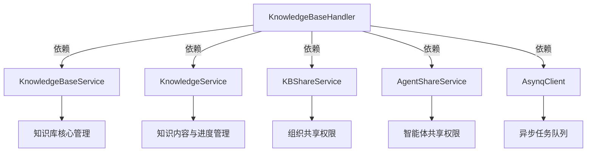

# knowledge_base_management_http_handlers 模块技术深度解析

## 1. 模块概述

**knowledge_base_management_http_handlers** 模块是一个位于系统 API 层的关键组件，负责处理知识库管理的所有 HTTP 请求，包括创建、查询、更新、删除知识库，以及复制知识库和在知识库中执行混合搜索等功能。

### 解决的核心问题

在多租户、多权限模型的系统中，知识库管理面临几个关键挑战：
1. **复杂的访问控制**：需要支持租户自有、组织共享、智能体共享三种访问模式
2. **异步操作支持**：知识库复制是耗时操作，需要异步处理机制
3. **权限分层管理**：不同角色（管理员/编辑者/查看者）对知识库有不同操作权限
4. **数据隔离与共享**：需要在保证租户数据隔离的前提下实现灵活的知识共享

本模块通过统一的 HTTP 处理层，为上层前端提供了清晰、安全、高效的知识库管理接口，将复杂的权限校验和业务逻辑封装在内部实现中。

---

## 2. 架构设计与核心组件

### 2.1 核心组件关系



### 2.2 核心组件详解

#### KnowledgeBaseHandler 结构体

这是模块的核心组件，作为 HTTP 请求的统一入口点，负责路由分发、请求参数解析、权限验证和响应格式化。

```go
type KnowledgeBaseHandler struct {
    service           interfaces.KnowledgeBaseService
    knowledgeService  interfaces.KnowledgeService
    kbShareService    interfaces.KBShareService
    agentShareService interfaces.AgentShareService
    asynqClient       *asynq.Client
}
```

**设计意图**：
- 采用依赖注入模式，通过接口而非具体实现耦合，提高了可测试性和灵活性
- 将不同职责的服务分离，符合单一职责原则
- 异步任务处理通过 `asynqClient` 集成，支持大规模知识库复制等耗时操作

#### 核心请求/响应结构体

1. **UpdateKnowledgeBaseRequest**：定义了更新知识库的请求结构
2. **CopyKnowledgeBaseRequest**：定义了复制知识库的请求结构
3. **CopyKnowledgeBaseResponse**：定义了复制知识库的响应结构

这些结构体清晰地定义了 API 的输入输出契约，起到了文档化和类型安全的作用。

---

## 3. 核心工作流程与数据流向

### 3.1 访问控制流程：validateAndGetKnowledgeBase

这是模块中最关键的内部方法，实现了三层权限检查机制，是所有需要访问知识库的操作的前置条件。

```
请求到达
    |
    v
提取租户ID和用户ID
    |
    v
检查租户所有权（自有知识库）
    | 是
    v
返回成功，权限为 Admin
    | 否
    v
检查组织共享访问
    | 是
    v
返回成功，权限为实际角色
    | 否
    v
检查智能体共享访问（有 agent_id 或无 agent_id）
    | 是
    v
返回成功，权限为 Viewer
    | 否
    v
返回禁止访问错误
```

**设计亮点**：
- 对于共享知识库，返回 `sourceTenantID` 而非调用者租户ID，确保向量搜索使用正确的索引
- 支持通过智能体间接访问知识库的两种模式：显式指定 `agent_id` 和隐式通过任意共享智能体访问
- 权限检查失败时不会泄露知识库存在性信息，符合安全最佳实践

### 3.2 知识库复制流程

知识库复制是一个典型的异步操作流程，展示了模块如何处理长时间运行的任务：

1. **请求接收与验证**：
   - 验证源知识库存在且属于当前租户
   - （可选）验证目标知识库属于当前租户
   
2. **任务准备**：
   - 生成或接受任务ID
   - 构造任务载荷
   
3. **任务入队**：
   - 使用 Asynq 库将任务加入队列
   - 设置最大重试次数为 3
   
4. **进度初始化**：
   - 保存初始进度到 Redis，以便前端立即查询
   
5. **响应返回**：
   - 返回任务ID给调用者

**设计意图**：
- 异步处理避免了请求超时，特别是对于大型知识库的复制
- 任务ID机制允许前端轮询进度，提升用户体验
- 租户隔离验证防止跨租户数据泄露

### 3.3 混合搜索流程

混合搜索结合了向量搜索和关键词搜索，是知识库的核心功能之一：

1. 权限验证（通过 `validateAndGetKnowledgeBase`）
2. 解析搜索参数
3. 调用服务层执行混合搜索
4. 返回搜索结果

**关键设计点**：
- 共享知识库使用 `sourceTenantID` 内部执行搜索，确保使用正确的向量索引
- 搜索参数统一使用 `types.SearchParams`，保持接口一致性
- 详细的日志记录包含知识库ID、查询文本和结果数量，便于问题排查

---

## 4. 设计决策与权衡分析

### 4.1 权限模型设计

**选择**：三层权限模型（自有/组织共享/智能体共享）

**权衡**：
- ✅ 灵活性高，支持多种使用场景
- ✅ 权限检查集中在单一方法，避免重复代码
- ❌ 逻辑复杂，需要仔细维护以避免安全漏洞
- ❌ 有多次服务调用，可能影响性能（但权限检查通常是必要的）

**替代方案考虑**：
- 简化的权限模型（仅自有）：减少复杂度但限制了功能
- 基于策略的访问控制：更灵活但实现复杂度更高

### 4.2 异步任务处理

**选择**：使用 Asynq 库处理知识库复制等耗时操作

**权衡**：
- ✅ 避免长时间阻塞 HTTP 请求
- ✅ 内置重试机制提高可靠性
- ✅ 支持任务队列优先级和分类
- ❌ 增加系统复杂度，需要维护任务队列基础设施
- ❌ 用户无法实时获得最终结果，需要轮询进度

### 4.3 数据验证策略

**选择**：在 Handler 层进行基本验证，复杂验证下放到 Service 层

**权衡**：
- ✅ 快速失败，减少无效请求到达下层
- ✅ 保持 Handler 层简洁，不包含过多业务逻辑
- ❌ 验证逻辑分散，可能导致重复

**例子**：`validateExtractConfig` 方法在 Handler 层验证知识图谱提取配置，确保只有格式正确的请求才会到达 Service 层。

---

## 5. 关键功能与用法

### 5.1 知识库 CRUD 操作

- **创建知识库**：`CreateKnowledgeBase` - 需要验证提取配置
- **获取知识库详情**：`GetKnowledgeBase` - 支持通过智能体访问
- **列出知识库**：`ListKnowledgeBases` - 支持获取特定智能体可用的知识库
- **更新知识库**：`UpdateKnowledgeBase` - 需要管理员或编辑者权限
- **删除知识库**：`DeleteKnowledgeBase` - 仅限知识库所有者

### 5.2 高级功能

- **混合搜索**：`HybridSearch` - 在知识库中执行向量和关键词混合搜索
- **复制知识库**：`CopyKnowledgeBase` - 异步复制知识库内容
- **获取复制进度**：`GetKBCloneProgress` - 查询知识库复制任务进度

---

## 6. 常见问题与注意事项

### 6.1 共享知识库的搜索租户问题

**问题**：在访问共享知识库时，为什么返回的是 `sourceTenantID` 而不是调用者的 `tenantID`？

**解答**：向量索引是按租户创建的，共享知识库的实际索引在源租户中。使用 `sourceTenantID` 确保搜索命中正确的索引，同时保持数据隔离。

### 6.2 智能体访问的两种模式

**注意**：有两种通过智能体访问知识库的方式：
1. 显式指定 `agent_id`：验证该特定智能体是否有权访问
2. 不指定 `agent_id`：检查用户是否有任何共享智能体可以访问该知识库

**设计意图**：第二种模式用于支持"通过智能体可见"的知识库列表，不需要用户知道具体是哪个智能体赋予了访问权限。

### 6.3 知识库复制的租户限制

**限制**：知识库复制仅限同一租户内的操作，不支持跨租户复制。

**原因**：这是安全设计决策，防止数据意外泄露到其他租户。如果需要跨租户共享，应使用知识库共享功能而非复制。

### 6.4 权限等级与允许的操作

| 权限等级 | 查看详情 | 搜索 | 更新 | 删除 | 复制 |
|---------|---------|-----|-----|-----|-----|
| Admin (所有者) | ✅ | ✅ | ✅ | ✅ | ✅ |
| Editor | ✅ | ✅ | ✅ | ❌ | ✅ |
| Viewer | ✅ | ✅ | ❌ | ❌ | ❌ |

---

## 7. 依赖关系与模块交互

本模块依赖以下关键服务：

1. **[KnowledgeBaseService](...)**：核心知识库管理功能
2. **[KnowledgeService](...)**：知识内容管理和复制进度存储
3. **[KBShareService](...)**：组织内知识库共享权限管理
4. **[AgentShareService](...)**：智能体共享访问控制
5. **AsynqClient**：异步任务队列客户端

这些服务通过接口依赖，使得模块具有良好的可测试性和可替换性。

---

## 8. 总结

**knowledge_base_management_http_handlers** 模块是一个精心设计的 API 层组件，它：

1. **简化了复杂性**：将复杂的权限检查和业务逻辑封装在简洁的 HTTP 接口后
2. **保障了安全性**：实现了多层权限检查，确保数据安全
3. **提升了用户体验**：通过异步任务处理支持耗时操作
4. **保持了灵活性**：通过依赖注入和接口设计支持未来扩展

对于新加入团队的开发者，理解这个模块的关键是掌握其三层权限模型和异步任务处理机制，以及它们如何共同解决多租户环境下的知识库管理挑战。
