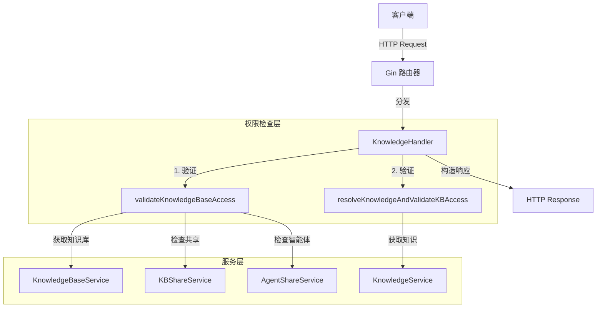

# knowledge_content_http_handlers 模块技术深度解析

## 1. 问题空间与模块定位

### 1.1 解决的核心问题

在多租户、支持组织共享和智能体共享的知识库系统中，知识资源的 HTTP 访问层面临着几个关键挑战：

- **权限模型复杂**：需要处理租户自有知识库、组织共享知识库、通过智能体间接访问知识库三种场景下的权限校验
- **多租户数据隔离**：不同租户的数据必须严格隔离，但又要支持跨租户的共享访问
- **多种知识创建方式**：文件上传、URL 抓取、手工录入三种知识来源，每种都有独特的校验和处理逻辑
- **批量操作与共享场景**：批量获取、批量标签更新等操作需要特殊处理共享知识库的租户上下文问题

如果没有这个模块，直接在 HTTP 层处理这些问题会导致代码重复、权限校验分散、难以维护。`KnowledgeHandler` 的核心价值就是将这些复杂逻辑封装在一个统一的处理层中。

### 1.2 架构角色

这个模块处于系统架构的 **HTTP 接入层**，是外部客户端与内部知识管理服务之间的适配器和守门人：

- **协议转换**：将 HTTP 请求（表单数据、JSON、路径参数等）转换为内部服务调用
- **权限守门**：在请求到达业务逻辑之前完成所有权限校验
- **上下文转换**：处理租户上下文切换（自有 -> 共享）
- **错误适配**：将内部错误转换为符合 HTTP 语义的响应

---

## 2. 核心心智模型

### 2.1 三层权限检查漏斗

想象一个三层的权限检查漏斗：

```
                    ┌─────────────────┐
                    │  请求进入        │
                    └────────┬────────┘
                             │
                    ┌────────▼────────┐
         第一层      │  租户自有检查   │──是──→ 通过（管理员权限）
                    └────────┬────────┘
                             │否
                    ┌────────▼────────┐
         第二层      │  组织共享检查   │──是──→ 通过（共享权限）
                    └────────┬────────┘
                             │否
                    ┌────────▼────────┐
         第三层      │  智能体共享检查 │──是──→ 通过（查看者权限）
                    └────────┬────────┘
                             │否
                    ┌────────▼────────┐
                    │  拒绝访问        │
                    └─────────────────┘
```

这就是 `validateKnowledgeBaseAccess` 系列方法的核心逻辑。每一层都比上一层更宽松，但权限级别也更低。

### 2.2 租户上下文的"切换透镜"

当访问共享资源时，我们需要一个"切换透镜"来改变数据查询的视角：

- **自有资源**：透镜指向请求者的租户 ID
- **共享资源**：透镜切换到资源所有者的租户 ID（源租户 ID）

这个透镜就是 `context.Context` 中的 `types.TenantIDContextKey`。所有下游服务都通过这个键来确定"我在哪个租户上下文中工作"。

---

## 3. 架构与数据流

### 3.1 组件架构图



### 3.2 关键数据流

#### 3.2.1 创建知识的完整流程（以文件上传为例）

1. **请求入口**：`CreateKnowledgeFromFile` 接收 `multipart/form-data` 请求
2. **权限预检查**：调用 `validateKnowledgeBaseAccess` 获取知识库和权限
   - 从 URL 路径提取 `kb_id`
   - 从 Gin Context 提取 `tenant_id` 和 `user_id`
   - 三层权限检查
   - 返回 `effectiveTenantID`（可能是源租户 ID）
3. **权限级别校验**：只有 `Admin` 或 `Editor` 可以创建知识
4. **请求解析**：提取文件、元数据、多模态标志等
5. **文件校验**：检查文件大小
6. **上下文设置**：将 `effectiveTenantID` 写入 Context
7. **服务调用**：调用 `kgService.CreateKnowledgeFromFile`
8. **重复检测**：检查是否是 `DuplicateKnowledgeError`，如是返回 409 Conflict
9. **响应构造**：返回 200 OK 或适当的错误

#### 3.2.2 批量获取知识的共享处理流程

`GetKnowledgeBatch` 展示了最复杂的共享场景处理：

1. **参数解析**：提取 `ids`、`kb_id`、`agent_id`
2. **智能体场景处理**（如果提供 `agent_id`）：
   - 验证用户对该共享智能体的访问权限
   - 将 `effectiveTenantID` 设置为智能体所属租户
3. **知识库场景处理**（如果提供 `kb_id`）：
   - 调用 `validateKnowledgeBaseAccessWithKBID`
   - 将 `effectiveTenantID` 设置为知识库的源租户
4. **服务调用选择**：
   - 有 `kb_id`：调用 `GetKnowledgeBatch`（限定范围）
   - 无 `kb_id`：调用 `GetKnowledgeBatchWithSharedAccess`（支持跨租户）

---

## 4. 核心组件深度解析

### 4.1 KnowledgeHandler 结构体

```go
type KnowledgeHandler struct {
    kgService         interfaces.KnowledgeService
    kbService         interfaces.KnowledgeBaseService
    kbShareService    interfaces.KBShareService
    agentShareService interfaces.AgentShareService
}
```

**设计意图**：
- 采用**依赖注入**模式，所有依赖通过构造函数传入，便于单元测试
- 四个依赖服务分别对应四个核心能力域：知识操作、知识库管理、知识库共享、智能体共享
- `kbShareService` 和 `agentShareService` 是可选的（代码中有 nil 检查），这是为了在不需要共享功能的部署中可以禁用这些组件

### 4.2 validateKnowledgeBaseAccess 方法

这是整个模块的核心方法，值得深入分析。

**方法签名**：
```go
func (h *KnowledgeHandler) validateKnowledgeBaseAccess(c *gin.Context) (
    *types.KnowledgeBase, string, uint64, types.OrgMemberRole, error,
)
```

**返回值解析**：
1. `*types.KnowledgeBase`：知识库对象（用于后续可能需要的元数据）
2. `string`：知识库 ID（透传）
3. `uint64`：**effectiveTenantID**（关键！下游查询使用的租户 ID）
4. `types.OrgMemberRole`：权限级别（Admin/Editor/Viewer）
5. `error`：错误

**内部逻辑拆解**：

1. **基础上下文提取**：
   - 从 Gin Context 获取 `tenant_id`（必须存在，否则 401）
   - 从 Gin Context 获取 `user_id`（可选，用于共享检查）
   - 从 URL 路径获取 `kb_id`

2. **第一层检查：租户自有**：
   ```go
   if kb.TenantID == tenantID {
       return kb, kbID, tenantID, types.OrgRoleAdmin, nil
   }
   ```
   - 知识库属于当前租户 → 直接通过，管理员权限，effectiveTenantID 就是当前租户

3. **第二层检查：组织共享**：
   - 调用 `kbShareService.CheckUserKBPermission` 检查用户是否被授予了该知识库的共享权限
   - 调用 `kbShareService.GetKBSourceTenant` 获取源租户 ID
   - effectiveTenantID 切换为源租户 ID

4. **第三层检查：智能体共享**：
   - 调用 `agentShareService.UserCanAccessKBViaSomeSharedAgent` 检查用户是否有任何共享智能体能访问该知识库
   - 这种场景下权限最低（Viewer）
   - effectiveTenantID 是知识库的租户 ID

**设计亮点**：
- **瀑布式失败**：每一层失败后自动尝试下一层，不提前返回
- **权限降级**：自有 → 共享 → 智能体，权限级别逐渐降低
- **上下文切换**：返回的 effectiveTenantID 确保下游服务查询正确的租户数据

### 4.3 resolveKnowledgeAndValidateKBAccess 方法

与 `validateKnowledgeBaseAccess` 类似，但它是从知识 ID 开始解析的：

1. 先通过 `kgService.GetKnowledgeByIDOnly` 获取知识对象
2. 然后检查知识的租户 ID 是否等于当前租户
3. 否则进行共享检查
4. 特殊之处：支持通过 `agent_id` 查询参数来验证智能体场景下的访问

**智能体场景的精细检查**：
```go
agentID := c.Query("agent_id")
if agentID != "" {
    // 获取共享智能体
    // 检查智能体的 KBSelectionMode
    // - "none"：拒绝
    // - "all"：通过
    // - "selected"：检查知识的 KB ID 是否在智能体的 KnowledgeBases 列表中
}
```

这展示了模块对智能体配置的深度理解，而不仅仅是简单的布尔权限检查。

### 4.4 GetKnowledgeBatch 方法

这是最复杂的端点之一，因为它要处理多种共享场景的组合。

**参数设计**：
```go
type GetKnowledgeBatchRequest struct {
    IDs     []string `form:"ids" binding:"required"`
    KBID    string   `form:"kb_id"`    // 可选：限定范围
    AgentID string   `form:"agent_id"` // 可选：智能体场景
}
```

**处理策略**：
- **AgentID 优先**：如果提供了 agent_id，首先处理智能体场景，将 effectiveTenantID 设置为智能体的租户
- **KBID 次之**：如果提供了 kb_id，验证知识库访问并设置 effectiveTenantID
- **默认场景**：使用 `GetKnowledgeBatchWithSharedAccess`，这个服务方法内部会处理跨租户的共享访问

**设计意图**：
- `kb_id` 和 `agent_id` 都是可选的，为了兼容不同的前端使用场景
- 特别是刷新页面后恢复共享知识库文件的场景：前端可能没有 kb_id，但有 agent_id

### 4.5 UpdateKnowledgeTagBatch 方法

另一个复杂的批量操作，展示了如何处理客户端可能没有提供 `kb_id` 的情况：

```go
if kbID := secutils.SanitizeForLog(req.KBID); kbID != "" {
    // 使用提供的 kb_id 验证
} else if len(req.Updates) > 0 {
    // 从第一个知识 ID 推断 kb_id
    var firstKnowledgeID string
    for id := range req.Updates {
        firstKnowledgeID = id
        break
    }
    // 使用第一个知识 ID 来验证并获取上下文
}
```

**设计权衡**：
- 优点：客户端不需要总是提供 `kb_id`，使用更方便
- 缺点：如果批量更新包含跨多个知识库的知识，只有第一个知识库的权限会被检查
- 缓解：隐含的假设是批量标签更新通常是在同一个知识库内进行的

---

## 5. 依赖分析

### 5.1 依赖的服务接口

| 接口 | 用途 | 所在模块 |
|------|------|----------|
| `interfaces.KnowledgeService` | 知识的 CRUD、搜索、解析等核心操作 | [application_services_and_orchestration-knowledge_ingestion_extraction_and_graph_services](../application_services_and_orchestration-knowledge_ingestion_extraction_and_graph_services.md) |
| `interfaces.KnowledgeBaseService` | 知识库的查询和管理 | 同上 |
| `interfaces.KBShareService` | 组织内知识库共享的权限检查 | [application_services_and_orchestration-agent_identity_tenant_and_configuration_services](../application_services_and_orchestration-agent_identity_tenant_and_configuration_services.md) |
| `interfaces.AgentShareService` | 智能体共享的权限检查和智能体配置获取 | 同上 |

### 5.2 被谁依赖

这个模块被 HTTP 路由层依赖，具体是：
- [http_handlers_and_routing-routing_middleware_and_background_task_wiring](../http_handlers_and_routing-routing_middleware_and_background_task_wiring.md) 中的路由注册代码

### 5.3 隐式契约

这个模块依赖几个关键的 Gin Context 键：
- `types.TenantIDContextKey`：租户 ID（必须由认证中间件设置）
- `types.UserIDContextKey`：用户 ID（可选，用于共享检查）

**这是一个重要的隐式契约**：如果这些键没有被正确设置，权限检查会失败。

---

## 6. 设计决策与权衡

### 6.1 权限检查在 Handler 层 vs Service 层

**决策**：主要的权限检查在 Handler 层完成

**理由**：
- 尽早失败：在请求解析的最早阶段就拒绝未授权的请求
- 上下文完整：Handler 层可以访问完整的 HTTP 请求信息（URL 参数、查询参数等）
- 服务层纯净：Service 层只关注业务逻辑，不需要知道 HTTP 上下文

**权衡**：
- 缺点：Service 层可能仍然需要自己的权限检查（防御性编程）
- 缓解：Handler 层设置的 effectiveTenantID 已经确保了 Service 层只能访问授权的数据

### 6.2 effectiveTenantID 通过 Context 传递 vs 显式参数

**决策**：通过 `context.Context` 传递

**理由**：
- 标准做法：Go 生态中传递请求范围数据的标准方式
- 透明传递：不需要修改每个 Service 方法的签名
- 自动传播：Context 会自动传递到数据库查询、日志等下游

**权衡**：
- 缺点：Context 中的值是类型不安全的（`interface{}`）
- 缓解：使用自定义类型作为键（`types.TenantIDContextKey`），并提供类型安全的访问器

### 6.3 三种访问模式的顺序

**决策**：租户自有 → 组织共享 → 智能体共享

**理由**：
- 性能：自有检查最快，不需要调用其他服务
- 权限级别：优先使用最高权限级别
- 用户体验：自有资源不应该被共享逻辑干扰

### 6.4 批量操作中 kb_id 的可选性

**决策**：让 kb_id 可选，没有时从第一个 ID 推断

**理由**：
- 前端易用性：前端不一定总是有 kb_id 可用
- 兼容性：支持多种使用场景

**权衡**：
- 前面讨论过的跨知识库批量操作的潜在问题
- 隐含的一致性假设

---

## 7. 使用指南与常见模式

### 7.1 添加新的知识操作端点

如果你要添加一个新的知识操作端点，遵循这个模式：

```go
func (h *KnowledgeHandler) MyNewEndpoint(c *gin.Context) {
    ctx := c.Request.Context()
    
    // 1. 提取并验证路径/查询参数
    id := secutils.SanitizeForLog(c.Param("id"))
    if id == "" {
        c.Error(errors.NewBadRequestError("ID cannot be empty"))
        return
    }
    
    // 2. 选择合适的权限验证方法
    // - 如果是知识库级操作：validateKnowledgeBaseAccess
    // - 如果是知识级操作：resolveKnowledgeAndValidateKBAccess
    _, effCtx, err := h.resolveKnowledgeAndValidateKBAccess(c, id, types.OrgRoleViewer)
    if err != nil {
        c.Error(err)
        return
    }
    
    // 3. 解析请求体（如果有）
    var req MyRequest
    if err := c.ShouldBindJSON(&req); err != nil {
        c.Error(errors.NewBadRequestError(err.Error()))
        return
    }
    
    // 4. 调用服务（使用 effCtx！）
    result, err := h.kgService.MyServiceMethod(effCtx, id, &req)
    if err != nil {
        // 检查是否是已知的应用错误
        if appErr, ok := errors.IsAppError(err); ok {
            c.Error(appErr)
            return
        }
        logger.ErrorWithFields(ctx, err, nil)
        c.Error(errors.NewInternalServerError(err.Error()))
        return
    }
    
    // 5. 返回响应
    c.JSON(http.StatusOK, gin.H{
        "success": true,
        "data":    result,
    })
}
```

**关键点**：
- 总是使用 `effCtx`（从权限验证方法返回的 Context）来调用服务
- 总是使用 `secutils.SanitizeForLog` 来清理用户输入后再记录日志
- 区分应用错误（`IsAppError`）和内部错误

### 7.2 权限级别选择指南

| 操作类型 | 所需权限 |
|----------|----------|
| 读取、下载 | `OrgRoleViewer` |
| 创建、修改、删除、重新解析 | `OrgRoleEditor` 或 `OrgRoleAdmin` |
| 批量标签更新 | `OrgRoleEditor` 或 `OrgRoleAdmin` |

---

## 8. 边缘情况与陷阱

### 8.1 Context 中缺少 TenantID

**症状**：`validateKnowledgeBaseAccess` 返回 401 Unauthorized，日志显示 "Failed to get tenant ID"

**原因**：认证中间件没有正确设置 `types.TenantIDContextKey`

**解决**：确保认证中间件在路由到 `KnowledgeHandler` 之前执行

### 8.2 共享知识库中操作失败但权限检查通过

**症状**：权限检查通过，但后续的 Service 调用返回错误

**可能原因**：
- 使用了原始的 `ctx` 而不是 `effCtx` 来调用 Service
- `effCtx` 虽然有正确的租户 ID，但其他必要的上下文信息丢失

**解决**：
- 始终使用权限验证方法返回的 `effCtx` 来调用服务
- 如果需要向 Context 中添加新值，基于 `effCtx` 来创建新的 Context

### 8.3 批量操作中的跨知识库混合

**症状**：批量操作中，部分知识更新成功，部分失败

**原因**：批量操作包含来自多个知识库的知识，但权限验证只通过了第一个知识库

**缓解**：
- 尽量避免跨知识库的批量操作
- 如果必须这样做，客户端应该按知识库分组后分别调用
- 或者确保用户对所有涉及的知识库都有相同级别的权限

### 8.4 智能体模式 "none"

**症状**：用户可以看到智能体，但不能访问智能体关联的任何知识库

**原因**：智能体的 `KBSelectionMode` 设置为 "none"

**这是预期行为**：在 `resolveKnowledgeAndValidateKBAccess` 和 `SearchKnowledge` 中都有对 "none" 模式的特殊处理

---

## 9. 总结

`knowledge_content_http_handlers` 模块是一个精心设计的 HTTP 接入层，它解决了多租户、多模式共享环境下知识资源访问的复杂性。

核心要点回顾：
1. **三层权限漏斗**：自有 → 组织共享 → 智能体共享
2. **租户上下文切换**：通过 `effectiveTenantID` 和 Context 实现
3. **尽早验证**：在 Handler 层完成所有权限检查
4. **批量操作的复杂性**：需要特殊处理共享场景和可选参数

这个模块的设计展示了如何在保持代码简洁的同时，处理复杂的业务场景和权限模型。
