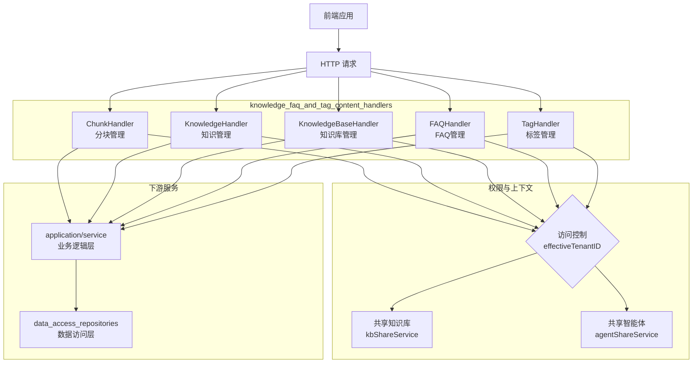

# 知识、FAQ 和标签内容处理模块深度解析

## 概述

`knowledge_faq_and_tag_content_handlers` 模块是整个系统的"门面"层，它将复杂的知识管理、FAQ 处理和标签组织功能暴露为简洁的 HTTP API。想象一下，这个模块就像是一个大型图书馆的前台服务台——读者（前端应用）不需要知道图书馆内部如何分类、存储和检索书籍，只需要通过服务台的标准流程（HTTP 请求）就能完成借书、还书、查询等操作。

这个模块解决的核心问题是：如何将复杂的多租户知识管理系统（包含知识库、知识条目、分块、FAQ、标签等多个概念）以安全、一致、易用的方式暴露给前端。它处理了权限验证、请求解析、响应格式化、错误处理等横切关注点，让下游的服务层可以专注于业务逻辑。

## 架构概览



### 核心组件职责

这个模块由五个主要的 Handler 组成，每个负责一个特定的资源领域：

1. **ChunkHandler**：处理知识分块的 CRUD 操作，包括获取分块列表、更新分块内容、删除分块等。
2. **KnowledgeHandler**：处理知识条目的创建、查询、更新、删除，支持从文件、URL、手动输入创建知识。
3. **KnowledgeBaseHandler**：处理知识库的管理，包括创建、更新、删除知识库，以及知识库复制、混合搜索等高级功能。
4. **FAQHandler**：专门处理 FAQ 知识库的操作，包括 FAQ 条目的批量导入/导出、搜索、标签管理等。
5. **TagHandler**：处理标签的创建、更新、删除，以及标签的统计信息。

### 数据与控制流

一个典型的请求流程如下：

1. **请求接收**：Gin 框架将 HTTP 请求路由到对应的 Handler 方法
2. **权限验证**：调用 `validateKnowledgeBaseAccess` 或类似方法验证用户权限
3. **上下文解析**：确定 `effectiveTenantID`（对于共享资源，这可能是资源所有者的租户 ID）
4. **参数解析**：将请求参数绑定到对应的结构体
5. **服务调用**：调用下游的 service 层执行实际业务逻辑
6. **响应格式化**：将 service 层的返回值格式化为标准的 JSON 响应
7. **错误处理**：统一处理各种错误并返回合适的 HTTP 状态码

## 关键设计决策

### 1. 统一的权限模型与 effectiveTenantID

**设计意图**：系统需要支持三种访问模式——自己的资源、组织共享的资源、通过共享智能体可见的资源。如果在每个 service 方法中都处理这三种模式，代码会变得复杂且难以维护。

**解决方案**：在 Handler 层统一解析权限，确定 `effectiveTenantID` 并注入到 context 中。下游 service 只需要从 context 中读取 `effectiveTenantID`，不需要知道资源是自己的还是共享的。

```go
// 示例：在 KnowledgeHandler 中解析 effectiveTenantID
func (h *KnowledgeHandler) validateKnowledgeBaseAccess(c *gin.Context) (*types.KnowledgeBase, string, uint64, types.OrgMemberRole, error) {
    // ... 检查是否是所有者
    if kb.TenantID == tenantID {
        return kb, kbID, tenantID, types.OrgRoleAdmin, nil
    }
    
    // ... 检查是否是组织共享
    if userExists && h.kbShareService != nil {
        // ... 检查共享权限
        return kb, kbID, sourceTenantID, permission, nil
    }
    
    // ... 检查是否通过共享智能体可见
    if userExists && h.agentShareService != nil {
        // ... 检查智能体权限
        return kb, kbID, kb.TenantID, types.OrgRoleViewer, nil
    }
}
```

**权衡**：这种设计将权限逻辑集中在 Handler 层，简化了 service 层，但要求 Handler 层必须正确设置 `effectiveTenantID`，否则可能导致权限泄露。

### 2. 异步任务模式与进度追踪

**设计意图**：知识库复制、FAQ 批量导入等操作可能耗时很长（几分钟到几小时），如果同步执行会导致请求超时，用户体验差。

**解决方案**：采用异步任务模式，Handler 层接收请求后立即返回任务 ID，实际工作由后台任务处理器执行。同时提供进度查询接口，让前端可以实时显示任务进度。

```go
// 示例：知识库复制的异步处理
func (h *KnowledgeBaseHandler) CopyKnowledgeBase(c *gin.Context) {
    // ... 验证权限和参数
    
    // 创建任务并立即返回
    task := asynq.NewTask(types.TypeKBClone, payloadBytes, ...)
    info, err := h.asynqClient.Enqueue(task)
    
    // 保存初始进度到 Redis
    initialProgress := &types.KBCloneProgress{
        TaskID:    taskID,
        Status:    types.KBCloneStatusPending,
        Progress:  0,
        Message:   "Task queued, waiting to start...",
        // ...
    }
    h.knowledgeService.SaveKBCloneProgress(ctx, initialProgress)
    
    c.JSON(http.StatusOK, gin.H{
        "success": true,
        "data": CopyKnowledgeBaseResponse{
            TaskID: taskID,
            // ...
        },
    })
}
```

**权衡**：异步模式改善了用户体验，但增加了系统复杂度——需要任务队列、进度存储、错误重试机制等。

### 3. 标签 ID 的双重解析（UUID vs seq_id）

**设计意图**：前端在某些场景下可能使用数据库自增 ID（seq_id）来引用标签，而在其他场景下使用 UUID。为了兼容这两种用法，Handler 层需要能够解析两种格式的 ID。

**解决方案**：在 TagHandler 中实现 `resolveTagIDWithCtx` 方法，尝试将 tag_id 解析为整数（seq_id），如果成功则通过 seq_id 查询标签的 UUID，否则直接使用 tag_id 作为 UUID。

```go
func (h *TagHandler) resolveTagIDWithCtx(c *gin.Context, ctx context.Context) (string, error) {
    tagIDParam := secutils.SanitizeForLog(c.Param("tag_id"))
    
    // 尝试解析为 seq_id
    if seqID, err := strconv.ParseInt(tagIDParam, 10, 64); err == nil {
        tenantID := ctx.Value(types.TenantIDContextKey).(uint64)
        tag, err := h.tagRepo.GetBySeqID(ctx, tenantID, seqID)
        if err != nil {
            return "", errors.NewNotFoundError("标签不存在")
        }
        return tag.ID, nil
    }
    // 否则视为 UUID
    return tagIDParam, nil
}
```

**权衡**：这种设计提供了更好的兼容性，但增加了一层间接性——每个标签操作都可能需要额外的数据库查询来解析 ID。

### 4. 统一的错误处理与响应格式

**设计意图**：前端需要一致的响应格式来处理成功和错误情况。如果每个 Handler 方法都自己格式化响应，会导致代码重复且格式不统一。

**解决方案**：所有成功响应都使用 `gin.H{"success": true, "data": ...}` 格式，错误响应通过 `c.Error(err)` 统一处理，由中间件将错误转换为合适的 JSON 格式。

## 子模块概览

这个模块可以进一步分解为以下子模块：

### 1. 分块内容 HTTP 处理器（chunk_content_http_handlers）
负责知识分块的管理，包括获取分块列表、更新分块内容、删除分块等。核心组件是 `ChunkHandler`。

[查看分块内容 HTTP 处理器文档](http_handlers_and_routing-knowledge_faq_and_tag_content_handlers-chunk_content_http_handlers.md)

### 2. 知识内容 HTTP 处理器（knowledge_content_http_handlers）
负责知识条目的创建、查询、更新、删除，支持从文件、URL、手动输入创建知识。核心组件是 `KnowledgeHandler`。

[查看知识内容 HTTP 处理器文档](http_handlers_and_routing-knowledge_faq_and_tag_content_handlers-knowledge_content_http_handlers.md)

### 3. 知识库管理 HTTP 处理器（knowledge_base_management_http_handlers）
负责知识库的管理，包括创建、更新、删除知识库，以及知识库复制、混合搜索等高级功能。核心组件是 `KnowledgeBaseHandler`。

[查看知识库管理 HTTP 处理器文档](http_handlers_and_routing-knowledge_faq_and_tag_content_handlers-knowledge_base_management_http_handlers.md)

### 4. FAQ 内容操作 HTTP 处理器（faq_content_operations_http_handlers）
专门处理 FAQ 知识库的操作，包括 FAQ 条目的批量导入/导出、搜索、标签管理等。核心组件是 `FAQHandler`。

[查看 FAQ 内容操作 HTTP 处理器文档](http_handlers_and_routing-knowledge_faq_and_tag_content_handlers-faq_content_operations_http_handlers.md)

### 5. 标签管理 HTTP 处理器（tag_management_http_handlers）
处理标签的创建、更新、删除，以及标签的统计信息。核心组件是 `TagHandler`。

[查看标签管理 HTTP 处理器文档](http_handlers_and_routing-knowledge_faq_and_tag_content_handlers-tag_management_http_handlers.md)

## 跨模块依赖关系

这个模块作为系统的门面层，依赖于多个下游模块：

1. **application/services**：所有 Handler 都依赖于 service 层来执行实际的业务逻辑。
2. **data_access_repositories**：某些 Handler（如 TagHandler）直接依赖 repository 层来执行数据查询。
3. **core_domain_types_and_interfaces**：依赖于领域模型和接口定义。
4. **platform_infrastructure_and_runtime**：依赖于 Asynq 客户端来执行异步任务。

同时，这个模块也被 `http_handlers_and_routing` 的路由注册模块所依赖。

## 新贡献者指南

### 常见陷阱

1. **忘记设置 effectiveTenantID**：在处理共享资源时，必须确保将 `effectiveTenantID` 注入到 context 中，否则下游 service 会使用当前租户 ID 查询，导致找不到资源。

2. **安全清理不足**：所有用户输入（包括 URL 参数、请求体、文件名）都需要经过 `secutils.SanitizeForLog` 或 `secutils.SanitizeForDisplay` 处理，以防止日志注入和 XSS 攻击。

3. **权限检查不完整**：在实现新的 Handler 方法时，必须确保使用正确的权限验证方法，并且检查所需的权限级别（Viewer vs Editor vs Admin）。

4. **异步任务错误处理**：异步任务可能失败，需要确保有重试机制和错误记录，并且进度查询接口能够正确处理失败状态。

### 扩展点

1. **添加新的资源类型**：如果需要添加新的资源类型（如"数据集"），可以遵循现有的 Handler 模式：创建一个新的 Handler 结构体，实现权限验证方法，然后实现 CRUD 方法。

2. **自定义权限逻辑**：如果需要添加新的访问模式（如"公共资源"），可以修改现有的权限验证方法（如 `validateKnowledgeBaseAccess`）来支持新模式。

3. **添加新的异步任务类型**：如果需要添加新的长时间运行操作，可以参考知识库复制的实现：创建任务类型定义，在 Handler 中入队任务，实现任务处理器，添加进度查询接口。
